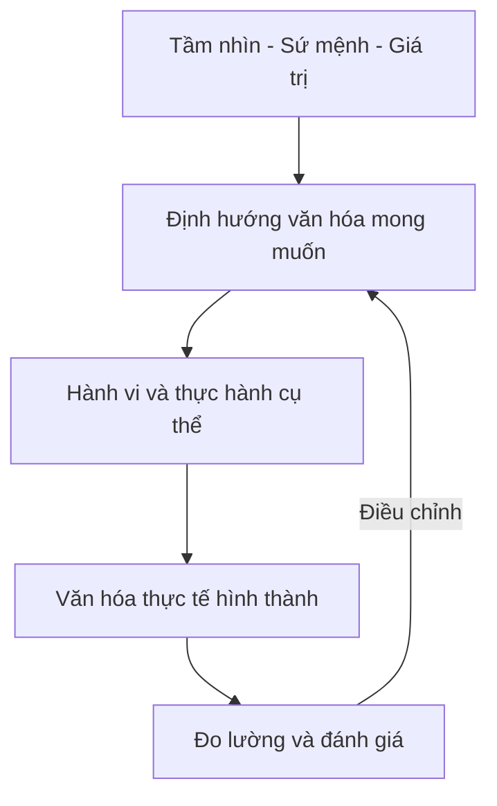
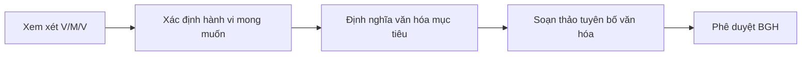
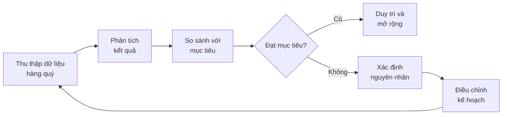
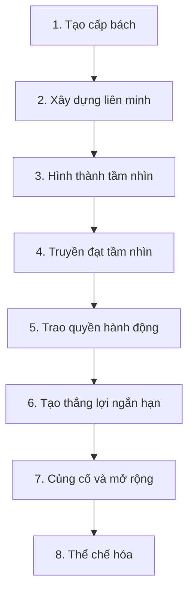

# SOP-01.5: XÂY DỰNG VĂN HÓA TỔ CHỨC

## 1. MỤC ĐÍCH
Quy định quy trình xây dựng và duy trì văn hóa tổ chức phản ánh tầm nhìn, sứ mệnh và giá trị cốt lõi, đảm bảo:
- Văn hóa mạnh mẽ và đặc trưng
- Hành vi nhất quán với giá trị
- Môi trường làm việc tích cực
- Thu hút và giữ chân nhân tài
- Hiệu suất tổ chức cao

## 2. PHẠM VI ÁP DỤNG
Áp dụng cho:
- Ban Giám hiệu
- Phòng Nhân sự
- Toàn thể cán bộ, giáo viên, nhân viên
- Học sinh (gián tiếp)

## 3. KHÁI NIỆM VĂN HÓA TỔ CHỨC

### 3.1. Định nghĩa
Văn hóa tổ chức là tập hợp các giá trị, niềm tin, hành vi và thực hành được chia sẻ, định hình cách mọi người làm việc và tương tác trong tổ chức.

### 3.2. Các cấp độ văn hóa
```
Cấp 1 - Hiện vật (Artifacts):
└─ Những gì nhìn thấy được: không gian, trang phục, ngôn ngữ, nghi lễ

Cấp 2 - Giá trị được tuyên bố (Espoused Values):
└─ Tầm nhìn, sứ mệnh, giá trị cốt lõi chính thức

Cấp 3 - Giả định ngầm (Basic Assumptions):
└─ Niềm tin sâu xa, không nói ra nhưng định hướng hành vi
```

### 3.3. Mối quan hệ V/M/V và Văn hóa


## 4. QUY TRÌNH XÂY DỰNG VĂN HÓA

### 4.1. Bước 1: Đánh giá văn hóa hiện tại (4-6 tuần)

#### 4.1.1. Thu thập dữ liệu
**Phương pháp**:
- Khảo sát văn hóa tổ chức (100% nhân viên)
- Phỏng vấn sâu lãnh đạo (10-15 người)
- Nhóm tập trung nhân viên (5-7 nhóm)
- Quan sát hành vi và thực hành
- Phân tích tài liệu (chính sách, quy trình)

**Công cụ đánh giá**:
```
1. Khảo sát văn hóa (30-40 câu hỏi):
   - Giá trị hiện tại vs. mong muốn
   - Phong cách lãnh đạo
   - Giao tiếp và hợp tác
   - Đổi mới và học hỏi
   - Sự gắn kết và hài lòng

2. Mô hình OCAI (Organizational Culture Assessment):
   - Văn hóa Gia đình (Clan)
   - Văn hóa Đổi mới (Adhocracy)
   - Văn hóa Thị trường (Market)
   - Văn hóa Phân cấp (Hierarchy)

3. Phân tích khoảng cách:
   - Văn hóa hiện tại
   - Văn hóa mong muốn
   - Khoảng cách cần khắc phục
```

#### 4.1.2. Phân tích kết quả
**Xác định**:
- Điểm mạnh văn hóa hiện tại
- Điểm yếu cần cải thiện
- Văn hóa con (sub-cultures) khác nhau
- Hành vi không phù hợp với giá trị
- Rào cản thay đổi văn hóa

**Đầu ra**: Báo cáo đánh giá văn hóa (15-20 trang)

### 4.2. Bước 2: Xác định văn hóa mục tiêu (2-3 tuần)

#### 4.2.1. Xây dựng tuyên bố văn hóa
**Quy trình**:


**Nội dung tuyên bố văn hóa**:
```
Văn hóa của chúng ta là:
- [Đặc điểm 1]: Mô tả cụ thể
- [Đặc điểm 2]: Mô tả cụ thể
- [Đặc điểm 3]: Mô tả cụ thể

Chúng ta tin vào:
- [Niềm tin 1]
- [Niềm tin 2]
- [Niềm tin 3]

Chúng ta hành động bằng cách:
- [Hành vi 1]
- [Hành vi 2]
- [Hành vi 3]
```

#### 4.2.2. Xác định hành vi văn hóa cốt lõi
**Ma trận hành vi theo giá trị**:
```
Giá trị | Hành vi mong muốn | Hành vi không chấp nhận
--------|-------------------|-------------------------
[Giá trị 1] | - Hành vi A | - Hành vi X
            | - Hành vi B | - Hành vi Y
[Giá trị 2] | - Hành vi C | - Hành vi Z
            | - Hành vi D | - Hành vi W
```

### 4.3. Bước 3: Lập kế hoạch chuyển đổi (2-3 tuần)

#### 4.3.1. Phân tích khoảng cách
```
Văn hóa hiện tại → Văn hóa mục tiêu

Khoảng cách:
1. [Khía cạnh 1]: Từ [trạng thái A] → [trạng thái B]
2. [Khía cạnh 2]: Từ [trạng thái C] → [trạng thái D]
3. [Khía cạnh 3]: Từ [trạng thái E] → [trạng thái F]

Ưu tiên:
- Cao: [Khía cạnh quan trọng và khả thi]
- Trung bình: [Quan trọng nhưng khó]
- Thấp: [Ít quan trọng hoặc dài hạn]
```

#### 4.3.2. Xây dựng kế hoạch hành động
**Cấu trúc kế hoạch**:
```
Mục tiêu: [Thay đổi văn hóa cụ thể]
Thời gian: [12-24 tháng]

Giai đoạn 1 (Tháng 1-6): Khởi động
├─ Sáng kiến 1: [Mô tả]
├─ Sáng kiến 2: [Mô tả]
└─ Sáng kiến 3: [Mô tả]

Giai đoạn 2 (Tháng 7-12): Tăng tốc
├─ Sáng kiến 4: [Mô tả]
├─ Sáng kiến 5: [Mô tả]
└─ Sáng kiến 6: [Mô tả]

Giai đoạn 3 (Tháng 13-18): Củng cố
├─ Sáng kiến 7: [Mô tả]
└─ Sáng kiến 8: [Mô tả]

Giai đoạn 4 (Tháng 19-24): Duy trì
└─ Các hoạt động thường xuyên
```

### 4.4. Bước 4: Triển khai các sáng kiến văn hóa (12-24 tháng)

#### 4.4.1. Lãnh đạo và mô hình hóa
**Hoạt động**:
```
1. Cam kết lãnh đạo:
   - BGH công khai cam kết
   - Lãnh đạo là hình mẫu đầu tiên
   - Accountability cho lãnh đạo

2. Đào tạo lãnh đạo:
   - Kỹ năng lãnh đạo văn hóa
   - Coaching và phản hồi
   - Xây dựng văn hóa trong nhóm

3. Giao tiếp thường xuyên:
   - Town halls về văn hóa
   - Câu chuyện và ví dụ
   - Minh bạch về tiến độ
```

#### 4.4.2. Hệ thống và quy trình
**Tích hợp văn hóa vào**:
```
1. Tuyển dụng:
   - Đánh giá phù hợp văn hóa
   - Câu hỏi phỏng vấn dựa trên hành vi
   - Quyết định tuyển dụng xem xét văn hóa

2. Đào tạo và phát triển:
   - Onboarding về văn hóa
   - Đào tạo hành vi văn hóa
   - Phát triển lãnh đạo văn hóa

3. Đánh giá hiệu suất:
   - KPI văn hóa và hành vi
   - 360 độ phản hồi
   - Hậu quả rõ ràng

4. Khen thưởng và công nhận:
   - Ghi nhận hành vi văn hóa
   - Thưởng cho người mẫu mực
   - Chia sẻ câu chuyện thành công
```

#### 4.4.3. Nghi lễ và biểu tượng
**Tạo các nghi lễ văn hóa**:
```
Hàng ngày:
- Bắt đầu họp với giá trị
- Kết thúc ngày với phản ánh
- Chào hỏi và tương tác

Hàng tuần:
- Họp nhóm chia sẻ
- Ghi nhận thành tích
- Học hỏi từ thất bại

Hàng tháng:
- Lễ trao giải văn hóa
- Sinh nhật và kỷ niệm
- Hoạt động xây dựng nhóm

Hàng năm:
- Lễ kỷ niệm thành lập
- Tổng kết và tri ân
- Lễ cam kết lại
```

**Biểu tượng văn hóa**:
```
Vật lý:
- Không gian làm việc phản ánh văn hóa
- Trang trí và màu sắc
- Khu vực chung và riêng tư

Phi vật lý:
- Ngôn ngữ và thuật ngữ chung
- Câu chuyện và huyền thoại
- Anh hùng và hình mẫu
```

#### 4.4.4. Giao tiếp và kể chuyện
**Chiến lược truyền thông văn hóa**:
```
1. Kênh truyền thông:
   - Email và newsletter
   - Intranet và mạng xã hội nội bộ
   - Họp và hội thảo
   - Poster và hiển thị

2. Nội dung:
   - Câu chuyện văn hóa thực tế
   - Phỏng vấn nhân viên mẫu mực
   - Video và hình ảnh
   - Số liệu và tiến độ

3. Tần suất:
   - Hàng tuần: Cập nhật nhỏ
   - Hàng tháng: Câu chuyện chi tiết
   - Hàng quý: Tổng kết tiến độ
```

### 4.5. Bước 5: Đo lường và điều chỉnh (Liên tục)

#### 4.5.1. Chỉ số đo lường văn hóa
**Các chỉ số chính**:
```
1. Chỉ số nhận thức:
   - % nhân viên hiểu văn hóa mục tiêu: ≥ 85%
   - % nhân viên nhớ hành vi cốt lõi: ≥ 80%

2. Chỉ số hành vi:
   - % nhân viên thực hành hành vi: ≥ 75%
   - Số câu chuyện văn hóa thu thập: ≥ 30/quý
   - Tỷ lệ vi phạm văn hóa: ≤ 5%

3. Chỉ số kết quả:
   - Điểm gắn kết nhân viên: ≥ 4.2/5.0
   - Tỷ lệ giữ chân nhân viên: ≥ 90%
   - Điểm hài lòng công việc: ≥ 4.0/5.0
   - Điểm văn hóa tổng thể: ≥ 80/100

4. Chỉ số nhận diện:
   - Uy tín thương hiệu nhà tuyển dụng
   - Đánh giá từ bên ngoài
   - Giải thưởng văn hóa
```

#### 4.5.2. Quy trình đánh giá


#### 4.5.3. Điều chỉnh chiến lược
**Khi cần điều chỉnh**:
- Tiến độ chậm hơn dự kiến
- Xuất hiện rào cản mới
- Thay đổi bối cảnh
- Phản hồi tiêu cực
- Kết quả không như mong đợi

**Quy trình điều chỉnh**:
```
1. Xác định vấn đề cụ thể
2. Phân tích nguyên nhân gốc rễ
3. Đề xuất giải pháp
4. Thử nghiệm quy mô nhỏ
5. Đánh giá hiệu quả
6. Triển khai rộng rãi nếu thành công
```

## 5. CÁC SÁNG KIẾN VĂN HÓA ĐIỂN HÌNH

### 5.1. Chương trình Đại sứ Văn hóa
**Mục đích**: Tạo mạng lưới người ủng hộ văn hóa

**Quy trình**:
```
1. Tuyển chọn (Hàng năm):
   - Mở đơn tự nguyện
   - Đề cử từ quản lý
   - Tiêu chí: Sống đúng giá trị, ảnh hưởng tích cực
   - Chọn 10-20 người

2. Đào tạo:
   - Hiểu sâu về văn hóa
   - Kỹ năng truyền cảm hứng
   - Vai trò và trách nhiệm

3. Hoạt động:
   - Tổ chức sự kiện văn hóa
   - Hỗ trợ nhân viên mới
   - Thu thập phản hồi
   - Đề xuất cải tiến

4. Ghi nhận:
   - Chứng chỉ và huy hiệu
   - Cơ hội phát triển
   - Ghi nhận công khai
```

### 5.2. Câu lạc bộ Học tập Văn hóa
**Hoạt động**:
- Đọc sách về văn hóa và lãnh đạo
- Thảo luận và chia sẻ
- Áp dụng vào công việc
- Tần suất: Tháng 1 lần

### 5.3. Ngày Văn hóa
**Tổ chức**: Quý 1 lần hoặc 6 tháng 1 lần

**Nội dung**:
```
- Đánh giá tiến độ văn hóa
- Chia sẻ câu chuyện thành công
- Workshop về hành vi văn hóa
- Hoạt động xây dựng nhóm
- Cam kết tiếp tục
```

### 5.4. Kho Câu chuyện Văn hóa
**Mục đích**: Lưu giữ và chia sẻ câu chuyện minh họa văn hóa

**Quy trình**:
```
1. Thu thập:
   - Form nộp câu chuyện
   - Phỏng vấn nhân viên
   - Quan sát và ghi chép

2. Tuyển chọn:
   - Đánh giá chất lượng
   - Chọn câu chuyện hay nhất
   - Chỉnh sửa và hoàn thiện

3. Chia sẻ:
   - Newsletter
   - Website nội bộ
   - Họp và đào tạo
   - Video và podcast

4. Sử dụng:
   - Onboarding nhân viên mới
   - Đào tạo lãnh đạo
   - Truyền thông bên ngoài
```

## 6. QUẢN LÝ THAY ĐỔI VĂN HÓA

### 6.1. Mô hình thay đổi


### 6.2. Xử lý kháng cự
**Các dạng kháng cự**:
```
1. Thụ động:
   - Không tham gia
   - Im lặng trong họp
   - Không thực hiện

2. Chủ động:
   - Phản đối công khai
   - Phàn nàn
   - Cản trở

3. Nguyên nhân:
   - Không hiểu tại sao
   - Sợ mất mát
   - Không tin tưởng
   - Đã quen với cũ
```

**Chiến lược ứng phó**:
```
1. Lắng nghe và thấu hiểu:
   - Tạo không gian chia sẻ
   - Hiểu mối quan ngại
   - Thừa nhận cảm xúc

2. Giao tiếp rõ ràng:
   - Giải thích lý do
   - Làm rõ lợi ích
   - Trả lời câu hỏi

3. Tham gia và trao quyền:
   - Mời tham gia thiết kế
   - Cho vai trò cụ thể
   - Ghi nhận đóng góp

4. Hỗ trợ và đào tạo:
   - Cung cấp kỹ năng mới
   - Coaching cá nhân
   - Thời gian thích nghi

5. Hậu quả rõ ràng:
   - Khen thưởng người ủng hộ
   - Hậu quả cho người cản trở
   - Nhất quán trong thực thi
```

### 6.3. Duy trì động lực
**Chiến lược**:
```
1. Truyền thông liên tục:
   - Cập nhật tiến độ thường xuyên
   - Chia sẻ thành công
   - Nhắc nhở mục tiêu

2. Thắng lợi ngắn hạn:
   - Đặt mục tiêu đạt được nhanh
   - Ăn mừng thành tích nhỏ
   - Tạo momentum

3. Ghi nhận và khen thưởng:
   - Công nhận người tiên phong
   - Thưởng hành vi mong muốn
   - Chia sẻ câu chuyện thành công

4. Điều chỉnh linh hoạt:
   - Lắng nghe phản hồi
   - Sẵn sàng thay đổi cách làm
   - Học từ thất bại
```

## 7. TRÁCH NHIỆM

### 7.1. Ban Giám hiệu
- Cam kết và mô hình hóa văn hóa
- Phê duyệt chiến lược văn hóa
- Cung cấp nguồn lực
- Giám sát tiến độ
- Giải quyết vấn đề lớn

### 7.2. Phòng Nhân sự
- Chủ trì xây dựng văn hóa
- Thiết kế và triển khai sáng kiến
- Đào tạo và hỗ trợ
- Đo lường và báo cáo
- Tư vấn cho lãnh đạo

### 7.3. Trưởng phòng ban
- Mô hình hóa trong bộ phận
- Cascading văn hóa xuống nhóm
- Coaching nhân viên
- Ghi nhận và khen thưởng
- Xử lý vi phạm

### 7.4. Nhân viên
- Hiểu và thực hành văn hóa
- Đóng góp ý kiến
- Hỗ trợ đồng nghiệp
- Ghi nhận người khác
- Tự cải thiện

## 8. NGÂN SÁCH ƯỚC TÍNH

```
Năm 1 (Xây dựng):
├─ Đánh giá văn hóa: 20-30 triệu VNĐ
├─ Tư vấn (nếu có): 50-100 triệu VNĐ
├─ Đào tạo: 30-50 triệu VNĐ
├─ Sự kiện và hoạt động: 40-60 triệu VNĐ
├─ Truyền thông: 20-30 triệu VNĐ
└─ Khen thưởng: 30-50 triệu VNĐ
---
Tổng năm 1: 190-320 triệu VNĐ

Năm 2-3 (Duy trì):
├─ Đào tạo: 20-30 triệu VNĐ/năm
├─ Sự kiện: 30-40 triệu VNĐ/năm
├─ Truyền thông: 15-20 triệu VNĐ/năm
├─ Khen thưởng: 30-50 triệu VNĐ/năm
└─ Đánh giá: 10-15 triệu VNĐ/năm
---
Tổng/năm: 105-155 triệu VNĐ
```

## 9. CHỈ SỐ ĐÁNH GIÁ THÀNH CÔNG

### 9.1. Chỉ số văn hóa
- Điểm văn hóa tổng thể: ≥ 80/100
- Tỷ lệ nhân viên hiểu văn hóa: ≥ 85%
- Tỷ lệ thực hành hành vi: ≥ 75%
- Điểm gắn kết: ≥ 4.2/5.0

### 9.2. Chỉ số kinh doanh
- Tỷ lệ giữ chân: ≥ 90%
- Hiệu suất làm việc: Tăng 10-15%
- Sự hài lòng khách hàng: Tăng 5-10%
- Uy tín thương hiệu: Top 10 ngành

### 9.3. Thời gian đạt được
- 6 tháng: Nhận thức và hiểu biết
- 12 tháng: Hành vi bắt đầu thay đổi
- 18-24 tháng: Văn hóa mới ổn định
- 3-5 năm: Văn hóa trở thành bản sắc

## 10. CÔNG CỤ VÀ MẪU BIỂU

### 10.1. Công cụ đánh giá
- Bảng khảo sát văn hóa OCAI
- Mẫu phỏng vấn sâu
- Hướng dẫn nhóm tập trung
- Checklist quan sát

### 10.2. Công cụ lập kế hoạch
- Template kế hoạch văn hóa
- Ma trận hành vi văn hóa
- Roadmap triển khai
- Bảng theo dõi tiến độ

### 10.3. Công cụ truyền thông
- Template câu chuyện văn hóa
- Mẫu newsletter
- Slide trình bày
- Video script

### 10.4. Công cụ đo lường
- Dashboard văn hóa
- Mẫu báo cáo định kỳ
- Công cụ phân tích dữ liệu

---

**Ngày ban hành**: 01/01/2024  
**Người phê duyệt**: Ban Giám hiệu  
**Người soạn thảo**: Phòng Nhân sự  
**Ngày xem xét lại**: 01/01/2025

