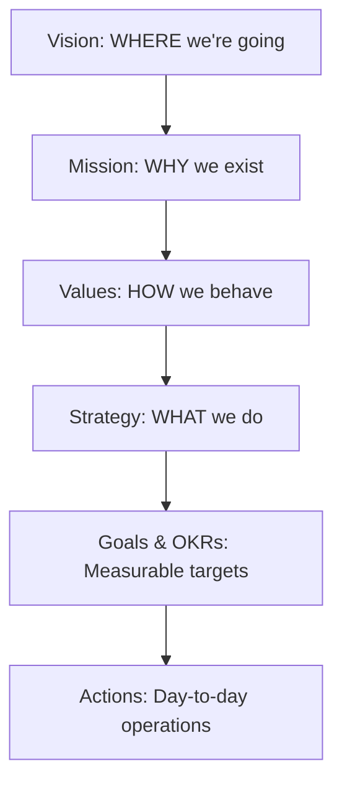
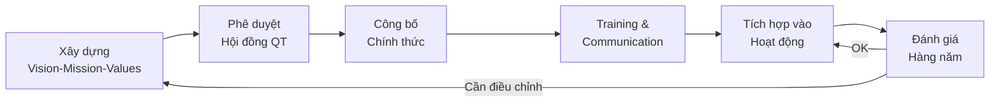

# SOP-01: TẦM NHÌN - SỨ MỆNH

## 1. MỤC ĐÍCH
Thiết lập quy trình xây dựng, truyền đạt và duy trì tầm nhìn (Vision), sứ mệnh (Mission) và giá trị cốt lõi (Core Values) của trường, đảm bảo:
- Định hướng chiến lược rõ ràng và nhất quán
- Toàn bộ stakeholders hiểu và hướng tới cùng một mục tiêu
- Quyết định và hành động phù hợp với giá trị tổ chức
- Văn hóa tổ chức mạnh mẽ và đặc trưng
- Động lực và cam kết từ toàn thể nhân viên

## 2. PHẠM VI ÁP DỤNG
Áp dụng cho:
- Hội đồng Quản trị
- Ban Giám hiệu
- Toàn thể cán bộ, giáo viên, nhân viên
- Học sinh và phụ huynh
- Đối tác và cộng đồng

## 3. TRÁCH NHIỆM

### 3.1. Hội đồng Quản trị
- Phê duyệt tầm nhìn, sứ mệnh, giá trị cốt lõi
- Đảm bảo tính nhất quán và phù hợp chiến lược
- Giám sát việc triển khai

### 3.2. Ban Giám hiệu
- Dẫn dắt quá trình xây dựng
- Truyền đạt và lan tỏa
- Tích hợp vào hoạt động hàng ngày
- Đánh giá và cập nhật định kỳ

### 3.3. Trưởng phòng ban
- Tham gia xây dựng
- Cascading xuống bộ phận
- Đảm bảo phòng ban hoạt động phù hợp

### 3.4. Toàn thể nhân viên
- Hiểu rõ và thực hành
- Đóng góp ý kiến
- Truyền cảm hứng cho học sinh

## 4. CÁC QUY TRÌNH CON

### 4.1. Xây dựng tầm nhìn - sứ mệnh - giá trị
**Mục tiêu**: Xác định định hướng dài hạn của tổ chức
**Chi tiết**: [SOP-01.1_Xay_dung_tam_nhin_su_menh_gia_tri.md](./SOP-01.1_Xay_dung_tam_nhin_su_menh_gia_tri.md)

**Hoạt động chính**:
- Thu thập input từ stakeholders
- Workshop với lãnh đạo
- Soạn thảo và tinh chỉnh
- Phê duyệt chính thức

### 4.2. Phổ biến và truyền thông nội bộ
**Mục tiêu**: Đảm bảo mọi người hiểu và ghi nhớ
**Chi tiết**: [SOP-01.2_Pho_bien_va_truyen_thong_noi_bo.md](./SOP-01.2_Pho_bien_va_truyen_thong_noi_bo.md)

**Hoạt động chính**:
- Lễ công bố chính thức
- Training và workshop
- Communication campaign
- Visual identity và branding

### 4.3. Tích hợp vào hoạt động hàng ngày
**Mục tiêu**: Biến vision thành hành động cụ thể
**Chi tiết**: [SOP-01.3_Tich_hop_vao_hoat_dong_hang_ngay.md](./SOP-01.3_Tich_hop_vao_hoat_dong_hang_ngay.md)

**Hoạt động chính**:
- Liên kết với OKR và KPI
- Tích hợp vào quyết định
- Recognition và reward
- Storytelling và role modeling

### 4.4. Đánh giá và cập nhật định kỳ
**Mục tiêu**: Đảm bảo luôn phù hợp và hiệu quả
**Chi tiết**: [SOP-01.4_Danh_gia_va_cap_nhat_dinh_ky.md](./SOP-01.4_Danh_gia_va_cap_nhat_dinh_ky.md)

**Hoạt động chính**:
- Khảo sát nhận thức hàng năm
- Review trong strategic planning
- Điều chỉnh khi cần thiết
- Re-launch khi có thay đổi lớn

### 4.5. Xây dựng văn hóa tổ chức
**Mục tiêu**: Tạo văn hóa mạnh phản ánh vision và values
**Chi tiết**: [SOP-01.5_Xay_dung_van_hoa_to_chuc.md](./SOP-01.5_Xay_dung_van_hoa_to_chuc.md)

**Hoạt động chính**:
- Culture assessment
- Culture initiatives
- Rituals và ceremonies
- Culture champions

## 5. KHUNG KHÁI NIỆM

### 5.1. Tầm nhìn (Vision)
**Định nghĩa**: Bức tranh về tương lai mà tổ chức muốn đạt được (10-20 năm)

**Đặc điểm của Vision tốt**:
- **Inspiring**: Truyền cảm hứng, tạo động lực
- **Clear**: Rõ ràng, dễ hiểu
- **Concise**: Ngắn gọn (1-2 câu)
- **Future-oriented**: Hướng tới tương lai
- **Memorable**: Dễ nhớ

**Ví dụ**:
- "To be the leading international school in Vietnam, nurturing global citizens who transform the world."
- "Trở thành trường quốc tế hàng đầu Việt Nam, nuôi dưỡng công dân toàn cầu thay đổi thế giới."

### 5.2. Sứ mệnh (Mission)
**Định nghĩa**: Lý do tồn tại của tổ chức, mục đích cốt lõi

**Đặc điểm của Mission tốt**:
- **Purpose**: Trả lời "Why we exist?"
- **Scope**: Trả lời "What we do?" và "For whom?"
- **Values**: Phản ánh "How we do it?"
- **Differentiating**: Khác biệt với đối thủ
- **Enduring**: Bền vững qua thời gian

**Ví dụ**:
- "To provide world-class education that empowers students to reach their full potential, embrace diversity, and make positive contributions to society through innovative learning experiences and holistic development."

**Template**: "To [động từ] [đối tượng] through [cách thức đặc trưng] that [kết quả mong đợi]."

### 5.3. Giá trị cốt lõi (Core Values)
**Định nghĩa**: Những nguyên tắc, niềm tin cơ bản định hướng hành vi và quyết định

**Đặc điểm của Core Values tốt**:
- **3-7 values**: Không quá nhiều
- **Truly core**: Thực sự quan trọng, không thỏa hiệp
- **Distinctive**: Đặc trưng riêng
- **Actionable**: Có thể thực hành hàng ngày
- **Clear meaning**: Định nghĩa rõ ràng

**Ví dụ**:
1. **Excellence** (Xuất sắc): We pursue excellence in everything we do.
2. **Integrity** (Chính trực): We act with honesty and transparency.
3. **Innovation** (Sáng tạo): We embrace creativity and continuous improvement.
4. **Collaboration** (Hợp tác): We work together to achieve common goals.
5. **Care** (Quan tâm): We care deeply about students, staff, and community.

### 5.4. Mối quan hệ Vision - Mission - Values



## 6. QUY TRÌNH TỔNG QUAN



## 7. CHỈ SỐ ĐÁNH GIÁ (KPI)

### 7.1. Về nhận thức (Awareness)
- % nhân viên nhớ đúng Vision: ≥ 90%
- % nhân viên nhớ đúng Mission: ≥ 85%
- % nhân viên nhớ được ≥ 3 Core Values: ≥ 80%
- % học sinh hiểu được Vision/Mission (lớp 6 trở lên): ≥ 70%

### 7.2. Về hiểu biết (Understanding)
- % nhân viên giải thích đúng ý nghĩa Vision: ≥ 80%
- % nhân viên giải thích đúng Core Values: ≥ 75%
- Score trung bình trong khảo sát hiểu biết: ≥ 4.0/5.0

### 7.3. Về hành động (Action)
- % nhân viên áp dụng Values vào công việc hàng ngày: ≥ 75%
- % quyết định được cân nhắc dựa trên Values: ≥ 70%
- Số câu chuyện (stories) phản ánh Values: ≥ 20 câu chuyện/năm

### 7.4. Về alignment (Sự liên kết)
- % phòng ban có goals phù hợp với Vision/Mission: 100%
- % OKR cấp cá nhân liên kết với Mission: ≥ 80%
- Culture alignment score: ≥ 4.0/5.0

### 7.5. Về impact (Tác động)
- Employee engagement score: ≥ 4.2/5.0
- Employer brand reputation: Top 10 trường tốt nhất để làm việc
- Retention rate: ≥ 90%
- Net Promoter Score (NPS): ≥ 60

## 8. HỒ SƠ VÀ TÀI LIỆU

### 8.1. Tài liệu nền tảng
- Vision, Mission, Values Statement (chính thức)
- Definition và behaviors cho mỗi Core Value
- Brand book và visual identity guidelines
- Culture handbook

### 8.2. Tài liệu training
- Orientation deck cho nhân viên mới
- Workshop materials
- Video giải thích
- Storytelling library (các câu chuyện minh họa)

### 8.3. Tài liệu truyền thông
- Posters, standees
- Website content
- Social media content
- Newsletter templates

### 8.4. Tài liệu đánh giá
- Annual awareness survey
- Culture assessment survey
- Focus group guidelines
- Analysis reports

## 9. CÔNG CỤ VÀ TEMPLATE

### 9.1. Công cụ xây dựng
- Vision/Mission/Values Workshop toolkit
- Stakeholder interview guide
- Analysis frameworks (SWOT, PESTEL)
- Drafting templates

### 9.2. Công cụ truyền thông
- Communication plan template
- Announcement email templates
- Presentation templates
- Visual design templates

### 9.3. Công cụ tích hợp
- OKR alignment worksheet
- Decision-making checklist (based on Values)
- Recognition program guidelines
- Storytelling framework

### 9.4. Công cụ đánh giá
- Survey questions library
- Dashboard templates (Power BI, Tableau)
- Focus group discussion guide
- Action planning template

## 10. BEST PRACTICES

### 10.1. Trong xây dựng
✅ **DO**:
- Involve stakeholders rộng rãi
- Dựa trên data và insights
- Keep it simple và memorable
- Authentic - phản ánh thực tế
- Differentiate - khác biệt

❌ **DON'T**:
- Copy paste từ trường khác
- Quá dài, phức tạp
- Unrealistic, không thực tế
- Generic, chung chung
- Top-down hoàn toàn không lắng nghe

### 10.2. Trong truyền thông
✅ **DO**:
- Multi-channel, lặp lại nhiều lần
- Storytelling và examples cụ thể
- Leaders phải role model
- Make it visual và engaging
- Two-way communication

❌ **DON'T**:
- One-time announcement rồi thôi
- Chỉ treo ở văn phòng mà không nói gì
- Inconsistent messages
- Leadership nói không làm
- Boring, suông sẻo

### 10.3. Trong tích hợp
✅ **DO**:
- Link với performance management
- Celebrate và recognize
- Weave into daily routines
- Hire for culture fit
- Make it part of decision criteria

❌ **DON'T**:
- Tách rời hoàn toàn với công việc
- Không có consequence khi vi phạm
- Chỉ áp dụng cho nhân viên, không áp dụng cho leader
- Forget it sau 3 tháng

## 11. CASE STUDIES

### 11.1. Ví dụ về Vision statements (các trường nổi tiếng)

**Eton College (UK)**:
"Eton will provide a world-class all-round education for students aged 13 to 18, developing excellence in each and preparing them to make a positive contribution to society."

**Singapore American School**:
"Excellence in education, an enduring passion for learning, a thoughtful response to opportunities and obligations, and a genuine care for others."

**Nord Anglia Education**:
"We are ambitious for our students, our people and our family of schools."

### 11.2. Ví dụ về Core Values tốt

**Google**:
1. Focus on the user
2. It's best to do one thing really, really well
3. Fast is better than slow
4. Democracy on the web works
5. You can be serious without a suit

**Zappos**:
1. Deliver WOW through service
2. Embrace and drive change
3. Create fun and a little weirdness
4. Be adventurous, creative, and open-minded
5. Pursue growth and learning

## 12. FAQ

**Q1: Bao lâu nên review lại Vision/Mission?**
A: Review hàng năm trong strategic planning, nhưng thường chỉ adjust nhỏ. Thay đổi lớn chỉ khi có sự kiện quan trọng (merger, change of ownership, market shift lớn).

**Q2: Làm sao để nhân viên thực sự tin và thực hành Values?**
A: 
- Leaders phải role model
- Link với performance review và bonus
- Celebrate publicly những người thể hiện values
- Consequence rõ ràng khi vi phạm
- Hire/fire based on culture fit

**Q3: Vision/Mission có giống nhau giữa các trường không?**
A: Có nhiều điểm chung (quality education, student-centered, etc.) nhưng cần có distinctive elements phản ánh unique positioning của trường bạn.

**Q4: Có nên để học sinh tham gia xây dựng không?**
A: Nên! Đặc biệt là học sinh lớn (10-12). Có thể:
- Focus group để lắng nghe
- Student council feedback
- Survey toàn trường

**Q5: Làm sao biết Vision/Mission có hiệu quả?**
A: 
- Khảo sát awareness và understanding
- Observe behaviors hàng ngày
- Exit interviews (người nghỉ việc có mention không?)
- External perception (parents, community)
- Business results (gián tiếp)

## 13. TÀI LIỆU THAM KHẢO

### 13.1. Sách
- "Built to Last" - Jim Collins & Jerry Porras
- "Start with Why" - Simon Sinek
- "The Advantage" - Patrick Lencioni
- "Good to Great" - Jim Collins
- "Corporate Culture and Performance" - John Kotter

### 13.2. Frameworks
- Golden Circle (Simon Sinek): Why - How - What
- Hedgehog Concept (Jim Collins)
- Culture Web (Gerry Johnson)
- Competing Values Framework

### 13.3. Tools
- Vision/Mission/Values canvas
- Culture assessment tools (Denison, OCAI)
- Employee engagement surveys (Gallup Q12)
- Brand positioning tools

## 14. PHỤ LỤC

### Phụ lục A: Vision/Mission/Values của trường (mẫu)
```
VISION:
"To be the leading international school in Vietnam, nurturing 
global citizens who transform the world."

MISSION:
"To provide world-class education that empowers students to 
reach their full potential, embrace diversity, and make positive 
contributions to society through innovative learning experiences 
and holistic development."

CORE VALUES:
1. EXCELLENCE: We pursue excellence in everything we do
2. INTEGRITY: We act with honesty and transparency
3. INNOVATION: We embrace creativity and continuous improvement
4. COLLABORATION: We work together to achieve common goals
5. CARE: We care deeply about students, staff, and community
```

### Phụ lục B: Value Behaviors Matrix (ví dụ cho EXCELLENCE)
```
EXCELLENCE - We pursue excellence in everything we do

What it means:
- Striving for the highest standards
- Continuous improvement mindset
- Attention to detail
- Taking pride in our work

Observable behaviors:
✅ Prepare thoroughly for classes/meetings
✅ Provide timely and quality feedback
✅ Seek feedback and act on it
✅ Go the extra mile for students
✅ Keep learning and developing

❌ Settle for "good enough"
❌ Ignore mistakes or feedback
❌ Cut corners
❌ Complacent with status quo
```

### Phụ lục C: Communication Timeline (Year 1)
```
Month 1-2: Development phase
Month 3: Launch event
Month 4-6: Intensive communication
Month 7-12: Ongoing reinforcement
Annual: Review and refresh
```

---

**Ngày ban hành**: 01/01/2024  
**Người phê duyệt**: Hội đồng Quản trị  
**Người soạn thảo**: Ban Giám hiệu  
**Ngày xem xét lại**: 01/01/2025
