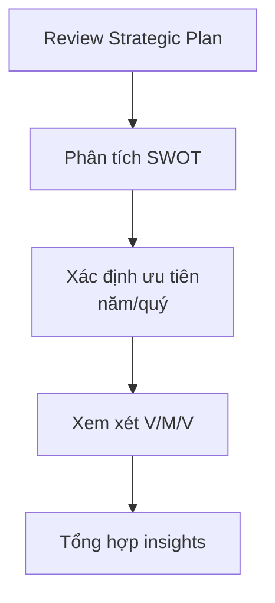
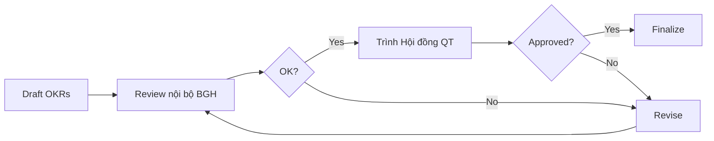

# SOP-02.1: XÂY DỰNG OKR CẤP TỔ CHỨC

## 1. MỤC ĐÍCH
Quy định quy trình xây dựng OKR cấp tổ chức (School-level OKRs), đảm bảo:
- Phản ánh chiến lược và ưu tiên của trường
- Phù hợp với tầm nhìn và sứ mệnh
- Đo lường được và thách thức
- Làm nền tảng cho cascading xuống các cấp
- Được toàn trường cam kết thực hiện

## 2. PHẠM VI ÁP DỤNG
- Ban Giám hiệu (chủ trì)
- Hội đồng Quản trị (phê duyệt)
- Trưởng phòng ban (tham gia đóng góp)

## 3. THỜI ĐIỂM THỰC HIỆN
- **OKR năm**: Tháng 6-7 (trước năm học mới)
- **OKR quý**: 2 tuần trước khi bắt đầu quý

## 4. QUY TRÌNH XÂY DỰNG

### 4.1. Chuẩn bị (1 tuần)

#### 4.1.1. Review chiến lược và bối cảnh


**Dữ liệu cần xem xét**:
```
1. Chiến lược 3-5 năm:
   - Mục tiêu dài hạn
   - Các initiatives chiến lược
   - Milestone quan trọng

2. Kết quả kỳ trước:
   - OKR quý/năm trước đạt được bao nhiêu
   - Bài học kinh nghiệm
   - Vấn đề chưa giải quyết

3. Bối cảnh hiện tại:
   - Thị trường và cạnh tranh
   - Chính sách giáo dục mới
   - Nhu cầu stakeholders
   - Nguồn lực khả dụng

4. Dữ liệu hiệu suất:
   - KPIs hiện tại
   - Điểm mạnh và yếu
   - Gaps cần khắc phục
```

#### 4.1.2. Thu thập input từ stakeholders
**Phương pháp**:
```
1. Survey nhanh (5-10 phút):
   - Gửi cho: Trưởng phòng, giáo viên chủ chốt
   - Câu hỏi: "3 ưu tiên quan trọng nhất cho quý/năm tới?"
   - Timeline: 3-5 ngày

2. Phỏng vấn 1-1:
   - Đối tượng: Trưởng phòng ban
   - Thời lượng: 30 phút/người
   - Nội dung: Thách thức, cơ hội, đề xuất

3. Review dữ liệu:
   - Phản hồi phụ huynh
   - Kết quả học sinh
   - Hiệu suất nhân viên
```

### 4.2. Workshop xây dựng OKR (1 ngày)

#### 4.2.1. Chuẩn bị workshop
**Tham gia**: BGH + Trưởng phòng ban (10-15 người)
**Thời gian**: 1 ngày làm việc (8 giờ)
**Địa điểm**: Off-site (tốt nhất) hoặc phòng họp lớn
**Facilitator**: Hiệu trưởng hoặc external coach

**Vật liệu cần có**:
- Whiteboard/flipchart
- Post-it notes nhiều màu
- Markers
- Laptop và projector
- Template OKR
- Dữ liệu đã chuẩn bị

#### 4.2.2. Agenda workshop
```
08:00-08:30: Mở đầu và context setting
├─ Mục đích workshop
├─ Review chiến lược và V/M/V
└─ Kết quả kỳ trước

08:30-10:00: Brainstorm Objectives
├─ Individual reflection (10 phút)
├─ Small group discussion (30 phút)
├─ Share và cluster ideas (30 phút)
└─ Vote và prioritize (20 phút)

10:00-10:15: Break

10:15-12:00: Refine Objectives
├─ Chọn top 3-5 Objectives
├─ Viết lại cho inspiring
├─ Check alignment với V/M/V
└─ Consensus

12:00-13:00: Lunch

13:00-15:00: Xác định Key Results
├─ Cho mỗi Objective:
│   ├─ Brainstorm metrics (15 phút)
│   ├─ Select 2-5 KRs (15 phút)
│   └─ Set baseline và target (15 phút)
└─ Review tổng thể

15:00-15:15: Break

15:15-16:30: Finalize và test
├─ Check quality (SMART, ambitious)
├─ Ensure alignment
├─ Identify owners
└─ Discuss resources needed

16:30-17:00: Next steps và wrap-up
```

#### 4.2.3. Kỹ thuật brainstorm Objectives
**Câu hỏi hướng dẫn**:
```
1. "Nếu thành công, quý/năm này chúng ta sẽ đạt được gì?"
2. "Điều gì sẽ tạo ra impact lớn nhất?"
3. "Stakeholders sẽ thấy gì khác biệt?"
4. "Chúng ta muốn được biết đến vì điều gì?"
5. "Nếu chỉ làm được 3 việc, đó là gì?"
```

**Phương pháp**:
```
Bước 1: Silent brainstorming (10 phút)
- Mỗi người viết 3-5 Objectives lên post-it
- Không thảo luận, tập trung suy nghĩ

Bước 2: Clustering (20 phút)
- Dán tất cả post-its lên board
- Group theo themes
- Đặt tên cho mỗi cluster

Bước 3: Dot voting (10 phút)
- Mỗi người có 5 dots
- Vote cho Objectives quan trọng nhất
- Count votes

Bước 4: Discussion (30 phút)
- Thảo luận top 5-7 Objectives
- Merge hoặc refine
- Narrow down to 3-5
```

#### 4.2.4. Xác định Key Results
**Nguyên tắc**:
```
✅ Measurable: Có số liệu cụ thể
✅ Time-bound: Rõ deadline
✅ Outcome-focused: Kết quả, không phải hoạt động
✅ Ambitious: Thách thức nhưng đạt được
✅ Limited: 2-5 KRs mỗi O
```

**Template KR**:
```
[Động từ đo lường] [Metric] từ [Baseline] đến [Target] vào [Deadline]

Ví dụ:
- Tăng điểm trung bình từ 7.8 lên 8.2 vào cuối quý
- Giảm tỷ lệ nghỉ việc từ 12% xuống 8% trong năm học
- Đạt NPS từ 45 lên 60 vào tháng 12
```

**Kiểm tra chất lượng KR**:
```
Hỏi: "Nếu đạt được KR này, có nghĩa là Objective đã thành công?"
- Nếu Yes → KR tốt
- Nếu No → KR không đủ hoặc sai focus
```

### 4.3. Hoàn thiện và phê duyệt (1 tuần)

#### 4.3.1. Polish draft OKRs
**Hoạt động**:
```
1. Viết lại cho clear và inspiring:
   - Objectives: Ngôn ngữ truyền cảm hứng
   - Key Results: Số liệu cụ thể, rõ ràng

2. Xác định ownership:
   - Mỗi Objective có 1 Executive Owner (BGH)
   - Mỗi KR có 1 DRI (Directly Responsible Individual)

3. Estimate resources:
   - Nhân sự cần thiết
   - Ngân sách
   - Công cụ và hệ thống

4. Identify dependencies:
   - Phụ thuộc vào phòng ban nào
   - Phụ thuộc vào external factors
   - Rủi ro tiềm ẩn
```

#### 4.3.2. Validation check
**Checklist**:
```
□ Alignment với V/M/V và chiến lược?
□ Số lượng hợp lý (3-5 Os, 2-5 KRs mỗi O)?
□ Objectives inspiring và clear?
□ Key Results measurable và ambitious?
□ Owners được xác định rõ?
□ Resources khả thi?
□ Balance giữa các lĩnh vực (học thuật, tài chính, nhân sự)?
□ Có ít nhất 1 O về innovation/growth?
```

#### 4.3.3. Trình phê duyệt
**Quy trình**:


**Presentation cho Hội đồng QT**:
```
1. Context (5 phút):
   - Tình hình hiện tại
   - Ưu tiên chiến lược

2. Proposed OKRs (10 phút):
   - Present từng O và KRs
   - Rationale
   - Expected impact

3. Resources và risks (5 phút):
   - Nguồn lực cần thiết
   - Rủi ro và mitigation

4. Q&A và discussion (15 phút)

5. Approval (5 phút)
```

### 4.4. Công bố và communication (1 tuần)

#### 4.4.1. Chuẩn bị materials
```
1. OKR Document (1 trang):
   - Formatted đẹp
   - Clear và concise
   - Visual nếu có thể

2. Presentation deck (10-15 slides):
   - Cho All-hands meeting
   - Story và context
   - Inspiring visuals

3. FAQ document:
   - Anticipate questions
   - Clear answers
   - Examples

4. Video message (optional):
   - Từ Hiệu trưởng
   - 3-5 phút
   - Explain why và how
```

#### 4.4.2. Launch event
**All-hands meeting** (1-2 giờ):
```
Agenda:
00:00-00:15: Opening và context
00:15-00:45: Present OKRs
            - Từng Objective
            - Tại sao quan trọng
            - Kỳ vọng impact
00:45-01:00: Q&A
01:00-01:15: Next steps
            - Cascading process
            - Timeline
            - Support available
01:15-01:30: Inspiration và commitment
```

**Multi-channel communication**:
```
Day 1: All-hands meeting + Email announcement
Day 2: Post on intranet + Social media internal
Day 3: Department meetings (cascading begins)
Day 4-5: 1-1s với Trưởng phòng
Week 2: Follow-up communications
```

## 5. TEMPLATE VÀ VÍ DỤ

### 5.1. Template OKR cấp tổ chức
```
[TÊN TRƯỜNG] - OKR [NĂM HỌC / QUÝ]
Thời gian: [Start date] - [End date]

OBJECTIVE 1: [Inspiring goal]
Owner: [Executive name]
├─ KR1: [Metric] từ [X] đến [Y] vào [date]
│   Owner: [DRI name]
│   Baseline: [Current]
│   Target: [Goal]
├─ KR2: [Metric] từ [X] đến [Y] vào [date]
│   Owner: [DRI name]
└─ KR3: [Metric] từ [X] đến [Y] vào [date]
    Owner: [DRI name]

[Repeat for O2, O3, etc.]
```

### 5.2. Ví dụ thực tế
```
TRƯỜNG ABC - OKR NĂM HỌC 2024-2025

O1: Trở thành trường hàng đầu về chất lượng học thuật
Owner: Phó HT Học thuật
├─ KR1: Tăng điểm trung bình từ 7.8 lên 8.3
│   Owner: Trưởng phòng Học thuật
├─ KR2: 90% học sinh đạt chuẩn quốc tế (từ 75%)
│   Owner: Trưởng phòng Khảo thí
└─ KR3: Top 3 trong kỳ thi học sinh giỏi thành phố
    Owner: Trưởng phòng Chuyên môn

O2: Xây dựng đội ngũ giáo viên world-class
Owner: Phó HT Hành chính
├─ KR1: 100% GV hoàn thành 30 giờ PD (từ 60%)
│   Owner: Trưởng phòng Đào tạo
├─ KR2: Tăng engagement score từ 4.0 lên 4.5/5.0
│   Owner: Trưởng phòng Nhân sự
└─ KR3: Giảm turnover từ 15% xuống 8%
    Owner: Trưởng phòng Nhân sự

O3: Đạt sự hài lòng xuất sắc từ phụ huynh
Owner: Hiệu trưởng
├─ KR1: NPS tăng từ 50 lên 70
│   Owner: Trưởng phòng Dịch vụ học sinh
├─ KR2: Retention rate tăng từ 88% lên 94%
│   Owner: Trưởng phòng Tuyển sinh
└─ KR3: Giải quyết 98% khiếu nại trong 24h (từ 80%)
    Owner: Trưởng phòng Quan hệ khách hàng
```

## 6. CÔNG CỤ HỖ TRỢ

### 6.1. OKR Canvas
Template 1 trang để brainstorm và structure OKRs

### 6.2. OKR Scoring Rubric
Đánh giá chất lượng OKRs (1-5 scale)

### 6.3. OKR Alignment Map
Visualize alignment giữa các OKRs

### 6.4. Resource Planning Template
Ước tính nguồn lực cần thiết

## 7. THỜI GIAN VÀ EFFORT

```
Chuẩn bị:           20-30 giờ (1 tuần)
Workshop:           8 giờ (1 ngày)
Finalization:       10-15 giờ (3-5 ngày)
Approval process:   5-10 giờ (2-3 ngày)
Communication:      10-15 giờ (1 tuần)
---
Total:              53-78 giờ (2-3 tuần)
```

## 8. CHỈ SỐ CHẤT LƯỢNG

```
□ Số Objectives: 3-5 ✅
□ Số KRs mỗi O: 2-5 ✅
□ Alignment score: ≥ 4.0/5.0 ✅
□ Clarity score: ≥ 4.0/5.0 ✅
□ Ambition level: 70-80% achievable ✅
□ Buy-in từ leadership: 100% ✅
□ Stakeholder understanding: ≥ 85% ✅
```

---

**Ngày ban hành**: 01/01/2024  
**Người phê duyệt**: Ban Giám hiệu  
**Người soạn thảo**: Phòng Chiến lược  
**Ngày xem xét lại**: 01/01/2025


