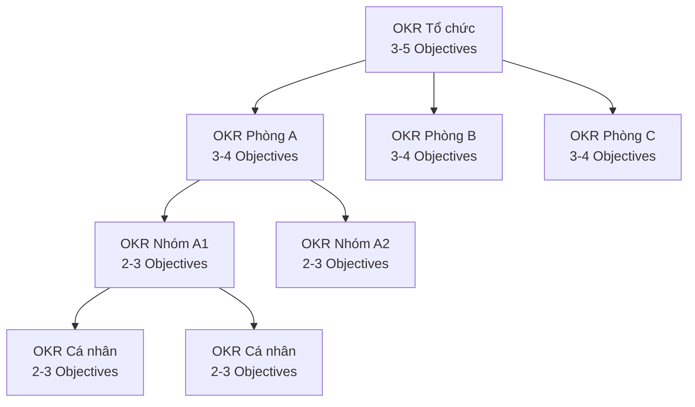
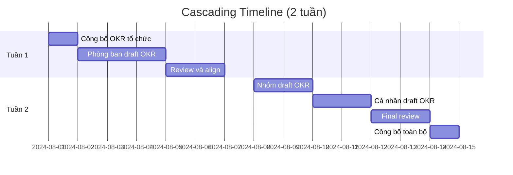
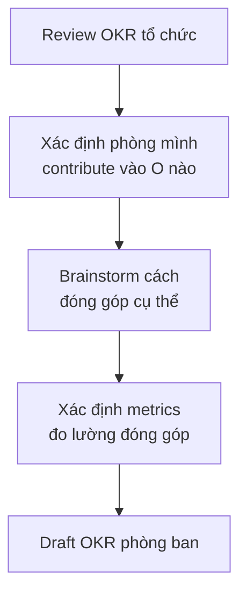

# SOP-02.2: CASCADING OKR XUỐNG PHÒNG BAN

## 1. MỤC ĐÍCH
Quy định quy trình cascading (phân tầng) OKR từ cấp tổ chức xuống phòng ban, nhóm và cá nhân, đảm bảo:
- Alignment hoàn toàn với OKR tổ chức
- Mỗi cấp đóng góp rõ ràng vào cấp trên
- Autonomy trong cách thức thực hiện
- Ownership và accountability
- Toàn bộ tổ chức hướng về cùng mục tiêu

## 2. PHẠM VI ÁP DỤNG
- Trưởng phòng ban (chủ trì cho phòng mình)
- Team leads (cho nhóm)
- Nhân viên (cho cá nhân)
- Phòng Nhân sự (hỗ trợ và facilitation)

## 3. NGUYÊN TẮC CASCADING

### 3.1. Mô hình Cascading


### 3.2. Tỷ lệ Top-down vs Bottom-up
```
60% Top-down:
└─ Đóng góp trực tiếp vào OKR tổ chức

40% Bottom-up:
└─ Sáng kiến riêng của phòng ban/cá nhân
```

### 3.3. Mối quan hệ giữa các cấp
```
OKR cấp dưới phải:
✅ Contribute to (Đóng góp vào) OKR cấp trên
✅ Không conflict (Không mâu thuẫn)
✅ Có autonomy (Tự chủ trong cách làm)
✅ Measurable (Đo lường được đóng góp)
```

## 4. QUY TRÌNH CASCADING

### 4.1. Timeline tổng thể


### 4.2. Bước 1: Công bố OKR tổ chức (Ngày 1)

#### 4.2.1. All-hands meeting
**Nội dung truyền đạt**:
```
1. Context và rationale
2. Từng Objective và Key Results
3. Tại sao quan trọng
4. Expected impact
5. Cascading process và timeline
6. Support available
```

#### 4.2.2. Materials cung cấp
```
- OKR document (1 trang)
- Presentation slides
- FAQ
- Cascading guide
- Templates
- Examples
```

### 4.3. Bước 2: Phòng ban xây dựng OKR (Tuần 1)

#### 4.3.1. Phân tích đóng góp (Ngày 1-2)
**Quy trình**:


**Công cụ: Contribution Matrix**
```
OKR Tổ chức | Phòng chúng tôi đóng góp như thế nào? | Metrics
------------|----------------------------------------|--------
O1: [...]   | [Cách đóng góp cụ thể]                | [KRs]
O2: [...]   | [Cách đóng góp cụ thể]                | [KRs]
O3: [...]   | [Không đóng góp trực tiếp]            | N/A
```

#### 4.3.2. Workshop phòng ban (Nửa ngày)
**Tham gia**: Trưởng phòng + Team leads + Key members

**Agenda** (4 giờ):
```
00:00-00:30: Review OKR tổ chức và contribution matrix
00:30-01:30: Brainstorm Objectives phòng ban
            - Top-down (60%): Từ OKR tổ chức
            - Bottom-up (40%): Sáng kiến riêng
01:30-02:00: Break
02:00-03:30: Xác định Key Results
03:30-04:00: Review và finalize draft
```

**Output**: Draft OKR phòng ban (3-4 Objectives)

#### 4.3.3. Alignment check (Ngày 3-4)
**Quy trình**:
```
1. Self-check:
   □ Có contribute vào ≥ 60% OKR tổ chức?
   □ Có conflict với phòng khác không?
   □ Resources khả thi?
   □ Ambitious nhưng achievable?

2. Peer review:
   - Share với phòng ban khác
   - Check dependencies
   - Identify collaboration opportunities

3. Review với BGH:
   - 1-1 meeting (30-60 phút)
   - Present draft OKRs
   - Get feedback
   - Align và adjust
```

#### 4.3.4. Finalize OKR phòng ban (Ngày 5)
**Hoạt động**:
```
- Incorporate feedback
- Polish language
- Confirm owners
- Document dependencies
- Communicate to team
```

### 4.4. Bước 3: Nhóm xây dựng OKR (Tuần 2, Ngày 1-2)

#### 4.4.1. Quy trình tương tự phòng ban
```
1. Team lead review OKR phòng ban
2. Workshop với team (2-3 giờ)
3. Draft OKR nhóm (2-3 Objectives)
4. Review với Trưởng phòng
5. Finalize
```

**Lưu ý**: Nhóm nhỏ có thể skip level này, đi thẳng từ phòng ban xuống cá nhân.

### 4.5. Bước 4: Cá nhân xây dựng OKR (Tuần 2, Ngày 3-4)

#### 4.5.1. Self-drafting
**Hướng dẫn cho nhân viên**:
```
Bước 1: Review OKR của phòng ban/nhóm
Bước 2: Tự hỏi "Tôi có thể đóng góp gì?"
Bước 3: Draft 2-3 Objectives cá nhân:
        - 60-70% từ OKR phòng/nhóm
        - 30-40% development cá nhân
Bước 4: Xác định 2-3 KRs cho mỗi O
```

**Template OKR cá nhân**:
```
[TÊN NHÂN VIÊN] - OKR [QUÝ/NĂM]

O1: [Đóng góp vào OKR phòng ban]
├─ KR1: [Measurable result]
├─ KR2: [Measurable result]
└─ Links to: [Phòng ban O1]

O2: [Đóng góp vào OKR phòng ban]
├─ KR1: [Measurable result]
└─ Links to: [Phòng ban O2]

O3: [Personal development]
├─ KR1: [Skill/competency goal]
└─ KR2: [Learning goal]
```

#### 4.5.2. 1-1 Review với Manager (30-45 phút)
**Agenda**:
```
00:00-00:10: Nhân viên present draft OKRs
00:10-00:25: Discussion:
            - Alignment check
            - Ambition level
            - Resource needs
            - Clarifications
00:25-00:35: Adjust và finalize
00:35-00:45: Commitment và support
```

**Manager checklist**:
```
□ OKRs align với phòng/nhóm?
□ Ambitious nhưng achievable?
□ Clear ownership?
□ Measurable?
□ Balance giữa contribute và development?
□ Resources available?
```

### 4.6. Bước 5: Final review và công bố (Tuần 2, Ngày 5-7)

#### 4.6.1. Consolidation
**Hoạt động**:
```
1. Tổng hợp tất cả OKRs vào hệ thống
2. Check alignment map (visual)
3. Identify gaps hoặc overlaps
4. Final adjustments nếu cần
```

#### 4.6.2. All-company OKR reveal
**Event** (1-2 giờ):
```
- Recap OKR tổ chức
- Highlight OKRs của từng phòng ban
- Show alignment map
- Celebrate commitment
- Q&A
```

#### 4.6.3. Documentation
```
Publish:
- OKR tổ chức
- OKR từng phòng ban
- Alignment map
- FAQ
- Support resources

Nơi: Intranet, shared drive, OKR tool
```

## 5. CÔNG CỤ HỖ TRỢ

### 5.1. Contribution Matrix Template
Bảng phân tích đóng góp của phòng ban vào OKR tổ chức

### 5.2. OKR Alignment Map
Visual map cho thấy mối liên hệ giữa các cấp OKRs

### 5.3. Cascading Checklist
Danh sách kiểm tra cho mỗi cấp

### 5.4. 1-1 Review Guide
Hướng dẫn cho managers khi review OKR cá nhân

## 6. XỬ LÝ CÁC TÌNH HUỐNG

### 6.1. Phòng ban không biết đóng góp như thế nào
**Giải pháp**:
```
1. Schedule 1-1 với BGH
2. Brainstorm together
3. Xác định indirect contributions
4. Explore innovation opportunities
```

### 6.2. Conflict giữa các phòng ban
**Giải pháp**:
```
1. Facilitation meeting với cả 2 phòng
2. Clarify boundaries
3. Identify collaboration
4. Escalate to BGH nếu cần
```

### 6.3. OKR cá nhân không align
**Giải pháp**:
```
1. Manager coaching
2. Revise OKRs
3. Additional 1-1
4. Training nếu cần
```

### 6.4. Quá nhiều dependencies
**Giải pháp**:
```
1. Map out dependencies
2. Prioritize critical ones
3. Setup collaboration mechanisms
4. Regular sync meetings
```

## 7. CHỈ SỐ THÀNH CÔNG

```
Alignment:
- % phòng ban có OKR align: 100%
- % cá nhân có OKR align: ≥ 95%
- Alignment score: ≥ 4.0/5.0

Quality:
- % OKRs đạt tiêu chuẩn: ≥ 90%
- Clarity score: ≥ 4.0/5.0

Process:
- Hoàn thành đúng timeline: 100%
- Participation rate: ≥ 98%
- Satisfaction với process: ≥ 4.0/5.0
```

## 8. VÍ DỤ CASCADING

### 8.1. Từ tổ chức xuống phòng ban
```
TỔNG CHỨC:
O1: Nâng cao chất lượng học thuật
└─ KR1: Tăng điểm TB từ 7.8 lên 8.3

    ↓ Cascades to

PHÒNG HỌC THUẬT:
O1: Cải thiện phương pháp giảng dạy
├─ KR1: 80% GV áp dụng active learning
├─ KR2: Tăng student engagement từ 70% lên 85%
└─ KR3: Giảm tỷ lệ học sinh yếu từ 12% xuống 7%

PHÒNG KHẢO THÍ:
O1: Nâng cao chất lượng đánh giá
├─ KR1: 100% đề thi đạt chuẩn quốc tế
└─ KR2: Phân tích kết quả cho 100% môn học

PHÒNG HỖ TRỢ HỌC SINH:
O1: Hỗ trợ hiệu quả học sinh khó khăn
├─ KR1: 90% HS yếu được hỗ trợ cải thiện
└─ KR2: Giảm dropout rate từ 3% xuống 1%
```

### 8.2. Từ phòng ban xuống cá nhân
```
PHÒNG HỌC THUẬT:
O1: Cải thiện phương pháp giảng dạy
└─ KR1: 80% GV áp dụng active learning

    ↓ Cascades to

GIÁO VIÊN TOÁN:
O1: Áp dụng active learning trong dạy Toán
├─ KR1: 100% bài giảng có hoạt động nhóm
├─ KR2: Tăng participation từ 60% lên 85%
└─ KR3: Điểm môn Toán tăng từ 7.5 lên 8.0

GIÁO VIÊN VĂN:
O1: Tích hợp PBL vào dạy Văn
├─ KR1: Hoàn thành 3 projects lớn trong năm
└─ KR2: 90% HS tham gia tích cực
```

---

**Ngày ban hành**: 01/01/2024  
**Người phê duyệt**: Ban Giám hiệu  
**Người soạn thảo**: Phòng Nhân sự  
**Ngày xem xét lại**: 01/01/2025


