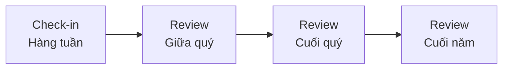

# SOP-02.3: THEO DÕI VÀ ĐÁNH GIÁ OKR

## 1. MỤC ĐÍCH
Quy định quy trình theo dõi tiến độ và đánh giá kết quả OKR, đảm bảo:
- Cập nhật tiến độ thường xuyên
- Phát hiện sớm vấn đề và rủi ro
- Hỗ trợ kịp thời khi cần
- Học hỏi và điều chỉnh linh hoạt
- Đo lường chính xác kết quả đạt được

## 2. PHẠM VI ÁP DỤNG
- Tất cả cấp độ có OKR
- Owners của từng OKR
- Managers và team leads
- Phòng Nhân sự / OKR Champion

## 3. CHU KỲ THEO DÕI

### 3.1. Tổng quan các mức độ theo dõi


### 3.2. Tần suất theo cấp độ
```
Cấp tổ chức:
├─ Check-in: 2 tuần/lần
├─ Review giữa quý: Tuần 6
└─ Review cuối quý: Tuần 12

Cấp phòng ban:
├─ Check-in: 1 tuần/lần
├─ Review giữa quý: Tuần 6
└─ Review cuối quý: Tuần 12

Cấp nhóm/cá nhân:
├─ Check-in: 1 tuần/lần
├─ Review giữa quý: Tuần 5-6
└─ Review cuối quý: Tuần 11-12
```

## 4. CHECK-IN HÀNG TUẦN

### 4.1. Mục đích
- Cập nhật tiến độ
- Xác định blockers
- Yêu cầu hỗ trợ
- Chia sẻ learnings

### 4.2. Quy trình check-in cá nhân (15-30 phút)

#### 4.2.1. Format check-in
```
1. Cập nhật tiến độ (5 phút):
   - Mỗi KR hiện tại ở mức nào (%)
   - Hoạt động chính tuần vừa qua
   - Kết quả đạt được

2. Status assessment (5 phút):
   🟢 On track: Đang đi đúng hướng
   🟡 At risk: Có rủi ro, cần chú ý
   🔴 Off track: Có vấn đề nghiêm trọng

3. Blockers và challenges (5 phút):
   - Vấn đề gặp phải
   - Nguyên nhân
   - Cần hỗ trợ gì

4. Plan tuần tới (5 phút):
   - Priorities
   - Actions cụ thể
   - Expected progress

5. Learnings (5 phút - optional):
   - Điều gì hiệu quả
   - Điều gì không hiệu quả
   - Adjustments
```

#### 4.2.2. Công cụ check-in
**Option 1: Spreadsheet**
```
Tuần | KR1 (%) | KR2 (%) | KR3 (%) | Status | Notes | Blockers
-----|---------|---------|---------|--------|-------|----------
W1   | 10%     | 5%      | 0%      | 🟢     | ...   | None
W2   | 20%     | 15%     | 10%     | 🟢     | ...   | None
W3   | 25%     | 20%     | 15%     | 🟡     | ...   | Resource
```

**Option 2: OKR Software**
- Weekdone, 15Five, Perdoo
- Automated reminders
- Dashboard real-time

**Option 3: Email template**
```
To: [Manager]
Subject: OKR Check-in - Week [X]

Progress update:
- KR1: [X%] (Target: [Y%] by now) - [Status]
- KR2: [X%] (Target: [Y%] by now) - [Status]
- KR3: [X%] (Target: [Y%] by now) - [Status]

Blockers:
- [Issue 1]
- [Issue 2]

Support needed:
- [Request 1]
- [Request 2]

Next week focus:
- [Priority 1]
- [Priority 2]
```

### 4.3. Team check-in meeting (30-60 phút)

#### 4.3.1. Agenda
```
00:00-00:10: Round-robin updates
            - Mỗi người 2 phút
            - Progress highlights
            - Status color

00:10-00:30: Deep dive vào at-risk OKRs
            - Root cause analysis
            - Brainstorm solutions
            - Assign actions

00:30-00:45: Collaboration opportunities
            - Ai cần help từ ai
            - Dependencies
            - Resource sharing

00:45-00:60: Wrap-up
            - Key takeaways
            - Commitments
            - Next steps
```

#### 4.3.2. Best practices
```
✅ DO:
- Keep it short và focused
- Focus on blockers, không phải updates
- Action-oriented
- Psychological safety (không blame)
- Celebrate small wins

❌ DON'T:
- Detailed status reports (đã có trong email)
- Problem dumping without solutions
- Finger pointing
- Off-topic discussions
```

### 4.4. Leadership check-in (BGH level)

**Tần suất**: 2 tuần/lần
**Thời lượng**: 1-2 giờ

**Agenda**:
```
1. Dashboard review (20 phút):
   - Overall progress
   - Trends
   - Red flags

2. Deep dive at-risk OKRs (40 phút):
   - Root causes
   - Strategic decisions needed
   - Resource reallocation

3. Cross-functional issues (30 phút):
   - Dependencies
   - Conflicts
   - Collaboration

4. Decisions và actions (30 phút):
   - What to do differently
   - Support to provide
   - Escalations
```

## 5. REVIEW GIỮA QUÝ (TUẦN 6)

### 5.1. Mục đích
- Đánh giá tiến độ 50%
- Dự báo khả năng đạt mục tiêu
- Quyết định có cần điều chỉnh không
- Re-energize team

### 5.2. Quy trình review

#### 5.2.1. Chuẩn bị (1 tuần trước)
```
1. Thu thập dữ liệu:
   - Progress tất cả KRs
   - Actual vs. Expected
   - Blockers và risks

2. Phân tích:
   - On track / At risk / Off track
   - Forecast cuối quý
   - Root causes của gaps

3. Chuẩn bị materials:
   - Dashboard
   - Presentation
   - Recommendations
```

#### 5.2.2. Review meeting cấp phòng ban (1-2 giờ)
```
Agenda:
00:00-00:20: Progress review
            - Từng OKR và KRs
            - Achievements
            - Challenges

00:20-00:40: Forecast và gap analysis
            - Dự báo cuối quý
            - Gaps to close
            - Probability of success

00:40-01:00: Problem solving
            - At-risk OKRs
            - Brainstorm solutions
            - Decide actions

01:00-01:20: Adjustments (nếu cần)
            - Revise targets
            - Change approach
            - Reallocate resources

01:20-01:40: Recommitment
            - Renewed focus
            - Clear priorities
            - Support commitments
```

#### 5.2.3. Review meeting cấp tổ chức (2-3 giờ)
**Tham gia**: BGH + Trưởng phòng ban

**Agenda**:
```
00:00-00:30: Overall progress
00:30-01:30: Phòng ban presentations (10 phút/phòng)
            - Progress
            - Forecast
            - Support needed
01:30-02:00: Break
02:00-02:45: Strategic discussions
            - Cross-functional issues
            - Resource decisions
            - Adjustments
02:45-03:00: Wrap-up và commitments
```

### 5.3. Quyết định điều chỉnh

#### 5.3.1. Khi nào nên điều chỉnh
```
Điều chỉnh KHI:
✅ Context thay đổi đáng kể
✅ Target không realistic (quá cao hoặc quá thấp)
✅ Priorities thay đổi
✅ Resources thay đổi
✅ Dependencies fail

KHÔNG điều chỉnh KHI:
❌ Chỉ vì khó đạt (except unrealistic)
❌ Để "look good"
❌ Thiếu effort
```

#### 5.3.2. Loại điều chỉnh
```
1. Adjust target:
   - Tăng nếu quá dễ
   - Giảm nếu unrealistic
   - Document rationale

2. Change approach:
   - Pivot strategy
   - Try new tactics
   - Reallocate resources

3. Deprioritize/Cancel:
   - Nếu không còn relevant
   - Nếu impossible
   - Replace với OKR mới
```

## 6. REVIEW CUỐI QUÝ (TUẦN 12)

### 6.1. Mục đích
- Đánh giá kết quả cuối cùng
- Tính điểm (scoring)
- Học hỏi (learnings)
- Celebrate thành công
- Input cho quý sau

### 6.2. Quy trình scoring

#### 6.2.1. Cách tính điểm
```
Cho mỗi Key Result:
Score = (Actual - Baseline) / (Target - Baseline) × 100%

Ví dụ:
KR: Tăng điểm TB từ 7.8 (baseline) lên 8.3 (target)
Actual: 8.1

Score = (8.1 - 7.8) / (8.3 - 7.8) × 100%
      = 0.3 / 0.5 × 100%
      = 60%
```

#### 6.2.2. Thang điểm
```
90-100%: Xuất sắc (Exceeds expectations)
70-89%:  Tốt (Meets expectations - target zone)
50-69%:  Trung bình (Acceptable)
30-49%:  Yếu (Below expectations)
0-29%:   Kém (Significantly below)
```

#### 6.2.3. Tính điểm Objective
```
Objective Score = Trung bình của tất cả KR scores

Ví dụ:
O1: Nâng cao chất lượng
├─ KR1: 80%
├─ KR2: 70%
└─ KR3: 60%

O1 Score = (80% + 70% + 60%) / 3 = 70%
```

#### 6.2.4. Overall OKR Score
```
Overall Score = Trung bình của tất cả O scores

Hoặc: Weighted average nếu có priorities khác nhau
```

### 6.3. Review meeting cuối quý

#### 6.3.1. Cấp cá nhân (30-45 phút)
```
1. Self-assessment (trước meeting):
   - Tính scores
   - Reflect on performance
   - Identify learnings

2. 1-1 với manager:
   - Present scores và rationale
   - Discuss achievements
   - Analyze gaps
   - Extract learnings
   - Input cho quý sau
```

#### 6.3.2. Cấp phòng ban (2 giờ)
```
00:00-00:30: Scores và achievements
00:30-01:00: Learnings session
            - What worked?
            - What didn't?
            - Why?
            - What to do differently?
01:00-01:30: Celebration
            - Recognize contributors
            - Share success stories
            - Team bonding
01:30-02:00: Preview quý sau
            - Priorities
            - Early thoughts on OKRs
```

#### 6.3.3. Cấp tổ chức (Nửa ngày)
```
08:00-08:30: Overall results
08:30-10:00: Phòng ban presentations
10:00-10:15: Break
10:15-11:30: Learnings và best practices
11:30-12:00: Recognition và celebration
12:00-13:00: Lunch
```

### 6.4. Documentation

#### 6.4.1. OKR Report Template
```
[TÊN PHÒNG BAN] - OKR QUÝ [X] REPORT

1. SUMMARY:
   - Overall score: [X%]
   - Objectives achieved: [X/Y]
   - Key highlights

2. DETAILED RESULTS:
   O1: [Name] - Score: [X%]
   ├─ KR1: [Name] - [Baseline] → [Target] → [Actual] = [Score%]
   ├─ KR2: [Name] - [Baseline] → [Target] → [Actual] = [Score%]
   └─ KR3: [Name] - [Baseline] → [Target] → [Actual] = [Score%]

   [Repeat for O2, O3...]

3. ACHIEVEMENTS:
   - [Major win 1]
   - [Major win 2]
   - [Major win 3]

4. CHALLENGES:
   - [Challenge 1 và cách overcome]
   - [Challenge 2 và cách overcome]

5. LEARNINGS:
   - [Learning 1]
   - [Learning 2]
   - [Learning 3]

6. RECOMMENDATIONS FOR NEXT QUARTER:
   - [Recommendation 1]
   - [Recommendation 2]
```

## 7. DASHBOARD VÀ BÁO CÁO

### 7.1. Real-time Dashboard
**Thông tin hiển thị**:
```
OVERVIEW:
├─ Overall progress: [X%]
├─ On track: [X] OKRs (🟢)
├─ At risk: [Y] OKRs (🟡)
└─ Off track: [Z] OKRs (🔴)

BY OBJECTIVE:
O1: [Name] - [X%] - [Status]
├─ KR1: [X%]
├─ KR2: [Y%]
└─ KR3: [Z%]

BY DEPARTMENT:
├─ Phòng A: [X%] - [Status]
├─ Phòng B: [Y%] - [Status]
└─ Phòng C: [Z%] - [Status]

ALERTS:
⚠️ [OKR name] - Behind schedule
⚠️ [OKR name] - Blocker identified
```

### 7.2. Báo cáo định kỳ
```
Weekly: Check-in summary (email)
Bi-weekly: Leadership dashboard
Mid-quarter: Progress report (presentation)
End-quarter: Final report (comprehensive)
```

## 8. CÔNG CỤ VÀ TEMPLATE

### 8.1. Check-in templates
- Weekly check-in form
- Team meeting agenda
- Email update template

### 8.2. Review templates
- Mid-quarter review deck
- End-quarter report
- Scoring calculator

### 8.3. Dashboard templates
- Excel/Google Sheets
- Power BI
- OKR software

## 9. CHỈ SỐ CHẤT LƯỢNG

```
Process compliance:
- % check-ins đúng hạn: ≥ 95%
- % tham gia review meetings: ≥ 98%
- % OKRs có scores cuối quý: 100%

Data quality:
- % KRs có data cập nhật: ≥ 95%
- Accuracy của forecasts: ≥ 70%

Engagement:
- Satisfaction với process: ≥ 4.0/5.0
- Usefulness rating: ≥ 4.0/5.0
```

---

**Ngày ban hành**: 01/01/2024  
**Người phê duyệt**: Ban Giám hiệu  
**Người soạn thảo**: Phòng Nhân sự  
**Ngày xem xét lại**: 01/01/2025


