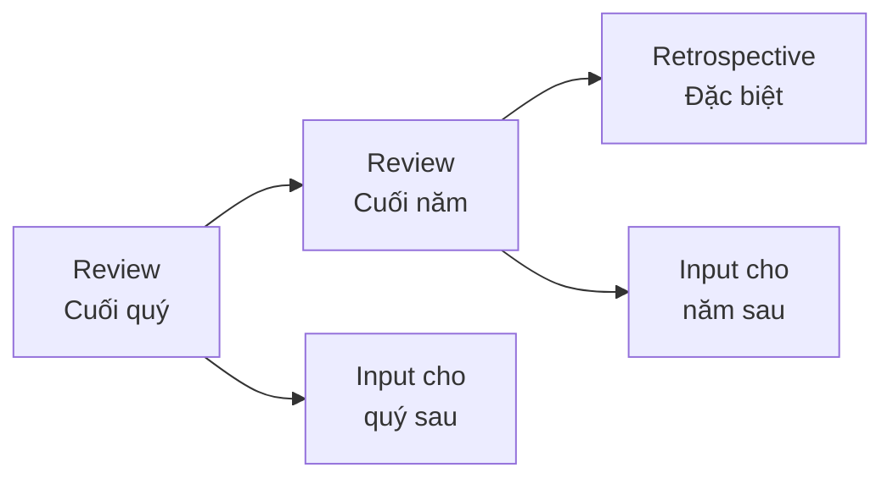
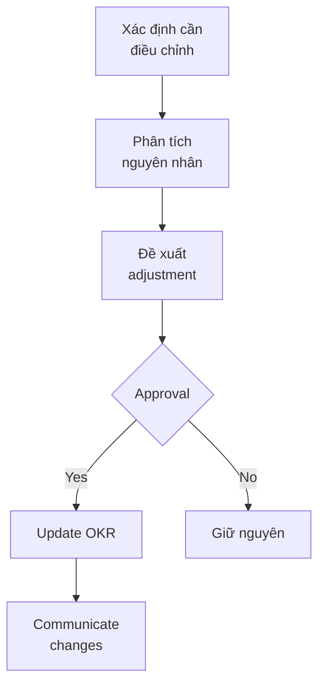

# SOP-02.4: REVIEW VÀ ĐIỀU CHỈNH OKR

## 1. MỤC ĐÍCH
Quy định quy trình review kết quả OKR, rút ra bài học và điều chỉnh cho kỳ tiếp theo, đảm bảo:
- Học hỏi từ thành công và thất bại
- Cải tiến liên tục quy trình OKR
- Điều chỉnh linh hoạt khi cần
- Tạo văn hóa học hỏi và phát triển
- Nâng cao hiệu quả OKR theo thời gian

## 2. PHẠM VI ÁP DỤNG
- Tất cả cấp độ có OKR
- Owners và contributors
- Managers và leaders
- OKR Champion

## 3. CÁC LOẠI REVIEW

### 3.1. Tổng quan


### 3.2. Phân biệt các loại review
```
Review Cuối quý:
├─ Focus: Kết quả quý vừa qua
├─ Mục đích: Học hỏi và cải thiện
├─ Output: Lessons learned, input cho quý sau
└─ Thời gian: 1-2 giờ

Review Cuối năm:
├─ Focus: Tổng kết cả năm
├─ Mục đích: Strategic insights, planning năm sau
├─ Output: Annual report, strategic adjustments
└─ Thời gian: Nửa ngày - 1 ngày

Retrospective:
├─ Focus: Process và cách làm việc
├─ Mục đích: Cải tiến quy trình OKR
├─ Output: Process improvements
└─ Thời gian: 1-2 giờ
```

## 4. QUY TRÌNH REVIEW CUỐI QUÝ

### 4.1. Chuẩn bị (1 tuần trước)

#### 4.1.1. Thu thập dữ liệu
```
1. Scores cuối cùng:
   - Tất cả KRs và Os
   - Actual vs. Target
   - Calculations

2. Context data:
   - Major events trong quý
   - Changes và pivots
   - External factors

3. Qualitative data:
   - Success stories
   - Challenges faced
   - Feedback từ team
```

#### 4.1.2. Self-reflection
**Câu hỏi hướng dẫn**:
```
1. Kết quả:
   - Đạt được gì?
   - Không đạt được gì?
   - Tại sao?

2. Process:
   - Cách làm nào hiệu quả?
   - Cách làm nào không hiệu quả?
   - Điều gì bất ngờ?

3. Collaboration:
   - Hợp tác tốt với ai?
   - Khó khăn với ai?
   - Dependencies nào problematic?

4. Support:
   - Support nào hữu ích?
   - Thiếu support gì?
   - Resources đủ không?

5. Personal:
   - Học được gì?
   - Phát triển được gì?
   - Muốn làm gì khác?
```

### 4.2. Review Meeting

#### 4.2.1. Cấp cá nhân (30-45 phút)
```
Agenda:
00:00-00:10: Present scores
            - Từng KR và rationale
            - Overall assessment

00:10-00:20: Discuss achievements
            - What went well
            - Proud moments
            - Impact created

00:20-00:30: Analyze gaps
            - What didn't work
            - Root causes
            - External factors

00:30-00:40: Extract learnings
            - Key takeaways
            - Do differently next time
            - Skills to develop

00:40-00:45: Forward looking
            - Priorities quý sau
            - Support needed
            - Growth opportunities
```

**Manager's role**:
```
✅ DO:
- Listen actively
- Ask probing questions
- Acknowledge efforts
- Focus on learning, not blame
- Provide coaching
- Commit to support

❌ DON'T:
- Judge harshly
- Focus only on failures
- Compare with others
- Make it about performance review
- Rush through
```

#### 4.2.2. Cấp team/phòng ban (2-3 giờ)
```
Part 1: Results Review (45 phút)
├─ Present overall scores
├─ Celebrate wins
├─ Acknowledge challenges
└─ Q&A

Part 2: Retrospective (60 phút)
├─ What went well? (20 phút)
├─ What didn't go well? (20 phút)
└─ What to do differently? (20 phút)

Part 3: Recognition (30 phút)
├─ Shout-outs
├─ Awards (nếu có)
└─ Team bonding

Part 4: Looking ahead (30 phút)
├─ Priorities quý sau
├─ Early OKR ideas
└─ Commitments
```

#### 4.2.3. Cấp tổ chức (Nửa ngày)
```
Morning Session (3 giờ):
08:00-08:30: Overall results presentation
08:30-10:00: Department presentations (10 phút/phòng)
10:00-10:15: Break
10:15-11:00: Cross-functional learnings

Lunch Break (1 giờ)

Afternoon Session (2 giờ):
13:00-14:00: Strategic insights
            - Patterns across departments
            - Systemic issues
            - Opportunities
14:00-14:30: Recognition ceremony
14:30-15:00: Preview và energize for next quarter
```

### 4.3. Retrospective Framework

#### 4.3.1. Format: Start-Stop-Continue
```
START (Bắt đầu làm):
- Những gì chúng ta nên bắt đầu làm?
- Practices mới nào sẽ giúp ích?

STOP (Ngừng làm):
- Những gì không hiệu quả nên dừng?
- Waste time/effort ở đâu?

CONTINUE (Tiếp tục làm):
- Những gì đang làm tốt?
- Best practices nào nên maintain?
```

**Quy trình**:
```
1. Individual reflection (5 phút):
   - Mỗi người viết ideas lên post-its

2. Sharing và clustering (15 phút):
   - Dán lên board
   - Group similar ideas

3. Discussion (20 phút):
   - Thảo luận từng cluster
   - Vote cho priorities

4. Action planning (20 phút):
   - Top 3-5 actions
   - Owners và deadlines
```

#### 4.3.2. Format: 4Ls
```
LIKED (Thích):
- Điều gì bạn thích trong quý này?

LEARNED (Học được):
- Bạn học được gì mới?

LACKED (Thiếu):
- Thiếu gì? Cần gì thêm?

LONGED FOR (Mong muốn):
- Bạn mong muốn điều gì cho quý sau?
```

## 5. QUY TRÌNH ĐIỀU CHỈNH

### 5.1. Khi nào điều chỉnh OKR

#### 5.1.1. Điều chỉnh giữa quý (Mid-quarter)
```
Điều chỉnh KHI:
✅ Context thay đổi lớn (chính sách, thị trường)
✅ Target rõ ràng unrealistic (data mới)
✅ Priorities thay đổi (strategic pivot)
✅ Major blocker không thể remove
✅ Dependency fail (phòng khác không deliver)

KHÔNG điều chỉnh KHI:
❌ Chỉ vì khó (unless truly impossible)
❌ Để "game the system"
❌ Thiếu effort
❌ Discomfort với stretch goal
```

#### 5.1.2. Quy trình điều chỉnh


**Approval levels**:
```
Điều chỉnh KR targets:
- < 20% change: Manager approval
- 20-50% change: Department head approval
- > 50% change: BGH approval

Điều chỉnh Objectives:
- Add/remove/change: BGH approval
- Major pivot: Board notification
```

### 5.2. Loại điều chỉnh

#### 5.2.1. Adjust targets
```
Tăng target:
- Khi: Progress vượt expectations
- Lý do: Maintain ambition
- Ví dụ: Target 8.0 → 8.3 (đã đạt 8.1 ở giữa quý)

Giảm target:
- Khi: Truly unrealistic (data mới, context change)
- Lý do: Keep credibility
- Ví dụ: Target 95% → 85% (do policy change)
```

#### 5.2.2. Change approach
```
Pivot strategy:
- Khi: Current approach không work
- Lý do: Achieve outcome khác cách
- Ví dụ: Từ training → coaching 1-1
```

#### 5.2.3. Add/Remove OKRs
```
Add:
- Khi: New priority urgent emerges
- Lý do: Respond to critical need
- Limit: Không quá 1-2 OKRs/quý

Remove:
- Khi: No longer relevant
- Lý do: Free up resources
- Process: Formal closure, document why
```

### 5.3. Documentation của changes
```
Change Log Template:

Date: [Date]
OKR: [Which OKR]
Type: [Adjust target / Change approach / Add / Remove]
From: [Old state]
To: [New state]
Rationale: [Why]
Approved by: [Name]
Impact: [On other OKRs, teams]
```

## 6. HỌC HỎI VÀ CẢI TIẾN

### 6.1. Capture learnings

#### 6.1.1. Template Lessons Learned
```
OKR: [Name]
Final Score: [X%]

WHAT WORKED WELL:
1. [Success factor 1]
   - Why: [Root cause]
   - Replicable: [Yes/No]
   - Apply to: [Other OKRs/teams]

2. [Success factor 2]
   [...]

WHAT DIDN'T WORK:
1. [Challenge 1]
   - Why: [Root cause]
   - Avoidable: [Yes/No]
   - Prevent next time: [How]

2. [Challenge 2]
   [...]

KEY INSIGHTS:
- [Insight 1]
- [Insight 2]
- [Insight 3]

RECOMMENDATIONS:
- For this OKR next time: [...]
- For other OKRs: [...]
- For OKR process: [...]
```

#### 6.1.2. Knowledge sharing
```
1. Document learnings trong OKR system
2. Share trong review meetings
3. Create best practices library
4. Training cho teams khác
5. Include trong onboarding
```

### 6.2. Process improvements

#### 6.2.1. OKR Process Retrospective (Cuối năm)
**Mục đích**: Cải tiến quy trình OKR

**Tham gia**: BGH + OKR Champion + Representatives

**Agenda** (2 giờ):
```
00:00-00:15: Review OKR process năm vừa qua
00:15-00:45: Retrospective (Start-Stop-Continue)
00:45-01:15: Identify improvements
01:15-01:45: Prioritize và action plan
01:45-02:00: Commitments
```

**Areas to review**:
```
1. OKR Setting:
   - Workshop format
   - Timeline
   - Tools
   - Quality of OKRs

2. Cascading:
   - Alignment process
   - Timeline
   - Support provided

3. Tracking:
   - Check-in frequency
   - Tools và systems
   - Data collection

4. Reviews:
   - Meeting formats
   - Participation
   - Usefulness

5. Culture:
   - Buy-in level
   - Psychological safety
   - Learning mindset
```

#### 6.2.2. Continuous improvements
```
Mỗi quý:
- Tweak 1-2 small things
- Test và evaluate
- Keep what works

Mỗi năm:
- Major process review
- Implement 3-5 improvements
- Update documentation
```

## 7. CELEBRATION VÀ RECOGNITION

### 7.1. Celebrate wins

#### 7.1.1. Quarterly celebration
```
Format:
- Trong review meeting cuối quý
- Hoặc separate event (nếu budget)

Activities:
1. Highlight achievements:
   - Top performing OKRs
   - Biggest improvements
   - Most impactful

2. Recognize contributors:
   - Individual shout-outs
   - Team awards
   - Certificates/prizes

3. Share stories:
   - How success was achieved
   - Challenges overcome
   - Collaboration examples

4. Energize for next quarter:
   - Momentum building
   - Renewed commitment
```

#### 7.1.2. Recognition criteria
```
Categories:
1. Highest Score: OKR đạt điểm cao nhất
2. Most Improved: Tiến bộ nhiều nhất
3. Best Collaboration: Hợp tác tốt nhất
4. Most Innovative: Approach sáng tạo nhất
5. Overcoming Odds: Vượt qua khó khăn lớn
```

### 7.2. Handle failures constructively

#### 7.2.1. Mindset về "failure"
```
OKR Score < 70% KHÔNG phải failure nếu:
✅ Effort đầy đủ
✅ Learnings có giá trị
✅ Approach reasonable
✅ External factors beyond control
✅ Ambitious target (stretch goal)

Chỉ là concern nếu:
❌ Lack of effort
❌ Poor planning
❌ Ignored early warnings
❌ Didn't ask for help
❌ Consistently low scores
```

#### 7.2.2. Blameless post-mortem
**Khi OKR fail badly (< 50%)**:
```
Quy trình:
1. Gather facts (không opinions)
2. Timeline reconstruction
3. Identify root causes (5 Whys)
4. Systemic issues vs. individual
5. Learnings
6. Preventive actions

Không:
❌ Blame individuals
❌ Punish for trying
❌ Discourage ambition
```

## 8. INPUT CHO KỲ TIẾP THEO

### 8.1. Từ review cuối quý → Quý sau

#### 8.1.1. Carry-over decisions
```
Cho mỗi OKR chưa hoàn thành:

Option 1: Carry over (Tiếp tục)
- Khi: Vẫn relevant và important
- Adjust: Target hoặc approach
- Commit: Renewed focus

Option 2: Close (Đóng lại)
- Khi: Đã đạt "good enough"
- Hoặc: Không còn relevant
- Document: Final status

Option 3: Transform (Chuyển đổi)
- Khi: Cần reframe
- Thành: OKR mới với angle khác
```

#### 8.1.2. New priorities
```
Identify:
1. Unfinished business (từ quý trước)
2. New strategic priorities
3. Emerging opportunities
4. Lessons learned applications

Balance:
- 50-60%: Continue from last quarter
- 40-50%: New priorities
```

### 8.2. Từ review cuối năm → Năm sau

#### 8.2.1. Annual synthesis
```
Aggregate learnings:
1. Patterns across quarters
2. Recurring themes
3. Systemic strengths/weaknesses
4. Strategic insights

Strategic implications:
1. Strategy adjustments needed?
2. Resource reallocation?
3. Capability gaps?
4. Market changes?
```

#### 8.2.2. Input cho strategic planning
```
OKR insights feed into:
- Annual strategic plan review
- Budget planning
- Org structure decisions
- Capability development plans
```

## 9. CÔNG CỤ VÀ TEMPLATE

### 9.1. Review templates
```
- Quarterly Review Report
- Annual Review Report
- Lessons Learned Template
- Retrospective Canvas
- Change Log
```

### 9.2. Analysis tools
```
- Scoring calculator
- Trend analysis charts
- Correlation analysis (OKR vs. KPI)
- Root cause analysis (5 Whys, Fishbone)
```

### 9.3. Communication templates
```
- Review meeting agenda
- Results presentation
- Learnings summary
- Celebration announcement
```

## 10. CHỈ SỐ CHẤT LƯỢNG

### 10.1. Process metrics
```
- % OKRs reviewed đúng hạn: 100%
- % có documented learnings: ≥ 90%
- Participation trong reviews: ≥ 95%
- Satisfaction với review process: ≥ 4.0/5.0
```

### 10.2. Learning metrics
```
- Số learnings captured: ≥ 3 per OKR
- % learnings applied quý sau: ≥ 50%
- Process improvements implemented: ≥ 3/năm
```

### 10.3. Outcome metrics
```
- OKR scores improving over time: Trend up
- % OKRs trong target zone (70-80%): ≥ 60%
- Repeat mistakes: Decreasing
```

## 11. BEST PRACTICES

### 11.1. Review meetings
```
✅ DO:
- Chuẩn bị kỹ trước
- Focus on learning
- Encourage honesty
- Document insights
- End on positive note
- Action-oriented

❌ DON'T:
- Blame game
- Superficial discussion
- Rush through
- Skip documentation
- Forget to celebrate
```

### 11.2. Scoring
```
✅ DO:
- Honest assessment
- Use data
- Explain rationale
- Accept stretch goal results (70%)

❌ DON'T:
- Inflate scores
- Sandbag targets
- Ignore context
- Punish low scores
```

### 11.3. Learnings
```
✅ DO:
- Specific và actionable
- Share broadly
- Apply to future
- Build knowledge base

❌ DON'T:
- Generic platitudes
- Keep to yourself
- Forget after meeting
```

---

**Ngày ban hành**: 01/01/2024  
**Người phê duyệt**: Ban Giám hiệu  
**Người soạn thảo**: Phòng Nhân sự  
**Ngày xem xét lại**: 01/01/2025

