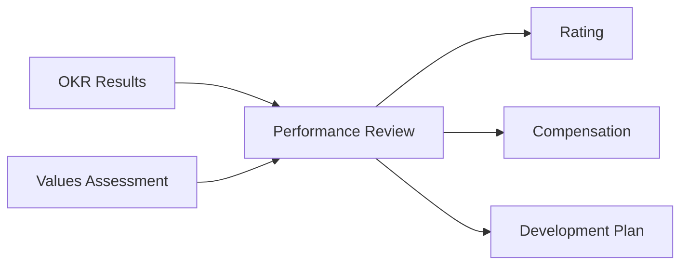

# SOP-02.5: KẾT NỐI OKR VỚI ĐÁNH GIÁ NHÂN SỰ

## 1. MỤC ĐÍCH
Quy định cách thức tích hợp OKR vào hệ thống đánh giá và phát triển nhân sự, đảm bảo:
- OKR và performance review bổ trợ lẫn nhau
- Rõ ràng về expectations và đánh giá
- Công bằng và minh bạch
- Động viên đúng hành vi
- Phát triển năng lực nhân viên

## 2. PHẠM VI ÁP DỤNG
- Phòng Nhân sự (thiết kế hệ thống)
- Managers (thực hiện đánh giá)
- Toàn thể nhân viên (được đánh giá)

## 3. NGUYÊN TẮC KẾT NỐI

### 3.1. Tách biệt nhưng liên kết
```
OKR ≠ Performance Review

OKR:
- Focus: Mục tiêu và kết quả
- Mindset: Ambitious, learning
- Frequency: Quarterly
- Outcome: 70% is good

Performance Review:
- Focus: Overall performance
- Mindset: Accountability
- Frequency: Annual/Biannual
- Outcome: Meet expectations
```

**Mối quan hệ**:


### 3.2. Weighting
```
Performance Review = 
├─ OKR Achievement (40-50%)
├─ Values Demonstration (30-40%)
└─ Core Responsibilities (20-30%)
```

**Lý do không 100% OKR**:
- Encourage ambition (không sợ fail)
- Recognize other contributions
- Holistic assessment

## 4. QUY TRÌNH TÍCH HỢP

### 4.1. Đầu năm: Goal Setting

#### 4.1.1. Performance Planning Meeting (60-90 phút)
```
Agenda:
00:00-00:15: Review role và responsibilities
00:15-00:45: Set OKRs (như SOP-02.2)
00:45-00:60: Set values goals
00:60-00:75: Set development goals
00:75-00:90: Finalize và document
```

**Output**: Performance Plan Document
```
[TÊN NHÂN VIÊN] - PERFORMANCE PLAN [NĂM]

1. CORE RESPONSIBILITIES (20-30%):
   - [Responsibility 1]: [Standard expected]
   - [Responsibility 2]: [Standard expected]
   - [Responsibility 3]: [Standard expected]

2. OKRs (40-50%):
   O1: [Name]
   ├─ KR1: [Target]
   └─ KR2: [Target]
   
   O2: [Name]
   └─ KR1: [Target]

3. VALUES GOALS (30-40%):
   - [Value 1]: [Specific behavior goal]
   - [Value 2]: [Specific behavior goal]

4. DEVELOPMENT GOALS:
   - [Skill 1]: [How to develop]
   - [Skill 2]: [How to develop]

Signatures:
Employee: __________ Date: ______
Manager: ___________ Date: ______
```

### 4.2. Trong năm: Tracking và Feedback

#### 4.2.1. Continuous feedback
```
Frequency: Ongoing, không chờ đến review

Occasions:
- Sau OKR check-ins
- Sau major milestones
- Khi có issues
- Khi có successes

Format:
- Informal conversations
- Formal written feedback (quarterly)
- 360 feedback (annual)
```

#### 4.2.2. Mid-year review (Tháng 6)
```
Agenda (60-90 phút):
1. Review 6 tháng đầu:
   - OKR scores (Q1 + Q2)
   - Core responsibilities
   - Values demonstration

2. Feedback:
   - Strengths
   - Areas for improvement
   - Specific examples

3. Adjust goals (nếu cần):
   - Based on performance
   - Based on context changes

4. Development:
   - Progress on development goals
   - Additional support needed

5. Second half planning:
   - Priorities
   - Focus areas
   - Commitments
```

### 4.3. Cuối năm: Performance Review

#### 4.3.1. Chuẩn bị (2 tuần trước)
```
Employee self-assessment:
1. OKR results:
   - Scores tất cả quarters
   - Achievements
   - Learnings

2. Core responsibilities:
   - How well performed
   - Examples

3. Values:
   - Self-rating
   - Examples demonstrated

4. Development:
   - Progress made
   - Skills gained

5. Overall self-rating: [1-5]
```

**Manager preparation**:
```
1. Review all data:
   - OKR scores (4 quarters)
   - Check-in notes
   - 360 feedback
   - Observations

2. Draft assessment:
   - Ratings
   - Supporting evidence
   - Feedback points

3. Calibration (với peer managers):
   - Ensure consistency
   - Discuss edge cases
```

#### 4.3.2. Performance Review Meeting (90-120 phút)
```
Agenda:
00:00-00:15: Opening và context

00:15-00:45: Review OKR component (40-50%):
            - Q1-Q4 scores
            - Overall OKR achievement
            - Highlights và challenges
            - Rating: [1-5]

00:45-01:00: Review core responsibilities (20-30%):
            - Quality of work
            - Consistency
            - Rating: [1-5]

01:00-01:15: Review values (30-40%):
            - Each value assessment
            - Behaviors observed
            - Rating: [1-5]

01:15-01:30: Overall rating calculation:
            - Weighted average
            - Final rating: [1-5]

01:30-01:45: Development discussion:
            - Strengths to leverage
            - Areas to develop
            - Career aspirations

01:45-02:00: Next year planning:
            - Goals preview
            - Support commitments
            - Signatures
```

#### 4.3.3. Rating scale
```
5 - Xuất sắc (Outstanding):
    - OKR: > 85% average
    - Consistently exceeds
    - Role model

4 - Vượt mong đợi (Exceeds):
    - OKR: 70-85%
    - Often exceeds
    - Strong performer

3 - Đạt mong đợi (Meets):
    - OKR: 60-70%
    - Meets expectations
    - Solid performer

2 - Cần cải thiện (Needs Improvement):
    - OKR: 40-60%
    - Below expectations
    - Performance plan needed

1 - Không đạt (Does Not Meet):
    - OKR: < 40%
    - Significantly below
    - Serious concern
```

### 4.4. Kết nối với compensation

#### 4.4.1. Nguyên tắc
```
Performance Rating → Compensation Decisions

Nhưng:
✅ OKR scores inform, không dictate
✅ Consider context và effort
✅ Multiple factors (not just OKR)
✅ Transparent criteria
```

#### 4.4.2. Compensation matrix
```
Rating | Bonus (% of base) | Salary Increase | Promotion Eligible
-------|-------------------|-----------------|-------------------
5      | 15-25%           | 8-12%           | Yes
4      | 10-15%           | 5-8%            | Yes
3      | 5-10%            | 3-5%            | Maybe
2      | 0-5%             | 0-3%            | No
1      | 0%               | 0%              | No (PIP)
```

**Lưu ý**: 
- Low OKR scores do ambition không penalty
- Consistent low scores do lack of effort có penalty
- Manager judgment critical

### 4.5. Kết nối với development

#### 4.5.1. Individual Development Plan (IDP)
```
Based on:
1. OKR results:
   - Skills cần develop để đạt OKRs tốt hơn
   - Strengths to leverage

2. Values assessment:
   - Values cần strengthen
   - Behaviors to develop

3. Career aspirations:
   - Next role requirements
   - Gaps to close

Output: IDP cho năm sau
├─ Development goals (2-3)
├─ Learning activities
├─ Timeline
└─ Success metrics
```

#### 4.5.2. Talent development decisions
```
High Performer (Rating 4-5):
├─ Stretch assignments
├─ Leadership opportunities
├─ Mentoring others
└─ Fast-track programs

Solid Performer (Rating 3):
├─ Skill development
├─ Lateral moves
└─ Continuous improvement

Needs Improvement (Rating 2):
├─ Performance Improvement Plan (PIP)
├─ Coaching intensive
├─ 90-day review
└─ Decision point

Does Not Meet (Rating 1):
├─ Immediate PIP
├─ 30-60 day review
└─ Termination consideration
```

## 5. XỬ LÝ CÁC TÌNH HUỐNG ĐỘC BIỆT

### 5.1. High OKR scores nhưng poor values
```
Situation: Nhân viên đạt OKRs cao nhưng vi phạm values

Assessment:
- Overall rating: Không thể là 5
- Maximum: 3 (Meets)
- Có thể: 2 nếu vi phạm nghiêm trọng

Actions:
- Clear feedback về values
- Development plan cho values
- Monitoring closely
- Consequences nếu không cải thiện
```

### 5.2. Low OKR scores nhưng great effort
```
Situation: Nhân viên cố gắng hết sức nhưng OKR khó

Assessment:
- Consider context
- Evaluate effort và learning
- Rating: Có thể 3-4 nếu values tốt

Actions:
- Acknowledge effort
- Adjust OKRs cho realistic
- Provide support
- Coaching
```

### 5.3. External factors impact
```
Situation: OKRs fail do external factors không control được

Assessment:
- Separate controllable vs. uncontrollable
- Evaluate response to situation
- Rating: Không penalty nếu effort tốt

Actions:
- Document circumstances
- Focus on learnings
- Adjust future OKRs
```

## 6. COMMUNICATION VỀ KẾT NỐI

### 6.1. Transparency về cách OKR affect reviews
```
Communicate clearly:
1. Weighting (40-50%)
2. Scoring method
3. Context considerations
4. Examples
5. FAQs
```

### 6.2. Manage expectations
```
Messages:
✅ "OKR scores inform reviews, không phải toàn bộ"
✅ "70% OKR là good performance"
✅ "Ambition được khuyến khích"
✅ "Context matters"
✅ "Values equally important"

Avoid:
❌ "OKR = Performance review"
❌ "Must hit 100%"
❌ "Low OKR = bad review"
```

## 7. CHỈ SỐ ĐÁNH GIÁ

```
System metrics:
- % nhân viên hiểu connection: ≥ 90%
- % reviews sử dụng OKR data: 100%
- Consistency trong ratings: High
- Appeals/disputes: < 5%

Satisfaction:
- Fairness perception: ≥ 4.0/5.0
- Transparency: ≥ 4.2/5.0
- Usefulness for development: ≥ 4.0/5.0

Outcomes:
- Correlation OKR-Performance: 0.6-0.8
- Retention of high performers: ≥ 95%
- Improvement of low performers: ≥ 60%
```

---

**Ngày ban hành**: 01/01/2024  
**Người phê duyệt**: Ban Giám hiệu  
**Người soạn thảo**: Phòng Nhân sự  
**Ngày xem xét lại**: 01/01/2025

