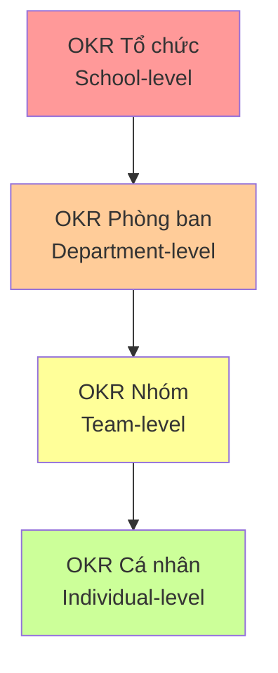
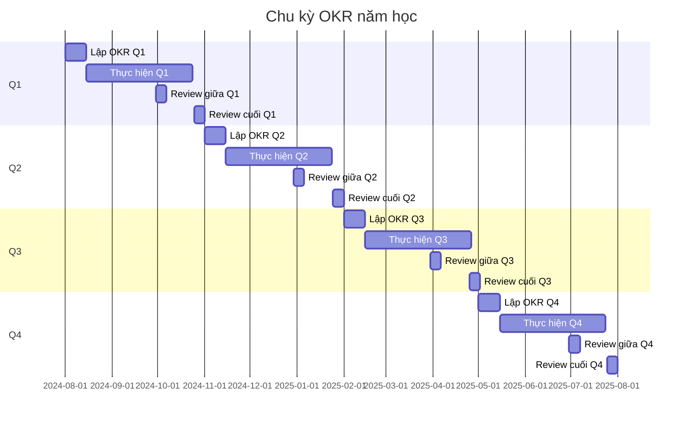
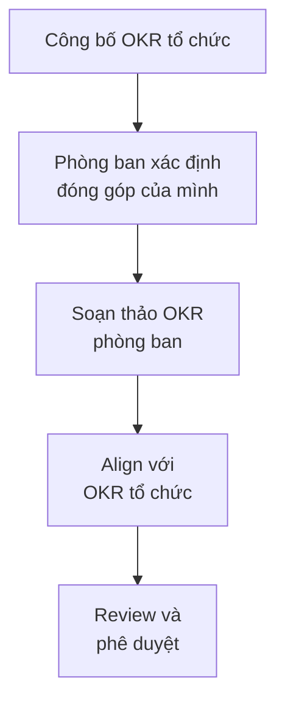

# SOP-02: LẬP OKR CHIẾN LƯỢC

## 1. MỤC ĐÍCH
Thiết lập quy trình xây dựng, triển khai và quản lý hệ thống OKR (Objectives and Key Results) cho toàn trường, đảm bảo:
- Mục tiêu rõ ràng và đo lường được
- Alignment từ tổ chức đến cá nhân
- Focus vào ưu tiên quan trọng
- Transparency và accountability
- Agile và linh hoạt điều chỉnh

## 2. PHẠM VI ÁP DỤNG
Áp dụng cho:
- Ban Giám hiệu
- Tất cả phòng ban và bộ phận
- Toàn thể cán bộ, giáo viên, nhân viên
- Được review và điều chỉnh hàng quý

## 3. KHÁI NIỆM OKR

### 3.1. Định nghĩa
**OKR** = Objectives (Mục tiêu) + Key Results (Kết quả then chốt)

**Objective (O)**: 
- Mục tiêu định tính, truyền cảm hứng
- Trả lời câu hỏi "Chúng ta muốn đạt được gì?"
- Thời hạn: Thường 1 quý hoặc 1 năm

**Key Results (KRs)**:
- Kết quả định lượng, đo lường được
- Trả lời câu hỏi "Làm sao biết đã đạt được?"
- Mỗi O có 2-5 KRs
- Có baseline, target, và actual

### 3.2. Đặc điểm OKR tốt
```
OBJECTIVE:
✅ Inspiring (Truyền cảm hứng)
✅ Qualitative (Định tính)
✅ Time-bound (Có thời hạn)
✅ Actionable (Có thể hành động)
✅ Aligned (Phù hợp với cấp trên)

KEY RESULTS:
✅ Measurable (Đo lường được)
✅ Specific (Cụ thể)
✅ Achievable but Ambitious (Đạt được nhưng thách thức)
✅ Outcome-focused (Tập trung kết quả, không phải hoạt động)
✅ Limited (2-5 KRs mỗi O)
```

### 3.3. Phân biệt OKR và KPI
```
OKR:
- Mục tiêu thay đổi (quý/năm)
- Tập trung vào đổi mới và cải tiến
- Ambitious (đạt 70% là tốt)
- Bottom-up và top-down

KPI:
- Chỉ số ổn định, duy trì
- Đo lường hiệu suất thường xuyên
- Phải đạt 100%
- Top-down
```

## 4. CẤU TRÚC OKR TỔNG THỂ

### 4.1. Các cấp độ OKR


### 4.2. Alignment và Cascading
```
Tổ chức: "Nâng cao chất lượng giáo dục"
    ↓ (Contributes to)
Phòng Học thuật: "Cải thiện phương pháp giảng dạy"
    ↓ (Contributes to)
Tổ Toán: "Triển khai phương pháp dạy học tích cực"
    ↓ (Contributes to)
Giáo viên A: "Áp dụng PBL trong 50% bài giảng"
```

## 5. QUY TRÌNH LẬP OKR

### 5.1. Chu kỳ OKR hàng năm


### 5.2. Các bước lập OKR

#### Bước 1: Xây dựng OKR cấp tổ chức (2 tuần)
**Thời điểm**: Trước khi bắt đầu quý/năm mới

**Quy trình**:


**Chi tiết**: [SOP-02.1_Xay_dung_OKR_cap_to_chuc.md](./SOP-02.1_Xay_dung_OKR_cap_to_chuc.md)

#### Bước 2: Cascading OKR xuống phòng ban (1 tuần)
**Quy trình**:


**Chi tiết**: [SOP-02.2_Cascading_OKR_xuong_phong_ban.md](./SOP-02.2_Cascading_OKR_xuong_phong_ban.md)

#### Bước 3: Theo dõi và đánh giá OKR (Liên tục)
**Tần suất**:
- Check-in hàng tuần (team level)
- Review giữa quý (tuần 6)
- Review cuối quý (tuần 12)

**Chi tiết**: [SOP-02.3_Theo_doi_va_danh_gia_OKR.md](./SOP-02.3_Theo_doi_va_danh_gia_OKR.md)

#### Bước 4: Review và điều chỉnh OKR (Hàng quý)
**Mục đích**: Học hỏi và cải thiện

**Chi tiết**: [SOP-02.4_Review_va_dieu_chinh_OKR.md](./SOP-02.4_Review_va_dieu_chinh_OKR.md)

#### Bước 5: Kết nối OKR với đánh giá nhân sự (Hàng năm)
**Mục đích**: Tích hợp vào performance management

**Chi tiết**: [SOP-02.5_Ket_noi_OKR_voi_danh_gia_nhan_su.md](./SOP-02.5_Ket_noi_OKR_voi_danh_gia_nhan_su.md)

## 6. CẤU TRÚC OKR TEMPLATE

### 6.1. Template cấp tổ chức
```
NĂM HỌC 2024-2025 - OKR TRƯỜNG [TÊN]

OBJECTIVE 1: [Mục tiêu truyền cảm hứng]
├─ KR1: [Chỉ số đo lường] từ [baseline] đến [target]
├─ KR2: [Chỉ số đo lường] từ [baseline] đến [target]
└─ KR3: [Chỉ số đo lường] từ [baseline] đến [target]

OBJECTIVE 2: [Mục tiêu truyền cảm hứng]
├─ KR1: [Chỉ số đo lường] từ [baseline] đến [target]
├─ KR2: [Chỉ số đo lường] từ [baseline] đến [target]
└─ KR3: [Chỉ số đo lường] từ [baseline] đến [target]

OBJECTIVE 3: [Mục tiêu truyền cảm hứng]
├─ KR1: [Chỉ số đo lường] từ [baseline] đến [target]
└─ KR2: [Chỉ số đo lường] từ [baseline] đến [target]
```

### 6.2. Ví dụ cụ thể
```
QUÝ 1 (T8-T10/2024) - OKR TRƯỜNG ABC

O1: Nâng cao chất lượng học tập của học sinh
├─ KR1: Tăng điểm trung bình toàn trường từ 7.8 lên 8.2
├─ KR2: Tỷ lệ học sinh giỏi tăng từ 25% lên 35%
└─ KR3: Giảm tỷ lệ học sinh yếu kém từ 8% xuống 5%

O2: Xây dựng đội ngũ giáo viên xuất sắc
├─ KR1: 100% giáo viên hoàn thành 20 giờ đào tạo
├─ KR2: Tăng điểm hài lòng giáo viên từ 4.0 lên 4.3/5.0
└─ KR3: Giảm tỷ lệ nghỉ việc từ 12% xuống 8%

O3: Tăng cường sự hài lòng của phụ huynh
├─ KR1: NPS (Net Promoter Score) tăng từ 45 lên 60
├─ KR2: Tỷ lệ tái đăng ký tăng từ 88% lên 92%
└─ KR3: Giải quyết 95% khiếu nại trong vòng 48 giờ
```

## 7. CÔNG CỤ VÀ HỆ THỐNG

### 7.1. Công cụ quản lý OKR
**Tùy chọn**:
```
Option 1: Phần mềm chuyên dụng
- Weekdone, 15Five, Perdoo, Gtmhub
- Ưu điểm: Chuyên nghiệp, tích hợp tốt
- Nhược điểm: Chi phí cao

Option 2: Công cụ phổ thông
- Google Sheets, Excel
- Ưu điểm: Linh hoạt, chi phí thấp
- Nhược điểm: Thủ công, khó scale

Option 3: Hệ thống nội bộ
- Phát triển riêng
- Ưu điểm: Tùy biến hoàn toàn
- Nhược điểm: Chi phí phát triển cao
```

**Khuyến nghị**: Bắt đầu với Google Sheets, sau đó chuyển sang phần mềm chuyên dụng khi quen.

### 7.2. Dashboard OKR
**Thông tin hiển thị**:
```
TỔNG QUAN:
├─ Số Objectives: [X]
├─ Số Key Results: [Y]
├─ Tiến độ trung bình: [Z%]
└─ Trạng thái: [On track/At risk/Off track]

CHI TIẾT TỪNG OKR:
├─ Objective: [Tên]
├─ Owner: [Người chịu trách nhiệm]
├─ Timeline: [Thời gian]
├─ Key Results:
│   ├─ KR1: [Tên] - [X%] hoàn thành
│   ├─ KR2: [Tên] - [Y%] hoàn thành
│   └─ KR3: [Tên] - [Z%] hoàn thành
└─ Status: [🟢 On track / 🟡 At risk / 🔴 Off track]
```

### 7.3. Báo cáo OKR
**Các loại báo cáo**:
```
1. Báo cáo tuần (Weekly Check-in):
   - Cập nhật tiến độ
   - Vấn đề gặp phải
   - Hỗ trợ cần thiết

2. Báo cáo giữa quý (Mid-quarter Review):
   - Đánh giá tiến độ 50%
   - Dự báo khả năng đạt được
   - Điều chỉnh nếu cần

3. Báo cáo cuối quý (End-of-quarter Review):
   - Kết quả cuối cùng
   - Điểm số (0-100%)
   - Bài học kinh nghiệm
   - Kế hoạch quý sau
```

## 8. NGUYÊN TẮC VÀ BEST PRACTICES

### 8.1. Nguyên tắc lập OKR
```
1. Less is More:
   - 3-5 Objectives mỗi cấp độ
   - 2-5 Key Results mỗi Objective
   - Focus vào quan trọng nhất

2. Ambitious but Achievable:
   - Đạt 70-80% là tốt
   - Không quá dễ, không quá khó
   - Stretch goals

3. Transparent:
   - Ai cũng thấy OKR của ai
   - Công khai tiến độ
   - Accountability

4. Bottom-up và Top-down:
   - 60% top-down (từ tổ chức)
   - 40% bottom-up (từ cá nhân)
   - Đảm bảo alignment

5. Outcome, not Output:
   - Focus vào kết quả, không phải hoạt động
   - "Tăng điểm học sinh" không phải "Tổ chức 10 buổi phụ đạo"
```

### 8.2. Những sai lầm thường gặp
```
❌ Quá nhiều OKRs (overload)
❌ KRs là activities, không phải outcomes
❌ Không ambitious (quá dễ đạt)
❌ Không align giữa các cấp
❌ Set and forget (không theo dõi)
❌ Dùng OKR để đánh giá performance (punishment)
❌ Không điều chỉnh khi cần
❌ Không celebrate thành công
```

### 8.3. Tips để thành công
```
✅ Bắt đầu nhỏ: Pilot với 1-2 phòng ban trước
✅ Training đầy đủ: Đảm bảo mọi người hiểu OKR
✅ Executive sponsorship: BGH cam kết và tham gia
✅ Regular check-ins: Không để quên OKR
✅ Celebrate wins: Ghi nhận tiến bộ
✅ Learn from failures: Không trừng phạt khi không đạt
✅ Iterate: Cải thiện quy trình mỗi quý
```

## 9. TRÁCH NHIỆM

### 9.1. Ban Giám hiệu
- Xây dựng OKR cấp tổ chức
- Phê duyệt OKR các phòng ban
- Tham gia review quý
- Mô hình hóa OKR culture

### 9.2. OKR Champion (nếu có)
- Đào tạo và hỗ trợ
- Quản lý hệ thống và công cụ
- Facilitation cho các buổi review
- Continuous improvement

### 9.3. Trưởng phòng ban
- Xây dựng OKR phòng ban
- Cascading xuống nhóm
- Check-in hàng tuần với team
- Báo cáo tiến độ

### 9.4. Nhân viên
- Xây dựng OKR cá nhân
- Cập nhật tiến độ thường xuyên
- Tham gia check-in và review
- Hỗ trợ đồng nghiệp

## 10. CHỈ SỐ ĐÁNH GIÁ

### 10.1. Chỉ số áp dụng
- % phòng ban có OKR: 100%
- % nhân viên có OKR cá nhân: ≥ 90%
- % OKR align với cấp trên: ≥ 80%
- % OKR được cập nhật đúng hạn: ≥ 95%

### 10.2. Chỉ số chất lượng
- % OKRs đạt tiêu chuẩn (SMART): ≥ 85%
- % KRs outcome-based: ≥ 90%
- Điểm trung bình đạt được: 70-80%
- % OKRs completed: 60-75%

### 10.3. Chỉ số tác động
- Cải thiện focus và alignment: ≥ 4.0/5.0
- Tăng transparency: ≥ 4.2/5.0
- Cải thiện performance: Đo lường qua KPIs
- Sự hài lòng với OKR system: ≥ 4.0/5.0

## 11. NGÂN SÁCH

```
Năm 1 (Triển khai):
├─ Đào tạo OKR: 20-30 triệu VNĐ
├─ Tư vấn (nếu có): 30-50 triệu VNĐ
├─ Phần mềm: 10-30 triệu VNĐ/năm
├─ Workshop và sự kiện: 10-15 triệu VNĐ
└─ Tài liệu và công cụ: 5-10 triệu VNĐ
---
Tổng: 75-135 triệu VNĐ

Năm 2+ (Duy trì):
├─ Phần mềm: 10-30 triệu VNĐ/năm
├─ Đào tạo refresh: 5-10 triệu VNĐ/năm
└─ Cải tiến hệ thống: 5-10 triệu VNĐ/năm
---
Tổng: 20-50 triệu VNĐ/năm
```

## 12. TÀI LIỆU THAM KHẢO

### 12.1. Sách
- "Measure What Matters" - John Doerr
- "Radical Focus" - Christina Wodtke
- "The OKRs Field Book" - Ben Lamorte

### 12.2. Frameworks
- Google OKR Playbook
- Intel OKR System (original)
- Objectives and Key Results Guide

### 12.3. Công cụ
- OKR templates (Google Sheets)
- OKR software comparison
- OKR training materials

---

**Ngày ban hành**: 01/01/2024  
**Người phê duyệt**: Ban Giám hiệu  
**Người soạn thảo**: Phòng Chiến lược & Phát triển  
**Ngày xem xét lại**: 01/01/2025
