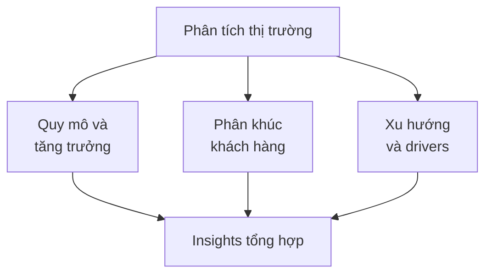

# SOP-03.1: XÂY DỰNG ĐỊNH VỊ THƯƠNG HIỆU

## 1. MỤC ĐÍCH
Quy định quy trình xây dựng định vị thương hiệu trường học, đảm bảo:
- Vị trí rõ ràng và khác biệt trong tâm trí khách hàng
- Phù hợp với năng lực và chiến lược
- Hấp dẫn với target audience
- Bền vững và khó bắt chước
- Làm nền tảng cho mọi hoạt động marketing

## 2. PHẠM VI ÁP DỤNG
- Ban Giám hiệu (phê duyệt)
- Phòng Marketing (chủ trì)
- Tư vấn chiến lược (nếu có)
- Stakeholders (cung cấp input)

## 3. QUY TRÌNH XÂY DỰNG

### 3.1. Bước 1: Nghiên cứu và phân tích (4-6 tuần)

#### 3.1.1. Phân tích thị trường


**Dữ liệu thu thập**:
```
1. Quy mô thị trường:
   - Số học sinh trong khu vực
   - Số trường tư thục
   - Học phí trung bình
   - Tốc độ tăng trưởng

2. Phân khúc:
   - Theo thu nhập gia đình
   - Theo mong muốn giáo dục
   - Theo địa lý
   - Theo giá trị ưu tiên

3. Xu hướng:
   - Nhu cầu tăng/giảm
   - Chương trình được ưa chuộng
   - Công nghệ trong giáo dục
   - Chính sách mới
```

#### 3.1.2. Phân tích đối thủ cạnh tranh
**Competitive Analysis Framework**:
```
Đối thủ | Định vị | Điểm mạnh | Điểm yếu | Học phí | Target
--------|---------|-----------|----------|---------|--------
Trường A| [...]   | [...]     | [...]    | [...]   | [...]
Trường B| [...]   | [...]     | [...]    | [...]   | [...]
Trường C| [...]   | [...]     | [...]    | [...]   | [...]
```

**Perceptual Map**:
```
        Cao cấp
            |
            |  [Trường A]
            |
Truyền thống ----+---- Hiện đại
            |
     [Trường B] | [Trường C]
            |
        Bình dân
```

#### 3.1.3. Phân tích nội bộ
**Audit điểm mạnh**:
```
1. Academic:
   - Chương trình học
   - Đội ngũ giáo viên
   - Kết quả học sinh
   - Phương pháp giảng dạy

2. Facilities:
   - Cơ sở vật chất
   - Công nghệ
   - An toàn

3. Culture:
   - Văn hóa tổ chức
   - Values
   - Community

4. Track record:
   - Lịch sử và uy tín
   - Alumni thành công
   - Giải thưởng
```

#### 3.1.4. Nghiên cứu khách hàng
**Phương pháp**:
```
1. Survey phụ huynh (n=200-300):
   - Tiêu chí chọn trường
   - Nhận thức về trường
   - Mức độ hài lòng

2. Phỏng vấn sâu (n=20-30):
   - Động cơ và mong đợi
   - Trải nghiệm thực tế
   - Perception vs. reality

3. Focus groups (5-7 nhóm):
   - Phụ huynh hiện tại
   - Phụ huynh tiềm năng
   - Alumni
```

**Insights cần có**:
```
- Jobs to be done (Phụ huynh cần giải quyết vấn đề gì?)
- Decision criteria (Tiêu chí quyết định quan trọng nhất?)
- Perceptions (Họ nghĩ gì về chúng ta vs. đối thủ?)
- Unmet needs (Nhu cầu chưa được đáp ứng?)
```

### 3.2. Bước 2: Xác định target audience (1-2 tuần)

#### 3.2.1. Segmentation
**Phân khúc theo**:
```
1. Demographics:
   - Thu nhập gia đình
   - Trình độ học vấn bố mẹ
   - Nghề nghiệp
   - Khu vực cư trú

2. Psychographics:
   - Giá trị và niềm tin
   - Lifestyle
   - Aspirations
   - Attitudes về giáo dục

3. Behaviors:
   - Quy trình quyết định
   - Information sources
   - Spending patterns
```

#### 3.2.2. Chọn target segments
**Tiêu chí đánh giá**:
```
Segment | Attractiveness | Fit | Priority
--------|----------------|-----|----------
Segment A | High | High | Primary
Segment B | High | Medium | Secondary
Segment C | Medium | Low | Tertiary
```

**Attractiveness**: Size, growth, profitability
**Fit**: Phù hợp với năng lực và values

#### 3.2.3. Persona development
**Primary Persona Template**:
```
TÊN: [Tên đại diện]
TUỔI: [35-45]
NGHỀ NGHIỆP: [...]
THU NHẬP: [...]

Demographics:
- Gia đình: [...]
- Nơi ở: [...]
- Học vấn: [...]

Psychographics:
- Giá trị: [...]
- Mục tiêu cho con: [...]
- Lo lắng: [...]

Behaviors:
- Tìm kiếm thông tin: [...]
- Quyết định: [...]
- Budget: [...]

Quote: "[Câu nói đặc trưng]"
```

### 3.3. Bước 3: Xây dựng positioning (2-3 tuần)

#### 3.3.1. Positioning Framework
```
FOR [Target audience]
WHO [Need/want]
[Brand name] IS A [Category]
THAT [Benefit/point of difference]
UNLIKE [Competitors]
BECAUSE [Reason to believe]
```

**Ví dụ**:
```
FOR các gia đình trung lưu cao
WHO mong muốn con có giáo dục quốc tế chất lượng cao
Trường ABC là trường quốc tế song ngữ
THAT kết hợp chương trình quốc tế với văn hóa Việt
UNLIKE các trường quốc tế khác chỉ focus phương Tây
BECAUSE đội ngũ giáo viên song ngữ xuất sắc và chương trình độc quyền
```

#### 3.3.2. Unique Value Proposition (UVP)
**Template**:
```
Chúng tôi giúp [target audience]
[Achieve goal]
Bằng cách [unique approach]
Không giống [competitors] vì [key difference]
```

**Ví dụ**:
```
Chúng tôi giúp học sinh Việt Nam
Trở thành công dân toàn cầu tự tin và thành công
Bằng cách kết hợp giáo dục quốc tế với bản sắc Việt
Không giống các trường khác vì chương trình song ngữ cân bằng và giáo viên bản ngữ
```

#### 3.3.3. Brand Pillars (3-5 trụ cột)
```
Pillar 1: [Tên]
- Mô tả: [...]
- Proof points: [...]
- Messages: [...]

Pillar 2: [Tên]
- Mô tả: [...]
- Proof points: [...]
- Messages: [...]

[Tiếp tục...]
```

**Ví dụ**:
```
Pillar 1: Chất lượng học thuật xuất sắc
- Mô tả: Chương trình quốc tế, giáo viên giỏi
- Proof: 95% đỗ đại học top, giải thưởng quốc tế
- Message: "Excellence in education"

Pillar 2: Môi trường đa văn hóa
- Mô tả: Học sinh đa quốc tịch, giáo viên quốc tế
- Proof: 30 quốc tịch, 40% giáo viên nước ngoài
- Message: "Global community"
```

### 3.4. Bước 4: Testing và validation (2-3 tuần)

#### 3.4.1. Internal validation
```
Test với:
- BGH và leadership
- Teachers
- Current parents
- Alumni

Questions:
- Có authentic không?
- Có differentiate không?
- Có credible không?
- Có compelling không?
```

#### 3.4.2. External validation
```
Test với:
- Prospective parents (n=50-100)
- Market research focus groups

Methods:
- Concept testing
- A/B testing messages
- Perceptual mapping
```

#### 3.4.3. Refinement
```
Based on feedback:
- Adjust wording
- Strengthen proof points
- Clarify differentiation
- Enhance appeal
```

### 3.5. Bước 5: Finalization và approval (1 tuần)

#### 3.5.1. Positioning Document
```
BRAND POSITIONING DOCUMENT (10-15 trang)

1. Executive Summary
2. Market Analysis
3. Competitive Landscape
4. Target Audience
5. Positioning Statement
6. Unique Value Proposition
7. Brand Pillars
8. Proof Points
9. Key Messages
10. Implementation Roadmap
```

#### 3.5.2. Phê duyệt
```
Review: Brand Committee
Approval: BGH → Board (nếu major)
```

## 4. IMPLEMENTATION

### 4.1. Cascading positioning
```
Positioning Strategy
    ↓
Brand Identity (logo, colors, design)
    ↓
Brand Messages (tagline, key messages)
    ↓
Marketing Materials (brochure, website, ads)
    ↓
Brand Experience (touchpoints, interactions)
```

### 4.2. Training
```
Đào tạo cho:
- Leadership: Brand ambassadors
- Marketing team: Deep expertise
- Admissions: Articulate positioning
- All staff: Basic understanding
```

## 5. CÔNG CỤ VÀ TEMPLATE

### 5.1. Research tools
- Survey templates
- Interview guides
- Competitive analysis matrix
- Perceptual map

### 5.2. Strategy tools
- Positioning canvas
- Value proposition canvas
- Brand pyramid
- Messaging framework

### 5.3. Testing tools
- Concept testing guide
- Validation survey
- Focus group guide

---

**Ngày ban hành**: 01/01/2024  
**Người phê duyệt**: Ban Giám hiệu  
**Người soạn thảo**: Phòng Marketing  
**Ngày xem xét lại**: 01/01/2025
