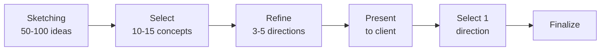
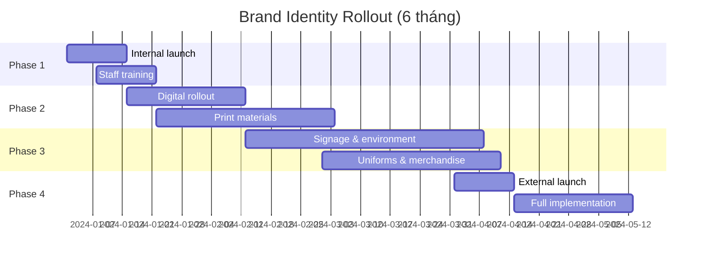

# SOP-03.2: THIẾT KẾ NHẬN DIỆN THƯƠNG HIỆU

## 1. MỤC ĐÍCH
Quy định quy trình thiết kế và quản lý hệ thống nhận diện thị giác thương hiệu, đảm bảo:
- Nhận diện thống nhất trên mọi điểm chạm
- Phản ánh đúng định vị và giá trị
- Chuyên nghiệp và hiện đại
- Dễ nhận biết và ghi nhớ
- Linh hoạt áp dụng đa phương tiện

## 2. PHẠM VI ÁP DỤNG
- Phòng Marketing (quản lý)
- Agency thiết kế (nếu thuê ngoài)
- Tất cả phòng ban (sử dụng)
- Đối tác (khi co-branding)

## 3. CÁC THÀNH PHẦN NHẬN DIỆN

### 3.1. Brand Identity System
```
Core Elements (Cốt lõi):
├─ Logo
├─ Màu sắc (Color palette)
├─ Typography (Font chữ)
└─ Imagery style (Phong cách hình ảnh)

Extended Elements (Mở rộng):
├─ Icons và symbols
├─ Patterns
├─ Photography style
├─ Illustration style
├─ Voice và tone
└─ Motion graphics
```

## 4. QUY TRÌNH THIẾT KẾ

### 4.1. Bước 1: Brief và research (1 tuần)

#### 4.1.1. Creative brief
```
1. Background:
   - Về trường
   - Lịch sử và thành tựu
   - Hiện trạng brand

2. Objectives:
   - Mục tiêu thiết kế
   - Vấn đề cần giải quyết

3. Positioning:
   - Target audience
   - Key messages
   - Differentiation

4. Mandatories:
   - Phải có gì
   - Không được có gì
   - Constraints

5. Deliverables:
   - Logo
   - Brand guidelines
   - Applications

6. Timeline và budget
```

#### 4.1.2. Research và inspiration
```
- Benchmark các trường hàng đầu
- Trends trong education branding
- Cultural considerations
- Color psychology
- Typography trends
```

### 4.2. Bước 2: Concept development (2-3 tuần)

#### 4.2.1. Logo design process


**Tiêu chí logo tốt**:
```
✅ Simple (Đơn giản)
✅ Memorable (Dễ nhớ)
✅ Timeless (Không lỗi thời)
✅ Versatile (Linh hoạt)
✅ Appropriate (Phù hợp)
✅ Scalable (Thu phóng tốt)
```

#### 4.2.2. Color palette development
**Quy trình chọn màu**:
```
1. Xác định personality:
   - Năng động → Màu sáng, tươi
   - Chuyên nghiệp → Màu trầm, lịch sự
   - Sáng tạo → Màu độc đáo

2. Color psychology:
   - Xanh dương: Tin cậy, ổn định
   - Xanh lá: Tăng trưởng, tươi mới
   - Đỏ: Năng lượng, đam mê
   - Vàng: Lạc quan, sáng tạo

3. Palette structure:
   - Primary color (1-2 màu chính)
   - Secondary colors (2-3 màu phụ)
   - Neutral colors (đen, trắng, xám)
   - Accent colors (nhấn nhá)
```

#### 4.2.3. Typography selection
```
Font system:
├─ Heading font: [Font name]
│   - Sử dụng: Tiêu đề, headlines
│   - Weights: Bold, Semibold, Regular
│
├─ Body font: [Font name]
│   - Sử dụng: Nội dung chính
│   - Weights: Regular, Italic
│
└─ Accent font (optional): [Font name]
    - Sử dụng: Highlights, quotes

Tiêu chí chọn font:
✅ Readability (Dễ đọc)
✅ Professional (Chuyên nghiệp)
✅ Distinctive (Đặc trưng)
✅ Web-safe (Dùng được online)
✅ License (Có quyền sử dụng)
```

### 4.3. Bước 3: Testing và refinement (1-2 tuần)

#### 4.3.1. Internal review
```
Present concepts to:
- BGH (strategic fit)
- Teachers (authenticity)
- Students (appeal)
- Parents (trust)

Criteria:
- Alignment với positioning
- Visual appeal
- Differentiation
- Versatility
```

#### 4.3.2. Technical testing
```
Test logo:
- Sizes (từ 16px đến 5m)
- Backgrounds (trắng, đen, màu, ảnh)
- Formats (print, digital, embroidery)
- Grayscale và monochrome
- Accessibility (contrast ratios)
```

### 4.4. Bước 4: Finalization (1 tuần)

#### 4.4.1. Logo variations
```
Tạo các phiên bản:
- Full logo (horizontal)
- Stacked logo (vertical)
- Icon only
- Wordmark only
- Reversed (for dark backgrounds)
- Monochrome
```

#### 4.4.2. File formats
```
Chuẩn bị files:
- Vector: AI, EPS, SVG (cho print và scale)
- Raster: PNG (transparent), JPG (web)
- Sizes: Multiple sizes cho web và print
- Color modes: RGB (digital), CMYK (print), PMS (branding)
```

### 4.5. Bước 5: Brand Guidelines (2-3 tuần)

#### 4.5.1. Cấu trúc Brand Guidelines
```
BRAND GUIDELINES DOCUMENT (40-60 trang)

1. GIỚI THIỆU (5 trang)
   - Về trường
   - Tầm nhìn, sứ mệnh, giá trị
   - Brand story

2. ĐỊNH VỊ (5 trang)
   - Positioning statement
   - Target audience
   - Brand pillars
   - Key messages

3. LOGO (8-10 trang)
   - Logo chính
   - Variations
   - Clear space
   - Minimum size
   - Dos and Don'ts

4. MÀU SẮC (5-6 trang)
   - Color palette
   - Color codes (HEX, RGB, CMYK, PMS)
   - Usage guidelines
   - Combinations

5. TYPOGRAPHY (4-5 trang)
   - Font families
   - Hierarchy
   - Sizes và spacing
   - Usage examples

6. IMAGERY (5-6 trang)
   - Photography style
   - Illustration style
   - Image treatments
   - Examples

7. APPLICATIONS (10-15 trang)
   - Business cards
   - Letterhead
   - Envelopes
   - Presentations
   - Website
   - Social media
   - Signage
   - Uniforms
   - Merchandise

8. VOICE & TONE (3-4 trang)
   - Brand personality
   - Writing style
   - Tone guidelines
   - Examples

9. DIGITAL GUIDELINES (5-6 trang)
   - Website
   - Email
   - Social media
   - Digital ads

10. PHỤ LỤC
    - Contact information
    - Approved vendors
    - Templates
```

#### 4.5.2. Format và distribution
```
Formats:
- PDF (interactive với bookmarks)
- Website (online version)
- Print (for key stakeholders)

Distribution:
- All staff (mandatory read)
- Partners và vendors
- Agency partners
- Public-facing version (simplified)
```

## 5. IMPLEMENTATION ROADMAP

### 5.1. Rollout plan


### 5.2. Priorities
```
Phase 1 (Tháng 1-2): Critical
├─ Logo finalized
├─ Guidelines completed
├─ Website updated
├─ Email signatures
└─ Presentations

Phase 2 (Tháng 3-4): Important
├─ Stationery
├─ Brochures
├─ Social media
└─ Digital ads

Phase 3 (Tháng 5-6): Nice-to-have
├─ Signage
├─ Uniforms
├─ Merchandise
└─ Vehicle wraps
```

## 6. QUẢN LÝ ASSETS

### 6.1. Brand Asset Library
```
Cấu trúc thư mục:
Brand_Assets/
├─ Logos/
│   ├─ Primary/
│   ├─ Variations/
│   └─ Legacy/ (old logos)
├─ Colors/
├─ Fonts/
├─ Images/
│   ├─ Photography/
│   └─ Illustrations/
├─ Templates/
│   ├─ Presentations/
│   ├─ Documents/
│   └─ Social_Media/
└─ Guidelines/
    ├─ Full_Guidelines.pdf
    └─ Quick_Reference.pdf
```

### 6.2. Access và permissions
```
Public access:
- Logo files (basic)
- Brand colors
- Quick reference guide

Staff access:
- All assets
- Templates
- Full guidelines

Admin access:
- Source files
- Edit permissions
```

## 7. COMPLIANCE VÀ ENFORCEMENT

### 7.1. Quy trình approval
```
Materials sử dụng brand:
1. Create theo guidelines
2. Submit for review
3. Brand Manager checks
4. Approve hoặc request changes
5. Final approval
6. Publish/print
```

### 7.2. Xử lý vi phạm
```
Vi phạm nhỏ (unintentional):
└─ Friendly reminder và correction

Vi phạm lớn (intentional hoặc repeated):
├─ Formal warning
├─ Require correction
└─ Escalate nếu cần

External violations:
├─ Cease and desist letter
└─ Legal action (nếu nghiêm trọng)
```

## 8. CHỈ SỐ ĐÁNH GIÁ

```
Design quality:
- Professional assessment: ≥ 4.5/5.0
- Stakeholder approval: ≥ 90%

Implementation:
- % materials compliant: ≥ 95%
- Rollout on time: 100%

Recognition:
- Brand recognition: Tăng 20-30% sau 6 tháng
- Positive perception: ≥ 75%
```

## 9. NGÂN SÁCH

```
Design phase:
├─ Agency/Designer fee: 30-80 triệu VNĐ
├─ Research: 10-20 triệu VNĐ
└─ Testing: 5-10 triệu VNĐ

Guidelines:
├─ Writing và design: 15-25 triệu VNĐ
└─ Printing: 5-10 triệu VNĐ

Implementation:
├─ Digital: 20-40 triệu VNĐ
├─ Print materials: 30-60 triệu VNĐ
├─ Signage: 50-100 triệu VNĐ
└─ Merchandise: 20-40 triệu VNĐ
---
Tổng: 185-385 triệu VNĐ
```

---

**Ngày ban hành**: 01/01/2024  
**Người phê duyệt**: Ban Giám hiệu  
**Người soạn thảo**: Phòng Marketing  
**Ngày xem xét lại**: 01/01/2025


