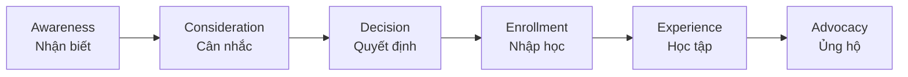
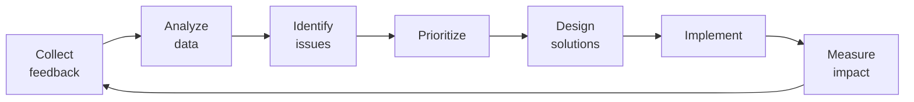

# SOP-03.3: QUẢN LÝ TRẢI NGHIỆM THƯƠNG HIỆU

## 1. MỤC ĐÍCH
Quy định quy trình quản lý và tối ưu hóa trải nghiệm thương hiệu tại mọi điểm chạm, đảm bảo:
- Trải nghiệm nhất quán và xuất sắc
- Phản ánh đúng brand promise
- Tạo ấn tượng tích cực và lâu dài
- Xây dựng lòng trung thành
- Biến khách hàng thành đại sứ thương hiệu

## 2. PHẠM VI ÁP DỤNG
- Tất cả phòng ban (tạo trải nghiệm)
- Phòng Marketing (quản lý tổng thể)
- Phòng Dịch vụ học sinh (chủ chốt)
- Toàn thể nhân viên (brand ambassadors)

## 3. CUSTOMER JOURNEY MAPPING

### 3.1. Các giai đoạn hành trình


### 3.2. Touchpoints theo giai đoạn

#### 3.2.1. Awareness (Nhận biết)
```
Touchpoints:
├─ Quảng cáo (online, offline)
├─ Social media
├─ Website
├─ Word-of-mouth
├─ Events cộng đồng
└─ PR và báo chí

Brand experience:
- First impression
- Messaging clarity
- Visual appeal
- Accessibility
```

#### 3.2.2. Consideration (Cân nhắc)
```
Touchpoints:
├─ Website (detailed)
├─ Brochures
├─ Open house
├─ School tour
├─ Admissions counseling
└─ Online reviews

Brand experience:
- Information quality
- Responsiveness
- Professionalism
- Transparency
```

#### 3.2.3. Decision (Quyết định)
```
Touchpoints:
├─ Application process
├─ Interview/assessment
├─ Admissions decision
├─ Contract signing
└─ Payment

Brand experience:
- Process smoothness
- Fairness
- Communication
- Support
```

#### 3.2.4. Enrollment (Nhập học)
```
Touchpoints:
├─ Welcome package
├─ Orientation
├─ First day
├─ Onboarding meetings
└─ Parent portal setup

Brand experience:
- Warmth và welcome
- Organization
- Information completeness
- Excitement building
```

#### 3.2.5. Experience (Học tập)
```
Touchpoints:
├─ Daily interactions (teachers, staff)
├─ Facilities và environment
├─ Learning activities
├─ Events và programs
├─ Communications (email, app, meetings)
├─ Report cards
└─ Parent-teacher conferences

Brand experience:
- Quality delivery
- Care và attention
- Consistency
- Problem resolution
- Continuous improvement
```

#### 3.2.6. Advocacy (Ủng hộ)
```
Touchpoints:
├─ Graduation
├─ Alumni relations
├─ Referral programs
├─ Testimonials
└─ Community involvement

Brand experience:
- Lasting impact
- Pride và belonging
- Ongoing relationship
- Recognition
```

## 4. QUY TRÌNH QUẢN LÝ TRẢI NGHIỆM

### 4.1. Bước 1: Mapping chi tiết (2-3 tuần)

#### 4.1.1. Identify touchpoints
```
Phương pháp:
1. Workshop với teams:
   - List tất cả touchpoints
   - Group theo giai đoạn
   - Prioritize theo importance

2. Customer shadowing:
   - Theo dõi actual journey
   - Document observations
   - Identify pain points

3. Data analysis:
   - CRM data
   - Survey feedback
   - Complaint data
```

#### 4.1.2. Map emotions và expectations
**Journey Map Template**:
```
Stage: [Tên giai đoạn]

Touchpoint | Action | Expectation | Current Experience | Emotion | Gap
-----------|--------|-------------|-------------------|---------|----
[Touch 1]  | [...]  | [...]       | [...]             | 😊/😐/☹️ | [...]
[Touch 2]  | [...]  | [...]       | [...]             | 😊/😐/☹️ | [...]
```

### 4.2. Bước 2: Thiết kế trải nghiệm mục tiêu (2-3 tuần)

#### 4.2.1. Xác định brand promise cho từng touchpoint
```
Touchpoint: [Tên]
Brand Promise: [Điều chúng ta hứa]
Desired Experience: [Trải nghiệm mong muốn]
Emotions: [Cảm xúc mục tiêu]
Success Metrics: [Đo lường như thế nào]
```

#### 4.2.2. Design principles
```
Nguyên tắc thiết kế trải nghiệm:
1. Nhất quán (Consistency)
2. Cá nhân hóa (Personalization)
3. Dễ dàng (Ease)
4. Chuyên nghiệp (Professionalism)
5. Ấm áp (Warmth)
```

### 4.3. Bước 3: Implementation (3-6 tháng)

#### 4.3.1. Cải thiện từng touchpoint
```
Quy trình cải thiện:
1. Select touchpoint
2. Gap analysis (current vs. desired)
3. Design solution
4. Pilot test
5. Gather feedback
6. Refine
7. Roll out
8. Monitor
```

#### 4.3.2. Training nhân viên
**Nội dung đào tạo**:
```
1. Brand fundamentals:
   - Positioning
   - Values
   - Promise

2. Service excellence:
   - Customer service skills
   - Communication
   - Problem solving

3. Touchpoint-specific:
   - Standards cho từng touchpoint
   - Scripts và guidelines
   - Role plays

4. Empowerment:
   - Authority để resolve issues
   - Resources available
   - Escalation process
```

**Tần suất**:
- New hires: Trong onboarding
- All staff: Annual refresh
- Specific roles: Quarterly

### 4.4. Bước 4: Monitoring và measurement (Liên tục)

#### 4.4.1. Đo lường trải nghiệm
```
Methods:
1. Surveys:
   - Post-interaction surveys
   - Periodic satisfaction surveys
   - NPS surveys

2. Feedback collection:
   - Feedback forms
   - Suggestion boxes
   - Online reviews

3. Mystery shopping:
   - Hired evaluators
   - Anonymous assessment
   - Quarterly

4. Data analytics:
   - Website behavior
   - App usage
   - Service metrics
```

#### 4.4.2. Chỉ số đo lường
```
Touchpoint-level:
- Satisfaction score: ≥ 4.0/5.0
- Completion rate: ≥ 90%
- Issue resolution: ≥ 95%

Journey-level:
- Overall satisfaction: ≥ 4.2/5.0
- NPS: ≥ 60
- Retention: ≥ 90%

Brand-level:
- Brand experience score: ≥ 80/100
- Consistency rating: ≥ 4.0/5.0
```

### 4.5. Bước 5: Continuous improvement (Liên tục)

#### 4.5.1. Quy trình cải tiến


#### 4.5.2. Innovation
```
Thử nghiệm:
- New touchpoints
- New technologies
- New approaches
- Pilot → Evaluate → Scale
```

## 5. BRAND EXPERIENCE STANDARDS

### 5.1. Service standards
```
Tất cả interactions phải:
✅ Professional (Chuyên nghiệp)
✅ Friendly (Thân thiện)
✅ Responsive (Phản hồi nhanh)
✅ Helpful (Hữu ích)
✅ Consistent (Nhất quán)
```

### 5.2. Response time standards
```
Email: ≤ 24 giờ
Phone: ≤ 3 rings hoặc voicemail
Chat: ≤ 2 phút
In-person: Immediate
Complaints: ≤ 48 giờ resolution
```

### 5.3. Quality standards
```
Communications:
- Error-free (grammar, spelling)
- On-brand (tone, visual)
- Clear và concise

Facilities:
- Clean và well-maintained
- Safe
- Welcoming

Events:
- Well-organized
- On-time
- Engaging
```

## 6. CÔNG CỤ VÀ TEMPLATE

### 6.1. Mapping tools
- Customer journey map template
- Touchpoint inventory
- Experience blueprint

### 6.2. Measurement tools
- Survey templates
- Mystery shopping checklist
- Experience scorecard

### 6.3. Training tools
- Service standards guide
- Role play scenarios
- Brand ambassador handbook

---

**Ngày ban hành**: 01/01/2024  
**Người phê duyệt**: Ban Giám hiệu  
**Người soạn thảo**: Phòng Marketing  
**Ngày xem xét lại**: 01/01/2025

