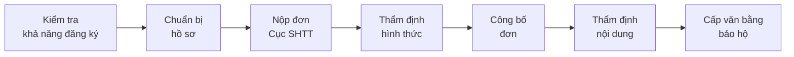
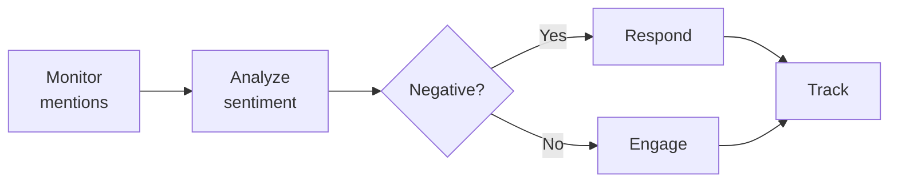
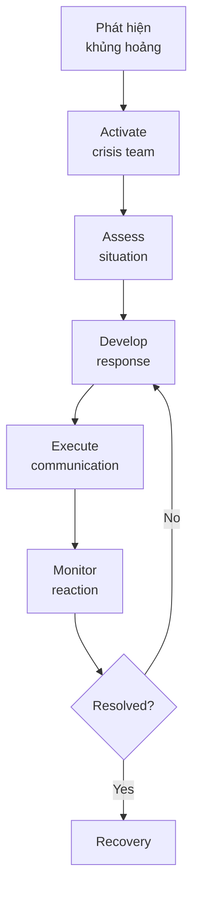

# SOP-03.4: BẢO VỆ VÀ GIÁM SÁT THƯƠNG HIỆU

## 1. MỤC ĐÍCH
Quy định quy trình bảo vệ tài sản thương hiệu và giám sát uy tín thương hiệu, đảm bảo:
- Quyền sở hữu thương hiệu được bảo hộ pháp lý
- Sử dụng thương hiệu đúng quy định
- Phát hiện và xử lý vi phạm kịp thời
- Quản lý khủng hoảng thương hiệu hiệu quả
- Duy trì và nâng cao uy tín

## 2. PHẠM VI ÁP DỤNG
- Phòng Pháp chế (bảo hộ pháp lý)
- Phòng Marketing (giám sát sử dụng)
- Phòng Truyền thông (quản lý khủng hoảng)
- Ban Giám hiệu (quyết định chiến lược)

## 3. BẢO HỘ PHÁP LÝ THƯƠNG HIỆU

### 3.1. Đăng ký nhãn hiệu

#### 3.1.1. Quy trình đăng ký


**Thời gian**: 12-18 tháng

#### 3.1.2. Phạm vi đăng ký
```
Classes cần đăng ký (Nice Classification):
├─ Class 41: Dịch vụ giáo dục
├─ Class 16: Ấn phẩm, văn phòng phẩm
├─ Class 25: Đồng phục (nếu có)
└─ Class 9: Phần mềm giáo dục (nếu có)

Các yếu tố đăng ký:
├─ Tên trường (text)
├─ Logo (hình ảnh)
├─ Slogan (nếu có)
└─ Mascot (nếu có)
```

#### 3.1.3. Duy trì bảo hộ
```
Hoạt động:
- Gia hạn: Mỗi 10 năm
- Theo dõi deadline
- Nộp phí duy trì
- Cập nhật thông tin

Chi phí:
- Đăng ký: 5-10 triệu VNĐ/class
- Gia hạn: 3-5 triệu VNĐ/class/10 năm
- Luật sư: 10-20 triệu VNĐ
```

### 3.2. Bảo hộ tài sản trí tuệ khác

#### 3.2.1. Copyright (Bản quyền)
```
Bảo hộ:
- Tài liệu giảng dạy độc quyền
- Video và multimedia
- Website content
- Publications

Quy trình:
- Tự động có bản quyền khi tạo ra
- Đăng ký để tăng cường bảo vệ
- Ghi rõ © [Năm] [Tên trường]
```

#### 3.2.2. Domain names
```
Đăng ký và bảo vệ:
- Domain chính: [tenruong].edu.vn
- Variations: [tenruong].com, .net, .org
- Typos phổ biến
- Social media handles

Renewal: Hàng năm, auto-renew
```

### 3.3. Hợp đồng và thỏa thuận

#### 3.3.1. Với nhân viên
```
Employment contract bao gồm:
- Confidentiality clause
- IP assignment (tài sản trí tuệ thuộc trường)
- Non-compete (nếu applicable)
- Brand usage after leaving
```

#### 3.3.2. Với đối tác
```
Partnership agreement bao gồm:
- Brand usage rights
- Co-branding guidelines
- Approval process
- Termination clauses
```

#### 3.3.3. Với vendors
```
Vendor agreement bao gồm:
- Brand guidelines compliance
- Quality standards
- Approval requirements
- Penalties for violations
```

## 4. GIÁM SÁT SỬ DỤNG THƯƠNG HIỆU

### 4.1. Internal monitoring

#### 4.1.1. Quy trình kiểm tra
```
Frequency: Hàng tuần

Checklist:
□ Website và social media
□ Email communications
□ Print materials mới
□ Signage và displays
□ Presentations
□ Uniforms và merchandise
□ Partner materials

Tool: Brand compliance checklist
```

#### 4.1.2. Audit định kỳ
```
Quarterly brand audit:
1. Review all touchpoints
2. Check compliance với guidelines
3. Identify violations
4. Rate consistency (1-5)
5. Report và action plan

Annual comprehensive audit:
- External auditor (nếu có)
- Deep dive
- Recommendations
```

### 4.2. External monitoring

#### 4.2.1. Online reputation monitoring


**Channels giám sát**:
```
- Google alerts
- Social media (Facebook, Instagram, LinkedIn)
- Review sites (Google Reviews, Facebook Reviews)
- Forums và groups
- News và blogs
- Competitor mentions
```

**Tools**:
- Google Alerts (free)
- Social listening tools (Hootsuite, Brandwatch)
- Review monitoring (ReviewTrackers)

**Frequency**: Hàng ngày

#### 4.2.2. Trademark infringement monitoring
```
Giám sát:
- Competitors using similar names/logos
- Unauthorized use of our brand
- Domain squatting
- Counterfeit merchandise

Actions:
- Document evidence
- Send cease and desist
- Legal action nếu cần
```

## 5. QUẢN LÝ KHỦNG HOẢNG THƯƠNG HIỆU

### 5.1. Phân loại khủng hoảng

#### 5.1.1. Levels
```
Level 1 - Minor:
- Complaint đơn lẻ
- Sai sót nhỏ
- Response: Routine handling

Level 2 - Moderate:
- Multiple complaints
- Negative review viral
- Response: Escalate to manager

Level 3 - Major:
- Media attention
- Widespread criticism
- Response: Crisis team activated

Level 4 - Severe:
- Threat to reputation
- Legal issues
- Response: BGH + Board involved
```

### 5.2. Crisis Management Process

#### 5.2.1. Preparation (Trước khủng hoảng)
```
1. Crisis team:
   - Spokesperson (Hiệu trưởng)
   - Communications lead
   - Legal counsel
   - Operations lead

2. Crisis plan:
   - Scenarios và responses
   - Contact lists
   - Communication templates
   - Escalation procedures

3. Training:
   - Media training cho spokesperson
   - Crisis simulation
   - Regular drills
```

#### 5.2.2. Response (Trong khủng hoảng)


**Timeline**:
```
0-1 giờ: Assess và activate team
1-3 giờ: Develop initial response
3-6 giờ: First public statement
6-24 giờ: Ongoing updates
24-48 giờ: Detailed response
48+ giờ: Recovery plan
```

#### 5.2.3. Communication principles
```
✅ DO:
- Respond nhanh
- Honest và transparent
- Take responsibility
- Show empathy
- Provide solutions
- Keep stakeholders informed

❌ DON'T:
- Ignore hoặc delete comments
- Defensive hoặc argumentative
- Blame others
- Speculate
- Over-promise
```

### 5.3. Recovery (Sau khủng hoảng)

#### 5.3.1. Quy trình phục hồi
```
1. Resolve root cause (1-2 tuần)
2. Communicate resolution (1 tuần)
3. Rebuild trust (1-3 tháng):
   - Positive actions
   - Transparency
   - Consistent delivery
4. Monitor sentiment (ongoing)
5. Post-crisis review (1 tháng sau)
```

#### 5.3.2. Learning
```
Post-crisis debrief:
- What happened?
- How did we respond?
- What worked?
- What didn't?
- How to prevent?
- Update crisis plan
```

## 6. XỬ LÝ VI PHẠM

### 6.1. Internal violations

#### 6.1.1. Quy trình xử lý
```
Step 1: Identify violation
Step 2: Assess severity
Step 3: Contact violator
Step 4: Request correction
Step 5: Follow up
Step 6: Escalate nếu không comply
```

**Consequences**:
```
First offense: Warning và education
Second offense: Formal reprimand
Third offense: Disciplinary action
```

### 6.2. External violations

#### 6.2.1. Unauthorized use
```
Discovery → Document → Cease & Desist Letter → Legal Action (nếu cần)
```

**Cease & Desist Letter bao gồm**:
```
1. Identification của trademark
2. Description của violation
3. Demand to stop
4. Deadline to comply
5. Consequences nếu không comply
```

## 7. CÔNG CỤ VÀ TEMPLATE

### 7.1. Legal templates
- Trademark application
- Cease and desist letter
- License agreement
- Usage agreement

### 7.2. Monitoring tools
- Brand compliance checklist
- Audit report template
- Monitoring dashboard
- Incident report form

### 7.3. Crisis tools
- Crisis communication plan
- Statement templates
- Contact lists
- Media Q&A

## 8. CHỈ SỐ ĐÁNH GIÁ

```
Legal protection:
- Trademarks registered: 100%
- Renewals on time: 100%

Compliance:
- Internal compliance: ≥ 95%
- Partner compliance: ≥ 90%

Monitoring:
- Coverage: 100% of channels
- Response time: ≤ 24h
- Issues resolved: ≥ 95%

Reputation:
- Positive sentiment: ≥ 75%
- Crisis incidents: ≤ 2/năm
- Recovery time: ≤ 3 tháng
```

---

**Ngày ban hành**: 01/01/2024  
**Người phê duyệt**: Ban Giám hiệu  
**Người soạn thảo**: Phòng Pháp chế & Marketing  
**Ngày xem xét lại**: 01/01/2025


