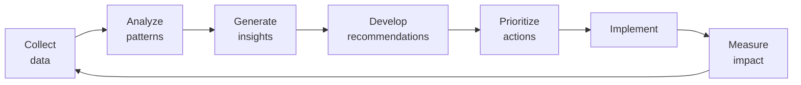

# SOP-03.5: ĐO LƯỜNG GIÁ TRỊ THƯƠNG HIỆU

## 1. MỤC ĐÍCH
Quy định quy trình đo lường và đánh giá giá trị thương hiệu, đảm bảo:
- Hiểu rõ sức khỏe thương hiệu
- Đo lường ROI của đầu tư brand
- Xác định điểm mạnh và cơ hội cải thiện
- So sánh với đối thủ
- Hỗ trợ quyết định chiến lược

## 2. PHẠM VI ÁP DỤNG
- Phòng Marketing (thực hiện đo lường)
- Phòng Tài chính (đánh giá tài chính)
- Ban Giám hiệu (sử dụng insights)
- Hội đồng Quản trị (báo cáo)

## 3. FRAMEWORK ĐO LƯỜNG

### 3.1. Brand Health Scorecard
```
Brand Health = 
├─ Brand Awareness (25%)
├─ Brand Perception (25%)
├─ Brand Preference (25%)
└─ Brand Loyalty (25%)

Thang điểm: 0-100
```

### 3.2. Các chỉ số chính

#### 3.2.1. Brand Awareness (Nhận biết)
```
Metrics:
1. Aided Awareness:
   - "Bạn có biết trường X không?"
   - Target: ≥ 70%

2. Unaided Awareness:
   - "Kể tên các trường quốc tế bạn biết"
   - Target: ≥ 40%

3. Top-of-Mind:
   - Trường được nhắc đầu tiên
   - Target: Top 5

4. Brand Recall:
   - Nhớ lại sau khi thấy logo
   - Target: ≥ 60%
```

#### 3.2.2. Brand Perception (Nhận thức)
```
Metrics:
1. Brand Attributes:
   - Chất lượng: [X/5]
   - Hiện đại: [X/5]
   - Uy tín: [X/5]
   - Thân thiện: [X/5]
   - Đáng tin: [X/5]
   Target: ≥ 4.0/5.0

2. Brand Associations:
   - Top 3 từ liên tưởng
   - Positive vs. negative
   - Unique vs. generic

3. Brand Favorability:
   - "Bạn có ấn tượng tốt về trường X?"
   - Target: ≥ 75% positive
```

#### 3.2.3. Brand Preference (Ưa thích)
```
Metrics:
1. Consideration Set:
   - % include trong shortlist
   - Target: ≥ 60%

2. Preference:
   - % chọn làm first choice
   - Target: ≥ 40%

3. Conversion Rate:
   - % inquiry → enrollment
   - Target: ≥ 30%

4. Share of Choice:
   - % trong tổng enrollments khu vực
   - Target: Top 3
```

#### 3.2.4. Brand Loyalty (Trung thành)
```
Metrics:
1. Retention Rate:
   - % học sinh tiếp tục năm sau
   - Target: ≥ 95%

2. Net Promoter Score (NPS):
   - % Promoters - % Detractors
   - Target: ≥ 60

3. Referral Rate:
   - % enrollments từ referrals
   - Target: ≥ 40%

4. Lifetime Value:
   - Trung bình số năm học
   - Siblings enrollment rate
```

## 4. QUY TRÌNH ĐO LƯỜNG

### 4.1. Brand Tracking Study (Định kỳ)

#### 4.1.1. Methodology
```
Type: Quantitative survey
Sample: 
- Current parents: n=200-300
- Prospective parents: n=200-300
- General public (khu vực): n=300-500

Frequency: 
- Quarterly: Lite version (10 phút)
- Annual: Comprehensive (20-30 phút)

Method: Online survey (email, social ads)
```

#### 4.1.2. Questionnaire structure
```
Section 1: Awareness (5 câu)
- Aided và unaided awareness
- Top-of-mind
- Source of awareness

Section 2: Perception (10-15 câu)
- Attribute ratings
- Associations
- Favorability
- Comparison với competitors

Section 3: Consideration (5 câu)
- Consideration set
- Preference
- Purchase intent

Section 4: Experience (10 câu - current parents only)
- Satisfaction
- NPS
- Specific touchpoints

Section 5: Demographics (5 câu)
```

#### 4.1.3. Analysis
```
1. Descriptive statistics:
   - Means, frequencies
   - Trends over time

2. Segmentation analysis:
   - By demographics
   - By awareness level
   - By experience

3. Competitive benchmarking:
   - Head-to-head comparison
   - Perceptual mapping

4. Correlation analysis:
   - What drives preference?
   - What drives loyalty?
```

### 4.2. Brand Equity Valuation (Hàng năm)

#### 4.2.1. Financial approach
```
Method: Price Premium Method

Calculation:
Brand Value = 
(Học phí trường - Học phí trung bình thị trường) 
× Số học sinh 
× Số năm dự kiến

Ví dụ:
Học phí: 200 triệu/năm
Trung bình thị trường: 150 triệu/năm
Premium: 50 triệu/năm
Số HS: 1000
Năm: 10

Brand Value = 50 triệu × 1000 × 10 = 500 tỷ VNĐ
```

#### 4.2.2. Customer-based approach
```
Brand Equity Index = 
├─ Brand Awareness Score (25%)
├─ Brand Strength Score (25%)
├─ Brand Loyalty Score (25%)
└─ Brand Performance Score (25%)

Scale: 0-100

Valuation = Brand Equity Index × Revenue multiplier
```

### 4.3. Social Media Analytics (Hàng tháng)

#### 4.3.1. Metrics
```
Reach:
- Followers/fans
- Impressions
- Reach

Engagement:
- Likes, comments, shares
- Engagement rate
- Click-through rate

Sentiment:
- Positive mentions
- Negative mentions
- Sentiment score

Share of Voice:
- % mentions vs. competitors
```

#### 4.3.2. Tools
```
- Native analytics (Facebook Insights, Instagram Insights)
- Social listening (Hootsuite, Sprout Social)
- Competitor tracking
```

### 4.4. Website Analytics (Hàng tháng)

#### 4.4.1. Metrics
```
Traffic:
- Visitors, sessions
- Traffic sources
- New vs. returning

Engagement:
- Pages/session
- Time on site
- Bounce rate

Conversion:
- Inquiry form submissions
- Tour bookings
- Application starts
```

## 5. REPORTING VÀ INSIGHTS

### 5.1. Brand Health Dashboard
```
Real-time dashboard hiển thị:

AWARENESS:
├─ Aided: [X%] ↑↓
├─ Unaided: [X%] ↑↓
└─ Top-of-mind: [Rank X]

PERCEPTION:
├─ Favorability: [X%] ↑↓
├─ Attributes: [X.X/5] ↑↓
└─ vs. Competitors: [Gap]

PREFERENCE:
├─ Consideration: [X%] ↑↓
├─ Preference: [X%] ↑↓
└─ Conversion: [X%] ↑↓

LOYALTY:
├─ NPS: [X] ↑↓
├─ Retention: [X%] ↑↓
└─ Referrals: [X%] ↑↓

OVERALL HEALTH: [XX/100]
```

### 5.2. Báo cáo định kỳ

#### 5.2.1. Monthly Brand Report
```
1. Social media performance
2. Website analytics
3. Online reputation summary
4. Key highlights và issues
5. Actions taken
```

#### 5.2.2. Quarterly Brand Health Report
```
1. Brand tracking results
2. Trend analysis
3. Competitive comparison
4. Insights và implications
5. Recommendations
```

#### 5.2.3. Annual Brand Valuation Report
```
1. Brand equity calculation
2. Year-over-year change
3. Drivers of value
4. Benchmarking
5. Strategic recommendations
6. Investment priorities
```

## 6. ACTIONABLE INSIGHTS

### 6.1. Từ data đến action


### 6.2. Common insights và actions
```
Insight: Low awareness trong segment A
Action: Tăng marketing trong khu vực A

Insight: Perception về "expensive" cao
Action: Value communication campaign

Insight: Conversion rate thấp
Action: Cải thiện admissions process

Insight: NPS giảm
Action: Service quality improvement
```

## 7. CÔNG CỤ VÀ TEMPLATE

### 7.1. Survey tools
- Brand tracking questionnaire
- NPS survey
- Satisfaction survey

### 7.2. Analysis tools
- Dashboard templates (Excel, Power BI)
- Statistical analysis tools
- Visualization tools

### 7.3. Reporting templates
- Monthly report
- Quarterly report
- Annual valuation report

## 8. NGÂN SÁCH

```
Annual measurement budget:
├─ Brand tracking surveys: 20-40 triệu VNĐ
├─ Social listening tools: 10-20 triệu VNĐ
├─ Analytics tools: 5-10 triệu VNĐ
├─ Research agency (nếu có): 30-60 triệu VNĐ
└─ Reporting và analysis: 10-15 triệu VNĐ
---
Tổng: 75-145 triệu VNĐ/năm
```

## 9. CHỈ SỐ THÀNH CÔNG

```
Data quality:
- Sample size adequate: ✅
- Response rate: ≥ 30%
- Data accuracy: ≥ 95%

Insights:
- Actionable insights: ≥ 5/quarter
- Actions implemented: ≥ 80%
- Impact measured: ≥ 70%

ROI:
- Brand value growth: ≥ 5-10%/năm
- Marketing efficiency: Improving
```

---

**Ngày ban hành**: 01/01/2024  
**Người phê duyệt**: Ban Giám hiệu  
**Người soạn thảo**: Phòng Marketing  
**Ngày xem xét lại**: 01/01/2025


