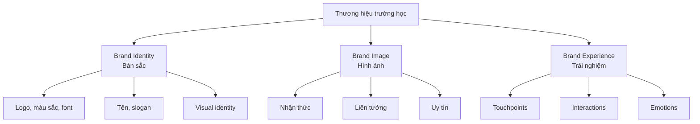

# SOP-03: QUẢN TRỊ THƯƠNG HIỆU

## 1. MỤC ĐÍCH
Thiết lập quy trình quản trị thương hiệu trường học một cách chuyên nghiệp và nhất quán, đảm bảo:
- Định vị thương hiệu rõ ràng và khác biệt
- Nhận diện thương hiệu thống nhất
- Trải nghiệm thương hiệu xuất sắc
- Bảo vệ và phát triển giá trị thương hiệu
- Đo lường và tối ưu hóa hiệu quả

## 2. PHẠM VI ÁP DỤNG
Áp dụng cho:
- Ban Giám hiệu
- Phòng Marketing và Truyền thông
- Tất cả phòng ban (tuân thủ brand guidelines)
- Đối tác và nhà cung cấp (khi sử dụng brand)

## 3. KHÁI NIỆM THƯƠNG HIỆU

### 3.1. Các thành phần thương hiệu


### 3.2. Brand Pyramid
```
                    [Brand Essence]
                   Bản chất cốt lõi
                  /                \
            [Brand Personality]  [Brand Promise]
           Tính cách thương hiệu  Lời hứa thương hiệu
              /                \
        [Brand Values]      [Brand Benefits]
       Giá trị thương hiệu  Lợi ích mang lại
            /                    \
    [Brand Attributes]        [Brand Experience]
    Đặc điểm thương hiệu      Trải nghiệm thương hiệu
```

## 4. CÁC QUY TRÌNH CON

### 4.1. Xây dựng định vị thương hiệu
**Mục tiêu**: Xác định vị trí độc nhất của trường trong tâm trí khách hàng
**Chi tiết**: [SOP-03.1_Xay_dung_dinh_vi_thuong_hieu.md](./SOP-03.1_Xay_dung_dinh_vi_thuong_hieu.md)

**Hoạt động chính**:
```
- Phân tích thị trường và đối thủ
- Xác định target audience
- Định nghĩa unique value proposition
- Xây dựng positioning statement
```

### 4.2. Thiết kế nhận diện thương hiệu
**Mục tiêu**: Tạo hệ thống nhận diện thị giác thống nhất
**Chi tiết**: [SOP-03.2_Thiet_ke_nhan_dien_thuong_hieu.md](./SOP-03.2_Thiet_ke_nhan_dien_thuong_hieu.md)

**Hoạt động chính**:
```
- Thiết kế logo và biểu tượng
- Xác định màu sắc và typography
- Xây dựng brand guidelines
- Áp dụng trên các ấn phẩm
```

### 4.3. Quản lý trải nghiệm thương hiệu
**Mục tiêu**: Đảm bảo mọi điểm chạm đều tạo trải nghiệm tích cực
**Chi tiết**: [SOP-03.3_Quan_ly_trai_nghiem_thuong_hieu.md](./SOP-03.3_Quan_ly_trai_nghiem_thuong_hieu.md)

**Hoạt động chính**:
```
- Mapping customer journey
- Thiết kế brand touchpoints
- Đào tạo nhân viên
- Đo lường trải nghiệm
```

### 4.4. Bảo vệ và giám sát thương hiệu
**Mục tiêu**: Bảo vệ tài sản thương hiệu và giám sát uy tín
**Chi tiết**: [SOP-03.4_Bao_ve_va_giam_sat_thuong_hieu.md](./SOP-03.4_Bao_ve_va_giam_sat_thuong_hieu.md)

**Hoạt động chính**:
```
- Đăng ký bảo hộ thương hiệu
- Giám sát sử dụng brand
- Quản lý khủng hoảng thương hiệu
- Xử lý vi phạm
```

### 4.5. Đo lường giá trị thương hiệu
**Mục tiêu**: Đánh giá và tối ưu hóa giá trị thương hiệu
**Chi tiết**: [SOP-03.5_Do_luong_gia_tri_thuong_hieu.md](./SOP-03.5_Do_luong_gia_tri_thuong_hieu.md)

**Hoạt động chính**:
```
- Đo lường brand awareness
- Đánh giá brand perception
- Tính toán brand equity
- Tối ưu hóa brand performance
```

## 5. BRAND ARCHITECTURE

### 5.1. Cấu trúc thương hiệu
```
[Thương hiệu Tổ chức]
    ↓
[Thương hiệu Cơ sở]
├─ Cơ sở 1
├─ Cơ sở 2
└─ Cơ sở 3
    ↓
[Thương hiệu Chương trình]
├─ Chương trình Quốc tế
├─ Chương trình Song ngữ
└─ Chương trình STEM
```

### 5.2. Mối quan hệ giữa các brand
```
Option 1: Branded House (Khuyến nghị)
- Tất cả dùng chung 1 brand
- VD: "Trường ABC - Cơ sở 1", "Trường ABC - Cơ sở 2"

Option 2: House of Brands
- Mỗi cơ sở có brand riêng
- Phức tạp và tốn kém

Option 3: Endorsed Brands
- Sub-brands với endorsement từ master brand
- VD: "Trường XYZ by ABC Education Group"
```

## 6. BRAND GOVERNANCE

### 6.1. Cơ cấu quản lý
```
Brand Steward (Hiệu trưởng):
└─ Quyết định chiến lược thương hiệu

Brand Manager (Giám đốc Marketing):
└─ Quản lý hàng ngày, guidelines, campaigns

Brand Champions (Mỗi phòng ban):
└─ Đảm bảo tuân thủ trong bộ phận

Brand Committee:
└─ Review và phê duyệt materials lớn
```

### 6.2. Quy trình phê duyệt
```
Materials nhỏ (poster, flyer):
└─ Brand Manager approval

Materials trung bình (brochure, video):
└─ Brand Committee review

Materials lớn (rebranding, campaign lớn):
└─ BGH approval

Strategic brand decisions:
└─ Board approval
```

## 7. TRÁCH NHIỆM

### 7.1. Ban Giám hiệu
- Phê duyệt chiến lược thương hiệu
- Mô hình hóa brand values
- Quyết định đầu tư brand
- Xử lý khủng hoảng brand

### 7.2. Phòng Marketing
- Quản lý brand hàng ngày
- Phát triển brand guidelines
- Giám sát tuân thủ
- Đo lường brand health

### 7.3. Tất cả phòng ban
- Tuân thủ brand guidelines
- Đóng góp vào brand experience
- Báo cáo vi phạm
- Đề xuất cải tiến

## 8. CHỈ SỐ ĐÁNH GIÁ

### 8.1. Brand awareness
- Aided awareness: ≥ 70% (trong target audience)
- Unaided awareness: ≥ 40%
- Top-of-mind: Top 5 trong khu vực

### 8.2. Brand perception
- Brand favorability: ≥ 75%
- Consideration rate: ≥ 60%
- Preference rate: ≥ 40%
- Net Promoter Score: ≥ 60

### 8.3. Brand consistency
- Tuân thủ guidelines: ≥ 95%
- Consistency score: ≥ 4.2/5.0

### 8.4. Brand value
- Brand equity index: Tăng 5-10%/năm
- Premium pricing ability: 10-20% vs. competitors
- Enrollment conversion: ≥ 30%

## 9. NGÂN SÁCH

```
Xây dựng ban đầu:
├─ Brand strategy & positioning: 50-100 triệu VNĐ
├─ Logo & identity design: 30-80 triệu VNĐ
├─ Brand guidelines: 20-30 triệu VNĐ
├─ Implementation: 50-100 triệu VNĐ
└─ Launch campaign: 100-200 triệu VNĐ
---
Tổng: 250-510 triệu VNĐ

Duy trì hàng năm:
├─ Brand monitoring: 10-20 triệu VNĐ
├─ Guidelines updates: 5-10 triệu VNĐ
├─ Training: 10-15 triệu VNĐ
├─ Brand campaigns: 100-200 triệu VNĐ
└─ Measurement: 15-25 triệu VNĐ
---
Tổng: 140-270 triệu VNĐ/năm
```

---

**Ngày ban hành**: 01/01/2024  
**Người phê duyệt**: Ban Giám hiệu  
**Người soạn thảo**: Phòng Marketing  
**Ngày xem xét lại**: 01/01/2025
