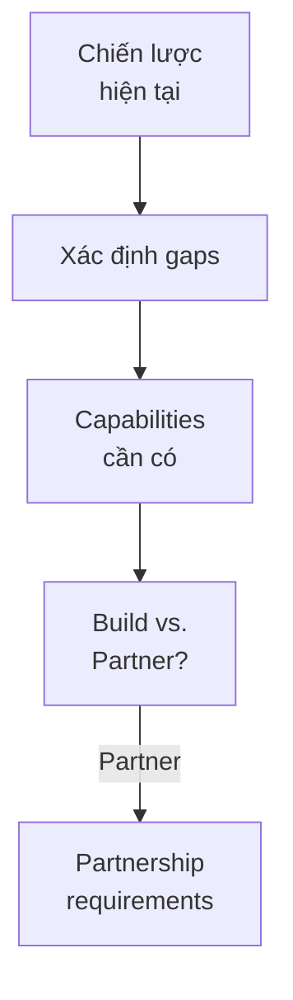
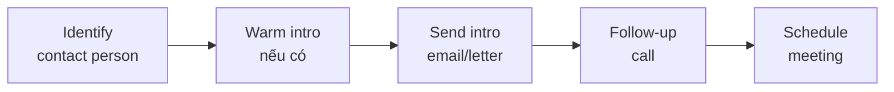

# SOP-04.1: XÁC ĐỊNH ĐỐI TÁC CHIẾN LƯỢC

## 1. MỤC ĐÍCH
Quy định quy trình xác định và lựa chọn đối tác chiến lược phù hợp, đảm bảo:
- Đối tác align với chiến lược trường
- Mang lại giá trị dài hạn
- Fit về văn hóa và giá trị
- Năng lực và uy tín cao
- Cam kết và tin cậy

## 2. QUY TRÌNH XÁC ĐỊNH

### 2.1. Bước 1: Phân tích nhu cầu chiến lược (2-3 tuần)

#### 2.1.1. Strategic gap analysis


**Câu hỏi hướng dẫn**:
```
1. Mục tiêu chiến lược là gì?
2. Capabilities nào chúng ta thiếu?
3. Build internally hay partner?
4. Loại đối tác nào cần?
5. Value proposition cho đối tác?
```

#### 2.1.2. Partnership criteria
```
Xác định tiêu chí:
1. Strategic fit:
   - Align với vision/mission
   - Support strategic goals
   - Complement capabilities

2. Value creation:
   - Tangible benefits
   - Intangible benefits
   - Mutual value

3. Cultural fit:
   - Values alignment
   - Working style
   - Communication

4. Capability:
   - Track record
   - Resources
   - Expertise

5. Commitment:
   - Long-term orientation
   - Investment willingness
   - Exclusivity (nếu cần)
```

### 2.2. Bước 2: Research đối tác tiềm năng (3-4 tuần)

#### 2.2.1. Sourcing candidates
```
Nguồn tìm kiếm:
├─ Industry research
├─ Conferences và events
├─ Referrals từ network
├─ LinkedIn và databases
├─ Consultants và advisors
└─ Inbound inquiries
```

#### 2.2.2. Initial screening
```
Screening checklist:
□ Meets basic criteria?
□ Reputation tốt?
□ Financial stability?
□ No conflicts of interest?
□ Geographic fit?
□ Size và scale phù hợp?

Result: Longlist (20-30 candidates)
```

### 2.3. Bước 3: Đánh giá và shortlist (2-3 tuần)

#### 2.3.1. Evaluation framework
```
Criteria | Weight | Score (1-5) | Weighted Score
---------|--------|-------------|---------------
Strategic fit | 30% | [X] | [X × 0.3]
Value potential | 25% | [Y] | [Y × 0.25]
Capability | 20% | [Z] | [Z × 0.2]
Cultural fit | 15% | [W] | [W × 0.15]
Risk profile | 10% | [V] | [V × 0.1]
---
Total | 100% | | [Sum]
```

**Scoring guide**:
```
5 = Excellent: Vượt trội
4 = Good: Tốt
3 = Acceptable: Chấp nhận được
2 = Poor: Yếu
1 = Unacceptable: Không chấp nhận
```

#### 2.3.2. Deep dive research
```
Cho top candidates:
1. Desktop research:
   - Website, annual reports
   - News và media coverage
   - Social media presence
   - Customer reviews

2. Reference checks:
   - Current partners của họ
   - Industry contacts
   - Customers/users

3. Financial analysis:
   - Revenue, profitability
   - Growth trajectory
   - Stability

4. Cultural assessment:
   - Values stated vs. practiced
   - Leadership style
   - Employee satisfaction
```

**Output**: Shortlist (5-10 candidates)

### 2.4. Bước 4: Initial outreach (2-3 tuần)

#### 2.4.1. Approach strategy


**Intro message template**:
```
Subject: Partnership opportunity - [Tên trường] & [Tên đối tác]

Dear [Name],

Tôi là [Chức vụ] tại [Tên trường], một trường [mô tả ngắn].

Chúng tôi đang tìm kiếm đối tác chiến lược trong [lĩnh vực] 
và tin rằng [Tên đối tác] sẽ là partner lý tưởng vì [lý do].

Chúng tôi muốn khám phá cơ hội hợp tác có thể mang lại 
giá trị cho cả hai bên, đặc biệt trong [areas].

Anh/Chị có thời gian cho một cuộc gặp mặt sơ bộ không?

Trân trọng,
[Tên - Chức vụ]
```

#### 2.4.2. Exploratory meeting (60-90 phút)
```
Agenda:
00:00-00:15: Giới thiệu lẫn nhau
00:15-00:30: Present về trường
00:30-00:45: Learn về đối tác
00:45-01:00: Explore synergies
01:00-01:15: Discuss potential collaboration
01:15-01:30: Next steps

Goals:
- Build rapport
- Assess mutual interest
- Identify opportunities
- Decide go/no-go
```

### 2.5. Bước 5: Selection và approval (1 tuần)

#### 2.5.1. Final evaluation
```
Tổng hợp:
- Evaluation scores
- Meeting notes
- Reference feedback
- Financial analysis
- Risk assessment

Recommendation:
- Top 1-3 partners
- Rationale
- Proposed approach
- Resource requirements
```

#### 2.5.2. Approval process
```
Present to:
1. Steering Committee
2. BGH
3. Board (nếu major partnership)

Decision:
- Approve và proceed
- Request more info
- Decline
```

## 3. CÔNG CỤ VÀ TEMPLATE

### 3.1. Assessment tools
- Partnership needs analysis
- Evaluation scorecard
- SWOT analysis template
- Risk assessment matrix

### 3.2. Research tools
- Partner profile template
- Due diligence checklist
- Reference check questions

### 3.3. Communication templates
- Intro email
- Meeting agenda
- Proposal outline

## 4. CHỈ SỐ ĐÁNH GIÁ

```
Process:
- Time to identify: ≤ 8 tuần
- Candidates evaluated: ≥ 10
- Success rate: ≥ 30% (proceed to negotiation)

Quality:
- Strategic fit score: ≥ 4.0/5.0
- Due diligence completeness: 100%
- Approval rate: ≥ 80%
```

---

**Ngày ban hành**: 01/01/2024  
**Người phê duyệt**: Ban Giám hiệu  
**Người soạn thảo**: Phòng Phát triển  
**Ngày xem xét lại**: 01/01/2025