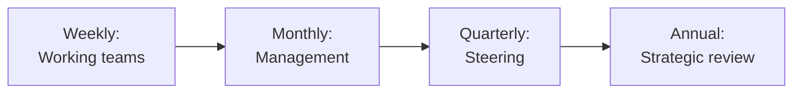

# SOP-04.3: QUẢN LÝ QUAN HỆ ĐỐI TÁC CHIẾN LƯỢC

## 1. MỤC ĐÍCH
Quy định quy trình quản lý và duy trì quan hệ với đối tác chiến lược, đảm bảo:
- Quan hệ được nurture và phát triển
- Communication hiệu quả và thường xuyên
- Issues được resolve nhanh chóng
- Value được maximize
- Partnership bền vững dài hạn

## 2. GOVERNANCE STRUCTURE

### 2.1. Steering Committee
```
Thành phần:
- Executives cả 2 bên (3-5 người/bên)
- Partnership managers

Vai trò:
- Strategic direction
- Major decisions
- Conflict resolution
- Performance review

Meetings: Quarterly (3 tháng/lần)
```

### 2.2. Partnership Management Team
```
Thành phần:
- Partnership managers (1-2 người/bên)
- Project leads

Vai trò:
- Day-to-day management
- Coordination
- Problem-solving
- Reporting

Meetings: Monthly
```

### 2.3. Working Groups
```
Theo từng initiative/project:
- Cross-functional teams
- Subject matter experts
- Execute activities
- Report to management team

Meetings: Weekly hoặc bi-weekly
```

## 3. QUY TRÌNH QUẢN LÝ

### 3.1. Communication cadence

#### 3.1.1. Regular touchpoints


#### 3.1.2. Communication channels
```
Formal:
- Scheduled meetings
- Email updates
- Reports
- Presentations

Informal:
- Phone calls
- Messaging (Teams, Slack)
- Social interactions
- Site visits
```

### 3.2. Joint planning

#### 3.2.1. Annual planning (Tháng 11-12)
```
Agenda (Nửa ngày):
1. Review năm vừa qua (60 phút):
   - Achievements
   - Challenges
   - Learnings

2. Strategic alignment (60 phút):
   - Both parties' strategies
   - Synergies
   - Opportunities

3. Plan năm sau (90 phút):
   - Objectives
   - Initiatives
   - Resources
   - Budget

4. Commitments (30 phút):
   - Sign-off
   - Next steps
```

**Output**: Joint Annual Plan

#### 3.2.2. Quarterly planning
```
Update và adjust:
- Progress review
- Adjust priorities
- Resolve issues
- Plan next quarter
```

### 3.3. Performance monitoring

#### 3.3.1. KPIs tracking
```
Partnership KPIs:
├─ Deliverables completed: [X%]
├─ Timeline adherence: [X%]
├─ Budget variance: [X%]
├─ Quality score: [X/5]
├─ Satisfaction score: [X/5]
└─ Value delivered: [Amount]

Dashboard: Monthly update
```

#### 3.3.2. Issue tracking
```
Issue log:
ID | Date | Issue | Severity | Owner | Status | Resolution
---|------|-------|----------|-------|--------|------------
1  | [..] | [..] | High     | [..] | Open   | [..]
2  | [..] | [..] | Medium   | [..] | Closed | [..]
```

**Severity levels**:
```
Critical: Threatens partnership
High: Significant impact
Medium: Moderate impact
Low: Minor inconvenience
```

**Resolution SLA**:
```
Critical: 24 giờ
High: 3 ngày
Medium: 1 tuần
Low: 2 tuần
```

### 3.4. Relationship building

#### 3.4.1. Executive engagement
```
Activities:
- Quarterly dinners
- Site visits (lẫn nhau)
- Industry events together
- Social occasions
- Annual retreat (nếu major partner)
```

#### 3.4.2. Team bonding
```
Activities:
- Joint workshops
- Team building events
- Celebrate milestones
- Knowledge sharing sessions
```

### 3.5. Value optimization

#### 3.5.1. Continuous improvement
```
Quarterly review:
1. What's working well?
2. What can improve?
3. New opportunities?
4. Efficiency gains?

Actions:
- Implement improvements
- Pilot new ideas
- Scale successes
```

#### 3.5.2. Innovation together
```
Co-innovation process:
1. Identify opportunity
2. Joint brainstorming
3. Pilot project
4. Evaluate results
5. Scale or pivot
```

## 4. REPORTING

### 4.1. Internal reporting
```
Monthly: Partnership dashboard
Quarterly: Steering Committee report
Annual: Comprehensive review
```

### 4.2. Partner reporting
```
Quarterly: Progress report
Annual: Impact report
Ad-hoc: As requested
```

## 5. CÔNG CỤ VÀ TEMPLATE

### 5.1. Governance tools
- Meeting agenda templates
- Minutes template
- Decision log

### 5.2. Management tools
- Partnership dashboard
- Issue tracker
- Action item list
- Communication log

### 5.3. Reporting templates
- Monthly update
- Quarterly report
- Annual review

## 6. CHỈ SỐ ĐÁNH GIÁ

```
Communication:
- Meeting attendance: ≥ 95%
- Response time: ≤ 24h
- Communication quality: ≥ 4.0/5.0

Performance:
- KPI achievement: ≥ 80%
- On-time delivery: ≥ 90%
- Quality score: ≥ 4.0/5.0

Relationship:
- Satisfaction: ≥ 4.2/5.0
- Trust level: ≥ 4.0/5.0
- Collaboration effectiveness: ≥ 4.0/5.0

Value:
- Value delivered vs. committed: ≥ 100%
- ROI: ≥ 3:1
```

---

**Ngày ban hành**: 01/01/2024  
**Người phê duyệt**: Ban Giám hiệu  
**Người soạn thảo**: Phòng Phát triển & Pháp chế  
**Ngày xem xét lại**: 01/01/2025


