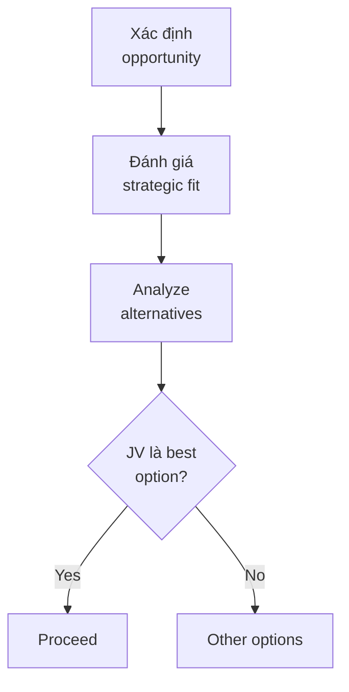
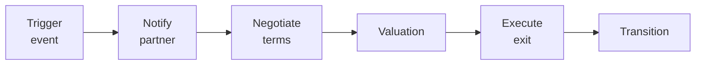

# SOP-04.4: JOINT VENTURES VÀ LIÊN DOANH

## 1. MỤC ĐÍCH
Quy định quy trình đánh giá, thành lập và quản lý joint ventures (liên doanh) với đối tác, đảm bảo:
- Cơ hội JV được đánh giá kỹ lưỡng
- Cấu trúc pháp lý và tài chính hợp lý
- Governance hiệu quả
- Rủi ro được quản lý
- Exit strategy rõ ràng

## 2. PHẠM VI ÁP DỤNG
- Hội đồng Quản trị (phê duyệt)
- Ban Giám hiệu (đề xuất và quản lý)
- Phòng Pháp chế và Tài chính (tư vấn)
- Đối tác JV

## 3. ĐỊNH NGHĨA VÀ PHÂN LOẠI

### 3.1. Joint Venture là gì
```
JV = Thực thể pháp lý mới được tạo ra bởi 2+ bên
để pursue một mục tiêu chung, chia sẻ:
- Ownership (cổ phần)
- Control (quản lý)
- Risks (rủi ro)
- Returns (lợi nhuận)
```

### 3.2. Các loại JV trong giáo dục
```
1. New School JV:
   - Thành lập trường mới cùng nhau
   - Ví dụ: Trường Việt + Tổ chức nước ngoài

2. Program JV:
   - Hợp tác chương trình cụ thể
   - Ví dụ: Chương trình IB, AP

3. Campus JV:
   - Phát triển cơ sở mới
   - Chia sẻ đầu tư và vận hành

4. Service JV:
   - Dịch vụ chung (catering, transport, etc.)
   - Economies of scale
```

## 4. QUY TRÌNH THÀNH LẬP JV

### 4.1. Bước 1: Opportunity assessment (4-6 tuần)

#### 4.1.1. Strategic rationale


**Câu hỏi then chốt**:
```
1. Tại sao JV? (Tại sao không go alone?)
2. Tại sao partner này?
3. Value creation như thế nào?
4. Risks là gì?
5. Exit strategy?
```

#### 4.1.2. Feasibility study
```
Phân tích:
1. Market feasibility:
   - Demand
   - Competition
   - Regulations

2. Technical feasibility:
   - Capabilities
   - Resources
   - Timeline

3. Financial feasibility:
   - Investment required
   - Revenue projections
   - Profitability
   - Payback period

4. Legal feasibility:
   - Structure options
   - Regulatory requirements
   - Compliance
```

**Output**: Feasibility Report + Recommendation

### 4.2. Bước 2: Partner selection và negotiation (8-12 tuần)

#### 4.2.1. Partner evaluation
```
Criteria:
1. Strategic alignment (30%)
2. Financial strength (25%)
3. Operational capability (20%)
4. Cultural fit (15%)
5. Reputation (10%)

Due diligence sâu:
- Financial (3 years)
- Legal (comprehensive)
- Operational (site visits)
- Reputational (thorough)
```

#### 4.2.2. Term sheet negotiation
```
Key terms:
□ Ownership split (50-50, 60-40, etc.)
□ Capital contribution
□ Governance (board seats, voting)
□ Management (CEO, key positions)
□ Profit/loss sharing
□ Decision-making (unanimous vs. majority)
□ Exit provisions
□ Dispute resolution
```

**Negotiation focus**:
```
Critical:
- Control và decision rights
- Capital calls
- Exit mechanisms

Important:
- Day-to-day management
- Reporting
- Branding

Nice-to-have:
- Office location
- Naming rights
```

### 4.3. Bước 3: Legal structure (4-6 tuần)

#### 4.3.1. Entity formation
```
Options:
1. Limited Liability Company (LLC):
   - Flexible
   - Tax advantages
   - Common choice

2. Joint Stock Company:
   - More formal
   - Easier to raise capital
   - More regulations

3. Contractual JV:
   - No new entity
   - Simpler
   - Less commitment
```

#### 4.3.2. Key documents
```
1. Joint Venture Agreement:
   - Master agreement (50-100 trang)
   - All terms và conditions

2. Shareholders Agreement:
   - Rights và obligations
   - Transfer restrictions
   - Exit provisions

3. Articles of Association:
   - Company charter
   - Governance rules

4. Management Agreement:
   - Day-to-day operations
   - Delegation of authority

5. IP License Agreement (nếu cần):
   - Use of trademarks
   - Curriculum rights
```

### 4.4. Bước 4: Setup và launch (3-6 tháng)

#### 4.4.1. Operational setup
```
1. Governance:
   - Appoint board members
   - Hire CEO/management
   - Setup committees

2. Operations:
   - Office space
   - Systems và IT
   - Policies và procedures
   - Hiring staff

3. Financial:
   - Bank accounts
   - Accounting system
   - Budget và controls

4. Legal:
   - Registrations
   - Licenses
   - Contracts
   - Insurance
```

#### 4.4.2. Launch planning
```
Timeline:
Month 1-2: Setup
Month 3-4: Soft launch
Month 5-6: Full operations
```

### 4.5. Bước 5: Operations và monitoring (Ongoing)

#### 4.5.1. Performance monitoring
```
Monthly:
- Financial performance
- Operational KPIs
- Issues log

Quarterly:
- Strategic review
- Variance analysis
- Forecast update

Annual:
- Comprehensive review
- Audit
- Strategic planning
```

#### 4.5.2. Relationship management
```
Maintain healthy partnership:
- Regular communication
- Transparent reporting
- Fair dealing
- Conflict resolution
- Celebrate successes
```

## 5. EXIT STRATEGY

### 5.1. Exit scenarios
```
1. Planned exit:
   - After achieving objectives
   - Pre-agreed timeline
   - Orderly transition

2. Performance-based exit:
   - Targets not met
   - Strategic misalignment
   - Negotiated exit

3. Forced exit:
   - Breach of agreement
   - Insolvency
   - Regulatory issues

4. Buy-out:
   - One party buys other's stake
   - Pre-agreed valuation method
```

### 5.2. Exit process


### 5.3. Exit provisions
```
Must include:
□ Exit triggers
□ Valuation method
□ Payment terms
□ Transition period
□ Non-compete
□ IP ownership
□ Customer/student transition
```

## 6. CÔNG CỤ VÀ TEMPLATE

### 6.1. Assessment tools
- JV opportunity assessment
- Feasibility study template
- Partner evaluation scorecard

### 6.2. Legal templates
- Term sheet
- JV agreement
- Shareholders agreement

### 6.3. Management tools
- Governance charter
- Performance dashboard
- Issue tracker

## 7. CHỈ SỐ ĐÁNH GIÁ

```
Setup:
- Time to launch: ≤ 9 tháng
- Budget adherence: ±10%
- Legal compliance: 100%

Performance:
- Financial targets: ≥ 80%
- Operational KPIs: ≥ 85%
- Partner satisfaction: ≥ 4.0/5.0

Sustainability:
- Survival rate: ≥ 80% after 3 years
- Value creation: Positive ROI
```

---

**Ngày ban hành**: 01/01/2024  
**Người phê duyệt**: Hội đồng Quản trị  
**Người soạn thảo**: Ban Giám hiệu  
**Ngày xem xét lại**: 01/01/2025


