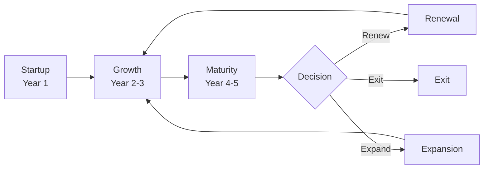

# SOP-04.5: ĐÁNH GIÁ VÀ PHÁT TRIỂN ĐỐI TÁC

## 1. MỤC ĐÍCH
Quy định quy trình đánh giá hiệu quả và phát triển mối quan hệ đối tác chiến lược, đảm bảo:
- Đo lường value được tạo ra
- Xác định cơ hội cải thiện
- Quyết định renewal hoặc exit
- Phát triển partnership lên tầm cao hơn
- Maximize long-term value

## 2. QUY TRÌNH ĐÁNH GIÁ

### 2.1. Quarterly review (Hàng quý)

#### 2.1.1. Performance scorecard
```
PARTNERSHIP SCORECARD

1. Deliverables (30%):
   - Completed on time: [X%]
   - Quality: [X/5]
   - Score: [X/5]

2. Financial (25%):
   - Budget adherence: [X%]
   - Value delivered: [X triệu]
   - Score: [X/5]

3. Relationship (25%):
   - Communication: [X/5]
   - Collaboration: [X/5]
   - Trust: [X/5]
   - Score: [X/5]

4. Strategic impact (20%):
   - Goal achievement: [X%]
   - Innovation: [X/5]
   - Score: [X/5]

OVERALL SCORE: [X/5]
```

#### 2.1.2. Review meeting
```
Agenda (90 phút):
00:00-00:30: Scorecard review
00:30-00:60: Issues và solutions
00:60-00:75: Opportunities
00:75-00:90: Action plan
```

### 2.2. Annual comprehensive review (Hàng năm)

#### 2.2.1. Deep dive analysis
```
Components:
1. Value analysis:
   - Tangible value (financial)
   - Intangible value (strategic, reputation)
   - Total value vs. cost
   - ROI calculation

2. Strategic alignment:
   - Still aligned với strategy?
   - Contribution to goals
   - Future relevance

3. Relationship health:
   - Satisfaction surveys (cả 2 bên)
   - Issue frequency và resolution
   - Trust và collaboration

4. Benchmarking:
   - Vs. other partnerships
   - Vs. industry standards
   - Best practices
```

#### 2.2.2. SWOT analysis
```
Strengths:
- Điểm mạnh của partnership

Weaknesses:
- Điểm yếu cần address

Opportunities:
- Cơ hội mở rộng
- New areas collaboration

Threats:
- Risks to partnership
- External challenges
```

### 2.3. Decision framework

#### 2.3.1. Partnership lifecycle


#### 2.3.2. Renewal decision
```
Renew KHI:
✅ Strategic fit vẫn strong
✅ Performance meets expectations
✅ Relationship healthy
✅ Value > Cost
✅ No better alternatives

Consider exit KHI:
⚠️ Strategic misalignment
⚠️ Consistent underperformance
⚠️ Relationship issues
⚠️ Better alternatives available
⚠️ Changed circumstances
```

## 3. PHÁT TRIỂN ĐỐI TÁC

### 3.1. Expansion opportunities

#### 3.1.1. Identify opportunities
```
Sources:
- Joint planning sessions
- Innovation workshops
- Market changes
- Success của current programs
- Partner suggestions
```

#### 3.1.2. Expansion types
```
1. Scope expansion:
   - Thêm programs
   - Thêm services
   - Thêm locations

2. Depth expansion:
   - Tăng investment
   - Longer commitment
   - Exclusive rights

3. Geographic expansion:
   - New markets
   - New campuses

4. Value chain expansion:
   - Upstream (curriculum development)
   - Downstream (career placement)
```

### 3.2. Upgrade process

#### 3.2.1. Proposal development
```
Expansion Proposal:
1. Current state
2. Opportunity identified
3. Proposed expansion
4. Value proposition (cả 2 bên)
5. Investment required
6. Expected returns
7. Risks và mitigation
8. Timeline
```

#### 3.2.2. Negotiation và approval
```
Steps:
1. Internal approval (BGH/Board)
2. Present to partner
3. Negotiate terms
4. Amend agreement
5. Execute expansion
```

## 4. RENEWAL PROCESS

### 4.1. Timeline
```
T-12 months: Annual review, initial assessment
T-9 months: Decision to renew/not renew
T-6 months: Negotiation begins
T-3 months: Finalize new terms
T-0: Current term ends, new term begins
```

### 4.2. Renewal negotiation

#### 4.2.1. Preparation
```
Review:
- Performance history
- Market changes
- Strategic priorities
- Learnings

Develop:
- Renewal proposal
- Desired changes
- Walk-away point
```

#### 4.2.2. Negotiation focus
```
Discuss:
1. Term length (1 năm vs. 3-5 năm)
2. Scope adjustments
3. Financial terms
4. Performance targets
5. Governance changes
6. New opportunities
```

### 4.3. Non-renewal process

#### 4.3.1. Decision và notification
```
Decision:
- Based on annual review
- BGH/Board approval
- Document rationale

Notification:
- Per contract terms (usually 6-12 months notice)
- Face-to-face meeting
- Formal letter
- Transparent rationale
```

#### 4.3.2. Transition planning
```
Transition plan:
1. Timeline
2. Responsibilities
3. Student/customer impact
4. Asset division
5. IP ownership
6. Communication plan
7. Post-partnership relationship
```

## 5. CÔNG CỤ VÀ TEMPLATE

### 5.1. Evaluation tools
- Partnership scorecard
- ROI calculator
- SWOT analysis template
- Decision matrix

### 5.2. Planning tools
- Expansion proposal template
- Renewal negotiation planner
- Transition plan template

### 5.3. Legal templates
- Amendment agreement
- Termination agreement
- Transition agreement

## 6. CHỈ SỐ ĐÁNH GIÁ

```
Partnership performance:
- Overall score: ≥ 4.0/5.0
- Value delivered: ≥ 100% committed
- ROI: ≥ 3:1

Renewal:
- Renewal rate: ≥ 80%
- Renewal with expansion: ≥ 30%
- Smooth transitions: 100%

Development:
- Partnerships expanded: ≥ 2/năm
- New value created: ≥ 20% increase
```

---

**Ngày ban hành**: 01/01/2024  
**Người phê duyệt**: Hội đồng Quản trị  
**Người soạn thảo**: Ban Giám hiệu  
**Ngày xem xét lại**: 01/01/2025


