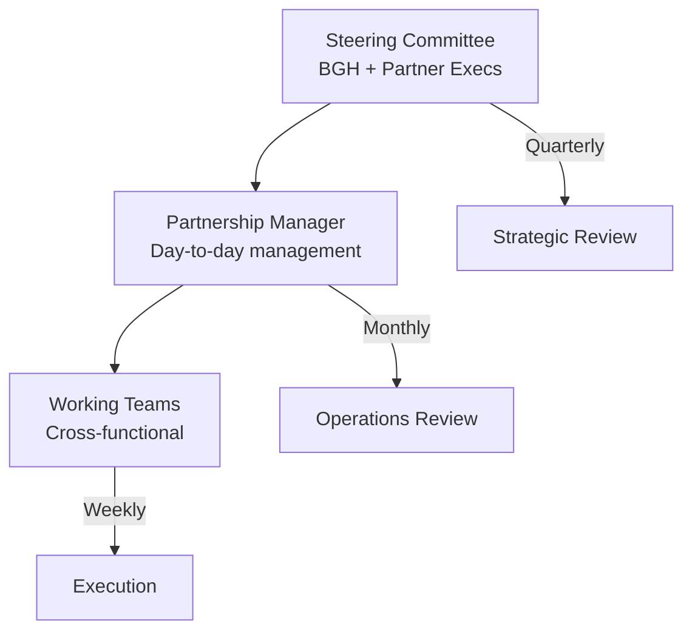

# SOP-04: QUAN HỆ ĐỐI TÁC CHIẾN LƯỢC

## 1. MỤC ĐÍCH
Thiết lập quy trình phát triển và quản lý các mối quan hệ đối tác chiến lược, đảm bảo:
- Đối tác mang lại giá trị chiến lược cao
- Quan hệ đối tác dài hạn và bền vững
- Hợp tác win-win cho cả hai bên
- Tạo lợi thế cạnh tranh
- Mở rộng năng lực và nguồn lực

## 2. PHẠM VI ÁP DỤNG
Áp dụng cho:
- Ban Giám hiệu (quyết định chiến lược)
- Phòng Phát triển (quản lý đối tác)
- Các phòng ban liên quan
- Đối tác chiến lược

## 3. ĐỊNH NGHĨA ĐỐI TÁC CHIẾN LƯỢC

### 3.1. Tiêu chí
```
Đối tác chiến lược phải:
✅ Aligned về vision và values
✅ Mang lại giá trị chiến lược (không chỉ transactional)
✅ Cam kết dài hạn (≥ 3 năm)
✅ Uy tín và năng lực cao
✅ Tạo lợi thế cạnh tranh khó bắt chước
```

### 3.2. Phân loại
```
Theo vai trò:
├─ Academic Partners: Đại học, tổ chức giáo dục quốc tế
├─ Technology Partners: Cung cấp giải pháp công nghệ
├─ Corporate Partners: Doanh nghiệp lớn (internship, sponsorship)
├─ Community Partners: Tổ chức xã hội, NGO
└─ Government Partners: Cơ quan nhà nước

Theo mức độ:
├─ Tier 1: Strategic (5-10 đối tác)
├─ Tier 2: Important (10-20 đối tác)
└─ Tier 3: Transactional (nhiều đối tác)
```

## 4. CÁC QUY TRÌNH CON

### 4.1. Xác định đối tác chiến lược
**Chi tiết**: [SOP-04.1_Xac_dinh_doi_tac_chien_luoc.md](./SOP-04.1_Xac_dinh_doi_tac_chien_luoc.md)

**Hoạt động**:
```
- Phân tích nhu cầu chiến lược
- Nghiên cứu đối tác tiềm năng
- Đánh giá fit và value
- Shortlist và prioritize
```

### 4.2. Đàm phán và ký kết hợp tác
**Chi tiết**: [SOP-04.2_Dam_phan_va_ky_ket_hop_tac.md](./SOP-04.2_Dam_phan_va_ky_ket_hop_tac.md)

**Hoạt động**:
```
- Chuẩn bị đề xuất hợp tác
- Đàm phán điều khoản
- Due diligence
- Ký kết thỏa thuận
```

### 4.3. Quản lý quan hệ đối tác chiến lược
**Chi tiết**: [SOP-04.3_Quan_ly_quan_he_doi_tac_chien_luoc.md](./SOP-04.3_Quan_ly_quan_he_doi_tac_chien_luoc.md)

**Hoạt động**:
```
- Governance structure
- Regular communications
- Joint planning
- Performance monitoring
```

### 4.4. Joint ventures và liên doanh
**Chi tiết**: [SOP-04.4_Joint_ventures_va_lien_doanh.md](./SOP-04.4_Joint_ventures_va_lien_doanh.md)

**Hoạt động**:
```
- Đánh giá cơ hội JV
- Cấu trúc pháp lý và tài chính
- Governance và operations
- Exit strategy
```

### 4.5. Đánh giá và phát triển đối tác
**Chi tiết**: [SOP-04.5_Danh_gia_va_phat_trien_doi_tac.md](./SOP-04.5_Danh_gia_va_phat_trien_doi_tac.md)

**Hoạt động**:
```
- Đánh giá hiệu quả định kỳ
- Identify growth opportunities
- Renewal negotiations
- Exit management
```

## 5. GOVERNANCE MODEL

### 5.1. Cơ cấu quản lý


### 5.2. Meetings structure
```
Strategic Review (Quarterly):
- Participants: Executives cả 2 bên
- Duration: 2-3 giờ
- Agenda: Strategy, performance, major decisions

Operations Review (Monthly):
- Participants: Partnership managers
- Duration: 1-2 giờ
- Agenda: Progress, issues, coordination

Working Team Meetings (Weekly/Bi-weekly):
- Participants: Project teams
- Duration: 30-60 phút
- Agenda: Execution, problem-solving
```

## 6. TRÁCH NHIỆM

### 6.1. Ban Giám hiệu
- Phê duyệt đối tác chiến lược
- Tham gia đàm phán cấp cao
- Giám sát performance
- Quyết định strategic pivots

### 6.2. Phòng Phát triển
- Identify và evaluate đối tác
- Manage relationships
- Coordinate activities
- Report và recommend

### 6.3. Phòng Pháp chế
- Legal review
- Contract negotiation
- Risk management
- Compliance monitoring

### 6.4. Các phòng ban liên quan
- Execute partnership activities
- Provide input và feedback
- Collaborate với partner teams

## 7. CHỈ SỐ ĐÁNH GIÁ

### 7.1. Portfolio metrics
```
- Số đối tác chiến lược: 5-10
- Tổng giá trị partnerships: ≥ 5 tỷ VNĐ/năm
- Retention rate: ≥ 85%
- Average partnership duration: ≥ 4 năm
```

### 7.2. Value metrics
```
- Strategic value score: ≥ 4.0/5.0
- ROI: ≥ 3:1
- Co-created innovations: ≥ 3/năm
- Joint programs: ≥ 5 active
```

### 7.3. Relationship metrics
```
- Partner satisfaction: ≥ 4.2/5.0
- Collaboration effectiveness: ≥ 4.0/5.0
- Issue resolution: ≥ 95% trong 1 tuần
```

## 8. NGÂN SÁCH

```
Annual partnership budget:
├─ Partnership development: 30-50 triệu VNĐ
├─ Relationship management: 20-30 triệu VNĐ
├─ Events và activities: 50-100 triệu VNĐ
├─ Legal và contracts: 15-25 triệu VNĐ
└─ Systems và tools: 10-20 triệu VNĐ
---
Tổng: 125-225 triệu VNĐ/năm
```

---

**Ngày ban hành**: 01/01/2024  
**Người phê duyệt**: Ban Giám hiệu  
**Người soạn thảo**: Phòng Phát triển  
**Ngày xem xét lại**: 01/01/2025