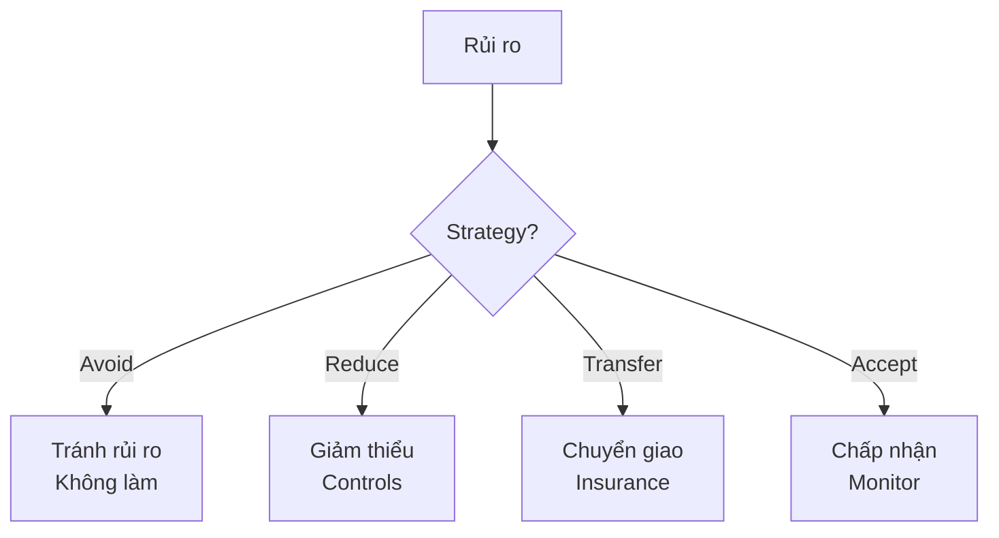

# SOP-05.2: LẬP KẾ HOẠCH ỨNG PHÓ RỦI RO

## 1. MỤC ĐÍCH
Quy định quy trình xây dựng và triển khai kế hoạch ứng phó với các rủi ro đã nhận diện, đảm bảo:
- Chiến lược ứng phó phù hợp với từng rủi ro
- Kế hoạch hành động cụ thể và khả thi
- Nguồn lực được chuẩn bị sẵn sàng
- Trách nhiệm rõ ràng
- Sẵn sàng triển khai khi cần

## 2. CHIẾN LƯỢC ỨNG PHÓ

### 2.1. 4 Strategies chính


### 2.2. Chi tiết từng strategy

#### 2.2.1. Avoid (Tránh)
```
Khi nào: 
- Risk quá cao
- Không thể mitigate
- Không worth it

Cách thức:
- Không pursue activity
- Exit khỏi situation
- Change approach hoàn toàn

Ví dụ:
Risk: Mở cơ sở ở khu vực nguy hiểm
Response: Không mở, chọn location khác
```

#### 2.2.2. Reduce (Giảm thiểu)
```
Khi nào:
- Risk moderate-high
- Có thể control
- Cost-effective

Cách thức:
- Preventive controls (ngăn ngừa)
- Detective controls (phát hiện)
- Corrective controls (sửa chữa)

Ví dụ:
Risk: Tai nạn học sinh
Response: 
- Training an toàn (preventive)
- Cameras giám sát (detective)
- First aid kit (corrective)
```

#### 2.2.3. Transfer (Chuyển giao)
```
Khi nào:
- Risk high impact
- Có thể insure
- Cost reasonable

Cách thức:
- Mua bảo hiểm
- Outsource
- Contractual transfer

Ví dụ:
Risk: Hỏa hoạn
Response: Bảo hiểm tài sản
```

#### 2.2.4. Accept (Chấp nhận)
```
Khi nào:
- Risk low
- Cost mitigation > benefit
- Trong risk appetite

Cách thức:
- Monitor
- Contingency budget
- Ready to respond

Ví dụ:
Risk: Minor IT glitches
Response: Accept, có IT support sẵn sàng
```

## 3. QUY TRÌNH LẬP KẾ HOẠCH

### 3.1. Bước 1: Select strategy (1 tuần)

#### 3.1.1. Decision matrix
```
Cho mỗi risk:

Risk: [Tên]
Score: [XX]
Level: [Extreme/High/Medium/Low]

Strategy options:
Option A: Avoid - [Mô tả] - Cost: [X] - Effectiveness: [Y]
Option B: Reduce - [Mô tả] - Cost: [X] - Effectiveness: [Y]
Option C: Transfer - [Mô tả] - Cost: [X] - Effectiveness: [Y]
Option D: Accept - [Mô tả] - Cost: [X] - Effectiveness: [Y]

Recommendation: [Option X]
Rationale: [Giải thích]
```

#### 3.1.2. Cost-benefit analysis
```
Cho strategy được chọn:

Benefits:
- Risk reduction: [From XX to YY]
- Financial savings: [Amount]
- Other benefits: [...]

Costs:
- Implementation: [Amount]
- Ongoing: [Amount/năm]
- Opportunity cost: [...]

Net benefit: [Benefits - Costs]
ROI: [Benefits / Costs]

Decision: [Proceed / Revise / Reject]
```

### 3.2. Bước 2: Develop action plan (2-3 tuần)

#### 3.2.1. Action plan template
```
RISK RESPONSE ACTION PLAN

Risk ID: R[XXX]
Risk: [Tên]
Strategy: [Avoid/Reduce/Transfer/Accept]

ACTIONS:
Action 1: [Mô tả cụ thể]
├─ Owner: [Tên]
├─ Deadline: [Date]
├─ Resources: [Cần gì]
├─ Success criteria: [Đo lường thế nào]
└─ Status: [Not started/In progress/Complete]

Action 2: [...]
[Tiếp tục...]

RESOURCES REQUIRED:
- Budget: [Amount]
- People: [FTEs]
- Tools/Systems: [...]
- External support: [...]

TIMELINE:
[Gantt chart hoặc milestones]

MONITORING:
- KPIs: [...]
- Frequency: [...]
- Owner: [...]

CONTINGENCY:
- If plan fails: [Plan B]
- Escalation: [To whom]
```

#### 3.2.2. Controls design
**Preventive controls**:
```
Purpose: Ngăn ngừa risk xảy ra

Examples:
- Policies và procedures
- Training
- Access controls
- Segregation of duties
- Pre-approval requirements
```

**Detective controls**:
```
Purpose: Phát hiện khi risk xảy ra

Examples:
- Monitoring systems
- Audits
- Reconciliations
- Alerts
- Inspections
```

**Corrective controls**:
```
Purpose: Sửa chữa khi phát hiện

Examples:
- Incident response procedures
- Backup systems
- Recovery plans
- Remediation processes
```

### 3.3. Bước 3: Approval và resource allocation (1 tuần)

#### 3.3.1. Prioritization
```
Ưu tiên based on:
1. Risk level (Extreme > High > Medium)
2. Cost-effectiveness
3. Feasibility
4. Timeline
5. Dependencies

Result: Prioritized action plan
```

#### 3.3.2. Budget approval
```
Submit to:
- Trưởng phòng: < 20 triệu
- BGH: 20-100 triệu
- Board: > 100 triệu

Include:
- Risk assessment
- Proposed actions
- Cost-benefit analysis
- Timeline
- Expected outcomes
```

### 3.4. Bước 4: Implementation (Theo timeline)

#### 3.4.1. Execute actions
```
For each action:
1. Assign resources
2. Communicate plan
3. Train if needed
4. Implement controls
5. Test effectiveness
6. Document
```

#### 3.4.2. Change management
```
If actions require behavior change:
1. Communicate why
2. Train how
3. Support during transition
4. Monitor compliance
5. Reinforce
```

### 3.5. Bước 5: Monitor effectiveness (Ongoing)

#### 3.5.1. Control testing
```
Frequency:
- Critical controls: Monthly
- Important controls: Quarterly
- Standard controls: Annual

Methods:
- Observation
- Testing
- Review documentation
- Interviews
```

#### 3.5.2. Residual risk assessment
```
After implementing controls:

Inherent risk: [Original score]
Controls effectiveness: [%]
Residual risk: [New score]

Target: Reduce to acceptable level
```

## 4. CONTINGENCY PLANNING

### 4.1. Contingency plan structure
```
FOR RISK: [Tên]

IF [Trigger event] HAPPENS:

IMMEDIATE ACTIONS (0-24h):
1. [Action 1] - [Owner]
2. [Action 2] - [Owner]
3. [Action 3] - [Owner]

SHORT-TERM ACTIONS (1-7 days):
1. [Action 1] - [Owner]
2. [Action 2] - [Owner]

LONG-TERM ACTIONS (1-4 weeks):
1. [Action 1] - [Owner]
2. [Action 2] - [Owner]

RESOURCES NEEDED:
- [Resource 1]
- [Resource 2]

COMMUNICATION PLAN:
- Internal: [Who, what, when]
- External: [Who, what, when]

RECOVERY CRITERIA:
- [Khi nào considered resolved]
```

### 4.2. Business Continuity Planning
```
Critical functions:
1. Teaching và learning
2. Student safety
3. Communications
4. IT systems
5. Facilities

For each:
- Recovery Time Objective (RTO)
- Recovery Point Objective (RPO)
- Minimum resources needed
- Workarounds
- Alternative arrangements
```

## 5. CÔNG CỤ VÀ TEMPLATE

### 5.1. Assessment tools
- Risk assessment matrix
- Impact assessment guide
- Control effectiveness rating

### 5.2. Planning tools
- Action plan template
- Contingency plan template
- BCP template

### 5.3. Monitoring tools
- Control testing checklist
- Effectiveness tracker
- Residual risk calculator

## 6. CHỈ SỐ ĐÁNH GIÁ

```
Planning:
- % high risks có action plans: 100%
- Plans approved on time: ≥ 95%
- Resource allocation: 100%

Implementation:
- Actions completed on time: ≥ 85%
- Budget adherence: ±10%
- Control effectiveness: ≥ 80%

Outcomes:
- Risks reduced to target: ≥ 75%
- Incidents prevented: Measurable
- Response time: ≤ SLA
```

---

**Ngày ban hành**: 01/01/2024  
**Người phê duyệt**: Ban Giám hiệu  
**Người soạn thảo**: Phòng Quản lý Rủi ro  
**Ngày xem xét lại**: 01/01/2025


