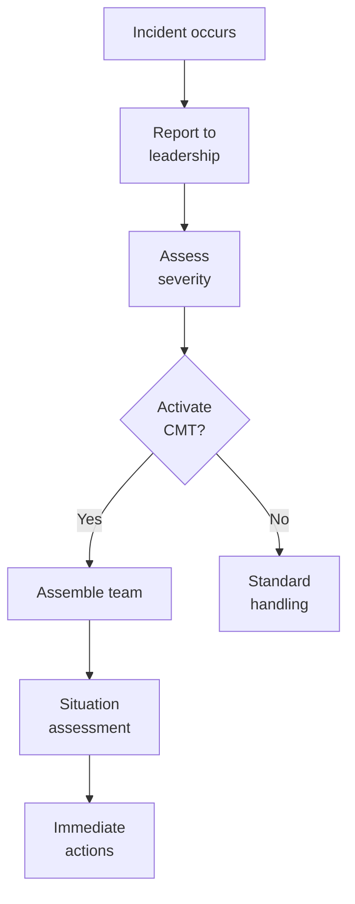

# SOP-05.3: QUẢN LÝ KHỦNG HOẢNG VÀ TRUYỀN THÔNG

## 1. MỤC ĐÍCH
Quy định quy trình quản lý khủng hoảng và truyền thông trong tình huống khẩn cấp, đảm bảo:
- Phản ứng nhanh chóng và hiệu quả
- Bảo vệ an toàn con người
- Giảm thiểu thiệt hại
- Truyền thông kịp thời và chính xác
- Phục hồi nhanh chóng

## 2. ĐỊNH NGHĨA KHỦNG HOẢNG

### 2.1. Levels
```
Level 1 - Minor:
- Ảnh hưởng hạn chế
- Xử lý cấp phòng ban
- Không cần kích hoạt crisis team

Level 2 - Moderate:
- Ảnh hưởng đáng kể
- Cần coordination
- Crisis team standby

Level 3 - Major:
- Ảnh hưởng nghiêm trọng
- Crisis team activated
- External communication needed

Level 4 - Severe:
- Threat to survival
- Full crisis mode
- Board involved
```

### 2.2. Các loại khủng hoảng
```
1. An toàn:
   - Tai nạn nghiêm trọng
   - Bạo lực
   - Mất tích học sinh

2. Sức khỏe:
   - Dịch bệnh
   - Ngộ độc thực phẩm
   - Epidemic

3. Thiên tai:
   - Hỏa hoạn
   - Lũ lụt
   - Động đất

4. Danh tiếng:
   - Scandal
   - Viral negative news
   - Boycott

5. Pháp lý:
   - Kiện tụng lớn
   - Điều tra
   - Vi phạm nghiêm trọng

6. Tài chính:
   - Phá sản
   - Fraud lớn
   - Mất thanh khoản
```

## 3. CRISIS MANAGEMENT TEAM

### 3.1. Cấu trúc
```
Crisis Management Team (CMT):
├─ Team Leader: Hiệu trưởng
├─ Deputy: Phó Hiệu trưởng
├─ Communications Lead: Giám đốc Truyền thông
├─ Operations Lead: Giám đốc Hành chính
├─ Legal Counsel: Luật sư
├─ HR Lead: Giám đốc Nhân sự
└─ Other members: Theo tình huống
```

### 3.2. Roles
```
Team Leader:
- Overall command
- Final decisions
- External spokesperson (primary)

Communications Lead:
- Media relations
- Message development
- Stakeholder communications

Operations Lead:
- Execute response actions
- Coordinate resources
- Safety và security

Legal Counsel:
- Legal advice
- Regulatory compliance
- Liability management

HR Lead:
- Staff communications
- Counseling support
- HR implications
```

### 3.3. Activation
```
Trigger: Level 3 hoặc 4 crisis

Process:
1. Incident reported
2. Initial assessment
3. Team Leader decides to activate
4. Alert team members (SMS, call)
5. Assemble within 1 giờ
6. Begin response
```

## 4. QUY TRÌNH ỨNG PHÓ

### 4.1. Phase 1: Immediate response (0-24h)

#### 4.1.1. First hour


**Immediate priorities**:
```
1. Safety first:
   - Secure people
   - Medical attention
   - Evacuate nếu cần

2. Contain situation:
   - Stop spread
   - Isolate affected area
   - Prevent escalation

3. Gather information:
   - What happened?
   - Who affected?
   - Current status?
```

#### 4.1.2. First 24 hours
```
Actions:
1. Establish command center
2. Assign roles
3. Assess full situation
4. Develop response plan
5. Execute immediate actions
6. First communication (internal)
7. Prepare external communication
8. Monitor và adjust
```

**Command center**:
```
Location: [Designated room]
Equipment:
- Phones, computers
- Whiteboards
- Supplies
- Food/water

Operations:
- 24/7 nếu severe
- Shifts rotation
- Log all activities
```

### 4.2. Phase 2: Active management (1-7 days)

#### 4.2.1. Response execution
```
Daily cycle:
08:00: CMT morning briefing
09:00-17:00: Execute actions
17:00: CMT evening review
18:00: Prepare next day plan
```

**Activities**:
```
- Implement response actions
- Coordinate with authorities
- Support affected parties
- Manage media
- Update stakeholders
- Adjust plan as needed
```

#### 4.2.2. Stakeholder management
```
Priority order:
1. Affected individuals/families
2. All students và parents
3. Staff
4. Board
5. Authorities
6. Media
7. General public
```

### 4.3. Phase 3: Recovery (1-4 tuần)

#### 4.3.1. Stabilization
```
Goals:
- Return to normal operations
- Address root causes
- Prevent recurrence
- Restore confidence
```

#### 4.3.2. Recovery actions
```
1. Operational:
   - Resume activities
   - Repair damages
   - Restore systems

2. Psychological:
   - Counseling support
   - Community healing
   - Morale building

3. Reputational:
   - Positive communications
   - Demonstrate improvements
   - Rebuild trust
```

### 4.4. Phase 4: Post-crisis review (1 tháng sau)

#### 4.4.1. Debrief
```
Agenda (3-4 giờ):
1. Timeline reconstruction
2. What went well?
3. What didn't?
4. Root cause analysis
5. Lessons learned
6. Improvements needed
```

#### 4.4.2. Update plans
```
Update:
- Crisis management plan
- Risk register
- Procedures
- Training
- Resources
```

## 5. CRISIS COMMUNICATIONS

### 5.1. Communication principles
```
✅ Fast: Respond trong golden hour
✅ Accurate: Facts only, no speculation
✅ Consistent: One voice, one message
✅ Transparent: Honest về situation
✅ Empathetic: Show care và concern
✅ Proactive: Don't wait for questions
```

### 5.2. Communication protocols

#### 5.2.1. Internal communications
```
Priority 1: Affected parties
- Personal contact
- Face-to-face nếu có thể
- Immediate support

Priority 2: All staff
- Email/SMS alert
- All-hands briefing
- Regular updates

Priority 3: All parents
- Email/app notification
- Hotline setup
- FAQ published
```

#### 5.2.2. External communications
```
Media:
- Prepare statement
- Designate spokesperson
- Media briefing (nếu cần)
- Monitor coverage

Authorities:
- Official reports
- Cooperation
- Compliance

Community:
- Website update
- Social media
- Community meeting (nếu cần)
```

### 5.3. Message development

#### 5.3.1. Holding statement (First 1-2 giờ)
```
Template:
"Chúng tôi nhận thức được tình huống [mô tả ngắn] 
xảy ra tại [địa điểm] vào [thời gian].

An toàn của học sinh và nhân viên là ưu tiên hàng đầu. 
[Hành động đã thực hiện].

Chúng tôi đang điều tra và sẽ cung cấp thêm thông tin 
khi có. 

Mọi thắc mắc xin liên hệ [hotline/email]."
```

#### 5.3.2. Full statement (Trong 6-12 giờ)
```
Structure:
1. Acknowledge situation
2. Express concern/empathy
3. Actions taken
4. Current status
5. Next steps
6. Contact information
```

### 5.4. Media management

#### 5.4.1. Spokesperson training
```
Skills:
- Stay calm
- Stick to key messages
- Bridge to positives
- Avoid speculation
- Handle tough questions
```

#### 5.4.2. Media interview guidelines
```
DO:
✅ Prepare talking points
✅ Practice answers
✅ Stay on message
✅ Show empathy
✅ Be honest
✅ Follow up

DON'T:
❌ Say "No comment"
❌ Speculate
❌ Blame others
❌ Get defensive
❌ Go off-record
❌ Lie
```

## 6. CÔNG CỤ VÀ TEMPLATE

### 6.1. Crisis management tools
- Crisis plan template
- Command center checklist
- Incident log
- Decision log

### 6.2. Communication tools
- Statement templates
- FAQ template
- Media Q&A
- Stakeholder contact lists

### 6.3. Recovery tools
- Recovery plan template
- Post-crisis review guide
- Lessons learned template

## 7. CHỈ SỐ ĐÁNH GIÁ

```
Preparedness:
- Crisis plan completeness: 100%
- Team training: 100% annually
- Drills conducted: ≥ 2/năm

Response:
- Activation time: ≤ 1 giờ
- First communication: ≤ 2 giờ
- Containment time: Varies by type

Recovery:
- Return to normal: ≤ target
- Reputation recovery: ≤ 3 tháng
- Lessons implemented: 100%
```

---

**Ngày ban hành**: 01/01/2024  
**Người phê duyệt**: Ban Giám hiệu  
**Người soạn thảo**: Phòng Truyền thông  
**Ngày xem xét lại**: 01/01/2025


