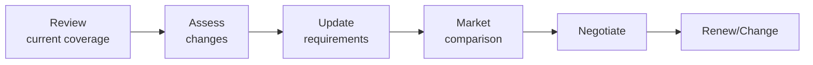
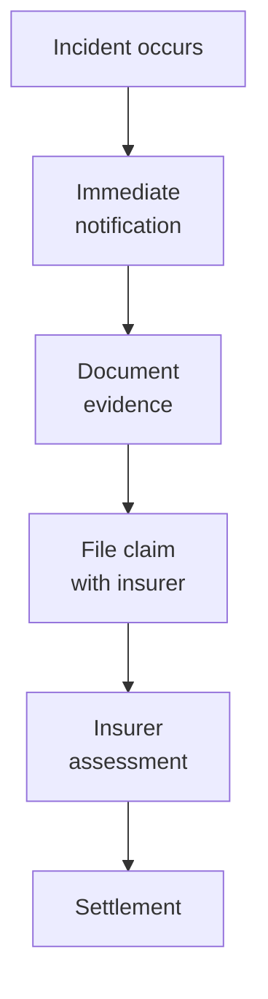

# SOP-05.4: BẢO HIỂM VÀ CHUYỂN GIAO RỦI RO

## 1. MỤC ĐÍCH
Quy định quy trình quản lý danh mục bảo hiểm và chuyển giao rủi ro, đảm bảo:
- Bảo vệ tài chính trước rủi ro lớn
- Coverage phù hợp và đầy đủ
- Chi phí bảo hiểm tối ưu
- Claims được xử lý hiệu quả
- Review và cập nhật thường xuyên

## 2. DANH MỤC BẢO HIỂM

### 2.1. Bảo hiểm bắt buộc
```
1. Bảo hiểm tài sản:
   - Buildings và facilities
   - Equipment và furniture
   - Inventory
   - Coverage: Replacement value
   - Rủi ro: Fire, theft, natural disasters

2. Bảo hiểm trách nhiệm:
   - Public liability
   - Professional indemnity
   - Directors & Officers (D&O)
   - Coverage: Theo quy định

3. Bảo hiểm nhân viên:
   - Bảo hiểm xã hội (BHXH)
   - Bảo hiểm y tế (BHYT)
   - Bảo hiểm tai nạn
   - Coverage: Theo luật lao động

4. Bảo hiểm học sinh:
   - Tai nạn học đường
   - Bệnh tật
   - Coverage: Theo quy định
```

### 2.2. Bảo hiểm tự nguyện (khuyến nghị)
```
1. Business interruption:
   - Loss of income
   - Extra expenses
   - Coverage: 6-12 tháng revenue

2. Cyber insurance:
   - Data breach
   - Cyber attacks
   - Coverage: Theo risk assessment

3. Key person insurance:
   - Hiệu trưởng
   - Key executives
   - Coverage: 2-5 năm salary

4. Travel insurance:
   - School trips
   - International travel
   - Coverage: Medical, cancellation, liability
```

## 3. QUY TRÌNH QUẢN LÝ BẢO HIỂM

### 3.1. Annual insurance review (Hàng năm)

#### 3.1.1. Timeline
```
Tháng 9-10: Review và planning
Tháng 11: Tender (nếu cần)
Tháng 12: Negotiation và renewal
Tháng 1: New policies effective
```

#### 3.1.2. Review process


**Review checklist**:
```
□ Coverage adequate?
□ Limits appropriate?
□ Exclusions acceptable?
□ Premium competitive?
□ Claims experience?
□ Insurer financial strength?
□ Service quality?
□ Changes needed?
```

### 3.2. Tender process (Mỗi 3 năm)

#### 3.2.1. Preparation
```
1. Prepare RFP (Request for Proposal):
   - School profile
   - Coverage requirements
   - Claims history
   - Evaluation criteria
   - Timeline

2. Identify insurers:
   - Minimum 3-5 insurers
   - Reputable và licensed
   - Experience trong education
```

#### 3.2.2. Evaluation
```
Criteria | Weight | Insurer A | Insurer B | Insurer C
---------|--------|-----------|-----------|----------
Coverage | 30% | [Score] | [Score] | [Score]
Premium | 25% | [Score] | [Score] | [Score]
Service | 20% | [Score] | [Score] | [Score]
Financial strength | 15% | [Score] | [Score] | [Score]
Claims process | 10% | [Score] | [Score] | [Score]
---
Total | 100% | [Total] | [Total] | [Total]
```

#### 3.2.3. Negotiation
```
Negotiate:
- Premium (discounts)
- Coverage extensions
- Deductibles
- Payment terms
- Service levels
```

### 3.3. Policy administration

#### 3.3.1. Documentation
```
Maintain:
- Policy documents
- Certificates of insurance
- Endorsements
- Renewal notices
- Claims records
- Correspondence
```

#### 3.3.2. Certificate management
```
Provide certificates to:
- Landlords (property insurance)
- Event venues
- Partners (liability)
- Contractors
- Government agencies

Track expiry dates
Renew on time
```

## 4. CLAIMS MANAGEMENT

### 4.1. Claims process

#### 4.1.1. Reporting


**Timeline**:
```
Immediate: Notify insurer (trong 24-48h)
Day 1-3: Submit claim form
Day 3-7: Provide documentation
Week 2-4: Insurer assessment
Week 4-8: Settlement (varies)
```

#### 4.1.2. Documentation
```
Collect:
- Incident report
- Photos/videos
- Witness statements
- Police report (nếu có)
- Medical reports
- Repair estimates
- Financial records
```

#### 4.1.3. Follow-up
```
Activities:
- Respond to insurer queries
- Provide additional info
- Negotiate settlement
- Accept payment
- Close claim
```

### 4.2. Claims optimization

#### 4.2.1. Reduce claims frequency
```
Prevention:
- Risk management programs
- Safety training
- Maintenance
- Quality control
```

#### 4.2.2. Reduce claims severity
```
Mitigation:
- Quick response
- Damage control
- Proper documentation
- Professional handling
```

## 5. ALTERNATIVE RISK TRANSFER

### 5.1. Self-insurance
```
Concept: Retain some risks, không insure

Mechanism:
- Set aside reserve fund
- For small, frequent losses
- Below deductible amounts

Advantages:
- Save premium
- Control claims
- Cash flow

Disadvantages:
- Uncertainty
- Requires capital
- Management burden
```

### 5.2. Captive insurance
```
Concept: Own insurance company

For: Large organizations only
Benefits: Control, tax, investment
Complexity: High
```

### 5.3. Contractual transfer
```
Transfer risk through contracts:
- Vendors hold insurance
- Indemnification clauses
- Hold harmless agreements
- Waivers (where legal)
```

## 6. CÔNG CỤ VÀ TEMPLATE

### 6.1. Planning tools
- Insurance needs assessment
- Coverage gap analysis
- Cost-benefit calculator

### 6.2. Administration tools
- Policy register
- Certificate tracker
- Renewal calendar
- Premium comparison sheet

### 6.3. Claims tools
- Claim form template
- Documentation checklist
- Claims log
- Settlement tracker

## 7. CHỈ SỐ ĐÁNH GIÁ

```
Coverage:
- Adequate coverage: 100% of identified risks
- No coverage gaps: ✅
- Compliance: 100%

Cost:
- Premium per student: Benchmark
- Claims ratio: < 60%
- Cost optimization: 5-10% savings

Service:
- Renewal on time: 100%
- Claims paid: ≥ 95%
- Settlement time: ≤ 60 days average
- Satisfaction: ≥ 4.0/5.0
```

## 8. NGÂN SÁCH

```
Annual insurance costs:
├─ Property insurance: 20-40 triệu VNĐ
├─ Liability insurance: 15-30 triệu VNĐ
├─ D&O insurance: 10-20 triệu VNĐ
├─ Staff insurance: 30-60 triệu VNĐ
├─ Student insurance: 10-20 triệu VNĐ
├─ Cyber insurance: 10-15 triệu VNĐ
└─ Other: 10-20 triệu VNĐ
---
Tổng: 105-205 triệu VNĐ/năm
(Varies by size và risk profile)
```

---

**Ngày ban hành**: 01/01/2024  
**Người phê duyệt**: Ban Giám hiệu  
**Người soạn thảo**: Phòng Tài chính  
**Ngày xem xét lại**: 01/01/2025


