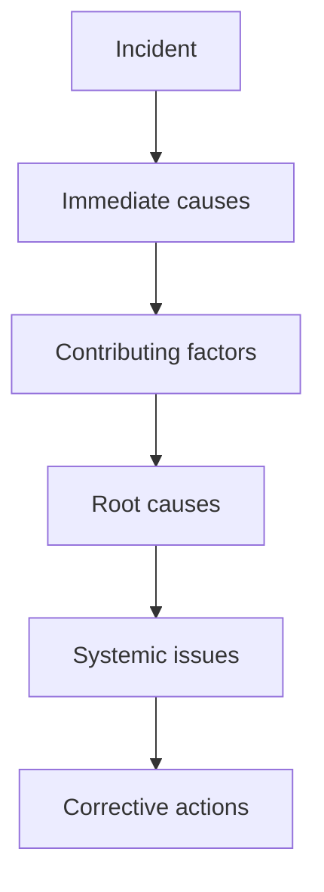

# SOP-05.5: ĐÁNH GIÁ VÀ CẢI TIẾN HỆ THỐNG

## 1. MỤC ĐÍCH
Quy định quy trình đánh giá hiệu quả hệ thống quản trị rủi ro và cải tiến liên tục, đảm bảo:
- Hệ thống luôn hiệu quả và phù hợp
- Học hỏi từ incidents và near-misses
- Cải tiến dựa trên best practices
- Văn hóa quản lý rủi ro mạnh mẽ
- Compliance với standards

## 2. QUY TRÌNH ĐÁNH GIÁ

### 2.1. Quarterly review (Hàng quý)

#### 2.1.1. Risk register review
```
Activities:
1. Update risk scores:
   - Changes trong likelihood
   - Changes trong impact
   - New information

2. Review actions:
   - Progress on action plans
   - Effectiveness của controls
   - Adjustments needed

3. New risks:
   - Add to register
   - Assess và prioritize

4. Closed risks:
   - Archive
   - Document lessons
```

**Meeting** (2 giờ):
```
Participants: Risk Manager + Risk Owners
Agenda:
- Dashboard review
- Top risks deep dive
- Action plan progress
- New risks
- Decisions
```

### 2.2. Annual comprehensive review (Hàng năm)

#### 2.2.1. System effectiveness assessment
```
Evaluate:
1. Risk identification:
   - Coverage (tất cả areas?)
   - Timeliness (sớm không?)
   - Quality (accurate không?)

2. Risk assessment:
   - Methodology appropriate?
   - Consistency
   - Accuracy of predictions

3. Risk response:
   - Plans executed?
   - Effectiveness
   - Resource adequacy

4. Monitoring:
   - Frequency adequate?
   - KPIs useful?
   - Reporting quality

5. Culture:
   - Risk awareness
   - Reporting comfort
   - Accountability
```

#### 2.2.2. Performance metrics
```
RISK MANAGEMENT SCORECARD

Input metrics:
- Risk assessments completed: [X]
- Staff trained: [X%]
- Budget allocated: [X%]

Process metrics:
- Risk register updated: [Frequency]
- High risks monitored: [Frequency]
- Action plans on track: [X%]

Output metrics:
- Risks mitigated: [X]
- Incidents prevented: [X]
- Losses avoided: [Amount]

Outcome metrics:
- Incidents occurred: [X] (trend)
- Financial losses: [Amount] (trend)
- Reputation impact: [Score]
- Compliance: [100%]

OVERALL SCORE: [XX/100]
```

### 2.3. Audit và assurance

#### 2.3.1. Internal audit (Annual)
```
Scope:
- Risk management framework
- Key controls
- Compliance
- Documentation

Process:
1. Planning
2. Fieldwork
3. Findings
4. Report
5. Management response
6. Follow-up
```

#### 2.3.2. External audit (Every 2-3 years)
```
Benefits:
- Independent perspective
- Best practice comparison
- Credibility
- Compliance verification

Deliverable:
- Audit report
- Recommendations
- Action plan
```

## 3. LEARNING FROM INCIDENTS

### 3.1. Incident analysis

#### 3.1.1. Root cause analysis


**Methods**:
```
- 5 Whys
- Fishbone diagram
- Fault tree analysis
- Timeline analysis
```

#### 3.1.2. Lessons learned
```
Template:
INCIDENT: [Mô tả]
DATE: [Date]

WHAT HAPPENED:
[Chi tiết]

ROOT CAUSES:
1. [Cause 1]
2. [Cause 2]

WHAT WORKED WELL:
- [Success 1]
- [Success 2]

WHAT DIDN'T WORK:
- [Failure 1]
- [Failure 2]

LESSONS LEARNED:
1. [Lesson 1]
2. [Lesson 2]

ACTIONS TO PREVENT RECURRENCE:
1. [Action 1] - [Owner] - [Deadline]
2. [Action 2] - [Owner] - [Deadline]

SHARE WITH: [Other departments/schools]
```

### 3.2. Near-miss reporting

#### 3.2.1. Encourage reporting
```
Culture:
- No blame
- Appreciate reporting
- Act on reports
- Share learnings

Incentives:
- Recognition
- Rewards
- Visibility
```

#### 3.2.2. Near-miss analysis
```
Process:
1. Report submitted
2. Quick investigation
3. Identify what prevented incident
4. Strengthen those factors
5. Share learning
```

## 4. CONTINUOUS IMPROVEMENT

### 4.1. Improvement sources

#### 4.1.1. Internal sources
```
- Incident reviews
- Audit findings
- Staff suggestions
- Performance data
- Benchmarking
```

#### 4.1.2. External sources
```
- Industry best practices
- Regulatory updates
- Consultant recommendations
- Peer learning
- Research và publications
```

### 4.2. Improvement process

#### 4.2.1. Identify opportunities
```
Quarterly:
- Review metrics
- Analyze trends
- Identify gaps
- Prioritize improvements
```

#### 4.2.2. Implement improvements
```
Steps:
1. Define improvement
2. Develop plan
3. Get approval
4. Pilot test (nếu major)
5. Roll out
6. Measure impact
7. Standardize
```

### 4.3. Knowledge management

#### 4.3.1. Risk knowledge base
```
Contents:
- Risk library (common risks)
- Response playbooks
- Lessons learned database
- Best practices
- Case studies
- Training materials
```

#### 4.3.2. Sharing mechanisms
```
- Intranet portal
- Regular bulletins
- Training sessions
- Lunch & learns
- Conferences
```

## 5. RISK CULTURE DEVELOPMENT

### 5.1. Awareness building
```
Activities:
- Risk awareness campaigns
- Posters và communications
- Success stories
- Gamification
```

### 5.2. Training program
```
Audience | Frequency | Duration | Content
---------|-----------|----------|--------
All staff | Annual | 2h | Risk basics, reporting
Managers | Annual | 4h | Risk assessment, response
Risk owners | Quarterly | 2h | Deep dive, tools
CMT | Annual | 1 day | Crisis management
```

### 5.3. Incentives
```
Positive:
- Recognize good risk management
- Reward incident prevention
- Celebrate improvements

Negative:
- Consequences for violations
- Accountability for failures
- Learning from mistakes (không punishment)
```

## 6. MATURITY MODEL

### 6.1. Levels
```
Level 1 - Initial:
- Ad-hoc risk management
- Reactive
- No formal process

Level 2 - Developing:
- Some processes
- Risk register exists
- Basic training

Level 3 - Defined:
- Formal framework
- Consistent processes
- Regular reviews

Level 4 - Managed:
- Integrated với strategy
- Proactive
- Data-driven

Level 5 - Optimizing:
- Continuous improvement
- Best-in-class
- Risk-aware culture

Target: Level 4 trong 3 năm
```

### 6.2. Maturity assessment
```
Annual assessment:
- Current level
- Progress from last year
- Gaps to next level
- Action plan
```

## 7. CÔNG CỤ VÀ TEMPLATE

### 7.1. Review tools
- Effectiveness scorecard
- Audit checklist
- Maturity assessment tool

### 7.2. Learning tools
- Incident analysis template
- Lessons learned template
- Near-miss report form

### 7.3. Improvement tools
- Improvement proposal template
- Pilot plan template
- Impact measurement tool

## 8. CHỈ SỐ ĐÁNH GIÁ

```
System effectiveness:
- Overall score: ≥ 80/100
- Maturity level: ≥ Level 3
- Audit findings: Decreasing

Learning:
- Lessons captured: 100% of incidents
- Lessons implemented: ≥ 80%
- Near-miss reports: ≥ 20/năm

Improvement:
- Improvements implemented: ≥ 5/năm
- Impact measured: 100%
- ROI positive: ≥ 70%

Culture:
- Risk awareness: ≥ 4.0/5.0
- Reporting rate: Increasing
- Engagement: ≥ 4.0/5.0
```

---

**Ngày ban hành**: 01/01/2024  
**Người phê duyệt**: Ban Giám hiệu  
**Người soạn thảo**: Phòng Quản lý Rủi ro  
**Ngày xem xét lại**: 01/01/2025


