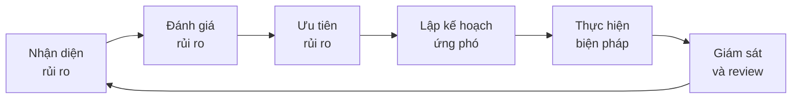

# SOP-05: QUẢN TRỊ RỦI RO

## 1. MỤC ĐÍCH
Thiết lập hệ thống quản trị rủi ro toàn diện cho trường, đảm bảo:
- Nhận diện sớm các rủi ro tiềm ẩn
- Đánh giá và ưu tiên rủi ro
- Lập kế hoạch ứng phó hiệu quả
- Giảm thiểu tác động tiêu cực
- Bảo vệ học sinh, nhân viên và tài sản

## 2. PHẠM VI ÁP DỤNG
Áp dụng cho:
- Ban Giám hiệu (chủ trì)
- Phòng Quản lý Rủi ro (nếu có)
- Tất cả phòng ban (nhận diện và báo cáo)
- Hội đồng Quản trị (giám sát)

## 3. FRAMEWORK QUẢN TRỊ RỦI RO

### 3.1. Quy trình tổng thể


### 3.2. Các loại rủi ro
```
1. Rủi ro chiến lược:
   - Thay đổi thị trường
   - Cạnh tranh
   - Thay đổi chính sách

2. Rủi ro vận hành:
   - Quy trình
   - Nhân sự
   - Công nghệ

3. Rủi ro tài chính:
   - Dòng tiền
   - Nợ xấu
   - Đầu tư

4. Rủi ro tuân thủ:
   - Pháp luật
   - Quy định
   - Chuẩn mực

5. Rủi ro danh tiếng:
   - PR crisis
   - Scandals
   - Negative publicity

6. Rủi ro an toàn:
   - Tai nạn
   - Thiên tai
   - Dịch bệnh
```

### 3.3. Risk appetite
```
Định nghĩa mức độ rủi ro chấp nhận:

Zero tolerance (Không chấp nhận):
- An toàn học sinh
- Vi phạm pháp luật nghiêm trọng
- Gian lận tài chính

Low appetite (Ít chấp nhận):
- Danh tiếng
- Chất lượng giáo dục
- Tuân thủ

Moderate appetite (Chấp nhận vừa):
- Đầu tư mới
- Thử nghiệm chương trình
- Mở rộng

Higher appetite (Chấp nhận cao):
- Innovation
- Marketing campaigns
- Technology adoption
```

## 4. CÁC QUY TRÌNH CON

### 4.1. Nhận diện và đánh giá rủi ro
**Chi tiết**: [SOP-05.1_Nhan_dien_va_danh_gia_rui_ro.md](./SOP-05.1_Nhan_dien_va_danh_gia_rui_ro.md)

**Hoạt động**:
```
- Risk identification workshops
- Risk assessment matrix
- Risk register maintenance
- Prioritization
```

### 4.2. Lập kế hoạch ứng phó rủi ro
**Chi tiết**: [SOP-05.2_Lap_ke_hoach_ung_pho_rui_ro.md](./SOP-05.2_Lap_ke_hoach_ung_pho_rui_ro.md)

**Hoạt động**:
```
- Risk response strategies
- Action plans
- Contingency planning
- Resource allocation
```

### 4.3. Quản lý khủng hoảng và truyền thông
**Chi tiết**: [SOP-05.3_Quan_ly_khung_hoang_va_truyen_thong.md](./SOP-05.3_Quan_ly_khung_hoang_va_truyen_thong.md)

**Hoạt động**:
```
- Crisis management plan
- Crisis team activation
- Communication protocols
- Recovery planning
```

### 4.4. Bảo hiểm và chuyển giao rủi ro
**Chi tiết**: [SOP-05.4_Bao_hiem_va_chuyen_giao_rui_ro.md](./SOP-05.4_Bao_hiem_va_chuyen_giao_rui_ro.md)

**Hoạt động**:
```
- Insurance portfolio management
- Coverage review
- Claims management
- Risk transfer mechanisms
```

### 4.5. Đánh giá và cải tiến hệ thống
**Chi tiết**: [SOP-05.5_Danh_gia_va_cai_tien_he_thong.md](./SOP-05.5_Danh_gia_va_cai_tien_he_thong.md)

**Hoạt động**:
```
- Risk management effectiveness review
- Lessons learned
- System improvements
- Culture development
```

## 5. RISK GOVERNANCE

### 5.1. Cơ cấu quản lý
```
Board Risk Committee:
└─ Giám sát rủi ro cấp cao

Chief Risk Officer (hoặc Phó HT):
└─ Chịu trách nhiệm tổng thể

Risk Management Team:
└─ Thực hiện hàng ngày

Department Risk Champions:
└─ Nhận diện và báo cáo trong bộ phận
```

### 5.2. Roles và responsibilities
```
Board:
- Approve risk appetite
- Review major risks
- Oversee risk management

BGH:
- Set risk strategy
- Allocate resources
- Make risk decisions
- Report to Board

Risk Manager:
- Maintain risk register
- Facilitate assessments
- Monitor và report
- Coordinate responses

All staff:
- Identify risks
- Report incidents
- Follow procedures
- Participate in training
```

## 6. RISK REGISTER

### 6.1. Cấu trúc
```
Risk ID | Category | Description | Likelihood | Impact | Score | Owner | Status
--------|----------|-------------|------------|--------|-------|-------|--------
R001    | [...]    | [...]       | [1-5]      | [1-5]  | [XX]  | [..] | [..]
```

### 6.2. Risk scoring
```
Risk Score = Likelihood × Impact

Likelihood (1-5):
5 = Almost certain (>80%)
4 = Likely (60-80%)
3 = Possible (40-60%)
2 = Unlikely (20-40%)
1 = Rare (<20%)

Impact (1-5):
5 = Catastrophic (>500 triệu VNĐ hoặc major reputation)
4 = Major (100-500 triệu)
3 = Moderate (20-100 triệu)
2 = Minor (5-20 triệu)
1 = Insignificant (<5 triệu)

Risk Level:
20-25: Extreme (Đỏ)
15-19: High (Cam)
10-14: Medium (Vàng)
5-9: Low (Xanh lá)
1-4: Very Low (Xanh dương)
```

## 7. CHỈ SỐ ĐÁNH GIÁ

### 7.1. Process metrics
```
- Risk register completeness: 100%
- Risks reviewed: Quarterly
- High risks monitored: Monthly
- Incidents reported: ≤ 24h
```

### 7.2. Effectiveness metrics
```
- Risks mitigated: ≥ 80%
- Incidents prevented: Measurable reduction
- Response time: ≤ targets
- Recovery time: ≤ targets
```

### 7.3. Culture metrics
```
- Risk awareness: ≥ 4.0/5.0
- Reporting comfort: ≥ 4.0/5.0
- Training completion: 100%
```

## 8. NGÂN SÁCH

```
Annual risk management budget:
├─ Insurance premiums: 50-150 triệu VNĐ
├─ Risk assessments: 10-20 triệu VNĐ
├─ Training: 10-15 triệu VNĐ
├─ Systems và tools: 10-20 triệu VNĐ
├─ Consulting: 20-40 triệu VNĐ
└─ Contingency fund: 100-200 triệu VNĐ
---
Tổng: 200-445 triệu VNĐ/năm
```

---

**Ngày ban hành**: 01/01/2024  
**Người phê duyệt**: Hội đồng Quản trị  
**Người soạn thảo**: Ban Giám hiệu  
**Ngày xem xét lại**: 01/01/2025