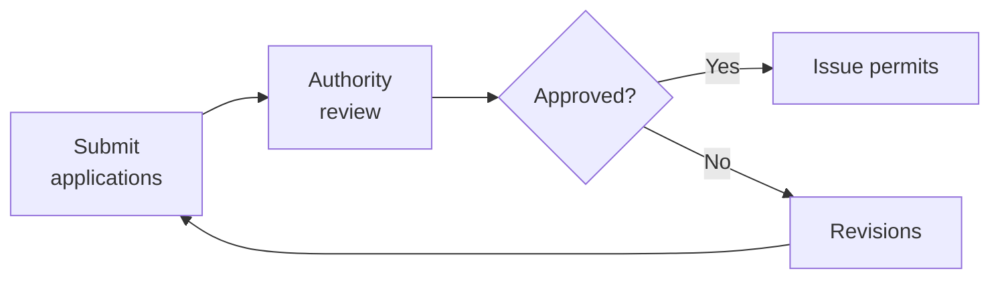
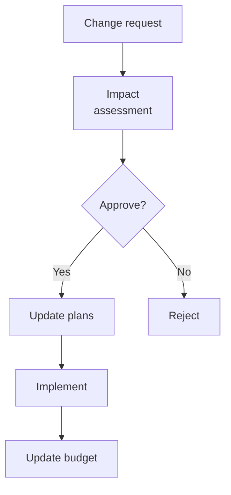

# SOP-06.3: THIẾT KẾ VÀ XÂY DỰNG CƠ SỞ MỚI

## 1. MỤC ĐÍCH
Quy định quy trình thiết kế và xây dựng cơ sở vật chất cho trường mới, đảm bảo:
- Thiết kế phù hợp với educational vision
- Chất lượng xây dựng cao
- An toàn và tuân thủ quy định
- Đúng tiến độ và ngân sách
- Bàn giao đầy đủ và sẵn sàng vận hành

## 2. QUY TRÌNH THIẾT KẾ

### 2.1. Bước 1: Concept design (2-3 tháng)

#### 2.1.1. Design brief
```
Requirements:
1. Educational vision:
   - Pedagogy approach
   - Learning spaces needed
   - Flexibility requirements

2. Functional requirements:
   - Capacity (số học sinh)
   - Classrooms (số lượng, size)
   - Specialized spaces (labs, library, gym)
   - Admin spaces
   - Support spaces (canteen, medical)

3. Technical requirements:
   - Building codes
   - Safety standards
   - Sustainability targets
   - Technology infrastructure

4. Budget constraints:
   - Total budget
   - Cost per m²
   - Value engineering opportunities

5. Timeline:
   - Design completion
   - Construction completion
   - Move-in date
```

#### 2.1.2. Architect selection
```
Process:
1. RFP to 3-5 firms
2. Review portfolios
3. Interviews
4. Proposal evaluation
5. Select architect

Criteria:
- Experience (education projects)
- Design quality
- Fee structure
- Timeline
- References
```

#### 2.1.3. Concept development
```
Deliverables:
- Site plan
- Floor plans
- Elevations
- 3D renderings
- Concept narrative
- Preliminary budget

Reviews:
- Internal (BGH, teachers, students)
- External (education consultants)
- Revisions
- Approval
```

### 2.2. Bước 2: Detailed design (3-4 tháng)

#### 2.2.1. Design development
```
Phases:
1. Schematic Design (30%):
   - Refine concept
   - Major systems
   - Preliminary specs

2. Design Development (60%):
   - Detailed drawings
   - Materials selection
   - MEP systems
   - Cost estimate

3. Construction Documents (100%):
   - Complete drawings
   - Full specifications
   - Tender documents
```

#### 2.2.2. Stakeholder reviews
```
Review points:
- 30%: Concept approval
- 60%: Design approval
- 90%: Pre-tender review
- 100%: Final sign-off

Reviewers:
- BGH
- Academic team
- Operations team
- IT team
- Finance
- Legal
```

### 2.3. Bước 3: Permits và approvals (2-4 tháng)

#### 2.3.1. Required permits
```
Checklist:
□ Planning permission
□ Building permit
□ Fire safety approval
□ Environmental clearance
□ Utility connections
□ Others (specific to location)
```

#### 2.3.2. Process


**Timeline**: Varies by location (2-6 tháng)

## 3. QUY TRÌNH XÂY DỰNG

### 3.1. Bước 1: Contractor selection (1-2 tháng)

#### 3.1.1. Tender process
```
Steps:
1. Prepare tender package
2. Advertise (public hoặc invited)
3. Site visits
4. Submit bids
5. Bid evaluation
6. Interviews
7. Award contract
```

#### 3.1.2. Evaluation criteria
```
Criteria | Weight | Contractor A | B | C
---------|--------|--------------|---|---
Price | 40% | [X] | [Y] | [Z]
Experience | 25% | [X] | [Y] | [Z]
Timeline | 15% | [X] | [Y] | [Z]
Quality | 10% | [X] | [Y] | [Z]
Financial strength | 10% | [X] | [Y] | [Z]
---
Total | 100% | [Total] | [Total] | [Total]
```

### 3.2. Bước 2: Construction (12-18 tháng)

#### 3.2.1. Project management
```
PM responsibilities:
- Schedule management
- Budget control
- Quality assurance
- Risk management
- Stakeholder communication
- Change management
```

#### 3.2.2. Monitoring và control
```
Weekly:
- Site meetings
- Progress review
- Issue resolution

Monthly:
- Progress report
- Financial report
- Steering Committee update

Milestones:
- Foundation complete
- Structure complete
- Roof complete
- MEP rough-in
- Finishes
- Substantial completion
```

#### 3.2.3. Quality control
```
Inspections:
- Daily: Site supervisor
- Weekly: Project manager
- Monthly: Consultant
- Milestones: Independent inspector
- Final: Comprehensive inspection

Documentation:
- Inspection reports
- Test results
- Photos
- As-built drawings
```

### 3.3. Bước 3: Fit-out (3-4 tháng)

#### 3.3.1. Interior fit-out
```
Scope:
- Flooring
- Ceilings
- Painting
- Fixtures
- Signage
- Branding elements
```

#### 3.3.2. FF&E (Furniture, Fixtures & Equipment)
```
Process:
1. Detailed specifications
2. Procurement (tender)
3. Manufacturing/ordering
4. Delivery
5. Installation
6. Testing
```

### 3.4. Bước 4: Commissioning (1-2 tháng)

#### 3.4.1. Systems testing
```
Test:
□ HVAC systems
□ Electrical systems
□ Plumbing
□ Fire safety systems
□ Security systems
□ IT infrastructure
□ AV equipment
□ Elevators
□ Kitchen equipment
```

#### 3.4.2. Handover
```
Deliverables:
- Certificate of completion
- As-built drawings
- O&M manuals
- Warranties
- Keys và access
- Training for staff

Defects list:
- Identify issues
- Contractor rectifies
- Final acceptance
```

## 4. CHANGE MANAGEMENT

### 4.1. Change control process


### 4.2. Approval levels
```
Change value | Approver
-------------|----------
< 50 triệu | Project Director
50-200 triệu | Steering Committee
> 200 triệu | Board
```

## 5. RISK MANAGEMENT

### 5.1. Construction risks
```
Risk | Mitigation
-----|------------
Delays | Buffer time, penalties, alternative suppliers
Cost overruns | Contingency, fixed-price contract
Quality issues | QA/QC, inspections, warranties
Safety incidents | Safety plan, training, insurance
Weather | Schedule float, weather protection
Labor shortage | Multiple contractors, early booking
```

### 5.2. Monitoring
```
Weekly risk review:
- Update risk register
- New risks
- Mitigation effectiveness
- Escalations
```

## 6. CÔNG CỤ VÀ TEMPLATE

### 6.1. Design tools
- Design brief template
- Review checklist
- Approval forms

### 6.2. Construction tools
- Tender documents
- Contract templates
- Progress report template
- Change order form
- Inspection checklist

### 6.3. Project management tools
- Gantt chart
- Budget tracker
- Risk register
- Issue log

## 7. CHỈ SỐ ĐÁNH GIÁ

```
Schedule:
- On-time completion: ±5%
- Milestone adherence: ≥ 90%

Budget:
- Within budget: ±10%
- Change orders: ≤ 5% of contract

Quality:
- Defects at handover: ≤ 50 items
- Serious defects: 0
- Quality score: ≥ 4.5/5.0

Safety:
- Lost time injuries: 0
- Safety incidents: ≤ 5 minor
```

---

**Ngày ban hành**: 01/01/2024  
**Người phê duyệt**: Ban Giám hiệu  
**Người soạn thảo**: Phòng Phát triển  
**Ngày xem xét lại**: 01/01/2025


