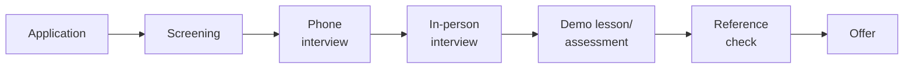

# SOP-06.4: TUYỂN DỤNG VÀ ĐÀO TẠO ĐỘI NGŨ

## 1. MỤC ĐÍCH
Quy định quy trình tuyển dụng và đào tạo đội ngũ cho cơ sở mới, đảm bảo:
- Đủ nhân sự chất lượng cao khi khai trương
- Đào tạo đầy đủ và sẵn sàng
- Văn hóa và values được truyền tải
- Team cohesion và collaboration
- Smooth operations từ ngày đầu

## 2. STAFFING PLAN

### 2.1. Organizational structure
```
Cơ sở mới (500-1000 học sinh):

Principal (1)
├─ Vice Principal - Academic (1)
│   ├─ Teachers (40-80)
│   └─ Teaching Assistants (10-20)
├─ Vice Principal - Operations (1)
│   ├─ Admin staff (10-15)
│   ├─ IT staff (3-5)
│   ├─ Facilities staff (5-10)
│   └─ Security (5-8)
└─ Student Services
    ├─ Counselors (3-5)
    ├─ Nurses (2-3)
    └─ Librarians (2-3)

Total: 80-150 staff
```

### 2.2. Hiring timeline
```
T-12 months: Principal
T-9 months: Vice Principals, key managers
T-6 months: Department heads, senior teachers
T-4 months: Teachers, specialists
T-2 months: Admin và support staff
T-1 month: Final hires, substitutes
```

## 3. QUY TRÌNH TUYỂN DỤNG

### 3.1. Recruitment strategy

#### 3.1.1. Sourcing channels
```
For Principal/Leadership:
- Executive search firms
- Industry networks
- Headhunting
- Referrals

For Teachers:
- Job boards (education-specific)
- University partnerships
- Teacher recruitment fairs
- Social media (LinkedIn, Facebook)
- Referrals từ staff hiện tại
- International recruitment (nếu cần)

For Support staff:
- General job boards
- Local recruitment
- Referrals
```

#### 3.1.2. Employer branding
```
Messages:
- "Join us in building something new"
- "Shape the future of education"
- "Be part of founding team"
- "Career growth opportunities"

Channels:
- Careers website
- Social media campaign
- Info sessions
- Campus tours (existing campus)
```

### 3.2. Selection process

#### 3.2.1. Standard process


**Timeline**: 4-6 tuần per position

#### 3.2.2. Assessment methods
```
For Teachers:
- Resume review
- Phone screening
- Teaching demo (30 phút)
- Panel interview (60 phút)
- Values assessment
- Reference checks (2-3)

For Leadership:
- Resume review
- Case study/presentation
- Multiple interviews
- Psychometric assessment (optional)
- Reference checks (3-5)
```

### 3.3. Onboarding

#### 3.3.1. Pre-start
```
After offer acceptance:
- Welcome package
- Pre-reading materials
- Online modules
- Facility tours
- Meet the team events
```

#### 3.3.2. First week
```
Day 1: Orientation
- Welcome
- Vision/Mission/Values
- Policies và procedures
- Campus tour
- Setup (ID, email, keys)

Day 2-3: Role-specific training
- Department overview
- Systems training
- Curriculum introduction

Day 4-5: Integration
- Shadow colleagues
- Attend meetings
- Start planning
```

## 4. TRAINING PROGRAM

### 4.1. Pre-opening training (2-3 tháng)

#### 4.1.1. Founding team intensive (1 tháng)
```
Week 1: Foundation
- Vision/Mission/Values deep dive
- School culture
- Educational philosophy
- Expectations

Week 2: Academic
- Curriculum training
- Pedagogy methods
- Assessment practices
- Technology tools

Week 3: Operations
- Systems và processes
- Policies và procedures
- Safety và compliance
- Customer service

Week 4: Team building
- Collaboration skills
- Communication
- Problem-solving
- Team bonding activities
```

#### 4.1.2. Role-specific training
```
Teachers:
- Curriculum deep dive (40 giờ)
- Classroom management (16 giờ)
- Technology integration (16 giờ)
- Assessment (16 giờ)
- Total: 88 giờ

Admin staff:
- Systems training (24 giờ)
- Customer service (16 giờ)
- Procedures (16 giờ)
- Total: 56 giờ

Support staff:
- Role-specific (20-30 giờ)
```

### 4.2. Soft launch training (1 tháng)

#### 4.2.1. Simulation và practice
```
Activities:
- Mock classes
- Mock enrollment
- Mock parent meetings
- Emergency drills
- System testing
- Dry runs
```

#### 4.2.2. Feedback và adjustment
```
After each simulation:
- Debrief
- Identify issues
- Adjust procedures
- Re-train if needed
```

## 5. TEAM BUILDING

### 5.1. Founding team culture
```
Activities:
- Team charter creation
- Values workshop
- Vision co-creation
- Norms establishment
```

### 5.2. Cohesion building
```
Events:
- Welcome retreat (2-3 ngày)
- Weekly team lunches
- Social activities
- Volunteer together
- Celebrate milestones
```

## 6. RETENTION STRATEGY

### 6.1. Incentives
```
Founding team benefits:
- Signing bonus
- Retention bonus (after Year 1)
- Equity/profit sharing (nếu có)
- Career development opportunities
- Recognition as founders
```

### 6.2. Support
```
Ongoing:
- Mentoring program
- Professional development
- Regular feedback
- Career pathing
- Work-life balance
```

## 7. CÔNG CỤ VÀ TEMPLATE

### 7.1. Planning tools
- Staffing plan template
- Hiring timeline
- Budget calculator

### 7.2. Recruitment tools
- Job description templates
- Interview guides
- Assessment rubrics
- Offer letter templates

### 7.3. Training tools
- Training curriculum
- Training schedule
- Assessment tools
- Feedback forms

## 8. CHỈ SỐ ĐÁNH GIÁ

```
Recruitment:
- Positions filled on time: ≥ 95%
- Quality of hire: ≥ 4.0/5.0
- Offer acceptance rate: ≥ 80%

Training:
- Training completion: 100%
- Training effectiveness: ≥ 4.0/5.0
- Readiness score: ≥ 4.2/5.0

Retention:
- Year 1 retention: ≥ 85%
- Year 2 retention: ≥ 90%
- Engagement score: ≥ 4.0/5.0
```

---

**Ngày ban hành**: 01/01/2024  
**Người phê duyệt**: Ban Giám hiệu  
**Người soạn thảo**: Phòng Nhân sự  
**Ngày xem xét lại**: 01/01/2025


