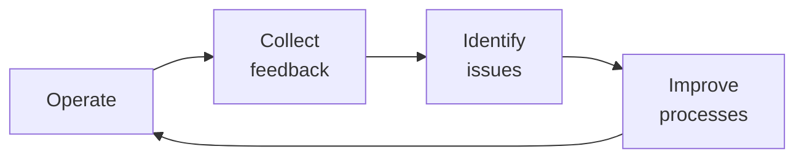

# SOP-06.5: VẬN HÀNH VÀ QUẢN LÝ CƠ SỞ MỚI

## 1. MỤC ĐÍCH
Quy định quy trình vận hành và quản lý cơ sở mới từ giai đoạn khai trương đến ổn định, đảm bảo:
- Khai trương thành công và ấn tượng
- Vận hành smooth từ ngày đầu
- Enrollment đạt target
- Chất lượng duy trì cao
- Đạt break-even đúng kế hoạch

## 2. PRE-OPENING PHASE

### 2.1. Countdown to opening (3 tháng)

#### 2.1.1. T-90 days: Final preparations
```
Checklist:
□ Construction substantially complete
□ Permits và licenses approved
□ Staff hired và trained
□ Systems tested
□ Supplies ordered
□ Marketing campaign active
□ Enrollment ongoing
```

#### 2.1.2. T-60 days: Soft launch planning
```
Activities:
- Finalize opening day plan
- Invite VIPs
- Prepare materials
- Media outreach
- Staff rehearsals
```

#### 2.1.3. T-30 days: Final countdown
```
Daily checks:
- Facilities readiness
- Staff readiness
- Student readiness
- Systems readiness
- Communications readiness
```

### 2.2. Soft launch (1 tháng trước grand opening)

#### 2.2.1. Objectives
```
Goals:
- Test operations với small group
- Identify và fix issues
- Build confidence
- Generate buzz
- Gather feedback
```

#### 2.2.2. Activities
```
Week 1-2: Staff move-in
- Setup offices
- Familiarize với space
- Final training
- System testing

Week 3-4: Limited operations
- Small group of students (50-100)
- Trial classes
- Test all processes
- Adjust as needed
```

## 3. GRAND OPENING

### 3.1. Opening day event

#### 3.1.1. Planning
```
Event type: Celebration + Open House
Duration: 4-6 giờ
Attendees: 500-1000 (students, parents, VIPs, media, community)

Program:
10:00-10:30: VIP arrival, registration
10:30-11:00: Opening ceremony
            - Welcome speech
            - Ribbon cutting
            - Performances
11:00-12:00: Campus tours
12:00-13:00: Lunch reception
13:00-15:00: Open house (public)
15:00-16:00: Wrap-up
```

#### 3.1.2. Logistics
```
Setup:
- Stage và seating
- Registration desk
- Signage và wayfinding
- Refreshments
- Photo booth
- Giveaways

Staffing:
- Greeters
- Tour guides
- Info desk
- Photographers
- Security
```

### 3.2. Media coverage

#### 3.2.1. Media plan
```
Pre-opening:
- Press release
- Media kit
- Site visits
- Interviews

Opening day:
- Media attendance
- Photo opportunities
- Spokesperson availability

Post-opening:
- Follow-up stories
- Features
- Social media amplification
```

## 4. RAMP-UP MANAGEMENT (Năm 1-2)

### 4.1. Enrollment management

#### 4.1.1. Enrollment targets
```
Year 1 (60% capacity):
- Q1: 200 students
- Q2: 250 students
- Q3: 280 students
- Q4: 300 students

Year 2 (85% capacity):
- Target: 600 students
- Focus: Fill lower grades first
```

#### 4.1.2. Marketing push
```
Ongoing activities:
- Open houses (monthly)
- School tours (weekly)
- Digital marketing
- Referral program
- Community engagement
```

### 4.2. Operations optimization

#### 4.2.1. Process refinement


**Focus areas**:
```
- Admissions process
- Daily operations
- Parent communications
- Academic delivery
- Support services
```

#### 4.2.2. Continuous improvement
```
Weekly:
- Staff feedback sessions
- Quick fixes

Monthly:
- Process reviews
- Implement improvements

Quarterly:
- Comprehensive review
- Strategic adjustments
```

### 4.3. Quality assurance

#### 4.3.1. Monitoring
```
Metrics:
- Student satisfaction: Weekly surveys
- Parent satisfaction: Monthly surveys
- Staff satisfaction: Monthly pulse
- Academic performance: Ongoing
- Operational efficiency: Dashboard
```

#### 4.3.2. Benchmarking
```
Compare với:
- Existing campus (if any)
- Targets in business plan
- Industry standards
- Competitor schools
```

### 4.4. Financial management

#### 4.4.1. Budget vs. actual
```
Monthly review:
- Revenue vs. forecast
- Expenses vs. budget
- Cash flow
- Variances analysis
- Corrective actions
```

#### 4.4.2. Break-even tracking
```
Monitor:
- Enrollment progress
- Revenue per student
- Cost per student
- Contribution margin
- Path to break-even

Target: Break-even by Year 3
```

## 5. STAKEHOLDER MANAGEMENT

### 5.1. Students và parents

#### 5.1.1. Onboarding excellence
```
Ensure:
- Smooth enrollment
- Clear communications
- Warm welcome
- Exceed expectations
- Quick issue resolution
```

#### 5.1.2. Community building
```
Activities:
- Parent orientations
- Welcome events
- Class parties
- School traditions start
- Parent association formation
```

### 5.2. Staff

#### 5.2.1. Support
```
Provide:
- Clear expectations
- Regular feedback
- Resources needed
- Professional development
- Recognition
```

#### 5.2.2. Culture building
```
Reinforce:
- Vision/Mission/Values
- Founding team identity
- Collaboration
- Innovation mindset
- Pride in achievement
```

### 5.3. Community

#### 5.3.1. Engagement
```
Activities:
- Community open days
- Partnership với local organizations
- Sponsor local events
- Volunteer programs
- Good neighbor initiatives
```

## 6. TRANSITION TO STEADY STATE

### 6.1. Milestones
```
Month 6: First semester complete
- Review và adjust
- Celebrate successes
- Address gaps

Month 12: First year complete
- Comprehensive review
- Retention analysis
- Plan Year 2

Month 24: Approaching capacity
- Optimize operations
- Reduce costs
- Improve margins

Month 36: Steady state
- Consistent quality
- Stable enrollment
- Profitable operations
- Transition to BAU (Business As Usual)
```

### 6.2. Handover to standard operations
```
When:
- Enrollment ≥ 90% capacity
- Operations smooth
- Quality consistent
- Financially stable

Process:
- Dissolve project team
- Transfer to standard governance
- Document lessons learned
- Celebrate success
```

## 7. CÔNG CỤ VÀ TEMPLATE

### 7.1. Planning tools
- Staffing plan template
- Recruitment timeline
- Training curriculum

### 7.2. Operations tools
- Opening day runbook
- Process checklists
- Feedback forms
- Dashboard templates

### 7.3. Reporting tools
- Monthly report template
- Quarterly review template
- Lessons learned template

## 8. CHỈ SỐ ĐÁNH GIÁ

```
Opening:
- On-time opening: ✅
- Event success: ≥ 4.5/5.0
- Media coverage: ≥ 10 articles

Enrollment:
- Year 1 target: ≥ 90% of plan
- Year 2 target: ≥ 90% of plan
- Retention: ≥ 90%

Quality:
- Student satisfaction: ≥ 4.0/5.0
- Parent satisfaction: ≥ 4.2/5.0
- Staff satisfaction: ≥ 4.0/5.0
- Academic performance: On target

Financial:
- Revenue vs. plan: ≥ 90%
- Costs vs. budget: ≤ 110%
- Break-even: On track
```

---

**Ngày ban hành**: 01/01/2024  
**Người phê duyệt**: Ban Giám hiệu  
**Người soạn thảo**: Phòng Phát triển  
**Ngày xem xét lại**: 01/01/2025


