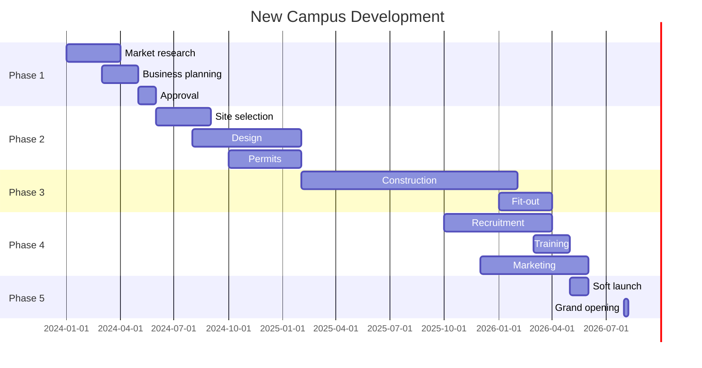

# SOP-06: PHÁT TRIỂN CƠ SỞ MỚI

## 1. MỤC ĐÍCH
Thiết lập quy trình phát triển và mở rộng cơ sở mới, đảm bảo:
- Quyết định mở rộng dựa trên dữ liệu
- Lập kế hoạch toàn diện và chi tiết
- Triển khai hiệu quả và đúng tiến độ
- Quản lý rủi ro và chi phí
- Vận hành thành công từ ngày đầu

## 2. PHẠM VI ÁP DỤNG
Áp dụng cho:
- Hội đồng Quản trị (quyết định đầu tư)
- Ban Giám hiệu (lập kế hoạch và triển khai)
- Phòng Phát triển (quản lý dự án)
- Tất cả phòng ban (hỗ trợ)

## 3. CHIẾN LƯỢC MỞ RỘNG

### 3.1. Growth options
```
Option 1: Organic growth
└─ Mở rộng cơ sở hiện tại (thêm tầng, building)

Option 2: New campus
└─ Xây dựng cơ sở hoàn toàn mới

Option 3: Acquisition
└─ Mua lại trường khác

Option 4: Franchise/License
└─ Cấp phép cho đối tác vận hành

Option 5: Joint venture
└─ Hợp tác với đối tác phát triển
```

### 3.2. Decision criteria
```
Factors:
1. Strategic fit
2. Market opportunity
3. Financial viability
4. Risk profile
5. Capability requirements
6. Timeline
7. Competitive advantage
```

## 4. CÁC QUY TRÌNH CON

### 4.1. Nghiên cứu và phân tích thị trường
**Chi tiết**: [SOP-06.1_Nghien_cuu_va_phan_tich_thi_truong.md](./SOP-06.1_Nghien_cuu_va_phan_tich_thi_truong.md)

**Hoạt động**:
```
- Market sizing và segmentation
- Competitive analysis
- Location analysis
- Demand forecasting
- Feasibility assessment
```

### 4.2. Lập kế hoạch và dự toán đầu tư
**Chi tiết**: [SOP-06.2_Lap_ke_hoach_va_du_toan_dau_tu.md](./SOP-06.2_Lap_ke_hoach_va_du_toan_dau_tu.md)

**Hoạt động**:
```
- Business plan development
- Financial modeling
- Funding strategy
- Risk assessment
- Approval process
```

### 4.3. Thiết kế và xây dựng cơ sở mới
**Chi tiết**: [SOP-06.3_Thiet_ke_va_xay_dung_co_so_moi.md](./SOP-06.3_Thiet_ke_va_xay_dung_co_so_moi.md)

**Hoạt động**:
```
- Site selection
- Architectural design
- Construction management
- Fit-out và equipment
- Licensing và permits
```

### 4.4. Tuyển dụng và đào tạo đội ngũ
**Chi tiết**: [SOP-06.4_Tuyen_dung_va_dao_tao_doi_ngu.md](./SOP-06.4_Tuyen_dung_va_dao_tao_doi_ngu.md)

**Hoạt động**:
```
- Staffing plan
- Recruitment campaign
- Selection và hiring
- Training program
- Team building
```

### 4.5. Vận hành và quản lý cơ sở mới
**Chi tiết**: [SOP-06.5_Van_hanh_va_quan_ly_co_so_moi.md](./SOP-06.5_Van_hanh_va_quan_ly_co_so_moi.md)

**Hoạt động**:
```
- Pre-opening preparations
- Soft launch
- Grand opening
- Ramp-up management
- Performance monitoring
```

## 5. PROJECT GOVERNANCE

### 5.1. Cơ cấu quản lý
```
Steering Committee:
├─ Chair: Board member hoặc Hiệu trưởng
├─ Members: BGH, CFO, Project Director
└─ Meetings: Monthly

Project Management Office:
├─ Project Director
├─ Project Managers (by workstream)
└─ Project Coordinators

Working Teams:
├─ Design & Construction
├─ Operations Setup
├─ HR & Training
├─ Marketing & Enrollment
└─ Finance & Legal
```

### 5.2. Decision-making
```
Steering Committee decides:
- Major scope changes
- Budget increases >10%
- Timeline changes >1 month
- Risk escalations

Project Director decides:
- Day-to-day operations
- Minor adjustments
- Resource allocation
- Vendor selection (within budget)
```

## 6. TIMELINE TỔNG QUAN

### 6.1. Typical timeline (2-3 năm)


### 6.2. Critical path
```
Longest path determines timeline:
1. Site acquisition (3-6 tháng)
2. Design (6-9 tháng)
3. Permits (3-6 tháng)
4. Construction (12-18 tháng)
5. Fit-out (3-4 tháng)

Total: 27-43 tháng (2.5-3.5 năm)
```

## 7. NGÂN SÁCH ƯỚC TÍNH

### 7.1. Capital expenditure (CAPEX)
```
Land acquisition:           50-200 tỷ VNĐ
Construction:               100-300 tỷ VNĐ
Fit-out:                    20-50 tỷ VNĐ
Equipment:                  10-30 tỷ VNĐ
IT systems:                 5-15 tỷ VNĐ
Contingency (10%):          18-59 tỷ VNĐ
---
Total CAPEX:                203-654 tỷ VNĐ

(Varies greatly by size, location, quality)
```

### 7.2. Pre-opening expenses (OPEX)
```
Project management:         5-10 tỷ VNĐ
Professional fees:          3-8 tỷ VNĐ
Recruitment:                2-5 tỷ VNĐ
Training:                   1-3 tỷ VNĐ
Marketing:                  5-15 tỷ VNĐ
Licensing:                  1-2 tỷ VNĐ
Working capital:            10-20 tỷ VNĐ
---
Total pre-opening:          27-63 tỷ VNĐ
```

### 7.3. Funding sources
```
Options:
1. Equity (Owner capital)
2. Bank loans
3. Bonds
4. Private equity
5. Strategic partners
6. Pre-enrollment deposits

Typical mix:
- Equity: 30-40%
- Debt: 60-70%
```

## 8. CHỈ SỐ THÀNH CÔNG

### 8.1. Project delivery
```
- On time: ±5%
- On budget: ±10%
- Quality: ≥ 4.5/5.0
- Safety: Zero major incidents
```

### 8.2. Enrollment
```
Year 1: 60-70% capacity
Year 2: 80-90% capacity
Year 3: 95-100% capacity
```

### 8.3. Financial
```
- Break-even: Year 3-4
- ROI: ≥ 15% (10 years)
- Payback: 7-10 years
```

### 8.4. Quality
```
- Student satisfaction: ≥ 4.0/5.0
- Parent satisfaction: ≥ 4.2/5.0
- Academic performance: On par với existing campus
- Accreditation: Achieved within 2 years
```

---

**Ngày ban hành**: 01/01/2024  
**Người phê duyệt**: Hội đồng Quản trị  
**Người soạn thảo**: Ban Giám hiệu  
**Ngày xem xét lại**: 01/01/2025