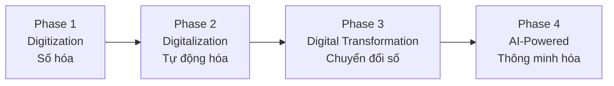

# QUY TẮC 09: CÔNG NGHỆ & PHÁT TRIỂN BỀN VỮNG

## 1. TỔNG QUAN

### 1.1. Giới thiệu
Quy tắc 09 thiết lập framework cho chuyển đổi số, ứng dụng công nghệ tiên tiến và phát triển bền vững, đảm bảo trường học hiện đại, an toàn và có trách nhiệm với môi trường và xã hội.

### 1.2. Mục đích
- Xây dựng hạ tầng công nghệ hiện đại và an toàn
- Quản trị dữ liệu hiệu quả và tuân thủ
- Ứng dụng công nghệ tiên tiến vào giáo dục
- Bảo vệ an toàn thông tin
- Phát triển bền vững về môi trường
- Thực hiện trách nhiệm xã hội doanh nghiệp

### 1.3. Phạm vi áp dụng
Áp dụng cho:
- Ban Giám hiệu
- Phòng Công nghệ Thông tin
- Phòng Quản lý Cơ sở
- Tất cả phòng ban (sử dụng công nghệ)
- Học sinh và phụ huynh (users)

## 2. CHIẾN LƯỢC CÔNG NGHỆ

### 2.1. Digital Transformation Roadmap


**Timeline**: 3-5 năm

### 2.2. Technology Stack
```
Infrastructure Layer:
├─ Cloud services (AWS, Azure, Google Cloud)
├─ Network và connectivity
├─ Data centers
└─ Security systems

Platform Layer:
├─ Learning Management System (LMS)
├─ Student Information System (SIS)
├─ Customer Relationship Management (CRM)
├─ Human Resource Management (HRM)
└─ Enterprise Resource Planning (ERP)

Application Layer:
├─ Mobile apps
├─ Web portals
├─ Collaboration tools
└─ Specialized apps (AI, VR/AR)

Data Layer:
├─ Data warehouse
├─ Analytics platform
└─ Business Intelligence tools
```

## 3. HỆ THỐNG QUY TRÌNH

### 3.1. SOP-01: Quản trị dữ liệu
**Mục tiêu**: Quản lý dữ liệu như tài sản chiến lược
**Nội dung**: [SOP-01_Quan_tri_du_lieu](./SOP-01_Quan_tri_du_lieu/SOP-01_Quan_tri_du_lieu.md)

**Các quy trình con**:
```
1. Thu thập và lưu trữ dữ liệu
2. Quản lý chất lượng dữ liệu
3. Phân tích và khai thác dữ liệu
4. Bảo mật và quyền riêng tư
5. Tuân thủ quy định dữ liệu
```

### 3.2. SOP-02: Phân quyền truy cập
**Mục tiêu**: Kiểm soát truy cập hệ thống an toàn
**Nội dung**: [SOP-02_Phan_quyen_truy_cap](./SOP-02_Phan_quyen_truy_cap/SOP-02_Phan_quyen_truy_cap.md)

**Các quy trình con**:
```
1. Thiết lập chính sách phân quyền
2. Quản lý tài khoản người dùng
3. Kiểm soát truy cập hệ thống
4. Audit và giám sát
5. Xử lý vi phạm
```

### 3.3. SOP-03: An toàn thông tin
**Mục tiêu**: Bảo vệ thông tin và hệ thống
**Nội dung**: [SOP-03_An_toan_thong_tin](./SOP-03_An_toan_thong_tin/SOP-03_An_toan_thong_tin.md)

**Các quy trình con**:
```
1. Đánh giá rủi ro an ninh mạng
2. Triển khai biện pháp bảo mật
3. Phát hiện và ứng phó sự cố
4. Đào tạo nhận thức an toàn
5. Audit và cải tiến bảo mật
```

### 3.4. SOP-04: Ứng dụng LMS-CRM-HRM
**Mục tiêu**: Tối ưu hóa hệ thống quản lý cốt lõi
**Nội dung**: [SOP-04_Ung_dung_LMS_CRM_HRM](./SOP-04_Ung_dung_LMS_CRM_HRM/SOP-04_Ung_dung_LMS_CRM_HRM.md)

**Các quy trình con**:
```
1. Lựa chọn và triển khai hệ thống
2. Tích hợp và tùy biến
3. Đào tạo và adoption
4. Vận hành và hỗ trợ
5. Tối ưu hóa và nâng cấp
```

### 3.5. SOP-05: Ứng dụng AI-VR-AR
**Mục tiêu**: Ứng dụng công nghệ tiên tiến vào giáo dục
**Nội dung**: [SOP-05_Ung_dung_AI_VR_AR](./SOP-05_Ung_dung_AI_VR_AR/SOP-05_Ung_dung_AI_VR_AR.md)

**Các quy trình con**:
```
1. Đánh giá và lựa chọn công nghệ
2. Pilot và thử nghiệm
3. Triển khai quy mô
4. Đào tạo và hỗ trợ
5. Đánh giá hiệu quả và mở rộng
```

### 3.6. SOP-06: Quản lý môi trường - Năng lượng
**Mục tiêu**: Vận hành bền vững và thân thiện môi trường
**Nội dung**: [SOP-06_Quan_ly_moi_truong_Nang_luong](./SOP-06_Quan_ly_moi_truong_Nang_luong/SOP-06_Quan_ly_moi_truong_Nang_luong.md)

**Các quy trình con**:
```
1. Quản lý năng lượng và tiết kiệm
2. Quản lý chất thải và tái chế
3. Quản lý nước và tài nguyên
4. Giáo dục môi trường
5. Đo lường và báo cáo bền vững
```

### 3.7. SOP-07: Chương trình CSR
**Mục tiêu**: Thực hiện trách nhiệm xã hội doanh nghiệp
**Nội dung**: [SOP-07_Chuong_trinh_CSR](./SOP-07_Chuong_trinh_CSR/SOP-07_Chuong_trinh_CSR.md)

**Các quy trình con**:
```
1. Xây dựng chiến lược CSR
2. Chương trình cộng đồng
3. Tình nguyện và từ thiện
4. Đối tác CSR
5. Đo lường impact xã hội
```

## 4. TECHNOLOGY GOVERNANCE

### 4.1. IT Steering Committee
```
Thành phần:
- Chair: Hiệu trưởng hoặc Phó HT
- Members: CIO, CFO, Academic Director, HR Director
- Advisors: External IT experts

Vai trò:
- Approve IT strategy
- Prioritize investments
- Oversee major projects
- Review performance

Meetings: Quarterly
```

### 4.2. IT Investment Framework
```
Evaluation criteria:
1. Strategic alignment (30%)
2. Educational impact (25%)
3. ROI (20%)
4. Feasibility (15%)
5. Risk (10%)

Approval levels:
- < 100 triệu: CIO
- 100-500 triệu: IT Steering Committee
- > 500 triệu: Board
```

## 5. CHỈ SỐ ĐÁNH GIÁ

### 5.1. Technology metrics
```
Infrastructure:
- System uptime: ≥ 99.5%
- Network speed: ≥ 100 Mbps
- Device ratio: 1:3 (device:student)

Adoption:
- LMS usage: ≥ 90% daily active users
- Mobile app adoption: ≥ 80%
- Digital literacy: ≥ 4.0/5.0

Security:
- Security incidents: ≤ 5/năm
- Data breaches: 0
- Compliance: 100%
```

### 5.2. Sustainability metrics
```
Environment:
- Energy reduction: 5%/năm
- Water reduction: 5%/năm
- Waste recycling: ≥ 60%
- Carbon footprint: Giảm 10%/năm

Social:
- CSR investment: ≥ 2% revenue
- Volunteer hours: ≥ 1000 giờ/năm
- Community beneficiaries: ≥ 500 người/năm
- Student participation: ≥ 70%
```

## 6. NGÂN SÁCH

### 6.1. Technology budget (Annual)
```
Infrastructure: 500-800 triệu VNĐ
Software licenses: 300-500 triệu VNĐ
Hardware: 400-600 triệu VNĐ
IT staff: 800-1200 triệu VNĐ
Training: 100-200 triệu VNĐ
Security: 200-300 triệu VNĐ
Innovation (AI/VR): 300-500 triệu VNĐ
---
Total: 2.6-4.1 tỷ VNĐ/năm
(~5-8% of revenue)
```

### 6.2. Sustainability budget (Annual)
```
Energy efficiency: 100-200 triệu VNĐ
Waste management: 50-100 triệu VNĐ
Green initiatives: 100-150 triệu VNĐ
CSR programs: 200-400 triệu VNĐ
Education programs: 50-100 triệu VNĐ
---
Total: 500-950 triệu VNĐ/năm
(~1-2% of revenue)
```

## 7. TRÁCH NHIỆM

### 7.1. Ban Giám hiệu
- Phê duyệt chiến lược công nghệ và bền vững
- Đầu tư nguồn lực
- Giám sát thực hiện
- Báo cáo cho Board

### 7.2. CIO (Chief Information Officer)
- Quản lý IT strategy và operations
- Đảm bảo security và compliance
- Innovation và digital transformation
- Vendor management

### 7.3. Sustainability Manager
- Triển khai sustainability strategy
- Quản lý CSR programs
- Đo lường và báo cáo
- Education và engagement

### 7.4. Tất cả phòng ban
- Sử dụng công nghệ hiệu quả
- Tuân thủ security policies
- Thực hành bền vững
- Tham gia CSR activities

---

**Ngày ban hành**: 01/01/2024  
**Người phê duyệt**: Hội đồng Quản trị  
**Người soạn thảo**: Ban Giám hiệu  
**Ngày xem xét lại**: 01/01/2025

---

**LƯU Ý**: Đây là QT cuối cùng trong Bộ 9 Quy tắc ISO, tập trung vào công nghệ và phát triển bền vững - nền tảng cho tương lai.
