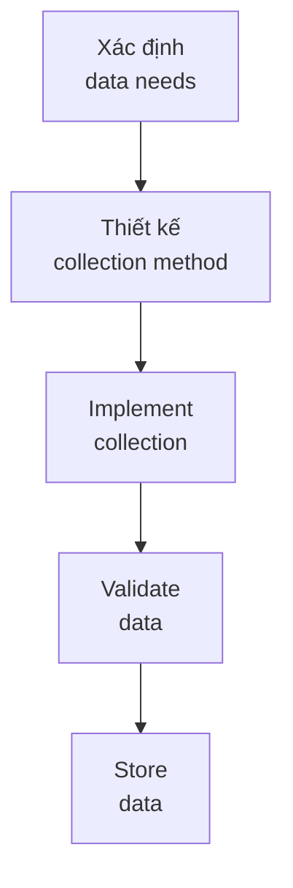
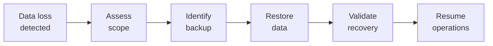

# SOP-01.1: THU THẬP VÀ LƯU TRỮ DỮ LIỆU

## 1. MỤC ĐÍCH
Quy định quy trình thu thập và lưu trữ dữ liệu, đảm bảo:
- Dữ liệu được thu thập đầy đủ và chính xác
- Lưu trữ an toàn và có tổ chức
- Dễ dàng truy xuất khi cần
- Tuân thủ quy định
- Tối ưu chi phí lưu trữ

## 2. QUY TRÌNH THU THẬP

### 2.1. Data collection planning


### 2.2. Collection methods
```
1. Automated collection:
   - System-generated (logs, transactions)
   - Sensors và IoT
   - API integrations
   - Web scraping (nếu legal)

2. Manual entry:
   - Forms và applications
   - Surveys
   - Assessments
   - Reports

3. Import:
   - File uploads (CSV, Excel)
   - Data migration
   - Third-party data
```

### 2.3. Data entry standards
```
Requirements:
✅ Standardized formats
✅ Validation rules
✅ Mandatory fields
✅ Consistent naming
✅ Timestamps
✅ User attribution

Quality checks:
- Real-time validation
- Range checks
- Format checks
- Duplicate detection
```

## 3. STORAGE ARCHITECTURE

### 3.1. Storage tiers
```
Tier 1 - Hot storage:
- Dữ liệu đang sử dụng (current year)
- High performance
- Truy cập nhanh
- Chi phí cao

Tier 2 - Warm storage:
- Dữ liệu gần đây (1-3 năm)
- Medium performance
- Occasional access
- Chi phí trung bình

Tier 3 - Cold storage:
- Dữ liệu cũ (>3 năm)
- Archive
- Rare access
- Chi phí thấp
```

### 3.2. Storage locations
```
On-premise:
- Critical systems
- Sensitive data
- Low latency needs

Cloud:
- Scalable storage
- Disaster recovery
- Collaboration data

Hybrid:
- Best of both
- Flexibility
- Cost optimization
```

## 4. DATA ORGANIZATION

### 4.1. Database structure
```
Databases by function:
├─ Student Information System (SIS)
├─ Learning Management System (LMS)
├─ Human Resources (HR)
├─ Finance (ERP)
├─ CRM
└─ Data Warehouse (consolidated)
```

### 4.2. Naming conventions
```
Tables: [Domain]_[Entity]_[Type]
VD: Student_Profile_Master

Fields: [Entity]_[Attribute]_[Type]
VD: Student_FirstName_Text

Files: [YYYY-MM-DD]_[Category]_[Description]
VD: 2024-09-15_Enrollment_Report
```

## 5. BACKUP VÀ RECOVERY

### 5.1. Backup strategy
```
3-2-1 Rule:
- 3 copies of data
- 2 different media types
- 1 off-site backup

Frequency:
- Critical data: Real-time replication
- Important data: Daily backup
- Standard data: Weekly backup
- Archives: Monthly backup
```

### 5.2. Recovery procedures


**Recovery Time Objective (RTO)**:
```
Critical systems: ≤ 4 giờ
Important systems: ≤ 24 giờ
Standard systems: ≤ 3 ngày
```

**Recovery Point Objective (RPO)**:
```
Critical data: ≤ 1 giờ (data loss acceptable)
Important data: ≤ 24 giờ
Standard data: ≤ 1 tuần
```

## 6. DATA RETENTION

### 6.1. Retention schedule
```
Data type | Retention | Location | Destruction
----------|-----------|----------|-------------
Student records | 10 năm | Archive | Shred
Financial | 7 năm | Archive | Secure delete
HR records | 5 năm | Archive | Shred
Communications | 1 năm | Active | Delete
Logs | 90 ngày | Active | Auto-delete
```

### 6.2. Archiving process
```
Triggers:
- End of retention period
- System migration
- Legal requirements

Process:
1. Identify data to archive
2. Validate completeness
3. Transfer to archive
4. Verify transfer
5. Delete from active
6. Document archiving
```

## 7. CÔNG CỤ VÀ HỆ THỐNG

### 7.1. Database systems
```
- Relational: MySQL, PostgreSQL, SQL Server
- NoSQL: MongoDB (nếu cần)
- Data warehouse: Snowflake, BigQuery
```

### 7.2. Storage solutions
```
- File storage: NAS, SAN
- Cloud storage: AWS S3, Azure Blob
- Backup: Veeam, Acronis
```

### 7.3. Data tools
```
- ETL: Talend, Informatica
- Data quality: Trifacta, Talend
- Master data: Informatica MDM
```

## 8. CHỈ SỐ ĐÁNH GIÁ

```
Collection:
- Data completeness: ≥ 95%
- Entry errors: ≤ 2%
- Timeliness: ≥ 95% on time

Storage:
- Storage utilization: 70-85%
- Backup success rate: ≥ 99%
- Recovery test success: 100%

Performance:
- Query response time: ≤ 3 seconds
- System availability: ≥ 99.5%
- User satisfaction: ≥ 4.0/5.0
```

---

**Ngày ban hành**: 01/01/2024  
**Người phê duyệt**: Ban Giám hiệu  
**Người soạn thảo**: Phòng IT  
**Ngày xem xét lại**: 01/01/2025