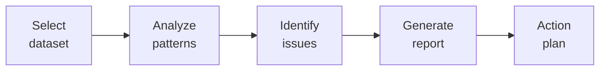

# SOP-01.2: QUẢN LÝ CHẤT LƯỢNG DỮ LIỆU

## 1. MỤC ĐÍCH
Quy định quy trình đảm bảo và cải thiện chất lượng dữ liệu, đảm bảo:
- Dữ liệu chính xác và đáng tin cậy
- Phát hiện và sửa lỗi kịp thời
- Ngăn ngừa vấn đề chất lượng
- Cải tiến liên tục
- Tin cậy cho quyết định

## 2. DATA QUALITY DIMENSIONS

### 2.1. 6 Dimensions
```
1. Accuracy (Chính xác):
   - Dữ liệu đúng với thực tế
   - Không có lỗi
   - Target: ≥ 98%

2. Completeness (Đầy đủ):
   - Tất cả fields cần thiết có data
   - Không missing values
   - Target: ≥ 95%

3. Consistency (Nhất quán):
   - Đồng nhất across systems
   - Không mâu thuẫn
   - Target: ≥ 97%

4. Timeliness (Kịp thời):
   - Cập nhật đúng lúc
   - Fresh data
   - Target: ≥ 95%

5. Validity (Hợp lệ):
   - Đúng format và rules
   - Trong range cho phép
   - Target: ≥ 99%

6. Uniqueness (Duy nhất):
   - Không duplicate
   - Một entity một record
   - Target: ≥ 99%
```

## 3. QUY TRÌNH QUẢN LÝ CHẤT LƯỢNG

### 3.1. Data profiling (Định kỳ)


**Frequency**: Monthly cho critical data

**Metrics**:
```
- Null values: [X%]
- Duplicates: [Y records]
- Outliers: [Z records]
- Format violations: [W records]
- Inconsistencies: [V records]
```

### 3.2. Data validation rules
```
Field-level rules:
- Format: Email phải có @
- Range: Age 3-18
- List: Grade trong [PK, K, 1-12]
- Required: First name không null

Record-level rules:
- Business rules: Enrollment date ≤ Start date
- Cross-field: If Grade=12 then Age≥17

Dataset-level rules:
- Uniqueness: Student ID unique
- Referential integrity: Class ID exists trong Classes table
```

### 3.3. Data cleansing
```
Process:
1. Identify issues (profiling)
2. Prioritize (impact)
3. Design fixes
4. Test fixes
5. Apply fixes
6. Validate results
7. Document changes
```

**Common issues và fixes**:
```
Issue: Duplicate records
Fix: Merge duplicates, keep best record

Issue: Missing values
Fix: Impute (nếu có thể) hoặc mark as unknown

Issue: Inconsistent formats
Fix: Standardize (VD: phone numbers)

Issue: Outdated data
Fix: Refresh from source

Issue: Invalid values
Fix: Correct hoặc remove
```

### 3.4. Ongoing monitoring
```
Automated checks:
- Daily: Critical data
- Weekly: Important data
- Monthly: All data

Alerts:
- Quality drops below threshold
- Anomalies detected
- Validation failures spike
```

## 4. DATA QUALITY METRICS

### 4.1. Scorecard
```
DATA QUALITY SCORECARD

Dimension | Target | Actual | Status
----------|--------|--------|--------
Accuracy | 98% | [X%] | [🟢/🟡/🔴]
Completeness | 95% | [Y%] | [🟢/🟡/🔴]
Consistency | 97% | [Z%] | [🟢/🟡/🔴]
Timeliness | 95% | [W%] | [🟢/🟡/🔴]
Validity | 99% | [V%] | [🟢/🟡/🔴]
Uniqueness | 99% | [U%] | [🟢/🟡/🔴]

OVERALL SCORE: [XX%]

Status:
🟢 Green: ≥ Target
🟡 Yellow: Target -5%
🔴 Red: < Target -5%
```

### 4.2. Reporting
```
Weekly: Dashboard update
Monthly: Quality report
Quarterly: Comprehensive review
Annual: Trend analysis
```

## 5. ROLES VÀ TRÁCH NHIỆM

### 5.1. Data Stewards
```
- Define quality standards
- Monitor quality
- Approve cleansing
- Report issues
- Drive improvements
```

### 5.2. Data Custodians (IT)
```
- Implement validation rules
- Run profiling jobs
- Execute cleansing
- Maintain tools
- Technical support
```

### 5.3. Data Users
```
- Follow entry standards
- Report quality issues
- Validate outputs
- Provide feedback
```

## 6. CÔNG CỤ

### 6.1. Data quality tools
```
- Profiling: Talend, Informatica
- Validation: Custom scripts, SQL
- Cleansing: OpenRefine, Trifacta
- Monitoring: Dashboards, alerts
```

### 6.2. Templates
```
- Data quality report
- Issue log
- Cleansing plan
- Validation rules document
```

## 7. CHỈ SỐ ĐÁNH GIÁ

```
Quality:
- Overall DQ score: ≥ 96%
- Critical data: ≥ 98%
- Trend: Improving

Process:
- Issues identified: 100%
- Issues resolved: ≥ 90% trong 1 tuần
- Preventive actions: ≥ 80%

Impact:
- Bad decisions due to data: 0
- Data-related incidents: ≤ 5/năm
- User trust: ≥ 4.0/5.0
```

---

**Ngày ban hành**: 01/01/2024  
**Người phê duyệt**: Ban Giám hiệu  
**Người soạn thảo**: Phòng IT  
**Ngày xem xét lại**: 01/01/2025


