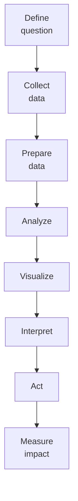

# SOP-01.3: PHÂN TÍCH VÀ KHAI THÁC DỮ LIỆU

## 1. MỤC ĐÍCH
Quy định quy trình phân tích và khai thác giá trị từ dữ liệu, đảm bảo:
- Insights hữu ích cho quyết định
- Dữ liệu được sử dụng hiệu quả
- Phát hiện patterns và trends
- Dự báo và tối ưu hóa
- Tạo lợi thế cạnh tranh

## 2. ANALYTICS FRAMEWORK

### 2.1. Các cấp độ analytics


### 2.2. Use cases
```
Academic:
- Student performance analysis
- Learning gap identification
- Intervention effectiveness
- Curriculum optimization

Operations:
- Attendance patterns
- Resource utilization
- Process efficiency
- Cost optimization

Marketing:
- Enrollment forecasting
- Campaign effectiveness
- Parent satisfaction drivers
- Churn prediction

HR:
- Teacher performance
- Retention analysis
- Workload balancing
- Recruitment optimization
```

## 3. QUY TRÌNH PHÂN TÍCH

### 3.1. Analytics project lifecycle


### 3.2. Reporting và dashboards

#### 3.2.1. Standard reports
```
Daily:
- Attendance report
- Incident log
- System health

Weekly:
- Academic progress
- Enrollment pipeline
- Financial summary

Monthly:
- Performance dashboard
- KPI scorecard
- Trend analysis

Quarterly:
- Comprehensive review
- Strategic insights
- Board report
```

#### 3.2.2. Dashboard design
```
Principles:
✅ Clear và concise
✅ Actionable insights
✅ Visual (charts, graphs)
✅ Real-time (nếu có thể)
✅ Drill-down capability
✅ Mobile-friendly

Components:
- KPIs (top metrics)
- Trends (time series)
- Comparisons (vs. target, vs. last year)
- Alerts (red flags)
- Actions (what to do)
```

### 3.3. Advanced analytics

#### 3.3.1. Predictive modeling
```
Applications:
- Enrollment forecasting
- Student risk prediction (dropout, failure)
- Teacher turnover prediction
- Budget forecasting
- Demand planning

Methods:
- Regression
- Time series
- Machine learning
- Ensemble models
```

#### 3.3.2. Segmentation
```
Segment:
- Students (by performance, needs, interests)
- Parents (by engagement, satisfaction)
- Teachers (by performance, potential)
- Prospects (by likelihood to enroll)

Use:
- Personalization
- Targeted interventions
- Resource allocation
- Marketing
```

## 4. SELF-SERVICE ANALYTICS

### 4.1. Empowerment
```
Enable users to:
- Access data (với permissions)
- Create reports
- Build dashboards
- Explore data
- Share insights
```

### 4.2. Tools
```
- Power BI
- Tableau
- Google Data Studio
- Excel (advanced)
```

### 4.3. Training
```
Levels:
- Basic: All staff (4 giờ)
- Intermediate: Managers (8 giờ)
- Advanced: Analysts (20 giờ)
```

## 5. DATA SCIENCE TEAM

### 5.1. Roles
```
Data Analyst:
- Descriptive analytics
- Reports và dashboards
- Ad-hoc analysis

Data Scientist:
- Predictive modeling
- Machine learning
- Advanced analytics

Data Engineer:
- Data pipelines
- Infrastructure
- Performance optimization
```

### 5.2. Project management
```
Process:
1. Intake request
2. Scope và prioritize
3. Assign resources
4. Execute project
5. Deliver insights
6. Measure impact
```

## 6. CÔNG CỤ VÀ TEMPLATE

### 6.1. Analysis tools
```
- SQL (queries)
- Python/R (advanced analytics)
- Excel (basic analysis)
- BI tools (visualization)
```

### 6.2. Templates
```
- Analysis request form
- Dashboard template
- Report template
- Insights presentation
```

## 7. CHỈ SỐ ĐÁNH GIÁ

```
Usage:
- Reports generated: ≥ 50/tháng
- Dashboard users: ≥ 80% managers
- Self-service adoption: ≥ 60%

Quality:
- Insights actionable: ≥ 80%
- Accuracy: ≥ 95%
- Timeliness: ≥ 90%

Impact:
- Data-driven decisions: ≥ 75%
- ROI from analytics: Positive
- User satisfaction: ≥ 4.2/5.0
```

---

**Ngày ban hành**: 01/01/2024  
**Người phê duyệt**: Ban Giám hiệu  
**Người soạn thảo**: Phòng IT  
**Ngày xem xét lại**: 01/01/2025


