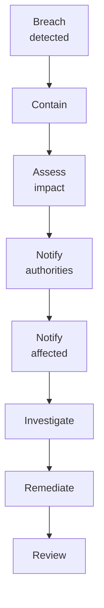

# SOP-01.4: BẢO MẬT VÀ QUYỀN RIÊNG TƯ

## 1. MỤC ĐÍCH
Quy định quy trình bảo vệ dữ liệu và quyền riêng tư, đảm bảo:
- Dữ liệu được bảo mật
- Quyền riêng tư được tôn trọng
- Tuân thủ luật bảo vệ dữ liệu
- Ngăn chặn truy cập trái phép
- Xử lý vi phạm hiệu quả

## 2. DATA CLASSIFICATION

### 2.1. Classification scheme
```
Level 4 - Restricted (Hạn chế cao):
- Student health records
- Financial account details
- Passwords và credentials
- Legal documents

Level 3 - Confidential (Bí mật):
- Student academic records
- HR records
- Contracts
- Strategic plans

Level 2 - Internal (Nội bộ):
- Policies và procedures
- Internal communications
- Operational data

Level 1 - Public (Công khai):
- Marketing materials
- Public announcements
- General information
```

### 2.2. Handling requirements
```
Level | Encryption | Access | Storage | Transmission
------|------------|--------|---------|-------------
4 | AES-256 | MFA required | Secure servers | Encrypted channel
3 | AES-128 | Password + approval | Protected | HTTPS/VPN
2 | Optional | Password | Standard | HTTPS
1 | No | None | Any | Any
```

## 3. PRIVACY PROTECTION

### 3.1. Privacy principles
```
1. Consent (Đồng ý):
   - Thu thập với consent
   - Clear purpose
   - Opt-in/opt-out

2. Minimization (Tối thiểu):
   - Chỉ thu thập cần thiết
   - Không excessive
   - Delete khi không cần

3. Purpose limitation (Mục đích rõ):
   - Dùng đúng mục đích
   - Không repurpose without consent

4. Accuracy (Chính xác):
   - Dữ liệu đúng
   - Cập nhật thường xuyên
   - Sửa lỗi khi phát hiện

5. Security (Bảo mật):
   - Bảo vệ khỏi unauthorized access
   - Technical và organizational measures

6. Accountability (Trách nhiệm):
   - Chịu trách nhiệm
   - Demonstrate compliance
   - Transparent
```

### 3.2. Consent management
```
Process:
1. Inform về data collection
2. Explain purposes
3. Obtain consent (written)
4. Record consent
5. Honor opt-outs
6. Renew consent (định kỳ)
```

**Consent form elements**:
```
□ What data collected
□ How used
□ Who has access
□ How long kept
□ Rights (access, correct, delete)
□ Contact for questions
□ Signature và date
```

### 3.3. Data subject rights
```
Rights:
1. Right to access (Quyền truy cập)
2. Right to rectification (Quyền sửa)
3. Right to erasure (Quyền xóa)
4. Right to restrict (Quyền hạn chế)
5. Right to portability (Quyền chuyển)
6. Right to object (Quyền phản đối)

Response time: ≤ 30 ngày
```

## 4. SECURITY MEASURES

### 4.1. Access controls
```
- Authentication (xác thực)
- Authorization (phân quyền)
- Audit trails (nhật ký)
- Least privilege (tối thiểu cần thiết)
- Separation of duties (phân tách nhiệm vụ)
```

### 4.2. Encryption
```
At rest:
- Database encryption
- File encryption
- Disk encryption

In transit:
- HTTPS/TLS
- VPN
- Secure email

In use:
- Masked data
- Tokenization
- Secure enclaves
```

### 4.3. Data masking
```
Techniques:
- Redaction (che đi)
- Substitution (thay thế)
- Shuffling (xáo trộn)
- Anonymization (ẩn danh)
- Pseudonymization (giả danh)

Use cases:
- Testing environments
- Analytics (non-sensitive)
- Third-party sharing
- Public reporting
```

## 5. INCIDENT RESPONSE

### 5.1. Data breach response


**Timeline**:
```
0-1h: Detect và contain
1-24h: Assess impact
24-72h: Notify (nếu required)
1-2 tuần: Investigate
2-4 tuần: Remediate
1 tháng: Review và improve
```

### 5.2. Notification requirements
```
Notify authorities (within 72h) if:
- Large scale breach
- Sensitive data
- High risk to individuals

Notify affected individuals if:
- High risk to rights và freedoms
- Personal data compromised
- Identity theft risk
```

## 6. COMPLIANCE

### 6.1. Applicable laws
```
Vietnam:
- Luật An toàn thông tin mạng
- Nghị định 13/2023 về bảo vệ dữ liệu cá nhân
- Thông tư hướng dẫn

International (nếu có students/staff nước ngoài):
- GDPR (EU)
- COPPA (US - children)
- Other jurisdictions
```

### 6.2. Compliance activities
```
- Privacy impact assessments
- Data protection audits
- Policy updates
- Training
- Documentation
- Reporting
```

## 7. CÔNG CỤ VÀ TEMPLATE

### 7.1. Privacy tools
```
- Consent management platform
- Privacy request portal
- Data mapping tool
- Compliance checklist
```

### 7.2. Security tools
```
- Encryption software
- Data masking tools
- Access management system
- Monitoring tools
```

### 7.3. Templates
```
- Privacy notice
- Consent form
- Data processing agreement
- Breach notification
```

## 8. CHỈ SỐ ĐÁNH GIÁ

```
Security:
- Data breaches: 0
- Unauthorized access: 0
- Encryption coverage: 100% (restricted data)

Privacy:
- Consent rate: 100%
- Privacy requests handled: 100%
- Response time: ≤ 30 ngày

Compliance:
- Violations: 0
- Audit findings: ≤ 5 minor
- Training completion: 100%
```

---

**Ngày ban hành**: 01/01/2024  
**Người phê duyệt**: Ban Giám hiệu  
**Người soạn thảo**: Phòng IT & Pháp chế  
**Ngày xem xét lại**: 01/01/2025


