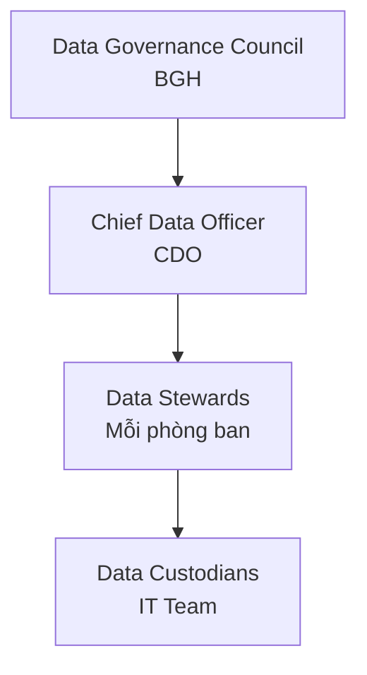
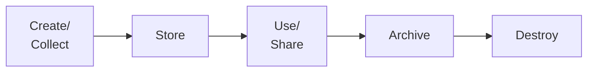

# SOP-01: QUẢN TRỊ DỮ LIỆU

## 1. MỤC ĐÍCH
Thiết lập framework quản trị dữ liệu toàn diện, đảm bảo:
- Dữ liệu chính xác, đầy đủ và kịp thời
- Bảo mật và quyền riêng tư
- Tuân thủ quy định pháp luật
- Khai thác giá trị từ dữ liệu
- Quản lý như tài sản chiến lược

## 2. PHẠM VI ÁP DỤNG
- Phòng IT (quản lý hệ thống)
- Tất cả phòng ban (tạo và sử dụng dữ liệu)
- Data governance team
- Ban Giám hiệu (oversight)

## 3. DATA GOVERNANCE FRAMEWORK

### 3.1. Cơ cấu quản trị


### 3.2. Roles và responsibilities
```
Data Governance Council:
- Approve data strategy
- Set policies
- Resolve conflicts
- Oversee compliance

Chief Data Officer:
- Lead data governance
- Manage data quality
- Drive data initiatives
- Report to Council

Data Stewards:
- Own data trong domain
- Ensure quality
- Define standards
- Support users

Data Custodians:
- Implement technical controls
- Maintain systems
- Backup và recovery
- Security
```

## 4. CÁC QUY TRÌNH CON

### 4.1. Thu thập và lưu trữ dữ liệu
**Chi tiết**: [SOP-01.1_Thu_thap_va_luu_tru_du_lieu.md](./SOP-01.1_Thu_thap_va_luu_tru_du_lieu.md)

**Hoạt động**:
```
- Data collection standards
- Data entry procedures
- Storage architecture
- Backup và archiving
```

### 4.2. Quản lý chất lượng dữ liệu
**Chi tiết**: [SOP-01.2_Quan_ly_chat_luong_du_lieu.md](./SOP-01.2_Quan_ly_chat_luong_du_lieu.md)

**Hoạt động**:
```
- Data quality dimensions
- Validation rules
- Cleansing procedures
- Quality monitoring
```

### 4.3. Phân tích và khai thác dữ liệu
**Chi tiết**: [SOP-01.3_Phan_tich_va_khai_thac_du_lieu.md](./SOP-01.3_Phan_tich_va_khai_thac_du_lieu.md)

**Hoạt động**:
```
- Analytics framework
- Reporting và dashboards
- Data mining
- Predictive analytics
```

### 4.4. Bảo mật và quyền riêng tư
**Chi tiết**: [SOP-01.4_Bao_mat_va_quyen_rieng_tu.md](./SOP-01.4_Bao_mat_va_quyen_rieng_tu.md)

**Hoạt động**:
```
- Data classification
- Access controls
- Encryption
- Privacy protection
```

### 4.5. Tuân thủ quy định dữ liệu
**Chi tiết**: [SOP-01.5_Tuan_thu_quy_dinh_du_lieu.md](./SOP-01.5_Tuan_thu_quy_dinh_du_lieu.md)

**Hoạt động**:
```
- Compliance requirements
- Data retention policies
- Audit trails
- Regulatory reporting
```

## 5. DATA LIFECYCLE

### 5.1. Các giai đoạn


### 5.2. Policies cho từng giai đoạn
```
Create/Collect:
- Standards và formats
- Consent requirements
- Quality checks

Store:
- Storage locations
- Backup frequency
- Security measures

Use/Share:
- Access permissions
- Sharing protocols
- Usage monitoring

Archive:
- Retention periods
- Archive systems
- Retrieval procedures

Destroy:
- Destruction methods
- Approvals
- Documentation
```

## 6. DATA CATEGORIES

### 6.1. Phân loại theo sensitivity
```
Public Data:
- Không nhạy cảm
- Có thể share công khai
- VD: School info, programs

Internal Data:
- Chỉ dùng nội bộ
- Không share ra ngoài
- VD: Policies, procedures

Confidential Data:
- Nhạy cảm
- Restricted access
- VD: Financial data, HR records

Restricted Data:
- Rất nhạy cảm
- Highly restricted
- VD: Student records, health info
```

### 6.2. Handling requirements
```
Category | Encryption | Access | Sharing | Retention
---------|------------|--------|---------|----------
Public | No | All | Yes | 1 năm
Internal | Optional | Staff | Internal only | 3 năm
Confidential | Yes | Need-to-know | Approval | 5 năm
Restricted | Yes | Minimal | Strict approval | 7-10 năm
```

## 7. CHỈ SỐ ĐÁNH GIÁ

### 7.1. Data quality
```
- Accuracy: ≥ 98%
- Completeness: ≥ 95%
- Consistency: ≥ 97%
- Timeliness: ≥ 95%
```

### 7.2. Data security
```
- Breaches: 0
- Unauthorized access: 0
- Compliance violations: 0
- Audit findings: ≤ 5 minor/năm
```

### 7.3. Data utilization
```
- Reports generated: ≥ 50/tháng
- Data-driven decisions: ≥ 80%
- User satisfaction: ≥ 4.0/5.0
- ROI from analytics: Positive
```

## 8. NGÂN SÁCH

```
Annual data management budget:
├─ Data storage: 50-100 triệu VNĐ
├─ Data tools: 100-200 triệu VNĐ
├─ Data staff: 200-400 triệu VNĐ
├─ Training: 20-40 triệu VNĐ
├─ Compliance: 30-50 triệu VNĐ
└─ Consulting: 50-100 triệu VNĐ
---
Tổng: 450-890 triệu VNĐ/năm
```

---

**Ngày ban hành**: 01/01/2024  
**Người phê duyệt**: Ban Giám hiệu  
**Người soạn thảo**: Phòng IT  
**Ngày xem xét lại**: 01/01/2025
