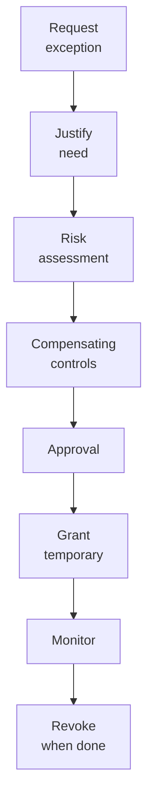

# SOP-02.1: THIẾT LẬP CHÍNH SÁCH PHÂN QUYỀN

## 1. MỤC ĐÍCH
Quy định quy trình thiết lập chính sách và ma trận phân quyền, đảm bảo:
- Roles và permissions được định nghĩa rõ ràng
- Phù hợp với cấu trúc tổ chức
- Cân bằng giữa security và usability
- Tuân thủ nguyên tắc bảo mật
- Dễ dàng quản lý và mở rộng

## 2. QUY TRÌNH THIẾT LẬP

### 2.1. Bước 1: Phân tích yêu cầu (2-3 tuần)

#### 2.1.1. Inventory systems và data
```
Liệt kê:
1. Hệ thống:
   - Student Information System (SIS)
   - Learning Management System (LMS)
   - HR Management System (HRM)
   - Finance System (ERP)
   - CRM
   - Email và Office 365
   - File servers
   - Specialized applications

2. Data categories:
   - Student data (academic, personal, health)
   - Staff data (HR, payroll, performance)
   - Financial data (accounting, budget)
   - Operational data (attendance, facilities)
```

#### 2.1.2. Identify user groups
```
Phân nhóm theo:
1. Job function:
   - Teachers
   - Admin staff
   - IT staff
   - Management
   - Support staff

2. Department:
   - Academic
   - Finance
   - HR
   - Marketing
   - Operations

3. Level:
   - Executive
   - Manager
   - Staff
   - Contractor
```

#### 2.1.3. Analyze access needs
**Phương pháp**:
```
1. Job analysis:
   - Review job descriptions
   - Interview incumbents
   - Observe workflows
   - Document requirements

2. Data flow mapping:
   - Who creates data?
   - Who uses data?
   - Who approves data?
   - Who reports data?

3. Compliance requirements:
   - Legal obligations
   - Industry standards
   - Contractual requirements
```

### 2.2. Bước 2: Define roles (2 tuần)

#### 2.2.1. Role definition template
```
ROLE: [Tên role]

Description: [Mô tả vai trò]

Job titles included:
- [Title 1]
- [Title 2]

Systems access:
- [System 1]: [Permission level]
- [System 2]: [Permission level]

Data access:
- [Data category 1]: [Read/Write/Delete]
- [Data category 2]: [Read/Write/Delete]

Restrictions:
- [Restriction 1]
- [Restriction 2]

Approval required from: [Role/Person]
Review frequency: [Quarterly/Annual]
```

#### 2.2.2. Standard roles
```
ROLE: Teacher
Systems: LMS (full), SIS (limited), Email
Data access:
- Own classes: Read/Write
- Own students: Read/Write (academic only)
- Other classes: Read only
- School-wide: Read only (announcements)

ROLE: Department Head
Systems: LMS, SIS, HRM (limited), Reports
Data access:
- Department data: Read/Write
- Department staff: Read/Write (performance)
- Cross-department: Read only
- Financial: Read (department budget)

ROLE: Finance Staff
Systems: ERP, SIS (limited), Reports
Data access:
- Financial data: Read/Write
- Student billing: Read/Write
- HR payroll: Read/Write
- Academic data: Read only (for billing)

[Định nghĩa cho tất cả roles...]
```

### 2.3. Bước 3: Build access matrix (1-2 tuần)

#### 2.3.1. System-level matrix
```
System | Super Admin | Dept Head | Manager | Staff | Student | Parent
-------|-------------|-----------|---------|-------|---------|-------
SIS | Full | Dept | Team | Own | Read own | Read child
LMS | Full | Dept | Team | Own classes | Full | Read child
HRM | Full | Limited | Team | Own | No | No
ERP | Full | Budget | No | No | No | No
CRM | Full | Full | Team | Limited | No | No
```

#### 2.3.2. Data-level matrix
```
Data type | Create | Read | Update | Delete | Export
----------|--------|------|--------|--------|-------
Student academic | Teacher | Teacher, Parent | Teacher, Admin | Admin only | Admin only
Student personal | Admin | Admin, Teacher | Admin | Admin | No
Student health | Nurse | Nurse, Admin | Nurse | Admin | No
Financial | Finance | Finance, Admin | Finance | CFO only | CFO only
HR records | HR | HR, Manager | HR | HR Director | No
```

#### 2.3.3. Function-level matrix
```
Function | Role A | Role B | Role C
---------|--------|--------|--------
View reports | ✅ | ✅ | ⚠️ Limited
Create users | ✅ | ❌ | ❌
Approve payments | ✅ | ⚠️ <100M | ❌
Grade students | ⚠️ Own | ✅ | ❌
Export data | ⚠️ Approved | ❌ | ❌
```

### 2.4. Bước 4: Implement technical controls (3-4 tuần)

#### 2.4.1. Configure systems
```
For each system:
1. Create roles trong system
2. Assign permissions
3. Test access
4. Document configuration
5. Train administrators
```

#### 2.4.2. Integration
```
Implement:
- Single Sign-On (SSO)
- Centralized user management (Active Directory, LDAP)
- Automated provisioning
- Role synchronization
```

### 2.5. Bước 5: Document và communicate (1 tuần)

#### 2.5.1. Policy document
```
ACCESS CONTROL POLICY (20-30 trang)

1. Purpose và scope
2. Principles
3. Roles và responsibilities
4. Role definitions
5. Access matrix
6. Request process
7. Review process
8. Violations và consequences
9. Exceptions process
10. Appendices
```

#### 2.5.2. User guides
```
For each user type:
- What systems you have access to
- What you can do
- What you cannot do
- How to request additional access
- Who to contact for help
```

#### 2.5.3. Training
```
All users (1 giờ):
- Policy overview
- Your access rights
- Responsibilities
- Dos and don'ts

Managers (2 giờ):
- Approval responsibilities
- Review process
- Handling requests

IT staff (4 giờ):
- Technical implementation
- Provisioning procedures
- Troubleshooting
- Audit và monitoring
```

## 6. EXCEPTION MANAGEMENT

### 6.1. Khi nào cần exception
```
Situations:
- Emergency access needed
- Temporary project needs
- Unique job requirements
- System limitations
```

### 6.2. Exception process


### 6.3. Exception tracking
```
Log:
- Who requested
- What exception
- Why needed
- Approved by
- Start date
- End date
- Compensating controls
- Review date
```

## 7. CÔNG CỤ VÀ TEMPLATE

### 7.1. Design tools
```
- Role definition template
- Access matrix template
- Data flow diagram tool
- Risk assessment matrix
```

### 7.2. Implementation tools
```
- Identity and Access Management (IAM) system
- Active Directory
- SSO solution
- Provisioning automation
```

### 7.3. Documentation templates
```
- Policy document template
- User guide template
- Training materials
- Exception request form
```

## 8. CHỈ SỐ ĐÁNH GIÁ

```
Design quality:
- Roles defined: 100%
- Matrix completeness: 100%
- Conflicts identified: 100%

Implementation:
- Systems configured: 100%
- Testing passed: 100%
- Documentation complete: 100%

Effectiveness:
- Access requests processed: ≥ 95% within SLA
- Inappropriate access: 0
- User satisfaction: ≥ 4.0/5.0
```

---

**Ngày ban hành**: 01/01/2024  
**Người phê duyệt**: Ban Giám hiệu  
**Người soạn thảo**: Phòng IT  
**Ngày xem xét lại**: 01/01/2025


