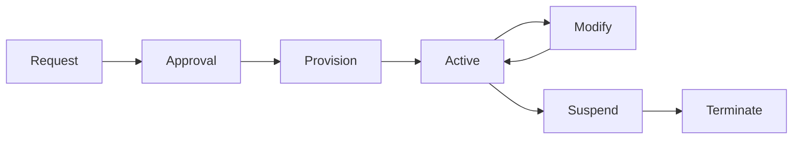
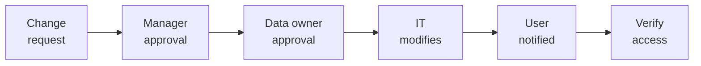

# SOP-02.2: QUẢN LÝ TÀI KHOẢN NGƯỜI DÙNG

## 1. MỤC ĐÍCH
Quy định quy trình quản lý vòng đời tài khoản người dùng, đảm bảo:
- Tạo tài khoản đúng quy trình
- Thay đổi quyền kịp thời
- Vô hiệu hóa khi nghỉ việc
- Không có tài khoản mồ côi
- Audit trail đầy đủ

## 2. ACCOUNT LIFECYCLE

### 2.1. Vòng đời tài khoản


### 2.2. Các giai đoạn
```
1. Request: User hoặc manager yêu cầu
2. Approval: Phê duyệt theo workflow
3. Provision: IT tạo tài khoản
4. Active: Đang sử dụng
5. Modify: Thay đổi quyền (nếu cần)
6. Suspend: Tạm khóa (nghỉ dài hạn)
7. Terminate: Xóa vĩnh viễn
```

## 3. QUY TRÌNH TẠO TÀI KHOẢN

### 3.1. Nhân viên mới

#### 3.1.1. Trigger
```
HR onboarding process:
- Offer letter signed
- Start date confirmed
- HR submits access request
- Timeline: 3-5 ngày trước start date
```

#### 3.1.2. Quy trình
```
Day -3: HR submits request
├─ Employee info
├─ Department
├─ Job title
├─ Manager
├─ Start date
└─ Required systems

Day -2: Approvals
├─ Manager approves
└─ IT reviews

Day -1: Provisioning
├─ Create accounts
├─ Assign roles
├─ Setup email
├─ Prepare equipment
└─ Test access

Day 1: Handover
├─ Provide credentials (sealed envelope)
├─ Initial login assistance
├─ Verify access
└─ Document completion
```

#### 3.1.3. Account details
```
Username format: [firstname].[lastname]@[domain]
VD: nguyen.van.a@abcschool.edu.vn

Email: Same as username

Initial password:
- Temporary, complex
- Must change on first login
- Sent securely (không qua email)

Systems provisioned:
- Email và calendar
- File storage
- LMS/SIS (theo role)
- Other systems (theo job)
```

### 3.2. Học sinh mới

#### 3.2.1. Trigger
```
Enrollment process:
- Enrollment confirmed
- Tuition paid
- Class assigned
- Timeline: 1 tuần trước start date
```

#### 3.2.2. Bulk provisioning
```
For new academic year:
1. Export student list từ SIS
2. Generate usernames
3. Create accounts (batch)
4. Assign to classes
5. Generate credentials
6. Distribute (sealed envelopes)
```

#### 3.2.3. Student account details
```
Username format: [student_id]@student.[domain]
VD: 2024001@student.abcschool.edu.vn

Password:
- Initial: Date of birth (DDMMYYYY)
- Must change on first login
- Parent can reset

Access:
- LMS (own classes)
- Student portal
- Library system
- Email (Grade 6+)
```

### 3.3. Phụ huynh

#### 3.3.1. Self-registration
```
Process:
1. Parent visits portal
2. Enter student ID + verification info
3. System validates
4. Create account
5. Email verification
6. Set password
7. Access granted
```

#### 3.3.2. Parent account details
```
Username: Email address
Access: 
- Student portal (own children only)
- Communications
- Payments
- Reports
```

## 4. THAY ĐỔI TÀI KHOẢN

### 4.1. Change request process

#### 4.1.1. Triggers
```
- Job change (promotion, transfer)
- Department change
- Additional responsibilities
- Project assignment
- Temporary coverage
```

#### 4.1.2. Quy trình


**Timeline**: 1-2 business days

### 4.2. Password reset

#### 4.2.1. Self-service
```
Method:
1. User clicks "Forgot password"
2. Verify identity (email/SMS OTP)
3. Set new password
4. Confirm change

Available: 24/7
```

#### 4.2.2. Help desk support
```
Process:
1. User contacts help desk
2. Verify identity (security questions)
3. Reset password
4. Temporary password sent
5. User changes on login

Available: Business hours
Response time: ≤ 2 giờ
```

### 4.3. Account suspension

#### 4.3.1. Khi nào suspend
```
Situations:
- Extended leave (>1 tháng)
- Investigation (misconduct)
- Non-payment (students)
- Security concern
```

#### 4.3.2. Quy trình
```
1. Notification to IT
2. Suspend account (không delete)
3. Document reason
4. Set review date
5. Notify user (nếu appropriate)

Reactivation:
- Request from manager
- Approval
- Restore access
- Notify user
```

## 5. XÓA TÀI KHOẢN

### 5.1. Nhân viên nghỉ việc

#### 5.1.1. Immediate actions (Day 0)
```
Upon termination/resignation:

Within 1 giờ:
□ Disable all accounts
□ Revoke VPN access
□ Revoke physical access (badges)
□ Change shared passwords (nếu biết)

Within 24 giờ:
□ Collect equipment (laptop, phone, keys)
□ Forward email (to manager)
□ Transfer file ownership
□ Remove from groups/lists
```

#### 5.1.2. Data retention (30 ngày)
```
Keep for 30 ngày:
- Email (archived)
- Files (transferred to manager)
- Logs (for audit)

After 30 ngày:
- Delete email
- Delete personal files
- Anonymize logs
```

### 5.2. Học sinh rời trường

#### 5.2.1. Quy trình
```
End of enrollment:
- Suspend access (end of school year)
- Retain data (per retention policy)
- Provide data export (nếu requested)
- Delete after retention period
```

#### 5.2.2. Alumni access
```
Optional: Provide alumni accounts
- Email forwarding
- Alumni portal
- Limited access
- Lifetime (hoặc until inactive)
```

## 6. ACCOUNT HYGIENE

### 6.1. Inactive account cleanup

#### 6.1.1. Detection
```
Criteria:
- No login > 90 ngày
- No activity > 120 ngày
- Orphan accounts (no owner)
```

#### 6.1.2. Process
```
Monthly scan:
1. Identify inactive accounts
2. Notify account owner
3. Confirm still needed
4. Disable if not needed
5. Delete after 30 ngày
```

### 6.2. Duplicate detection
```
Check for:
- Same person, multiple accounts
- Similar usernames
- Same email

Resolution:
- Merge if possible
- Disable duplicates
- Keep primary only
```

## 7. SPECIAL ACCOUNTS

### 7.1. Service accounts
```
Definition: Accounts cho applications, không phải người

Management:
- Descriptive names (svc_[application])
- Strong passwords (không expire)
- Documented purpose
- Limited permissions
- Regular review

Examples:
- svc_backup
- svc_monitoring
- svc_integration
```

### 7.2. Shared accounts
```
Policy: Avoid nếu có thể

Nếu cần thiết:
- Document justification
- Approval from CIO
- Strong password
- Change khi member leaves
- Audit usage
- Review quarterly

Examples:
- admin@school.edu.vn
- info@school.edu.vn
```

### 7.3. Emergency accounts
```
Purpose: Break-glass access trong emergency

Controls:
- Sealed envelope (physical)
- Requires 2 people to open
- Immediate notification to CIO
- Audit trail
- Password change after use
- Review usage
```

## 8. AUTOMATION

### 8.1. Automated provisioning
```
Triggers:
- HR system updates
- SIS enrollment
- Workflow approvals

Actions:
- Create accounts
- Assign roles
- Send notifications
- Update directories
```

### 8.2. Automated deprovisioning
```
Triggers:
- HR termination record
- SIS graduation/withdrawal
- Scheduled suspension

Actions:
- Disable accounts
- Revoke access
- Archive data
- Notify stakeholders
```

## 9. CÔNG CỤ VÀ TEMPLATE

### 9.1. Management tools
```
- Identity Management System
- Active Directory
- Provisioning automation
- Password management
```

### 9.2. Templates
```
- Account request form
- Change request form
- Termination checklist
- User guide
```

## 10. CHỈ SỐ ĐÁNH GIÁ

```
Timeliness:
- New accounts: ≤ 1 day
- Changes: ≤ 2 days
- Terminations: ≤ 1 hour (disable)
- Password resets: ≤ 2 hours

Accuracy:
- Provisioning errors: ≤ 2%
- Orphan accounts: 0
- Inactive accounts: ≤ 5%

Security:
- Terminated accounts active: 0
- Shared accounts: ≤ 5
- Service accounts documented: 100%
```

---

**Ngày ban hành**: 01/01/2024  
**Người phê duyệt**: Ban Giám hiệu  
**Người soạn thảo**: Phòng IT  
**Ngày xem xét lại**: 01/01/2025