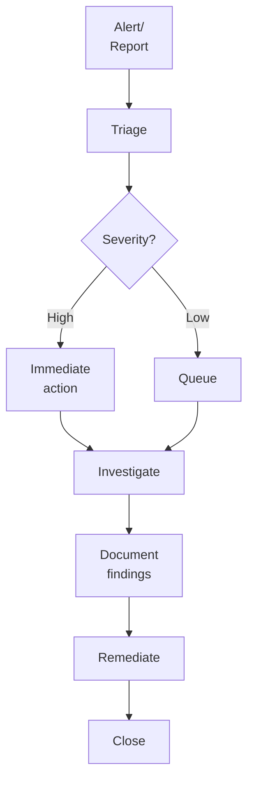

# SOP-02.4: AUDIT VÀ GIÁM SÁT

## 1. MỤC ĐÍCH
Quy định quy trình audit và giám sát truy cập hệ thống, đảm bảo:
- Phát hiện truy cập bất thường
- Điều tra sự cố hiệu quả
- Tuân thủ chính sách
- Răn đe hành vi vi phạm
- Cải tiến liên tục

## 2. LOGGING (GHI NHẬT KÝ)

### 2.1. Events cần log
```
Authentication events:
- Login attempts (success/fail)
- Logout
- Password changes
- MFA events
- Account lockouts

Authorization events:
- Permission changes
- Role assignments
- Access denials
- Privilege escalation

Data access events:
- View sensitive data
- Export data
- Delete data
- Bulk operations

Administrative events:
- Account creation/deletion
- System configuration changes
- Security setting changes
```

### 2.2. Log format
```
Standard log entry:
{
  "timestamp": "2024-01-15T10:30:45Z",
  "user_id": "nguyen.van.a",
  "user_ip": "192.168.1.100",
  "event_type": "LOGIN_SUCCESS",
  "system": "SIS",
  "details": "Logged in from Chrome",
  "risk_score": 0
}
```

### 2.3. Log management
```
Storage:
- Hot storage: 90 ngày (fast access)
- Warm storage: 1 năm (medium access)
- Cold storage: 7 năm (archive, compliance)

Protection:
- Tamper-proof (write-once)
- Encrypted
- Access restricted
- Backed up

Retention:
- Standard logs: 1 năm
- Security logs: 3 năm
- Audit logs: 7 năm
- Compliance logs: Per regulation
```

## 3. MONITORING (GIÁM SÁT)

### 3.1. Real-time monitoring

#### 3.1.1. Security Operations Center (SOC)
```
Setup:
- Monitoring dashboard (24/7)
- Alert system
- Incident response team
- Playbooks

Monitoring:
- Login activities
- Failed attempts
- Privilege usage
- Data access
- System health
```

#### 3.1.2. Alerts và thresholds
```
Alert type | Threshold | Action
-----------|-----------|--------
Failed logins | 5 trong 15 phút | Lock account, notify
Unusual time | Login ngoài giờ | Alert SOC
Unusual location | Login từ nước ngoài | Challenge, alert
Bulk export | >100 records | Alert, require approval
Admin activity | Any admin action | Log, notify
Privilege escalation | Any elevation | Alert, review
```

### 3.2. Anomaly detection

#### 3.2.1. Behavioral analytics
```
Baseline behavior:
- Typical login times
- Usual locations
- Normal data access patterns
- Standard activities

Anomalies:
- Deviation from baseline
- Risk scoring
- Automatic alerts
- Investigation triggers
```

#### 3.2.2. Machine learning
```
Models:
- Login pattern analysis
- Data access anomaly
- Insider threat detection
- Account compromise detection

Actions:
- Alert SOC
- Challenge user
- Require additional authentication
- Temporary suspension (high risk)
```

## 4. ACCESS REVIEWS

### 4.1. Periodic certification

#### 4.1.1. Quarterly review (High-risk)
```
Scope:
- Admin accounts
- Financial system access
- HR system access
- Privileged accounts

Process:
1. Generate access report
2. Send to managers
3. Managers certify (correct/incorrect)
4. IT processes changes
5. Document completion
```

#### 4.1.2. Annual review (All accounts)
```
Scope: All user accounts, all systems

Process:
1. Extract access data
2. Generate reports by manager
3. Managers review và certify
4. Escalate non-responses
5. IT implements changes
6. Report to management

Timeline: 4 tuần
```

### 4.2. Review checklist
```
For each user:
□ Account still needed?
□ Role still appropriate?
□ Permissions still required?
□ No excessive permissions?
□ Separation of duties OK?
□ Last login date reasonable?
□ Any concerns?
```

### 4.3. Remediation
```
Issues found:
- Excessive permissions → Remove
- Orphan accounts → Disable
- Inactive accounts → Suspend
- Violations → Investigate
- Conflicts → Resolve

Timeline: 2 tuần after review
```

## 5. AUDIT TRAILS

### 5.1. Audit log contents
```
Who: User ID, name, role
What: Action performed
When: Timestamp
Where: System, location, IP
Why: Context (nếu có)
Result: Success/failure
Impact: Data affected
```

### 5.2. Audit reports

#### 5.2.1. Standard reports
```
Daily:
- Failed login attempts
- After-hours access
- Admin activities
- High-risk events

Weekly:
- Access summary by user
- Permission changes
- Unusual activities

Monthly:
- Compliance report
- Trend analysis
- Top users/systems

Quarterly:
- Comprehensive audit
- Risk assessment
- Recommendations
```

#### 5.2.2. Ad-hoc reports
```
On-demand:
- User activity history
- Data access audit
- Investigation support
- Compliance evidence
```

## 6. INVESTIGATION PROCEDURES

### 6.1. Incident investigation


### 6.2. Investigation steps
```
1. Preserve evidence:
   - Copy logs
   - Screenshot
   - Document timeline

2. Analyze:
   - What happened?
   - Who involved?
   - How occurred?
   - Impact?

3. Determine cause:
   - Malicious?
   - Accidental?
   - System error?

4. Recommend actions:
   - Immediate fixes
   - Long-term improvements
   - Disciplinary (nếu cần)

5. Document:
   - Investigation report
   - Evidence
   - Actions taken
   - Lessons learned
```

## 7. COMPLIANCE AUDITS

### 7.1. Internal audit (Quarterly)
```
Scope:
- Policy compliance
- Access reviews completed
- Logs maintained
- Controls effective

Process:
1. Planning
2. Testing samples
3. Findings
4. Management response
5. Follow-up
```

### 7.2. External audit (Annual)
```
Auditors:
- Independent firm
- ISO 27001 auditors
- Regulatory auditors

Deliverables:
- Audit report
- Compliance certificate
- Recommendations
```

## 8. REPORTING VÀ DASHBOARDS

### 8.1. Access dashboard
```
REAL-TIME DASHBOARD

Active sessions: [X]
Failed logins (24h): [Y]
Alerts (open): [Z]

BY SYSTEM:
System | Users | Sessions | Alerts
-------|-------|----------|-------
SIS | [X] | [Y] | [Z]
LMS | [X] | [Y] | [Z]
[...]

BY USER TYPE:
Type | Count | Active | Alerts
-----|-------|--------|-------
Staff | [X] | [Y%] | [Z]
Students | [X] | [Y%] | [Z]
Parents | [X] | [Y%] | [Z]

TOP ALERTS:
⚠️ [Alert 1] - [Count]
⚠️ [Alert 2] - [Count]
```

### 8.2. Compliance dashboard
```
COMPLIANCE STATUS

Access reviews:
- Due this quarter: [X]
- Completed: [Y]
- Overdue: [Z]
- Completion rate: [W%]

Accounts:
- Total: [X]
- Active: [Y]
- Inactive >90 days: [Z]
- Orphan: [W]

Violations:
- This month: [X]
- This quarter: [Y]
- YTD: [Z]

Audit status: [🟢 Compliant / 🟡 Minor issues / 🔴 Major issues]
```

## 9. TOOLS VÀ TECHNOLOGIES

### 9.1. Monitoring tools
```
- SIEM (Security Information and Event Management)
  Examples: Splunk, LogRhythm, Azure Sentinel
  
- User Behavior Analytics (UBA)
  Examples: Exabeam, Securonix
  
- Access analytics
  Examples: Varonis, SailPoint
```

### 9.2. Audit tools
```
- Log management: ELK Stack, Graylog
- Compliance tools: Compliance Manager
- Reporting: Power BI, Tableau
```

## 10. TRÁCH NHIỆM

### 10.1. Security Operations Team
```
- Monitor dashboards 24/7
- Respond to alerts
- Investigate incidents
- Generate reports
- Maintain tools
```

### 10.2. IT Audit Team
```
- Conduct audits
- Review compliance
- Test controls
- Report findings
- Track remediation
```

### 10.3. Managers
```
- Complete access reviews
- Approve requests
- Report issues
- Enforce policies
```

## 11. CHỈ SỐ ĐÁNH GIÁ

### 11.1. Monitoring effectiveness
```
- Alert response time: ≤ 15 phút
- False positive rate: ≤ 20%
- Incidents detected: 100%
- Mean time to detect: ≤ 1 giờ
- Mean time to respond: ≤ 4 giờ
```

### 11.2. Audit compliance
```
- Reviews completed on time: 100%
- Audit findings: ≤ 5 minor
- Remediation completion: ≥ 95%
- Compliance score: ≥ 90%
```

### 11.3. Log management
```
- Log completeness: ≥ 99%
- Log availability: 100%
- Retention compliance: 100%
- Tamper attempts: 0
```

## 12. NGÂN SÁCH

```
Annual audit và monitoring budget:
├─ SIEM system: 100-200 triệu VNĐ
├─ UBA solution: 50-100 triệu VNĐ
├─ Log storage: 30-60 triệu VNĐ
├─ Audit tools: 20-40 triệu VNĐ
├─ SOC staff: 300-500 triệu VNĐ
└─ External audits: 50-100 triệu VNĐ
---
Tổng: 550-1000 triệu VNĐ/năm
```

---

**Ngày ban hành**: 01/01/2024  
**Người phê duyệt**: Ban Giám hiệu  
**Người soạn thảo**: Phòng IT Security  
**Ngày xem xét lại**: 01/01/2025


