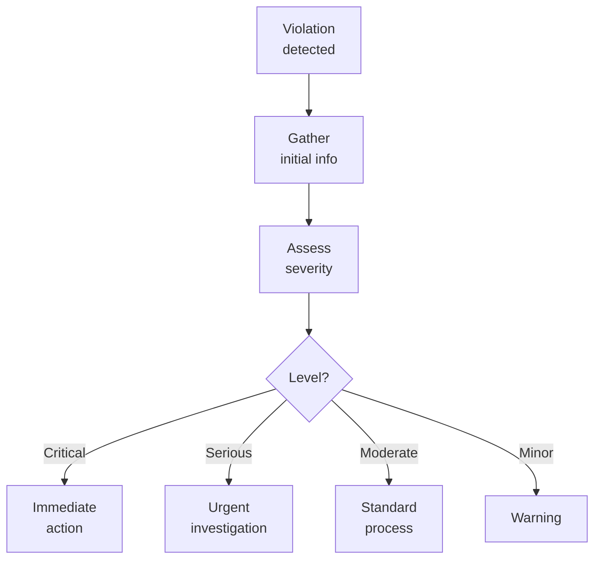

# SOP-02.5: XỬ LÝ VI PHẠM

## 1. MỤC ĐÍCH
Quy định quy trình phát hiện và xử lý vi phạm chính sách truy cập, đảm bảo:
- Phát hiện nhanh chóng
- Điều tra công bằng và kỹ lưỡng
- Xử lý nhất quán
- Ngăn chặn tái diễn
- Răn đe hiệu quả

## 2. PHÂN LOẠI VI PHẠM

### 2.1. Theo mức độ nghiêm trọng
```
Level 1 - Minor (Nhẹ):
- Quên logout
- Chia sẻ password không chủ ý
- Vi phạm lần đầu, không ác ý
- Không thiệt hại

Level 2 - Moderate (Trung bình):
- Truy cập data không được phép
- Sử dụng account người khác
- Vi phạm lặp lại
- Thiệt hại nhỏ

Level 3 - Serious (Nghiêm trọng):
- Cố ý truy cập trái phép
- Export data trái phép
- Phá hoại hệ thống
- Thiệt hại đáng kể

Level 4 - Critical (Rất nghiêm trọng):
- Đánh cắp data
- Sabotage
- Fraud
- Thiệt hại lớn
```

### 2.2. Theo loại vi phạm
```
Policy violations:
- Không tuân thủ password policy
- Không logout
- Chia sẻ credentials
- Sử dụng unauthorized devices

Access violations:
- Truy cập data không được phép
- Vượt quyền hạn
- Access ngoài giờ không hợp lý

Data violations:
- Export trái phép
- Share data ra ngoài
- Modify data không được phép
- Delete data

Security violations:
- Bypass security controls
- Hack attempts
- Malware installation
```

## 3. QUY TRÌNH XỬ LÝ

### 3.1. Detection (Phát hiện)

#### 3.1.1. Automated detection
```
Sources:
- SIEM alerts
- Access logs analysis
- Anomaly detection
- System alerts
- Data loss prevention (DLP)
```

#### 3.1.2. Manual detection
```
Sources:
- User reports
- Manager observations
- Audit findings
- Whistleblower
- Incident investigations
```

### 3.2. Triage (Phân loại)

#### 3.2.1. Initial assessment


#### 3.2.2. Immediate actions (Critical)
```
Within 1 giờ:
□ Suspend account
□ Preserve evidence
□ Contain damage
□ Notify management
□ Initiate investigation
□ Consider legal/police
```

### 3.3. Investigation (Điều tra)

#### 3.3.1. Investigation process
```
Steps:
1. Assign investigator
2. Gather evidence:
   - Logs
   - Screenshots
   - Witness statements
   - System data
   - Communications

3. Interview involved parties:
   - Alleged violator
   - Witnesses
   - Managers
   - IT staff

4. Analyze evidence:
   - Timeline reconstruction
   - Intent assessment
   - Impact evaluation
   - Root cause

5. Document findings:
   - Facts
   - Analysis
   - Conclusions
   - Recommendations
```

#### 3.3.2. Investigation principles
```
✅ Fair và objective
✅ Confidential
✅ Thorough
✅ Timely
✅ Documented
✅ Consistent

Timeline:
- Minor: 3-5 ngày
- Moderate: 1-2 tuần
- Serious: 2-4 tuần
- Critical: As long as needed
```

### 3.4. Disciplinary action (Kỷ luật)

#### 3.4.1. Action matrix
```
Severity | First offense | Second offense | Third offense
---------|---------------|----------------|---------------
Minor | Warning | Written warning | Suspension
Moderate | Written warning | Suspension | Termination
Serious | Suspension | Termination | Legal action
Critical | Termination | Legal action | -
```

#### 3.4.2. Disciplinary process
```
1. Investigation complete
2. Review findings với HR
3. Determine appropriate action
4. Notify employee:
   - Meeting với HR + Manager
   - Present findings
   - Hear employee's side
   - Decide action
5. Document decision
6. Implement action
7. Follow-up
```

### 3.5. Remediation (Khắc phục)

#### 3.5.1. Immediate remediation
```
Actions:
- Revoke unauthorized access
- Change compromised passwords
- Patch vulnerabilities
- Restore data (nếu cần)
- Notify affected parties
```

#### 3.5.2. Long-term improvements
```
Analyze:
- Why violation occurred?
- How to prevent?
- System weaknesses?
- Policy gaps?

Implement:
- Technical controls
- Policy updates
- Training
- Process improvements
```

## 4. COMMUNICATION

### 4.1. Internal communication

#### 4.1.1. Notification requirements
```
Notify immediately:
- CIO (all violations)
- CISO (security violations)
- HR (employee violations)
- Legal (serious violations)
- BGH (critical violations)
- Board (major incidents)

Notify after investigation:
- Affected users
- Relevant managers
- Audit committee
```

#### 4.1.2. Communication guidelines
```
✅ Factual và objective
✅ Confidential (need-to-know)
✅ Timely
✅ Clear về actions taken

❌ Speculation
❌ Gossip
❌ Premature disclosure
❌ Blame without evidence
```

### 4.2. External communication

#### 4.2.1. Khi nào notify external
```
Required:
- Data breach (affected parties)
- Regulatory violations (authorities)
- Criminal activity (police)
- Contractual obligations (partners)

Optional:
- Public disclosure (major incidents)
- Media response (nếu có coverage)
```

## 5. PREVENTION

### 5.1. Awareness training
```
All users (Annual):
- Access policies
- Responsibilities
- Consequences
- How to report

High-risk users (Quarterly):
- Advanced threats
- Social engineering
- Case studies
- Best practices
```

### 5.2. Technical controls
```
Preventive:
- Strong authentication
- Least privilege
- Access reviews
- Monitoring

Detective:
- Logging
- Alerts
- Audits
- Analytics

Corrective:
- Automated responses
- Incident procedures
- Remediation plans
```

### 5.3. Culture
```
Promote:
- Security awareness
- Reporting comfort
- Accountability
- Continuous improvement

Discourage:
- Shortcuts
- Workarounds
- Silence
- Blame culture
```

## 6. METRICS VÀ REPORTING

### 6.1. Violation metrics
```
Volume:
- Total violations: [X]
- By severity: [Minor/Moderate/Serious/Critical]
- By type: [Policy/Access/Data/Security]
- Trend: [↑/→/↓]

Response:
- Detection time: [Average]
- Investigation time: [Average]
- Resolution time: [Average]

Outcomes:
- Warnings: [X]
- Suspensions: [Y]
- Terminations: [Z]
- Legal actions: [W]
```

### 6.2. Dashboard
```
VIOLATIONS DASHBOARD

This month:
- Violations: [X] (↓ Y% vs. last month)
- Open investigations: [Z]
- Resolved: [W]

By severity:
🔴 Critical: [X]
🟠 Serious: [Y]
🟡 Moderate: [Z]
🟢 Minor: [W]

By type:
- Policy: [X]
- Access: [Y]
- Data: [Z]
- Security: [W]

Top violators: [List]
Repeat offenders: [List]
```

## 7. CÔNG CỤ VÀ TEMPLATE

### 7.1. Investigation tools
```
- Forensic tools
- Log analysis tools
- Timeline tools
- Evidence management
```

### 7.2. Templates
```
- Incident report template
- Investigation report template
- Disciplinary action form
- Remediation plan template
```

## 8. CHỈ SỐ ĐÁNH GIÁ

```
Detection:
- Violations detected: 100%
- Detection time: ≤ 1 giờ
- False positives: ≤ 20%

Investigation:
- Completion on time: ≥ 90%
- Quality score: ≥ 4.0/5.0
- Evidence preserved: 100%

Resolution:
- Appropriate actions: 100%
- Recurrence rate: ≤ 10%
- User satisfaction (process): ≥ 3.5/5.0

Prevention:
- Violations trending: Down
- Training completion: 100%
- Awareness score: ≥ 4.0/5.0
```

---

**Ngày ban hành**: 01/01/2024  
**Người phê duyệt**: Ban Giám hiệu  
**Người soạn thảo**: Phòng IT Security  
**Ngày xem xét lại**: 01/01/2025


