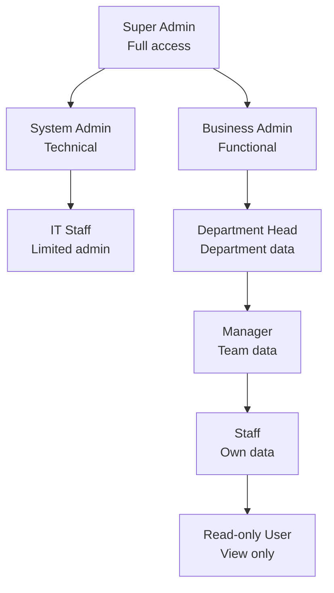
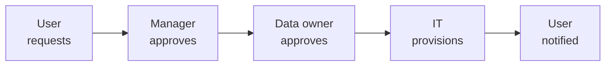

# SOP-02: PHÂN QUYỀN TRUY CẬP

## 1. MỤC ĐÍCH
Thiết lập hệ thống phân quyền truy cập hệ thống thông tin, đảm bảo:
- Chỉ người có thẩm quyền mới truy cập được
- Phân quyền theo nguyên tắc tối thiểu cần thiết
- Quản lý vòng đời tài khoản
- Giám sát và audit truy cập
- Xử lý vi phạm kịp thời

## 2. PHẠM VI ÁP DỤNG
Áp dụng cho:
- Phòng IT (quản lý hệ thống)
- Phòng Nhân sự (quản lý tài khoản nhân viên)
- Tất cả users (tuân thủ)
- Vendors và partners (khi có quyền truy cập)

## 3. NGUYÊN TẮC PHÂN QUYỀN

### 3.1. Least Privilege (Tối thiểu cần thiết)
```
Principle: Chỉ cấp quyền tối thiểu cần thiết để thực hiện công việc

Implementation:
- Default: No access
- Grant: Theo yêu cầu và approval
- Review: Định kỳ
- Revoke: Khi không cần nữa
```

### 3.2. Separation of Duties (Phân tách nhiệm vụ)
```
Principle: Một người không nên có toàn quyền trong quy trình quan trọng

Examples:
- Người tạo payment ≠ Người approve
- Người nhập điểm ≠ Người approve
- Developer ≠ Production admin
```

### 3.3. Need-to-Know (Cần biết)
```
Principle: Chỉ truy cập data cần thiết cho công việc

Implementation:
- Role-based access
- Data segmentation
- Contextual access
```

## 4. CÁC QUY TRÌNH CON

### 4.1. Thiết lập chính sách phân quyền
**Chi tiết**: [SOP-02.1_Thiet_lap_chinh_sach_phan_quyen.md](./SOP-02.1_Thiet_lap_chinh_sach_phan_quyen.md)

**Hoạt động**:
```
- Định nghĩa roles và permissions
- Xây dựng access matrix
- Thiết lập approval workflows
- Document policies
```

### 4.2. Quản lý tài khoản người dùng
**Chi tiết**: [SOP-02.2_Quan_ly_tai_khoan_nguoi_dung.md](./SOP-02.2_Quan_ly_tai_khoan_nguoi_dung.md)

**Hoạt động**:
```
- Tạo tài khoản mới
- Thay đổi quyền truy cập
- Vô hiệu hóa/xóa tài khoản
- Password management
```

### 4.3. Kiểm soát truy cập hệ thống
**Chi tiết**: [SOP-02.3_Kiem_soat_truy_cap_he_thong.md](./SOP-02.3_Kiem_soat_truy_cap_he_thong.md)

**Hoạt động**:
```
- Authentication mechanisms
- Authorization controls
- Session management
- Remote access
```

### 4.4. Audit và giám sát
**Chi tiết**: [SOP-02.4_Audit_va_giam_sat.md](./SOP-02.4_Audit_va_giam_sat.md)

**Hoạt động**:
```
- Access logging
- Activity monitoring
- Periodic reviews
- Anomaly detection
```

### 4.5. Xử lý vi phạm
**Chi tiết**: [SOP-02.5_Xu_ly_vi_pham.md](./SOP-02.5_Xu_ly_vi_pham.md)

**Hoạt động**:
```
- Phát hiện vi phạm
- Điều tra
- Xử lý kỷ luật
- Khắc phục và phòng ngừa
```

## 5. ROLE-BASED ACCESS CONTROL (RBAC)

### 5.1. Role hierarchy


### 5.2. Standard roles
```
Role | Systems | Permissions | Examples
-----|---------|-------------|----------
Super Admin | All | Full | CIO
Academic Admin | SIS, LMS | Admin | Academic Director
Teacher | LMS, SIS | Read/Write own classes | Teachers
Parent | Portal | Read own child | Parents
Student | LMS, Portal | Read/Submit | Students
HR Admin | HRM | Admin | HR Manager
Finance Admin | ERP | Admin | CFO
IT Support | All | Support level | IT Staff
```

### 5.3. Permission matrix
```
Function | Super Admin | Dept Admin | Manager | Staff | Read-only
---------|-------------|------------|---------|-------|----------
View data | ✅ All | ✅ Dept | ✅ Team | ✅ Own | ✅ Assigned
Create | ✅ | ✅ | ✅ | ✅ | ❌
Edit | ✅ | ✅ | ✅ | ⚠️ Own | ❌
Delete | ✅ | ⚠️ Approved | ❌ | ❌ | ❌
Export | ✅ | ⚠️ Approved | ⚠️ Limited | ❌ | ❌
Admin | ✅ | ⚠️ Limited | ❌ | ❌ | ❌
```

## 6. AUTHENTICATION

### 6.1. Authentication methods
```
Level 1 - Basic:
- Username + Password
- For: Low-risk systems

Level 2 - Strong:
- Password + Security questions
- For: Standard systems

Level 3 - Multi-factor (MFA):
- Password + OTP/SMS/App
- For: Sensitive systems, admin accounts

Level 4 - Biometric:
- Fingerprint, face recognition
- For: Highly restricted areas/systems
```

### 6.2. Password policy
```
Requirements:
- Minimum length: 12 characters
- Complexity: Upper + lower + number + special
- History: Không reuse 5 passwords gần nhất
- Expiry: 90 ngày (hoặc không expire nếu MFA)
- Lockout: 5 failed attempts

Exceptions:
- Service accounts: Không expire
- Shared accounts: Không cho phép (nếu có thể)
```

## 7. ACCESS REQUEST PROCESS

### 7.1. Quy trình xin cấp quyền


### 7.2. Request form
```
ACCESS REQUEST FORM

Requester: [Tên]
Department: [...]
Manager: [Tên]

Access requested:
- System: [Tên hệ thống]
- Role: [Role cần]
- Reason: [Business justification]
- Duration: [Permanent / Temporary until [date]]

Data owner approval: _________ Date: _____
Manager approval: _________ Date: _____
IT provisioned by: _________ Date: _____
```

### 7.3. Approval workflow
```
Standard access:
- Manager approval only
- Provisioned within 1 business day

Elevated access:
- Manager + Data owner approval
- Provisioned within 2 business days

Admin access:
- Manager + CIO approval
- Background check (nếu mới)
- Provisioned within 3 business days
```

## 8. ACCESS REVIEWS

### 8.1. Periodic reviews
```
Quarterly: High-privilege accounts
- Admin accounts
- Finance access
- HR access

Semi-annual: All accounts
- Managers review team access
- Confirm still needed
- Remove unnecessary

Annual: Comprehensive
- All systems
- All users
- Certify correctness
```

### 8.2. Review process
```
1. Generate access report
2. Send to managers
3. Managers review và certify
4. IT processes changes
5. Document completion
```

## 9. TRÁCH NHIỆM

### 9.1. IT Department
- Implement technical controls
- Provision/deprovision accounts
- Monitor access
- Maintain systems
- Support users

### 9.2. Managers
- Approve access requests
- Review team access
- Report leavers
- Enforce policies

### 9.3. Data Owners
- Define access requirements
- Approve sensitive access
- Monitor usage
- Audit compliance

### 9.4. Users
- Protect credentials
- Use access appropriately
- Report issues
- Comply với policies

## 10. CHỈ SỐ ĐÁNH GIÁ

### 10.1. Access management
```
- Provisioning time: ≤ SLA
- Deprovisioning (leavers): ≤ 24h
- Access reviews completed: 100%
- Orphan accounts: 0
```

### 10.2. Security
```
- Unauthorized access attempts: Detected 100%
- Successful breaches: 0
- Password policy compliance: 100%
- MFA adoption: ≥ 90% (admin accounts)
```

### 10.3. Compliance
```
- Audit findings: ≤ 5 minor
- Policy violations: ≤ 10/năm
- Training completion: 100%
```

## 11. NGÂN SÁCH

```
Annual access management budget:
├─ IAM system: 50-100 triệu VNĐ
├─ MFA solution: 20-40 triệu VNĐ
├─ SSO solution: 30-60 triệu VNĐ
├─ Password manager: 10-20 triệu VNĐ
├─ Audit tools: 20-30 triệu VNĐ
└─ Training: 10-20 triệu VNĐ
---
Tổng: 140-270 triệu VNĐ/năm
```

---

**Ngày ban hành**: 01/01/2024  
**Người phê duyệt**: Ban Giám hiệu  
**Người soạn thảo**: Phòng IT  
**Ngày xem xét lại**: 01/01/2025
