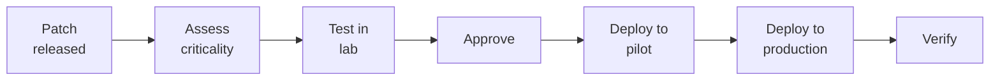

# SOP-03.2: TRIỂN KHAI BIỆN PHÁP BẢO MẬT

## 1. MỤC ĐÍCH
Quy định quy trình triển khai các biện pháp bảo mật kỹ thuật và quản lý, đảm bảo:
- Hệ thống được bảo vệ đa lớp
- Controls hiệu quả và phù hợp
- Cân bằng security và usability
- Tuân thủ best practices
- Cập nhật với mối đe dọa mới

## 2. NETWORK SECURITY

### 2.1. Firewall management

#### 2.1.1. Firewall architecture
```
Internet
    ↓
Perimeter Firewall
    ↓
DMZ (Public servers)
    ↓
Internal Firewall
    ↓
Internal Network
├─ Admin VLAN
├─ Staff VLAN
├─ Student VLAN
└─ Server VLAN
```

#### 2.1.2. Firewall rules
```
Default policy: Deny all

Allow rules (examples):
- HTTP/HTTPS out (port 80, 443)
- Email (port 25, 587, 993)
- DNS (port 53)
- Approved applications

Block rules:
- Torrent ports
- Known malicious IPs
- Unauthorized protocols
- High-risk countries (optional)
```

#### 2.1.3. Rule management
```
Process:
1. Request firewall change
2. Justify business need
3. Security review
4. Approve (CISO)
5. Implement
6. Test
7. Document
8. Review quarterly
```

### 2.2. Network segmentation

#### 2.2.1. VLANs
```
Segmentation strategy:
- Separate by user type
- Separate by sensitivity
- Limit lateral movement
- Micro-segmentation (advanced)

VLANs:
- VLAN 10: Servers
- VLAN 20: Admin
- VLAN 30: Staff
- VLAN 40: Students
- VLAN 50: Guest
- VLAN 60: IoT devices
```

#### 2.2.2. Inter-VLAN rules
```
Traffic allowed:
- Staff → Servers (authenticated)
- Students → Internet (filtered)
- Admin → All (controlled)

Traffic denied:
- Students → Servers (direct)
- Guest → Internal
- IoT → Internal
```

### 2.3. Wireless security

#### 2.3.1. WiFi networks
```
SSIDs:
1. School-Staff (WPA3-Enterprise):
   - For staff only
   - 802.1X authentication
   - Access to internal resources

2. School-Students (WPA3-Personal):
   - For students
   - Voucher-based
   - Internet only, filtered

3. School-Guest (WPA2-Personal):
   - For visitors
   - Time-limited
   - Internet only, isolated
```

#### 2.3.2. WiFi controls
```
Security measures:
- Strong encryption (WPA3)
- Hidden SSID (optional)
- MAC filtering (staff network)
- Captive portal (guest)
- Bandwidth limits
- Content filtering
```

## 3. ENDPOINT SECURITY

### 3.1. Antivirus/Anti-malware

#### 3.1.1. Deployment
```
Coverage: 100% of endpoints

Components:
- Real-time scanning
- Scheduled scans (weekly full, daily quick)
- Automatic updates
- Centralized management
- Quarantine

Products: Symantec, Trend Micro, Windows Defender ATP
```

#### 3.1.2. Management
```
Daily:
- Review alerts
- Quarantine review
- Update definitions

Weekly:
- Scan results analysis
- Exceptions review

Monthly:
- Coverage report
- Effectiveness review
- Update policies
```

### 3.2. Patch management

#### 3.2.1. Patching policy
```
Critical patches:
- Assessment: Within 24h
- Testing: 2-3 days
- Deployment: Within 7 days

Security patches:
- Assessment: Within 3 days
- Testing: 1 week
- Deployment: Within 2 tuần

Regular updates:
- Assessment: Within 1 tuần
- Testing: 2 tuần
- Deployment: Monthly patch cycle
```

#### 3.2.2. Patching process


### 3.3. Endpoint Detection & Response (EDR)

#### 3.3.1. Capabilities
```
Features:
- Behavioral monitoring
- Threat hunting
- Incident investigation
- Automated response
- Forensics
```

#### 3.3.2. Response actions
```
Automated:
- Isolate infected endpoint
- Kill malicious processes
- Block malicious IPs
- Alert SOC

Manual:
- Deep investigation
- Remediation
- Recovery
```

## 4. EMAIL SECURITY

### 4.1. Email gateway

#### 4.1.1. Protections
```
Inbound:
├─ Spam filtering (≥95% accuracy)
├─ Malware scanning
├─ Phishing detection
├─ URL filtering
└─ Attachment sandboxing

Outbound:
├─ DLP (data loss prevention)
├─ Encryption (sensitive)
├─ Malware scanning
└─ Policy enforcement
```

#### 4.1.2. Configuration
```
Actions:
- Quarantine: Suspected spam/phishing
- Block: Known malware
- Tag: [EXTERNAL] cho email ngoài
- Encrypt: Sensitive keywords detected
- Alert: Large attachments, bulk sends
```

### 4.2. Email policies

#### 4.2.1. Usage policy
```
Allowed:
✅ Work-related communications
✅ School business
✅ Professional use

Not allowed:
❌ Personal business (excessive)
❌ Chain letters, spam
❌ Illegal content
❌ Harassment
❌ Confidential data to personal email
```

#### 4.2.2. Best practices
```
Users should:
✅ Verify sender trước khi click links
✅ Không open suspicious attachments
✅ Report phishing
✅ Use encryption cho sensitive data
✅ Clean mailbox regularly

Users should not:
❌ Share credentials qua email
❌ Click links trong suspicious emails
❌ Download executables
❌ Auto-forward to external
```

## 5. WEB SECURITY

### 5.1. Web filtering

#### 5.1.1. Categories
```
Blocked:
- Adult content
- Malware/Phishing
- Illegal content
- Gambling
- Violence
- Hate speech

Restricted (staff only):
- Social media (limited hours)
- Streaming
- Downloads

Allowed:
- Educational sites
- News
- Research
- Business tools
```

#### 5.1.2. Implementation
```
Methods:
- DNS filtering
- Proxy server
- Cloud-based filtering (Cisco Umbrella, Zscaler)

Exceptions:
- Request form
- Approval từ manager + IT
- Time-limited
- Logged
```

### 5.2. HTTPS inspection

#### 5.2.1. SSL/TLS inspection
```
Purpose: Detect threats trong encrypted traffic

Implementation:
- Install CA certificate
- Man-in-the-middle proxy
- Decrypt, inspect, re-encrypt

Exclusions:
- Banking sites
- Healthcare
- Privacy-sensitive (optional)
```

## 6. MOBILE SECURITY

### 6.1. Mobile Device Management (MDM)

#### 6.1.1. Enrollment
```
Device types:
- School-owned: Mandatory
- BYOD: Optional (nếu access school data)

Enrollment process:
1. Download MDM app
2. Register device
3. Accept policies
4. Install profile
5. Configure settings
```

#### 6.1.2. MDM controls
```
Enforced:
- Passcode requirement (6+ digits)
- Encryption
- Auto-lock (5 phút)
- No jailbreak/root
- Remote wipe capability

Optional:
- App restrictions
- Content filtering
- Location tracking (school devices only)
```

### 6.2. BYOD policy

#### 6.2.1. Requirements
```
To access school resources:
□ MDM enrolled (containerized)
□ OS updated
□ Passcode set
□ Encryption enabled
□ No jailbreak
□ Acceptable use agreement signed
```

#### 6.2.2. Containerization
```
Concept: Separate work và personal data

Work container:
- School email
- School apps
- School data
- Managed by MDM
- Can be wiped remotely

Personal container:
- Personal apps
- Personal data
- Not managed
- Privacy protected
```

## 7. CLOUD SECURITY

### 7.1. Cloud services
```
Approved cloud services:
- Google Workspace / Microsoft 365
- AWS / Azure (infrastructure)
- Approved SaaS (per list)

Approval process:
- Security assessment
- Vendor due diligence
- Contract review
- Configuration hardening
```

### 7.2. Cloud controls
```
Controls:
- SSO integration
- MFA required
- DLP policies
- Access reviews
- Activity monitoring
- Data encryption
- Geo-restrictions
```

## 8. SECURITY TESTING

### 8.1. Vulnerability scanning
```
Frequency: Weekly (internal), Monthly (external)

Process:
1. Run automated scan
2. Review results
3. Prioritize vulnerabilities
4. Assign remediation
5. Verify fixes
6. Re-scan

Tools: Nessus, Qualys, OpenVAS
```

### 8.2. Penetration testing
```
Frequency: Annual (minimum)

Scope:
- External (Internet-facing)
- Internal (assume breach)
- Web applications
- Wireless
- Social engineering

Process:
1. Define scope
2. Hire testers (external)
3. Execute tests
4. Receive report
5. Remediate findings
6. Re-test critical issues
```

## 9. CÔNG CỤ VÀ TEMPLATE

### 9.1. Security tools
```
Network:
- Firewalls (Fortinet, Palo Alto, Cisco)
- IPS (Snort, Suricata)
- NAC (Cisco ISE, Aruba ClearPass)

Endpoint:
- Antivirus (Symantec, Trend, CrowdStrike)
- EDR (Carbon Black, SentinelOne)
- Patch management (WSUS, SCCM)

Email:
- Gateway (Proofpoint, Mimecast)
- Anti-phishing (KnowBe4)

Web:
- Filtering (Cisco Umbrella, Zscaler)
- WAF (Cloudflare, F5)

Mobile:
- MDM (Intune, Jamf, MobileIron)

Cloud:
- CASB (Microsoft Defender, Netskope)
```

### 9.2. Templates
```
- Security baseline document
- Configuration standards
- Change request form
- Exception request form
```

## 10. CHỈ SỐ ĐÁNH GIÁ

```
Coverage:
- Endpoints protected: 100%
- Network segmentation: 100%
- Email filtering: 100%
- Web filtering: 100%

Effectiveness:
- Malware blocked: ≥ 99%
- Spam blocked: ≥ 95%
- Phishing blocked: ≥ 90%
- Vulnerabilities remediated: ≥ 95% trong SLA

Performance:
- False positives: ≤ 5%
- User complaints: ≤ 10/tháng
- System impact: Minimal
```

---

**Ngày ban hành**: 01/01/2024  
**Người phê duyệt**: Ban Giám hiệu  
**Người soạn thảo**: Phòng IT Security  
**Ngày xem xét lại**: 01/01/2025