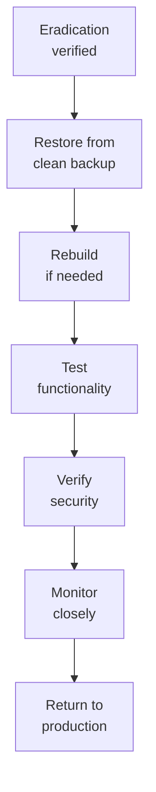

# SOP-03.3: PHÁT HIỆN VÀ ỨNG PHÓ SỰ CỐ

## 1. MỤC ĐÍCH
Quy định quy trình phát hiện và ứng phó sự cố an ninh mạng, đảm bảo:
- Phát hiện sớm các sự cố
- Phản ứng nhanh chóng và hiệu quả
- Giảm thiểu thiệt hại
- Phục hồi nhanh chóng
- Học hỏi và cải tiến

## 2. INCIDENT RESPONSE TEAM (IRT)

### 2.1. Cấu trúc
```
Incident Response Team:
├─ Team Lead: CISO
├─ Technical Lead: Security Engineer
├─ Forensics: IT Specialist
├─ Communications: PR Manager
├─ Legal: Legal Counsel
└─ Business: Relevant department head

On-call rotation: 24/7
Response time: ≤ 1 giờ
```

### 2.2. Roles
```
Team Lead:
- Overall coordination
- Decision making
- Stakeholder communication
- Resource allocation

Technical Lead:
- Technical investigation
- Containment actions
- Recovery oversight

Forensics:
- Evidence collection
- Analysis
- Documentation

Communications:
- Internal communications
- External communications
- Media handling

Legal:
- Legal advice
- Regulatory compliance
- Law enforcement liaison

Business:
- Business impact assessment
- Recovery priorities
- User support
```

## 3. INCIDENT CLASSIFICATION

### 3.1. Severity levels
```
SEV 1 - Critical:
- Active data breach
- Ransomware outbreak
- Complete system outage
- Response: Immediate, all hands

SEV 2 - High:
- Malware infection (contained)
- Unauthorized access (limited)
- Significant system degradation
- Response: Within 1 giờ

SEV 3 - Medium:
- Phishing attempt (unsuccessful)
- Policy violation
- Minor system issue
- Response: Within 4 giờ

SEV 4 - Low:
- Suspicious activity (false alarm)
- Informational events
- Response: Next business day
```

### 3.2. Incident types
```
Categories:
1. Malware (virus, ransomware, trojan)
2. Phishing/Social engineering
3. Unauthorized access
4. Data breach/leak
5. DDoS attack
6. System compromise
7. Insider threat
8. Physical breach
9. Third-party incident
```

## 4. INCIDENT RESPONSE PROCESS

### 4.1. Preparation (Chuẩn bị sẵn)
```
Readiness:
□ IRT trained và ready
□ Runbooks prepared
□ Tools installed
□ Contacts updated
□ Communication templates ready
□ Backup verified
□ Insurance current
□ Legal counsel on retainer
```

### 4.2. Detection & Analysis

#### 4.2.1. Detection sources
```
Automated:
- SIEM alerts
- IDS/IPS
- Antivirus
- DLP
- Log analysis
- Anomaly detection

Manual:
- User reports
- Help desk tickets
- Security monitoring
- External notifications
```

#### 4.2.2. Analysis process
```
Steps:
1. Gather initial information:
   - What happened?
   - When discovered?
   - Who reported?
   - Systems affected?

2. Validate incident (true/false positive):
   - Check logs
   - Verify indicators
   - Correlate events

3. Classify severity

4. Determine scope:
   - How many systems?
   - What data?
   - How long?

5. Assign to IRT
```

### 4.3. Containment

#### 4.3.1. Short-term containment
```
Actions (within minutes-hours):
- Isolate affected systems (disconnect network)
- Block malicious IPs/domains
- Disable compromised accounts
- Quarantine malware
- Preserve evidence

Goal: Stop spread immediately
```

#### 4.3.2. Long-term containment
```
Actions (within hours-days):
- Patch vulnerabilities
- Change passwords
- Rebuild systems
- Enhanced monitoring
- Additional controls

Goal: Prevent recurrence
```

### 4.4. Eradication

#### 4.4.1. Remove threat
```
Steps:
1. Identify all affected systems
2. Remove malware completely
3. Close attack vectors
4. Verify eradication
5. Update defenses
```

#### 4.4.2. Verification
```
Checks:
- Re-scan systems
- Monitor for 24-48h
- Check for persistence mechanisms
- Verify no re-infection
```

### 4.5. Recovery

#### 4.5.1. Recovery process


#### 4.5.2. Validation
```
Before returning to production:
□ Malware removed
□ Systems patched
□ Passwords changed
□ Configurations hardened
□ Monitoring enhanced
□ Tested thoroughly
□ Security verified
```

### 4.6. Post-Incident Activities

#### 4.6.1. Lessons learned meeting
```
Timing: 1-2 tuần after resolution

Agenda (2 giờ):
00:00-00:30: Timeline review
00:30-01:00: What went well?
01:00-01:30: What could be better?
01:30-02:00: Action items

Attendees: IRT + Management
```

#### 4.6.2. Incident report
```
INCIDENT REPORT

1. Executive summary
2. Incident details:
   - Detection
   - Timeline
   - Scope
   - Impact
3. Response actions
4. Root cause analysis
5. Lessons learned
6. Recommendations:
   - Immediate fixes
   - Long-term improvements
7. Cost analysis
8. Appendices (logs, evidence)
```

## 5. INCIDENT DOCUMENTATION

### 5.1. Incident log
```
Fields:
- Incident ID
- Date/time detected
- Severity
- Type
- Description
- Systems affected
- Actions taken
- Status
- Owner
- Resolution date
```

### 5.2. Evidence handling
```
Chain of custody:
- Who collected
- When collected
- Where stored
- Who accessed
- Why accessed

Preservation:
- Write-protected storage
- Hashed for integrity
- Backed up
- Access logged
```

## 6. COMMUNICATION PROTOCOLS

### 6.1. Internal notifications
```
Immediate (SEV 1-2):
- IRT activation
- CISO/CIO
- BGH
- Affected department heads

Within 4h:
- All management
- IT team
- HR (nếu insider threat)

Within 24h:
- All staff (nếu widespread)
- Board (nếu major)
```

### 6.2. External notifications
```
Required:
- Data Protection Authority (within 72h for breach)
- Affected individuals (without undue delay)
- Law enforcement (criminal activity)
- Partners (nếu affected)

Optional:
- Media (major incidents)
- Industry peers (threat sharing)
- Insurance company
```

### 6.3. Communication templates
```
Template 1: Internal alert
Template 2: User notification
Template 3: External disclosure
Template 4: Media statement
Template 5: Regulatory notification
```

## 7. TOOLS VÀ RESOURCES

### 7.1. Detection tools
```
- SIEM (Splunk, LogRhythm)
- IDS/IPS (Snort, Suricata)
- EDR (CrowdStrike, Carbon Black)
- Network monitoring (Wireshark, SolarWinds)
```

### 7.2. Response tools
```
- Forensics (EnCase, FTK)
- Malware analysis (sandbox)
- Threat intelligence platforms
- Incident management (ServiceNow, Jira)
```

### 7.3. Runbooks
```
By incident type:
- Ransomware response
- Phishing response
- Data breach response
- DDoS response
- Insider threat response
```

## 8. CHỈ SỐ ĐÁNH GIÁ

### 8.1. Detection
```
- Detection time: ≤ 1 giờ (critical)
- False positive rate: ≤ 20%
- Incidents missed: 0
```

### 8.2. Response
```
- Response time: ≤ SLA by severity
- Containment time: ≤ 4 giờ (critical)
- Resolution time: ≤ 24 giờ (SEV 1), ≤ 1 tuần (SEV 2)
```

### 8.3. Effectiveness
```
- Recurrence rate: ≤ 5%
- Damage minimized: ≥ 80% prevented
- Downtime: ≤ 4 giờ (critical systems)
- Lessons implemented: 100%
```

---

**Ngày ban hành**: 01/01/2024  
**Người phê duyệt**: Ban Giám hiệu  
**Người soạn thảo**: Phòng IT Security  
**Ngày xem xét lại**: 01/01/2025


