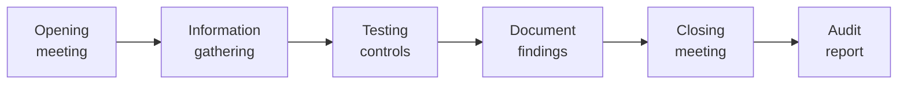
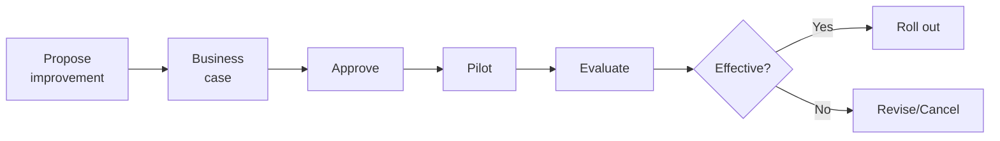

# SOP-03.5: AUDIT VÀ CẢI TIẾN BẢO MẬT

## 1. MỤC ĐÍCH
Quy định quy trình audit và cải tiến liên tục hệ thống an toàn thông tin, đảm bảo:
- Đánh giá hiệu quả bảo mật
- Phát hiện gaps và weaknesses
- Tuân thủ standards và regulations
- Cải tiến dựa trên best practices
- Duy trì và nâng cao security posture

## 2. AUDIT PROGRAM

### 2.1. Các loại audit

#### 2.1.1. Internal audits
```
Quarterly technical audits:
- Configuration review
- Access review
- Log review
- Vulnerability status
- Patch compliance

Semi-annual process audits:
- Policy compliance
- Procedure adherence
- Documentation review
- Training records

Annual comprehensive audit:
- Full ISMS review
- All controls
- Gap analysis vs. ISO 27001
- Recommendations
```

#### 2.1.2. External audits
```
Annual:
- ISO 27001 certification audit
- Compliance audit
- Financial audit (IT controls)

Ad-hoc:
- Regulatory audits
- Customer audits
- Partner audits
```

### 2.2. Audit process

#### 2.2.1. Planning
```
Steps:
1. Define scope
2. Identify standards/requirements
3. Develop audit plan
4. Assign auditors
5. Schedule
6. Communicate
```

#### 2.2.2. Execution


**Timeline**: 2-4 tuần

#### 2.2.3. Findings classification
```
Critical:
- Immediate risk
- Urgent action required
- Report to BGH

High:
- Significant risk
- Action within 1 tháng
- Report to management

Medium:
- Moderate risk
- Action within 3 tháng
- Track progress

Low:
- Minor issue
- Action within 6 tháng
- Recommendations

Observations:
- Best practice suggestions
- No immediate risk
- Consider for improvement
```

### 2.3. Remediation

#### 2.3.1. Action planning
```
For each finding:
1. Acknowledge
2. Root cause analysis
3. Develop remediation plan:
   - Actions
   - Owners
   - Deadlines
   - Resources
4. Approve plan
5. Execute
6. Verify completion
7. Close finding
```

#### 2.3.2. Tracking
```
Remediation tracker:
Finding ID | Severity | Description | Action | Owner | Due | Status
-----------|----------|-------------|--------|-------|-----|--------
F001 | Critical | [...] | [...] | [...] | [...] | Open
F002 | High | [...] | [...] | [...] | [...] | In progress
```

**Follow-up**:
- Weekly: Critical và high
- Monthly: Medium
- Quarterly: Low
```

## 3. PENETRATION TESTING

### 3.1. Annual pentest

#### 3.1.1. Scope
```
External testing:
- Internet-facing systems
- Web applications
- Email security
- VPN
- Network perimeter

Internal testing:
- Assume breach scenario
- Lateral movement
- Privilege escalation
- Data exfiltration

Application testing:
- SIS, LMS, CRM
- Custom applications
- APIs
```

#### 3.1.2. Methodology
```
Phases:
1. Planning và scoping (1 tuần)
2. Reconnaissance (1 tuần)
3. Scanning (3-5 ngày)
4. Exploitation (1-2 tuần)
5. Reporting (1 tuần)

Total: 6-8 tuần
```

#### 3.1.3. Remediation
```
Priority by CVSS score:
- Critical (9.0-10.0): 7 ngày
- High (7.0-8.9): 30 ngày
- Medium (4.0-6.9): 90 ngày
- Low (0.1-3.9): 180 ngày

Re-test: After critical/high fixes
```

## 4. SECURITY METRICS & KPIs

### 4.1. Technical metrics
```
Vulnerability management:
- Open vulnerabilities: [X]
- Critical/High open: [Y]
- Average time to remediate: [Z days]
- SLA compliance: [W%]

Incidents:
- Incidents this month: [X]
- Incidents this quarter: [Y]
- Incidents this year: [Z]
- Mean time to detect: [A hours]
- Mean time to respond: [B hours]
- Mean time to recover: [C hours]

Availability:
- System uptime: [X%]
- Security tool uptime: [Y%]
```

### 4.2. Compliance metrics
```
- Policies current: [X/Y]
- Controls implemented: [X%]
- Audit findings open: [X]
- Training completion: [Y%]
- Certifications valid: [All/Some/None]
```

### 4.3. Effectiveness metrics
```
- Malware infections: [X]
- Phishing success rate: [Y%]
- Data breaches: [Z]
- Security ROI: [Calculate]
```

## 5. CONTINUOUS IMPROVEMENT

### 5.1. Improvement sources

#### 5.1.1. Internal
```
- Audit findings
- Incident lessons
- Metrics trends
- User feedback
- Team suggestions
```

#### 5.1.2. External
```
- Industry best practices
- Vendor recommendations
- Peer benchmarking
- Standards updates (ISO, NIST)
- Threat intelligence
```

### 5.2. Improvement process

#### 5.2.1. Identify opportunities
```
Quarterly review:
1. Analyze metrics
2. Review audit findings
3. Gather feedback
4. Benchmark
5. Prioritize improvements
```

#### 5.2.2. Implementation


### 5.3. Maturity model

#### 5.3.1. Levels
```
Level 1 - Initial:
- Ad-hoc security
- Reactive
- No formal processes

Level 2 - Developing:
- Some processes
- Basic controls
- Awareness growing

Level 3 - Defined:
- Documented processes
- Comprehensive controls
- Regular audits

Level 4 - Managed:
- Quantitative management
- Proactive
- Metrics-driven

Level 5 - Optimizing:
- Continuous improvement
- Innovation
- Industry-leading

Current: [Level X]
Target: Level 4 trong 2 năm
```

## 6. REPORTING

### 6.1. Security dashboard
```
SECURITY POSTURE DASHBOARD

Overall score: [XX/100]
Trend: [↑/→/↓]

Vulnerabilities:
- Critical: [X]
- High: [Y]
- Medium: [Z]
- Low: [W]

Incidents (MTD):
- SEV 1: [X]
- SEV 2: [Y]
- SEV 3: [Z]

Compliance:
- Policies compliant: [X%]
- Controls effective: [Y%]
- Audit findings: [Z open]

Metrics:
- MTTD: [X hours]
- MTTR: [Y hours]
- Phishing click rate: [Z%]
```

### 6.2. Reports

#### 6.2.1. Monthly security report
```
TO: BGH
FROM: CISO

1. Executive summary
2. Incidents summary
3. Vulnerability status
4. Project updates
5. Metrics
6. Upcoming activities
7. Risks và concerns
```

#### 6.2.2. Quarterly Board report
```
1. Security posture overview
2. Major incidents (nếu có)
3. Compliance status
4. Audit results
5. Investments và ROI
6. Strategic initiatives
7. Recommendations
```

## 7. CERTIFICATION & COMPLIANCE

### 7.1. ISO 27001 certification

#### 7.1.1. Timeline to certification
```
Year 1:
- Gap analysis (Q1)
- ISMS implementation (Q2-Q4)
- Internal audits (Q3-Q4)

Year 2:
- Pre-assessment (Q1)
- Remediation (Q2)
- Certification audit (Q3)
- Certificate issued (Q4)

Ongoing:
- Surveillance audits (annual)
- Re-certification (every 3 years)
```

#### 7.1.2. Benefits
```
- Structured approach
- Best practices
- Customer confidence
- Competitive advantage
- Risk reduction
- Continuous improvement
```

## 8. CÔNG CỤ VÀ TEMPLATE

### 8.1. Audit tools
```
- GRC platform (Governance, Risk, Compliance)
- Vulnerability scanners
- Configuration assessment tools
- Compliance checkers
```

### 8.2. Templates
```
- Audit plan template
- Audit checklist
- Finding report template
- Remediation plan template
- Security dashboard template
```

## 9. CHỈ SỐ ĐÁNH GIÁ

```
Audit program:
- Audits completed on schedule: 100%
- Coverage: 100% of scope
- Findings documented: 100%

Remediation:
- Critical closed: 100% within 7 days
- High closed: ≥ 90% within 30 days
- Overall closure: ≥ 85%

Improvement:
- Improvements implemented: ≥ 5/năm
- Maturity level: Increasing
- Security score: Trending up
- ROI: Positive
```

---

**Ngày ban hành**: 01/01/2024  
**Người phê duyệt**: Ban Giám hiệu  
**Người soạn thảo**: Phòng IT Security  
**Ngày xem xét lại**: 01/01/2025


