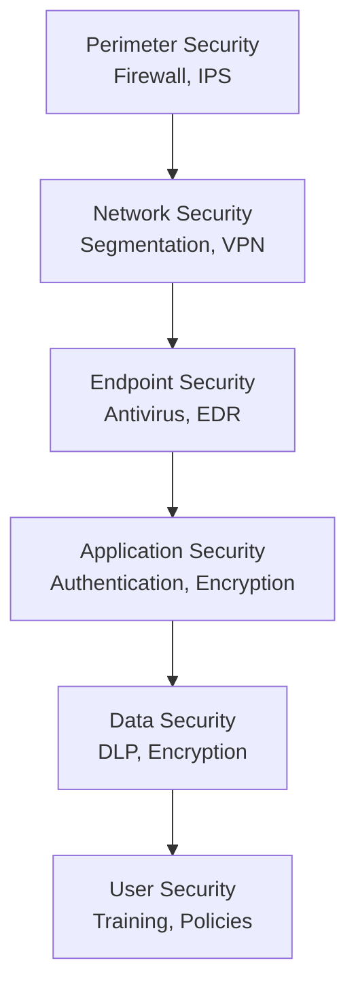

# SOP-03: AN TOÀN THÔNG TIN

## 1. MỤC ĐÍCH
Thiết lập hệ thống quản lý an toàn thông tin toàn diện, đảm bảo:
- Bảo vệ thông tin khỏi các mối đe dọa
- Đảm bảo tính bí mật, toàn vẹn và sẵn sàng
- Tuân thủ tiêu chuẩn ISO 27001
- Phòng chống tấn công mạng
- Phục hồi nhanh sau sự cố

## 2. PHẠM VI ÁP DỤNG
Áp dụng cho:
- Phòng IT Security (chủ trì)
- Tất cả phòng ban (tuân thủ)
- Toàn thể nhân viên (awareness)
- Vendors và partners (khi kết nối)

## 3. INFORMATION SECURITY FRAMEWORK

### 3.1. CIA Triad
```
Confidentiality (Bí mật):
└─ Chỉ người được phép mới truy cập

Integrity (Toàn vẹn):
└─ Dữ liệu chính xác và không bị sửa đổi trái phép

Availability (Sẵn sàng):
└─ Hệ thống và dữ liệu available khi cần
```

### 3.2. Defense in Depth


## 4. CÁC QUY TRÌNH CON

### 4.1. Đánh giá rủi ro an ninh mạng
**Chi tiết**: [SOP-03.1_Danh_gia_rui_ro_an_ninh_mang.md](./SOP-03.1_Danh_gia_rui_ro_an_ninh_mang.md)

**Hoạt động**:
```
- Risk identification
- Vulnerability assessment
- Threat analysis
- Risk evaluation
```

### 4.2. Triển khai biện pháp bảo mật
**Chi tiết**: [SOP-03.2_Trien_khai_bien_phap_bao_mat.md](./SOP-03.2_Trien_khai_bien_phap_bao_mat.md)

**Hoạt động**:
```
- Network security
- Endpoint protection
- Email security
- Web security
- Mobile security
```

### 4.3. Phát hiện và ứng phó sự cố
**Chi tiết**: [SOP-03.3_Phat_hien_va_ung_pho_su_co.md](./SOP-03.3_Phat_hien_va_ung_pho_su_co.md)

**Hoạt động**:
```
- Security monitoring
- Incident detection
- Incident response
- Recovery procedures
```

### 4.4. Đào tạo nhận thức an toàn
**Chi tiết**: [SOP-03.4_Dao_tao_nhan_thuc_an_toan.md](./SOP-03.4_Dao_tao_nhan_thuc_an_toan.md)

**Hoạt động**:
```
- Security awareness program
- Phishing simulations
- Best practices training
- Culture building
```

### 4.5. Audit và cải tiến bảo mật
**Chi tiết**: [SOP-03.5_Audit_va_cai_tien_bao_mat.md](./SOP-03.5_Audit_va_cai_tien_bao_mat.md)

**Hoạt động**:
```
- Security audits
- Penetration testing
- Compliance assessment
- Continuous improvement
```

## 5. SECURITY ARCHITECTURE

### 5.1. Network security
```
Perimeter:
├─ Firewalls (next-gen)
├─ Intrusion Prevention System (IPS)
├─ DDoS protection
└─ VPN gateway

Internal:
├─ Network segmentation (VLANs)
├─ Internal firewalls
├─ Network Access Control (NAC)
└─ Wireless security (WPA3)

DMZ (Demilitarized Zone):
├─ Public website
├─ Email gateway
└─ Guest WiFi
```

### 5.2. Endpoint security
```
Protection:
├─ Antivirus/Anti-malware
├─ Endpoint Detection & Response (EDR)
├─ Host-based firewall
├─ Disk encryption
└─ Device management (MDM)

Devices covered:
- Desktops
- Laptops
- Servers
- Mobile devices
- Tablets
```

### 5.3. Application security
```
Controls:
├─ Secure development lifecycle
├─ Code reviews
├─ Vulnerability scanning
├─ Penetration testing
├─ WAF (Web Application Firewall)
└─ API security
```

### 5.4. Data security
```
Protection:
├─ Encryption (at rest, in transit)
├─ Data Loss Prevention (DLP)
├─ Backup và recovery
├─ Access controls
└─ Data masking
```

## 6. SECURITY POLICIES

### 6.1. Core policies
```
Required policies:
□ Information Security Policy (tổng quát)
□ Acceptable Use Policy
□ Password Policy
□ Remote Access Policy
□ BYOD Policy
□ Email và Internet Usage Policy
□ Incident Response Policy
□ Data Classification Policy
□ Backup Policy
□ Vendor Management Policy
```

### 6.2. Policy management
```
Lifecycle:
1. Develop/Update
2. Review (stakeholders)
3. Approve (CISO/CIO)
4. Publish
5. Communicate
6. Train
7. Enforce
8. Review annually
```

## 7. TRÁCH NHIỆM

### 7.1. Chief Information Security Officer (CISO)
```
- Lead security strategy
- Manage security team
- Oversee implementations
- Report to BGH
- Coordinate incidents
```

### 7.2. Security Team
```
- Implement controls
- Monitor systems
- Respond to incidents
- Conduct assessments
- Support users
```

### 7.3. All Employees
```
- Follow policies
- Protect credentials
- Report incidents
- Complete training
- Practice safe computing
```

## 8. CHỈ SỐ ĐÁNH GIÁ

### 8.1. Security posture
```
- Vulnerabilities (high/critical): 0
- Security incidents: ≤ 10/năm
- Data breaches: 0
- System availability: ≥ 99.5%
```

### 8.2. Compliance
```
- Policy compliance: ≥ 95%
- Training completion: 100%
- Audit findings: ≤ 10 minor
- Certifications: ISO 27001 (target)
```

### 8.3. Effectiveness
```
- Phishing test pass rate: ≥ 80%
- Incident response time: ≤ 1 giờ
- Recovery time: ≤ 4 giờ
- User awareness: ≥ 4.0/5.0
```

## 9. NGÂN SÁCH

```
Annual information security budget:
├─ Security staff: 500-800 triệu VNĐ
├─ Security tools: 300-500 triệu VNĐ
├─ Firewalls & IPS: 200-300 triệu VNĐ
├─ Endpoint security: 100-200 triệu VNĐ
├─ SIEM & monitoring: 150-250 triệu VNĐ
├─ Penetration testing: 50-100 triệu VNĐ
├─ Training: 50-80 triệu VNĐ
├─ Consulting: 100-150 triệu VNĐ
└─ Contingency: 100-200 triệu VNĐ
---
Tổng: 1.55-2.58 tỷ VNĐ/năm
(~3-5% of IT budget)
```

---

**Ngày ban hành**: 01/01/2024  
**Người phê duyệt**: Ban Giám hiệu  
**Người soạn thảo**: Phòng IT Security  
**Ngày xem xét lại**: 01/01/2025
