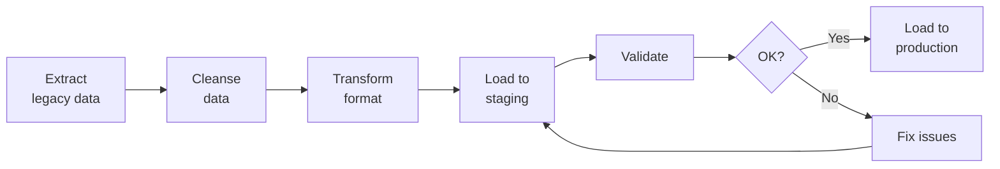

# SOP-04.2: TÍCH HỢP VÀ TÙY BIẾN

## 1. MỤC ĐÍCH
Quy định quy trình tích hợp hệ thống và tùy biến theo nhu cầu, đảm bảo:
- Tích hợp seamless giữa các hệ thống
- Dữ liệu đồng bộ và nhất quán
- Tùy biến phù hợp với quy trình
- Không ảnh hưởng nâng cấp tương lai
- Hiệu suất tối ưu

## 2. INTEGRATION STRATEGY

### 2.1. Integration patterns

#### 2.1.1. Point-to-point
```
[System A] <---> [System B]

Use when:
- Simple integration
- 1-1 relationship
- Low volume

Pros: Simple, fast to implement
Cons: Không scale, nhiều connections
```

#### 2.1.2. Hub-and-spoke (ESB)
```
    [System A]
         |
    [Integration Hub]
    /    |    \
[Sys B][Sys C][Sys D]

Use when:
- Multiple systems
- Complex transformations
- High volume

Pros: Scalable, centralized
Cons: Single point of failure, complexity
```

#### 2.1.3. API-led
```
[Systems] → [Process APIs] → [System APIs] → [Data]

Use when:
- Microservices architecture
- Reusability needed
- Modern stack

Pros: Flexible, reusable
Cons: Requires API management
```

### 2.2. Integration types

#### 2.2.1. Data integration
```
Purpose: Sync data giữa systems

Methods:
1. Real-time (APIs, webhooks):
   - Critical data
   - Immediate sync
   - Example: Enrollment → SIS → LMS

2. Near real-time (polling):
   - Important data
   - Minutes delay
   - Example: Grade updates

3. Batch (scheduled ETL):
   - Bulk data
   - Nightly/weekly
   - Example: Data warehouse refresh
```

#### 2.2.2. Process integration
```
Purpose: Orchestrate processes across systems

Example: New student enrollment
1. CRM: Lead converts → Student
2. SIS: Create student record
3. LMS: Create learner account
4. Finance: Create billing account
5. Email: Send welcome
6. Portal: Grant parent access
```

#### 2.2.3. UI integration
```
Purpose: Unified user experience

Methods:
- SSO (single login)
- Portal/Dashboard (widgets)
- Deep linking (navigate between)
- Embedded iframes (nếu allowed)
```

## 3. QUY TRÌNH TÍCH HỢP

### 3.1. Integration planning (2-3 tuần)

#### 3.1.1. Integration mapping
```
Define:
1. What systems to integrate
2. What data to sync
3. Which direction (one-way/two-way)
4. Frequency (real-time/batch)
5. Data mappings (field A → field B)
6. Transformation rules
7. Error handling
```

#### 3.1.2. Integration design document
```
INTEGRATION SPECIFICATION

Source: [System A]
Target: [System B]
Direction: [A→B / A↔B]

Trigger: [Event/Schedule]
Frequency: [Real-time / Hourly / Daily]

Data mapping:
Source Field | Target Field | Transform | Required
-------------|--------------|-----------|----------
StudentID | LearnerId | None | Yes
FirstName | first_name | Trim, Title case | Yes
DOB | DateOfBirth | Format YYYY-MM-DD | Yes

Business rules:
- [Rule 1]
- [Rule 2]

Error handling:
- Validation failures → Log và alert
- System unavailable → Retry 3 times → Queue
- Data conflicts → Manual resolution

Monitoring:
- Success rate
- Latency
- Error rate
```

### 3.2. Development (4-6 tuần)

#### 3.2.1. Build integrations
```
Activities:
1. Setup integration environment
2. Develop connectors
3. Implement transformations
4. Error handling
5. Logging
6. Unit testing
```

#### 3.2.2. API development (nếu custom)
```
Standards:
- RESTful design
- JSON format
- OAuth 2.0 authentication
- Rate limiting
- Versioning
- Documentation (Swagger/OpenAPI)
```

### 3.3. Testing (3-4 tuần)

#### 3.3.1. Integration testing
```
Test cases:
- Happy path (normal flow)
- Error scenarios (failures, retries)
- Edge cases (nulls, special characters)
- Volume testing (large datasets)
- Performance testing (latency)
- Idempotency (duplicate calls)
```

#### 3.3.2. End-to-end testing
```
Scenario testing:
1. Create student trong CRM
2. Verify appears trong SIS
3. Verify appears trong LMS
4. Verify appears trong Finance
5. Update student data
6. Verify propagates
7. Delete student
8. Verify cascades
```

### 3.4. Data migration (4-6 tuần)

#### 3.4.1. Migration strategy
```
Approach:
1. Extract data từ legacy systems
2. Transform để match new format
3. Load vào new systems
4. Validate accuracy
5. Reconcile differences
```

#### 3.4.2. Migration process


**Validation**:
```
- Record counts match
- Sample data verification (100-200 records)
- Business logic checks
- User validation
- Sign-off from business
```

## 4. CUSTOMIZATION

### 4.1. Customization guidelines

#### 4.1.1. Configuration first
```
Preference order:
1. Standard features (best)
2. Configuration (good)
3. Customization (careful)
4. Custom development (last resort)

Why:
- Easier to maintain
- Supported by vendor
- Easier to upgrade
- Lower cost
```

#### 4.1.2. Customization types
```
1. UI customizations:
   - Themes và branding
   - Field labels
   - Layout adjustments

2. Business logic:
   - Validation rules
   - Workflow automation
   - Calculations

3. Reports:
   - Custom reports
   - Dashboards
   - Data exports

4. Integrations:
   - Custom connectors
   - APIs
   - Middleware
```

### 4.2. Customization process

#### 4.2.1. Request và approval
```
Process:
1. Submit request
2. Evaluate:
   - Can configure instead?
   - Cost vs. benefit
   - Impact on upgrades
   - Complexity
3. Approve / Reject / Defer
4. Prioritize
5. Develop
6. Test
7. Deploy
```

#### 4.2.2. Documentation
```
For each customization:
- Purpose và requirements
- Design specifications
- Code/configuration
- Test results
- Deployment instructions
- Upgrade impact notes
```

## 5. DEPLOYMENT

### 5.1. Deployment planning

#### 5.1.1. Cutover plan
```
CUTOVER PLAN

Pre-cutover (1 tuần trước):
□ Final data migration
□ System validation
□ User communication
□ Training completion
□ Support readiness
□ Rollback plan ready

Cutover weekend:
Saturday:
- 08:00: Final backup
- 10:00: Disable old system
- 12:00: Data migration
- 16:00: Validation
- 18:00: Enable new system
- 20:00: Smoke testing

Sunday:
- 08:00: Extended testing
- 14:00: User acceptance
- 16:00: Go/no-go decision
- 18:00: Communication

Monday:
- Go-live
- Support team ready
```

#### 5.1.2. Rollback plan
```
Triggers:
- Critical defects
- Data integrity issues
- Performance problems
- User rejection

Process:
1. Decision to rollback
2. Disable new system
3. Enable old system
4. Restore data (from backup)
5. Communicate
6. Investigate issues
7. Fix và retry
```

### 5.2. Go-live

#### 5.2.1. Go-live checklist
```
□ All testing passed
□ Data migrated và validated
□ Training completed
□ Documentation ready
□ Support team briefed
□ Communication sent
□ Vendor support confirmed
□ Monitoring active
□ Rollback plan ready
□ Go-live approval obtained
```

## 6. CÔNG CỤ VÀ TEMPLATE

### 6.1. Integration tools
```
- ETL tools (Talend, Informatica)
- iPaaS (MuleSoft, Dell Boomi)
- API management (Apigee, Kong)
- Data migration tools
```

### 6.2. Templates
```
- Integration design document
- API specification
- Data mapping template
- Test plan
- Cutover plan
- Rollback plan
```

## 7. CHỈ SỐ ĐÁNH GIÁ

```
Integration:
- Integrations delivered: 100%
- On time: ±2 tuần
- Data accuracy: ≥ 99%
- Performance: ≤ 2 seconds latency

Migration:
- Data migrated: 100%
- Data accuracy: ≥ 99.5%
- Validation passed: 100%
- User acceptance: ✅

Deployment:
- Go-live on time: ±1 tuần
- Critical defects: 0
- Rollback needed: No
- User readiness: ≥ 90%
```

---

**Ngày ban hành**: 01/01/2024  
**Người phê duyệt**: Ban Giám hiệu  
**Người soạn thảo**: Phòng IT  
**Ngày xem xét lại**: 01/01/2025


