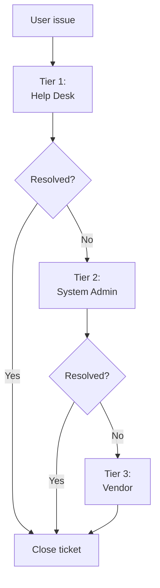

# SOP-04.4: VẬN HÀNH VÀ HỖ TRỢ

## 1. MỤC ĐÍCH
Quy định quy trình vận hành và hỗ trợ hệ thống LMS/CRM/HRM, đảm bảo:
- Hệ thống hoạt động ổn định
- Issues được giải quyết nhanh
- Performance được tối ưu
- Users được hỗ trợ tốt
- Continuous availability

## 2. OPERATIONS MANAGEMENT

### 2.1. Daily operations

#### 2.1.1. Morning checks (30 phút)
```
System health check:
□ System status (up/down)
□ Response time
□ Error logs review
□ Scheduled jobs (ran successfully?)
□ Integration status
□ Storage space
□ Database performance
```

#### 2.1.2. Monitoring
```
Real-time monitoring:
- System availability
- Response times
- Error rates
- User sessions
- Resource utilization (CPU, memory, disk)

Alerts:
- System down → Immediate
- Performance degraded → 15 phút
- Errors spike → 30 phút
- Storage >80% → Warning
```

### 2.2. Maintenance windows

#### 2.2.1. Scheduled maintenance
```
Frequency: Monthly

Timing: 
- Weekend (Saturday night)
- Or school break
- Avoid peak times

Activities:
- System updates
- Database maintenance
- Performance tuning
- Backup verification
- Security patches

Duration: 2-4 giờ

Communication:
- 1 tuần advance notice
- Reminder 1 ngày trước
- Status during maintenance
- Completion notice
```

#### 2.2.2. Emergency maintenance
```
Triggers:
- Critical security patch
- Major bug fix
- Performance crisis
- Data corruption

Process:
1. Assess urgency
2. Get approval (CIO/Business owner)
3. Notify users (minimum 2 giờ notice nếu có thể)
4. Execute maintenance
5. Validate
6. Communicate completion
```

### 2.3. Backup và recovery

#### 2.3.1. Backup strategy
```
Database:
- Full backup: Nightly
- Differential: Hourly
- Transaction logs: Real-time (critical systems)
- Retention: 30 ngày

Files:
- Incremental: Daily
- Full: Weekly
- Retention: 90 ngày

Configurations:
- Before changes
- Monthly
- Retention: 1 năm
```

#### 2.3.2. Recovery testing
```
Frequency: Quarterly

Process:
1. Select random backup
2. Restore to test environment
3. Validate data integrity
4. Test functionality
5. Document results
6. Improve process

Success criteria:
- Data restored: 100%
- Within RTO: ✅
- Functional: ✅
```

## 3. HELP DESK SUPPORT

### 3.1. Support model

#### 3.1.1. Support tiers


#### 3.1.2. SLA by priority
```
Priority | Response | Resolution | Example
---------|----------|------------|--------
P1 Critical | 15 phút | 4 giờ | System down
P2 High | 1 giờ | 8 giờ | Critical feature broken
P3 Medium | 4 giờ | 2 ngày | Non-critical issue
P4 Low | 1 ngày | 5 ngày | Enhancement request
```

### 3.2. Ticket management

#### 3.2.1. Ticketing system
```
Information captured:
- Requester
- System
- Issue category
- Priority
- Description
- Screenshots/attachments
- Assigned to
- Status
- Resolution
- Closure date
```

#### 3.2.2. Ticket lifecycle
```
States:
New → Assigned → In Progress → Pending (user input)
→ Resolved → Closed

Transitions:
- Auto-assign based on category
- Escalate if SLA breach
- Auto-close after 3 ngày (if resolved)
```

### 3.3. Knowledge base

#### 3.3.1. Content types
```
Articles:
- How-to guides
- FAQs
- Troubleshooting
- Best practices
- Release notes
- Known issues

Formats:
- Text articles
- Video tutorials (2-5 phút)
- Screenshots
- PDFs
```

#### 3.3.2. Knowledge management
```
Process:
1. Create article (from tickets, training)
2. Review (quality check)
3. Approve (subject matter expert)
4. Publish
5. Update (when outdated)
6. Archive (when obsolete)

Metrics:
- Articles published: ≥ 50
- Article views: Track
- Helpful ratings: ≥ 80%
- Self-service resolution: ≥ 30%
```

## 4. PERFORMANCE MANAGEMENT

### 4.1. Performance monitoring

#### 4.1.1. Key metrics
```
Response time:
- Page load: ≤ 3 seconds
- Search: ≤ 2 seconds
- Reports: ≤ 10 seconds
- API calls: ≤ 1 second

Throughput:
- Concurrent users: ≥ 500
- Transactions/second: ≥ 100

Availability:
- Uptime: ≥ 99.5% (monthly)
- Planned downtime: ≤ 4 giờ/tháng
```

#### 4.1.2. Performance baselines
```
Establish baselines:
- Average response times
- Peak usage times
- Resource utilization
- Error rates

Alert thresholds:
- >2x baseline: Warning
- >3x baseline: Critical
```

### 4.2. Performance tuning

#### 4.2.1. Optimization activities
```
Monthly:
- Database optimization (indexes, queries)
- Cache tuning
- Log cleanup
- Archive old data

Quarterly:
- Capacity planning
- Scalability testing
- Architecture review
- Vendor consultation
```

#### 4.2.2. Capacity management
```
Monitor trends:
- User growth
- Data growth
- Storage consumption
- Bandwidth usage

Plan ahead:
- Forecast 6-12 months
- Provision resources
- Avoid bottlenecks
```

## 5. INCIDENT MANAGEMENT

### 5.1. Incident response

#### 5.1.1. Classification
```
P1 - Critical:
- System completely down
- Data loss
- Security breach
- Response: Immediate, all hands

P2 - High:
- Major feature broken
- Performance severely degraded
- Affecting many users
- Response: 1 giờ, dedicated team

P3 - Medium:
- Minor feature broken
- Workarounds available
- Affecting some users
- Response: 4 giờ, assigned staff

P4 - Low:
- Cosmetic issues
- Single user
- Enhancement requests
- Response: Next business day
```

#### 5.1.2. Escalation
```
Escalation path:
Tier 1 → Tier 2 → Vendor → Vendor Management

Time-based escalation:
- P1: 15 phút → Manager → 30 phút → CIO
- P2: 1 giờ → Manager → 4 giờ → CIO
- P3: 4 giờ → Manager
- P4: 1 ngày → Manager
```

### 5.2. Communication

#### 5.2.1. Status updates
```
P1 incidents:
- Initial notification: 15 phút
- Updates: Every 30 phút
- Resolution notification: Immediate

P2 incidents:
- Initial notification: 1 giờ
- Updates: Every 2 giờ
- Resolution notification: Within 1 giờ

Channels:
- Email
- System banner
- Status page
- App notifications
```

## 6. VENDOR MANAGEMENT

### 6.1. Vendor relationship

#### 6.1.1. Regular touchpoints
```
Weekly: Technical sync (implementation phase)
Monthly: Operations review
Quarterly: Business review
Annual: Strategic planning
```

#### 6.1.2. SLA management
```
Track:
- Uptime commitment
- Support response times
- Bug fix timelines
- Feature delivery

Review monthly:
- SLA compliance
- Credits due (nếu breach)
- Areas for improvement
```

### 6.2. Vendor escalation
```
Levels:
1. Support engineer
2. Support manager
3. Account manager
4. Regional director
5. Executive sponsor

Use sparingly: For critical issues not resolved
```

## 7. CÔNG CỤ VÀ TEMPLATE

### 7.1. Operations tools
```
- Monitoring (Nagios, Zabbix, Datadog)
- Ticketing (Jira Service Desk, Zendesk)
- Knowledge base (Confluence, SharePoint)
- Status page (StatusPage.io)
```

### 7.2. Templates
```
- Incident report template
- Maintenance notification template
- Performance report template
- SLA report template
```

## 8. CHỈ SỐ ĐÁNH GIÁ

```
Availability:
- System uptime: ≥ 99.5%
- Unplanned downtime: ≤ 4 giờ/tháng

Performance:
- Response time SLA: ≥ 95%
- Performance incidents: ≤ 5/tháng

Support:
- Ticket resolution within SLA: ≥ 90%
- First contact resolution: ≥ 60%
- User satisfaction: ≥ 4.0/5.0
- Average resolution time: ≤ 2 ngày

Vendor:
- SLA compliance: ≥ 95%
- Support quality: ≥ 4.0/5.0
```

---

**Ngày ban hành**: 01/01/2024  
**Người phê duyệt**: Ban Giám hiệu  
**Người soạn thảo**: Phòng IT  
**Ngày xem xét lại**: 01/01/2025


