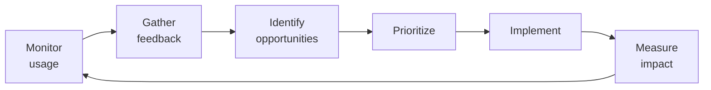

# SOP-04.5: TỐI ƯU HÓA VÀ NÂNG CẤP

## 1. MỤC ĐÍCH
Quy định quy trình tối ưu hóa hiệu quả sử dụng và nâng cấp hệ thống, đảm bảo:
- Maximize value từ hệ thống
- Features mới được áp dụng
- Performance được cải thiện
- ROI được đo lường
- Hệ thống luôn current và competitive

## 2. USAGE ANALYTICS

### 2.1. Data collection

#### 2.1.1. Usage metrics
```
User metrics:
- Active users (daily, weekly, monthly)
- Login frequency
- Session duration
- Feature adoption
- User segments

Feature metrics:
- Feature usage frequency
- Feature combinations
- Power users vs. casual users
- Unused features

Content metrics (LMS):
- Courses created
- Assignments posted
- Resources uploaded
- Student engagement

Performance metrics:
- Page load times
- Error rates
- API response times
- Database queries
```

#### 2.1.2. Analysis
```
Analyze:
1. Usage patterns:
   - Peak times
   - Popular features
   - User behaviors
   - Workflows

2. Gaps:
   - Underutilized features
   - Workarounds
   - Manual processes
   - Integration gaps

3. Opportunities:
   - Quick wins
   - High-impact improvements
   - Automation potential
```

### 2.2. User feedback

#### 2.2.1. Feedback collection
```
Methods:
- In-app feedback widget
- Quarterly surveys
- User group meetings
- Help desk tickets analysis
- Feature requests tracking
```

#### 2.2.2. Feedback prioritization
```
Prioritization matrix:

Impact/Effort:

High Impact, Low Effort:
└─ Quick wins (do first)

High Impact, High Effort:
└─ Strategic projects (plan carefully)

Low Impact, Low Effort:
└─ Nice to have (fill gaps)

Low Impact, High Effort:
└─ Avoid (unless critical)
```

## 3. OPTIMIZATION

### 3.1. Process optimization

#### 3.1.1. Identify opportunities
```
Sources:
- Usage analytics
- User complaints
- Process observation
- Benchmarking
- Vendor recommendations
```

#### 3.1.2. Optimization projects
```
Examples:

LMS:
- Automate grade calculations
- Bulk assignment creation
- Template library
- Mobile app enhancements
- Integration với Google/Microsoft

CRM:
- Email automation
- Lead scoring
- Pipeline automation
- Reporting automation

HRM:
- Self-service expansion
- Approval workflows
- Onboarding automation
- Performance review templates
```

### 3.2. Configuration improvements

#### 3.2.1. Regular reviews (Quarterly)
```
Review:
- User roles (still appropriate?)
- Workflows (optimized?)
- Notifications (too many/few?)
- Permissions (correct?)
- Integrations (working well?)

Adjust:
- Based on feedback
- Usage patterns
- Business changes
```

#### 3.2.2. Feature activation
```
New features from vendor:
1. Evaluate relevance
2. Plan rollout
3. Configure
4. Test
5. Train users
6. Enable
7. Monitor adoption
```

## 4. VERSION UPGRADES

### 4.1. Upgrade planning

#### 4.1.1. Upgrade types
```
Patch updates (monthly):
- Bug fixes
- Security patches
- Minor improvements
- Low risk
- Automated (nếu có thể)

Minor upgrades (quarterly):
- New features
- Enhancements
- Medium risk
- Planned maintenance

Major upgrades (annual):
- Significant changes
- New capabilities
- UI changes
- High risk
- Careful planning
```

#### 4.1.2. Upgrade decision
```
Evaluate:
- What's new? (release notes)
- Benefits?
- Risks?
- Effort required?
- User impact?
- Timeline?

Decide:
- Upgrade now
- Defer (wait for X.1 release)
- Skip (if no value)
```

### 4.2. Upgrade process

#### 4.2.1. Planning phase (4-6 tuần)
```
Activities:
1. Review release notes
2. Identify impacts:
   - Features affected
   - Customizations impacted
   - Integrations to update
   - Training needed
3. Develop upgrade plan
4. Communicate to users
5. Schedule upgrade window
```

#### 4.2.2. Testing phase (2-4 tuần)
```
Test environment:
1. Upgrade sandbox/UAT
2. Test core functions
3. Test customizations
4. Test integrations
5. Performance testing
6. User acceptance testing

Fix issues before production
```

#### 4.2.3. Execution phase (1 weekend)
```
Upgrade checklist:
□ Backup current system
□ Notify users (downtime)
□ Execute upgrade
□ Smoke testing
□ Full testing
□ Verify integrations
□ Monitor performance
□ Go/no-go decision
□ Rollback nếu issues
□ Notify users (completion)
```

#### 4.2.4. Post-upgrade (2-4 tuần)
```
Activities:
- Enhanced support (extended hours)
- Monitor closely
- Quick fixes
- User feedback
- Training updates (nếu cần)
- Documentation updates
- Lessons learned
```

## 5. VALUE MEASUREMENT

### 5.1. ROI calculation

#### 5.1.1. Costs
```
Initial investment:
- Licenses
- Implementation
- Training
- Customization

Ongoing costs:
- Annual licenses
- Support & maintenance
- Staff time (admin)
- Upgrades
- Add-ons

Total 3-year cost: [X triệu VNĐ]
```

#### 5.1.2. Benefits
```
Quantifiable:
- Time savings (hours/week × hourly rate)
- Cost savings (reduced manual work, paper)
- Revenue increase (better enrollment)
- Efficiency gains (automation)

Intangible:
- Better decisions (data-driven)
- Improved satisfaction
- Risk reduction
- Competitive advantage

Total 3-year benefit: [Y triệu VNĐ]

ROI = (Benefits - Costs) / Costs × 100%
Target: ≥ 200%
```

### 5.2. Value realization

#### 5.2.1. Benefits tracking
```
For each expected benefit:
- Baseline measurement
- Target
- Actual achievement
- Variance
- Actions to close gap

Example:
Benefit: Reduce admin time by 20%
Baseline: 100 giờ/tuần
Target: 80 giờ/tuần
Actual (Month 6): 85 giờ/tuần
Variance: -5 giờ (not yet achieved)
Action: Further automation, training
```

#### 5.2.2. Periodic reviews
```
Quarterly:
- Usage metrics
- Benefits realized
- Issues outstanding
- Optimization opportunities

Annual:
- Comprehensive ROI review
- Strategic alignment
- Renewal decision
- Investment priorities
```

## 6. CONTINUOUS IMPROVEMENT

### 6.1. Improvement cycle


### 6.2. Innovation
```
Stay current:
- Attend vendor events (webinars, conferences)
- Join user communities
- Beta programs (new features)
- Pilot emerging capabilities
- Learn from peers
```

## 7. LIFECYCLE MANAGEMENT

### 7.1. System lifecycle
```
Stages:
1. Selection & implementation (Year 0-1)
2. Optimization (Year 1-3)
3. Maturity (Year 3-5)
4. Evaluation (Year 5+)
5. Sunset/Replace (nếu cần)

Typical lifespan: 5-7 năm
```

### 7.2. Replacement considerations
```
Consider replacing when:
- Vendor going out of business
- Technology outdated
- Better alternatives available
- Costs outweigh benefits
- Major business changes
- Integration challenges
```

## 8. CÔNG CỤ VÀ TEMPLATE

### 8.1. Analytics tools
```
- System analytics (built-in)
- Google Analytics (web)
- Custom dashboards (Power BI)
- Survey tools
```

### 8.2. Templates
```
- Optimization proposal
- Upgrade plan
- ROI calculator
- Benefits tracking
- Lifecycle review
```

## 9. CHỈ SỐ ĐÁNH GIÁ

```
Utilization:
- Feature adoption: ≥ 70% of core features
- Active users: ≥ 85%
- Self-service: ≥ 40%

Performance:
- Response time: ≤ SLA
- Uptime: ≥ 99.5%
- Errors: ≤ 0.1%

Value:
- Benefits realized: ≥ 80% of projected
- ROI: ≥ 200% (3 năm)
- User satisfaction: ≥ 4.2/5.0
- Would recommend: ≥ 85%

Improvement:
- Optimizations implemented: ≥ 5/năm
- Upgrades on time: 100%
- Value increasing: YoY
```

---

**Ngày ban hành**: 01/01/2024  
**Người phê duyệt**: Ban Giám hiệu  
**Người soạn thảo**: Phòng IT  
**Ngày xem xét lại**: 01/01/2025


