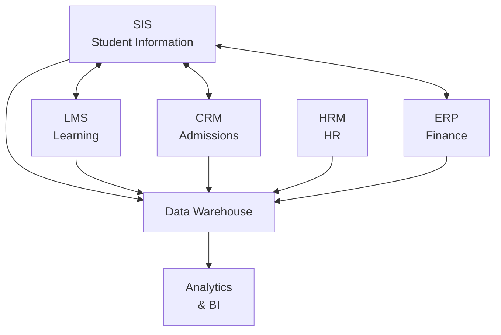

# SOP-04: ỨNG DỤNG LMS-CRM-HRM

## 1. MỤC ĐÍCH
Thiết lập quy trình lựa chọn, triển khai và tối ưu hóa các hệ thống quản lý cốt lõi, đảm bảo:
- Hệ thống phù hợp với nhu cầu
- Triển khai thành công
- Adoption cao từ users
- Tích hợp seamless
- ROI tối đa

## 2. PHẠM VI ÁP DỤNG
Áp dụng cho:
- Phòng IT (technical implementation)
- Phòng Học thuật (LMS)
- Phòng Marketing (CRM)
- Phòng Nhân sự (HRM)
- Tất cả users

## 3. CÁC HỆ THỐNG CỐT LÕI

### 3.1. Learning Management System (LMS)
```
Purpose: Quản lý học tập và giảng dạy

Core functions:
├─ Course management
├─ Content delivery
├─ Assignments và submissions
├─ Grading
├─ Communications
├─ Analytics
└─ Integration với SIS

Popular LMS:
- Canvas (Instructure)
- Moodle (open-source)
- Google Classroom
- Blackboard
- Schoology
```

### 3.2. Customer Relationship Management (CRM)
```
Purpose: Quản lý quan hệ phụ huynh và tuyển sinh

Core functions:
├─ Lead management
├─ Enrollment pipeline
├─ Parent communications
├─ Event management
├─ Marketing automation
├─ Analytics
└─ Integration với SIS

Popular CRM:
- Salesforce Education Cloud
- HubSpot
- Zoho CRM
- Custom solutions
```

### 3.3. Human Resource Management (HRM)
```
Purpose: Quản lý nhân sự

Core functions:
├─ Employee records
├─ Recruitment
├─ Onboarding/Offboarding
├─ Performance management
├─ Leave management
├─ Payroll
├─ Training tracking
└─ Analytics

Popular HRM:
- Workday
- SAP SuccessFactors
- BambooHR
- Zoho People
```

## 4. CÁC QUY TRÌNH CON

### 4.1. Lựa chọn và triển khai hệ thống
**Chi tiết**: [SOP-04.1_Lua_chon_va_trien_khai_he_thong.md](./SOP-04.1_Lua_chon_va_trien_khai_he_thong.md)

**Hoạt động**:
```
- Requirements gathering
- Vendor selection
- Contract negotiation
- Project planning
- Go-live
```

### 4.2. Tích hợp và tùy biến
**Chi tiết**: [SOP-04.2_Tich_hop_va_tuy_bien.md](./SOP-04.2_Tich_hop_va_tuy_bien.md)

**Hoạt động**:
```
- System integration
- Data migration
- Customization
- Testing
- Validation
```

### 4.3. Đào tạo và adoption
**Chi tiết**: [SOP-04.3_Dao_tao_va_adoption.md](./SOP-04.3_Dao_tao_va_adoption.md)

**Hoạt động**:
```
- Training program
- Change management
- User adoption
- Champions program
- Support provision
```

### 4.4. Vận hành và hỗ trợ
**Chi tiết**: [SOP-04.4_Van_hanh_va_ho_tro.md](./SOP-04.4_Van_hanh_va_ho_tro.md)

**Hoạt động**:
```
- Daily operations
- Help desk support
- Incident management
- Performance monitoring
- Maintenance
```

### 4.5. Tối ưu hóa và nâng cấp
**Chi tiết**: [SOP-04.5_Toi_uu_hoa_va_nang_cap.md](./SOP-04.5_Toi_uu_hoa_va_nang_cap.md)

**Hoạt động**:
```
- Usage analytics
- Optimization opportunities
- Feature enhancements
- Version upgrades
- ROI measurement
```

## 5. INTEGRATION ARCHITECTURE

### 5.1. Systems integration map


### 5.2. Integration methods
```
Real-time:
- APIs (REST, SOAP)
- Webhooks
- Message queues

Batch:
- Scheduled ETL
- File transfer (SFTP)
- Database sync

Hybrid:
- Critical data: Real-time
- Bulk data: Batch
```

## 6. GOVERNANCE

### 6.1. System ownership
```
LMS:
- Business Owner: Academic Director
- Technical Owner: IT Director
- System Admin: LMS Administrator

CRM:
- Business Owner: Marketing Director
- Technical Owner: IT Director
- System Admin: CRM Administrator

HRM:
- Business Owner: HR Director
- Technical Owner: IT Director
- System Admin: HR Systems Manager
```

### 6.2. Change management
```
Change types:
1. Configuration changes:
   - Business owner approval
   - Test in sandbox
   - Document changes

2. Customizations:
   - Business case
   - IT review
   - Development
   - Testing
   - Deployment

3. Upgrades:
   - Planning (3 tháng ahead)
   - Testing
   - User communication
   - Deployment
   - Post-upgrade support
```

## 7. TRÁCH NHIỆM

### 7.1. Business owners
```
- Define requirements
- Prioritize features
- Accept deliverables
- Drive adoption
- Monitor value
```

### 7.2. IT team
```
- Technical implementation
- Integration
- Security
- Performance
- Support
```

### 7.3. System admins
```
- Configuration
- User management
- Data quality
- Reporting
- Training
```

### 7.4. End users
```
- Use systems effectively
- Follow best practices
- Report issues
- Provide feedback
- Participate in training
```

## 8. CHỈ SỐ ĐÁNH GIÁ

### 8.1. Adoption metrics
```
LMS:
- Daily active users (teachers): ≥ 90%
- Daily active users (students): ≥ 80%
- Course content uploaded: ≥ 90%
- Assignment submissions online: ≥ 95%

CRM:
- Leads tracked: 100%
- Pipeline updated: Daily
- Communications logged: ≥ 80%
- Conversion tracking: 100%

HRM:
- Employee records current: 100%
- Self-service usage: ≥ 70%
- Performance reviews on time: 100%
- Leave requests online: ≥ 95%
```

### 8.2. Performance metrics
```
- System uptime: ≥ 99.5%
- Response time: ≤ 2 seconds
- Error rate: ≤ 0.1%
- User satisfaction: ≥ 4.0/5.0
```

### 8.3. Value metrics
```
- Time savings: ≥ 20% (vs. manual)
- Cost savings: ≥ 15%
- Data accuracy: ≥ 98%
- ROI: ≥ 200% (3 năm)
```

## 9. NGÂN SÁCH

```
Implementation (one-time):
├─ LMS: 200-500 triệu VNĐ
├─ CRM: 150-300 triệu VNĐ
├─ HRM: 200-400 triệu VNĐ
├─ Integration: 100-200 triệu VNĐ
├─ Data migration: 50-100 triệu VNĐ
├─ Training: 100-200 triệu VNĐ
└─ Consulting: 100-200 triệu VNĐ
---
Subtotal: 900-1900 triệu VNĐ

Annual recurring:
├─ LMS licenses: 100-200 triệu VNĐ
├─ CRM licenses: 80-150 triệu VNĐ
├─ HRM licenses: 100-180 triệu VNĐ
├─ Support & maintenance: 150-250 triệu VNĐ
├─ Upgrades: 50-100 triệu VNĐ
└─ Training refresh: 30-50 triệu VNĐ
---
Subtotal: 510-930 triệu VNĐ/năm
```

---

**Ngày ban hành**: 01/01/2024  
**Người phê duyệt**: Ban Giám hiệu  
**Người soạn thảo**: Phòng IT  
**Ngày xem xét lại**: 01/01/2025
