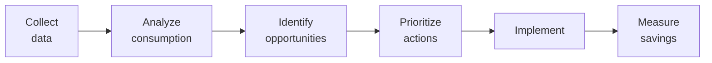

# SOP-06.1: QUẢN LÝ NĂNG LƯỢNG VÀ TIẾT KIỆM

## 1. MỤC ĐÍCH
Quy định quy trình quản lý và tiết kiệm năng lượng, đảm bảo:
- Giảm tiêu thụ năng lượng
- Tối ưu hóa chi phí
- Sử dụng năng lượng tái tạo
- Giảm phát thải carbon
- Nâng cao hiệu quả năng lượng

## 2. ENERGY MANAGEMENT SYSTEM

### 2.1. Energy audit

#### 2.1.1. Baseline measurement
```
Thu thập data:
1. Electricity consumption:
   - Monthly bills (12 tháng)
   - Peak demand
   - Load profile (24h)
   - Cost per kWh

2. Breakdown by area:
   - Lighting: [X%]
   - HVAC: [Y%]
   - Equipment: [Z%]
   - Other: [W%]

3. Benchmarking:
   - kWh per student
   - kWh per m²
   - Compare với similar schools
```

#### 2.1.2. Energy audit process


**Audit frequency**: Annual comprehensive, Monthly monitoring

### 2.2. Energy efficiency improvements

#### 2.2.1. Lighting
```
Measures:
1. LED conversion:
   - Replace all với LED
   - 50-70% energy savings
   - Payback: 2-3 năm

2. Daylight harvesting:
   - Sensors (turn off khi đủ sáng tự nhiên)
   - Design (maximize natural light)

3. Occupancy sensors:
   - Auto off khi không người
   - Classrooms, toilets, corridors

4. Zoning:
   - Control by area
   - Schedule based on usage
```

#### 2.2.2. HVAC (Heating, Ventilation, Air Conditioning)
```
Measures:
1. Inverter AC:
   - Variable speed
   - 30-40% savings vs. non-inverter

2. Temperature setpoints:
   - Summer: 25-26°C (không <24°C)
   - Winter: 20-22°C
   - Enforce centrally

3. Scheduling:
   - Turn on 30 phút before use
   - Turn off khi không dùng
   - Reduced settings khi part-occupied

4. Maintenance:
   - Clean filters monthly
   - Service quarterly
   - Prevent efficiency loss

5. Zoning:
   - Separate controls per area
   - Unused areas off
```

#### 2.2.3. Equipment
```
Measures:
1. Energy-efficient equipment:
   - ENERGY STAR rated
   - High efficiency
   - Right-sizing (không over-capacity)

2. Power management:
   - PCs sleep after 10 phút
   - Monitors off after 5 phút
   - Shutdown overnight
   - Central management (GPO)

3. Plug load management:
   - Smart strips (cut phantom load)
   - Timers
   - Unplug chargers
```

### 2.3. Renewable energy

#### 2.3.1. Solar PV system
```
Planning:
1. Site assessment:
   - Roof area available
   - Orientation (South ideal)
   - Shading analysis
   - Structural capacity

2. System sizing:
   - Energy consumption
   - Available space
   - Budget
   - Grid connection

3. Financial analysis:
   - Installation cost
   - Energy savings
   - Payback period (7-10 năm)
   - ROI
```

#### 2.3.2. Implementation
```
Steps:
1. Design system
2. Get permits
3. Procure equipment
4. Installation
5. Inspection
6. Grid connection
7. Commissioning
8. Monitoring setup

Timeline: 6-12 tháng
```

## 4. ENERGY MONITORING

### 4.1. Monitoring system

#### 4.1.1. Metering
```
Install sub-meters:
- By building
- By floor
- By major equipment (HVAC, kitchen)
- Real-time data
- Cloud-based platform
```

#### 4.1.2. Dashboard
```
ENERGY DASHBOARD

Today:
- Consumption: [X kWh]
- Cost: [Y VNĐ]
- Solar generation: [Z kWh]
- Net: [X-Z kWh]

This month:
- Total: [A kWh] (↓ B% vs. last month)
- Cost: [C VNĐ]
- Target: [D kWh]
- Status: [🟢 On track / 🟡 Warning / 🔴 Over]

By area:
Area | kWh | % of total | vs. target
-----|-----|------------|------------
Classrooms | [X] | [Y%] | [🟢/🟡/🔴]
HVAC | [X] | [Y%] | [🟢/🟡/🔴]
[...]

Alerts:
⚠️ HVAC usage high - Check settings
⚠️ After-hours consumption - Investigate
```

### 4.2. Reporting

#### 4.2.1. Regular reports
```
Weekly: Energy manager review
Monthly: Management report
Quarterly: Sustainability Committee
Annual: Comprehensive report + trends
```

## 5. BEHAVIORAL PROGRAMS

### 5.1. Energy saving campaigns

#### 5.1.1. Awareness campaigns
```
Activities:
- Posters ("Turn off lights")
- Email reminders
- Competitions (class vs. class)
- Rewards (most improved)
- Education assemblies
```

#### 5.1.2. Incentives
```
For departments/classes:
- Track consumption by area
- Reward reductions
- Recognition
- Budget share-back (savings)
```

### 5.2. Green practices

#### 5.2.1. Daily habits
```
Encourage:
✅ Turn off lights khi rời phòng
✅ Unplug chargers
✅ Use natural light
✅ Optimal AC settings
✅ Stairs instead of elevator (nếu có)
✅ Share equipment
✅ Report wastage
```

## 6. CÔNG CỤ VÀ TEMPLATE

### 6.1. Measurement tools
```
- Energy meters
- Monitoring software
- Analytics platform
- Mobile app
```

### 6.2. Templates
```
- Energy audit template
- Savings calculator
- ROI analysis
- Monthly report template
```

## 7. CHỈ SỐ ĐÁNH GIÁ

```
Consumption:
- Energy intensity: ↓ 5%/năm
- Cost per student: ↓ 3%/năm (real terms)
- Peak demand: ↓ 10% (3 năm)

Renewable:
- Solar generation: [X kWh/năm]
- % renewable: Increasing to 100%
- ROI: ≥ 10%

Savings:
- Annual savings: ≥ 100 triệu VNĐ
- Payback: ≤ 5 năm (investments)
```

---

**Ngày ban hành**: 01/01/2024  
**Người phê duyệt**: Ban Giám hiệu  
**Người soạn thảo**: Phòng Quản lý Cơ sở  
**Ngày xem xét lại**: 01/01/2025


