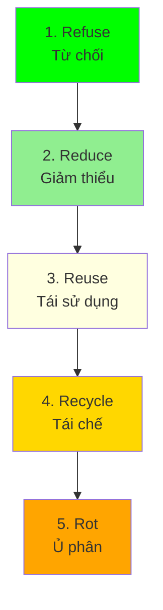

# SOP-06.2: QUẢN LÝ CHẤT THẢI VÀ TÁI CHẾ

## 1. MỤC ĐÍCH
Quy định quy trình quản lý chất thải và tái chế, đảm bảo:
- Giảm thiểu chất thải
- Phân loại đúng cách
- Tái chế tối đa
- Tuân thủ quy định
- Hướng tới zero waste

## 2. WASTE HIERARCHY

### 2.1. 5R Framework


**Priority**: Refuse > Reduce > Reuse > Recycle > Rot

## 3. WASTE MANAGEMENT PROCESS

### 3.1. Waste segregation

#### 3.1.1. Waste categories
```
1. Recyclables (Xanh lá):
   - Paper, cardboard
   - Plastic bottles (PET, HDPE)
   - Aluminum cans
   - Glass bottles

2. Organic (Nâu):
   - Food waste
   - Garden waste
   - Biodegradable materials

3. General waste (Đen):
   - Mixed waste (không recycle được)
   - Contaminated items

4. Hazardous (Đỏ):
   - Batteries
   - Electronics (e-waste)
   - Chemicals
   - Medical waste
```

#### 3.1.2. Bin placement
```
Locations:
- Classrooms: 2-bin system (recyclables, general)
- Corridors: 3-bin stations (every 20m)
- Canteen: 3-bin (recyclables, organic, general)
- Offices: 2-bin
- Specialized areas: As needed

Signage:
- Clear labels (color-coded)
- Pictures (what goes in)
- Multiple languages (nếu cần)
```

### 3.2. Collection và disposal

#### 3.2.1. Collection schedule
```
Daily:
- General waste (end of day)
- Organic waste (after meals)

Weekly:
- Recyclables (Tuesday, Friday)

Monthly:
- E-waste
- Batteries

As needed:
- Hazardous waste (call specialist)
```

#### 3.2.2. Vendor management
```
Waste collectors:
- Licensed contractors
- Proper disposal certifications
- Tracking receipts
- Performance monitoring

Recycling partners:
- Verified recyclers
- Transparent processes
- Fair pricing
- Social enterprises (preferred)
```

## 4. WASTE REDUCTION INITIATIVES

### 4.1. Reduce programs

#### 4.1.1. Paperless initiatives
```
Strategies:
- Digital communications (email, app)
- Online submissions (assignments)
- E-books và digital resources
- Digital forms
- Online assessments

Target: 50% paper reduction trong 2 năm
```

#### 4.1.2. Single-use plastic elimination
```
Actions:
- Ban plastic bags
- No plastic bottles (water stations instead)
- Reusable containers (canteen)
- No plastic straws, utensils
- Reusable shopping bags

Timeline: Phase out trong 1 năm
```

### 4.2. Reuse programs

#### 4.2.1. Reusable items
```
Encourage:
- Reusable water bottles (students)
- Reusable lunch boxes
- Cloth bags
- Refillable containers

Provide:
- Water stations (filtered)
- Bottle filling stations
- Microwave (students can bring lunch)
```

#### 4.2.2. Sharing economy
```
Programs:
- Book exchange (student-to-student)
- Uniform swap shop
- Equipment sharing
- Lost & found → Donate
```

### 4.3. Recycling programs

#### 4.3.1. Materials recycling
```
Paper:
- Collection bins
- Partner: Paper recycling company
- Target: 90% of paper waste

Plastic:
- PET bottles → Recycling
- HDPE → Recycling
- Other plastics → Assess

Electronics:
- E-waste collection drives (quarterly)
- Partner: Certified e-waste recycler
- Data wiping before disposal
```

#### 4.3.2. Composting
```
Organic waste program:
1. Separate food waste
2. On-site composting (nếu có space)
   - Compost bins
   - Student-managed (supervised)
3. Use compost (school garden)
4. Reduce: 30-40% of total waste

Alternative: Partner với composting facility
```

## 5. MONITORING VÀ REPORTING

### 5.1. Waste tracking

#### 5.1.1. Metrics
```
Monthly tracking:
- Total waste: [X kg]
- Recyclables: [Y kg] ([Z%])
- Organic: [W kg] ([V%])
- Landfill: [U kg] ([T%])

Per capita:
- Waste per student: [A kg/student/tháng]
- Recycling rate: [B%]
- Diversion rate: [C%] (from landfill)

Targets:
- Recycling rate: ≥ 60%
- Diversion rate: ≥ 70%
- Waste reduction: 5%/năm
```

#### 5.1.2. Dashboard
```
WASTE MANAGEMENT DASHBOARD

This month:
Total waste: [X kg] (↓ Y% vs. last month)
- Recycled: [A kg] ([B%])
- Composted: [C kg] ([D%])
- Landfill: [E kg] ([F%])

Waste per student: [G kg]
Recycling rate: [H%]
Target: [I%]
Status: [🟢 On track / 🟡 Warning / 🔴 Off track]

Top waste generators:
1. [Area A]: [X kg]
2. [Area B]: [Y kg]

Improvement areas:
⚠️ [Area C] - Low recycling rate
⚠️ [Area D] - High contamination
```

### 5.2. Reporting
```
Monthly: Internal report
Quarterly: Sustainability Committee
Annual: Comprehensive + public report
```

## 6. EDUCATION & ENGAGEMENT

### 6.1. Student programs

#### 6.1.1. Curriculum integration
```
By grade:
PK-2: Basics (reduce, reuse, recycle)
3-5: Waste sorting, composting
6-8: Environmental science, sustainability
9-12: Climate change, circular economy

Activities:
- Waste audits (student-led)
- Recycling projects
- Campaigns
- Competitions
```

#### 6.1.2. Eco-clubs
```
Activities:
- Waste monitors (check bins)
- Recycling drives
- Composting team
- Awareness campaigns
- Community outreach
```

### 6.2. Staff engagement

#### 6.2.1. Training
```
Annual training (1 giờ):
- Waste policy
- Segregation rules
- Their responsibilities
- Best practices

Refreshers: Quarterly emails
```

#### 6.2.2. Departmental targets
```
Set targets by department:
- Reduce waste by X%
- Recycle Y%
- Track performance
- Reward achievements
```

## 7. SPECIAL WASTE STREAMS

### 7.1. E-waste
```
Quarterly collection:
- Publicize dates
- Collection points
- Partner: Certified recycler
- Data security (wipe drives)
- Certificates of disposal
```

### 7.2. Batteries
```
Collection program:
- Drop-off bins (offices)
- Monthly collection
- Partner: Battery recycler
- Proper disposal
```

### 7.3. Hazardous waste
```
Types:
- Lab chemicals
- Cleaning products
- Paint
- Fluorescent bulbs

Handling:
- Licensed contractor
- Proper storage
- Scheduled pickup
- Compliance documentation
```

## 8. CÔNG CỤ VÀ TEMPLATE

### 8.1. Monitoring tools
```
- Waste tracking spreadsheet
- Weighing scales
- Photo documentation
- Dashboard software
```

### 8.2. Templates
```
- Waste audit template
- Monthly report template
- Vendor agreement template
- Disposal certificates
```

## 9. CHỈ SỐ ĐÁNH GIÁ

```
Waste reduction:
- Total waste: ↓ 5%/năm
- Waste per student: ↓ 5%/năm
- Plastic waste: ↓ 50% (2 năm)

Recycling:
- Recycling rate: ≥ 60%
- Contamination rate: ≤ 10%
- Composting rate: ≥ 30%

Diversion:
- Landfill diversion: ≥ 70%
- Target (2030): 100%

Compliance:
- Violations: 0
- Proper disposal: 100%
```

---

**Ngày ban hành**: 01/01/2024  
**Người phê duyệt**: Ban Giám hiệu  
**Người soạn thảo**: Phòng Quản lý Cơ sở  
**Ngày xem xét lại**: 01/01/2025


