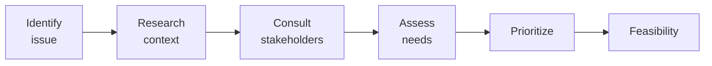
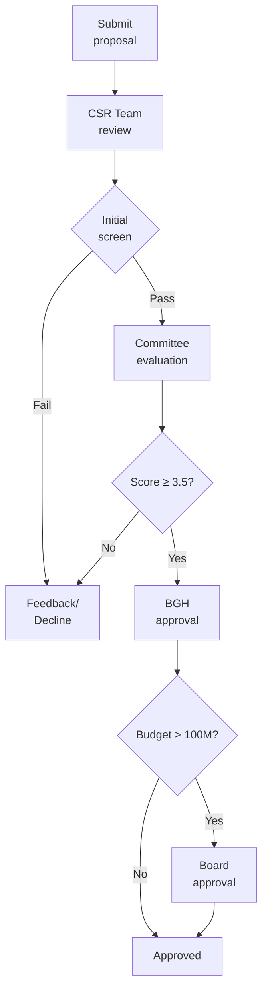

# SOP-07.1: XÁC ĐỊNH VÀ LỰA CHỌN DỰ ÁN

## 1. MỤC ĐÍCH
Quy định quy trình xác định và lựa chọn dự án CSR, đảm bảo:
- Đúng nhu cầu cộng đồng
- Phù hợp với sứ mệnh trường
- Impact đo lường được
- Khả thi về nguồn lực
- Hiệu quả cao

## 2. PROJECT IDENTIFICATION

### 2.1. Sources of ideas

#### 2.1.1. Internal sources
```
From within school:
- Student suggestions (surveys, councils)
- Teacher proposals
- Parent ideas
- Staff observations
- Previous project learnings

Process:
- Open call (annually)
- Submission form
- Initial screening
```

#### 2.1.2. External sources
```
Community needs:
- Community surveys
- Local government (district, ward)
- NGO partnerships
- Media reports (social issues)
- Site visits (observe firsthand)

Stakeholders:
- Beneficiary communities
- NGOs
- Corporate partners
- Alumni
```

### 2.2. Needs assessment

#### 2.2.1. Assessment process


#### 2.2.2. Assessment tools
```
Data collection:
- Surveys (community)
- Interviews (key informants)
- Focus groups
- Observations (site visits)
- Secondary data (government, NGO reports)

Analysis:
- Problem tree (causes, effects)
- SWOT analysis
- Stakeholder analysis
- Resource assessment
```

## 3. PROJECT SELECTION

### 3.1. Selection criteria

#### 3.1.1. Alignment với mission
```
Questions:
- Fits CSR pillars? (Education, Community, Environment, Social)
- Aligns với school values?
- Educational opportunity (students)?
- Long-term vision consistent?

Weight: 25%
```

#### 3.1.2. Impact potential
```
Assess:
- Number of beneficiaries (direct)
- Ripple effects (indirect)
- Depth of impact (transformational?)
- Sustainability (continues after project?)
- Measurability (can track?)

Weight: 30%
```

#### 3.1.3. Feasibility
```
Evaluate:
- Budget reasonable?
- Skills và expertise available?
- Time commitment manageable?
- Partnerships identified?
- Risks acceptable?

Weight: 25%
```

#### 3.1.4. Strategic value
```
Consider:
- Reputation benefits
- Partnership opportunities
- Learning value (students)
- Innovation (novel approach?)
- Scalability (can expand?)

Weight: 20%
```

### 3.2. Scoring matrix

#### 3.2.1. Evaluation template
```
PROJECT EVALUATION MATRIX

Project: [Name]
Proposed by: [Person/Org]
Date: [XX/XX/XXXX]

Criteria | Weight | Score (1-5) | Weighted Score
---------|--------|-------------|----------------
Alignment | 25% | [X] | [Y]
Impact | 30% | [X] | [Y]
Feasibility | 25% | [X] | [Y]
Strategic value | 20% | [X] | [Y]
---
Total | 100% | --- | [Total/5.0]

Recommendation:
□ Approve (score ≥ 4.0)
□ Approve with conditions (3.5-3.9)
□ Defer for more info (3.0-3.4)
□ Decline (< 3.0)
```

## 4. STAKEHOLDER CONSULTATION

### 4.1. Internal consultation

#### 4.1.1. Student voice
```
Methods:
- Student council input
- Surveys (interest, skills)
- Focus groups
- Service learning classes

Purpose:
- Gauge interest
- Identify champions
- Assess capacity
- Ensure learning value
```

#### 4.1.2. Staff buy-in
```
Engagement:
- Present proposals (faculty meeting)
- Seek volunteers
- Address concerns
- Clarify commitments

Goal: ≥ 70% support
```

### 4.2. External consultation

#### 4.2.1. Community engagement
```
Beneficiaries:
- Involve trong planning (not just recipients)
- Understand true needs
- Co-design solutions
- Build ownership

Partners:
- NGOs (expertise)
- Local leaders (access, legitimacy)
- Other schools (collaboration)
```

## 5. APPROVAL PROCESS

### 5.1. Proposal development

#### 5.1.1. Project proposal template
```
CSR PROJECT PROPOSAL (5-10 trang)

1. EXECUTIVE SUMMARY (1 trang)
   - Project name
   - Objective
   - Beneficiaries
   - Budget
   - Timeline

2. PROBLEM STATEMENT (1-2 trang)
   - Issue addressed
   - Context và background
   - Why important?
   - Who affected?

3. PROJECT DESIGN (2-3 trang)
   - Objectives (SMART)
   - Activities
   - Timeline (Gantt chart)
   - Budget breakdown
   - Roles và responsibilities

4. EXPECTED IMPACT (1 trang)
   - Beneficiaries (number, profile)
   - Outcomes expected
   - Measurement plan
   - Sustainability

5. PARTNERSHIPS (1 trang)
   - Partners identified
   - Roles
   - Commitments

6. RISKS & MITIGATION (1 trang)

7. BUDGET (detailed)

8. APPENDICES (letters of support, etc.)
```

### 5.2. Approval workflow

#### 5.2.1. Approval steps


**Timeline**: 4-6 tuần from submission to decision

## 6. PORTFOLIO MANAGEMENT

### 6.1. Portfolio balance

#### 6.1.1. Diversification
```
By focus area:
- Education: 40%
- Community: 30%
- Environment: 20%
- Social welfare: 10%

By size:
- Large projects (>100M): 2-3
- Medium (50-100M): 3-5
- Small (<50M): 5-10

By duration:
- Long-term (>2 năm): 30%
- Medium (1-2 năm): 40%
- Short-term (<1 năm): 30%

By type:
- Direct service: 50%
- Capacity building: 30%
- Advocacy: 20%
```

### 6.2. Annual planning

#### 6.2.1. Planning cycle
```
Q1 (Jan-Mar):
- Call for proposals (internal/external)
- Needs assessment
- Stakeholder consultation

Q2 (Apr-Jun):
- Proposal development
- Evaluation và selection
- Budget approval

Q3 (Jul-Sep):
- Project kickoffs
- Partnerships finalized
- Implementation begins

Q4 (Oct-Dec):
- Mid-year reviews
- Adjustments
- Next year planning starts
```

## 7. CÔNG CỤ VÀ TEMPLATE

### 7.1. Templates
```
- Project proposal template
- Evaluation matrix
- Needs assessment toolkit
- Budget template
- Risk register
```

### 7.2. Tools
```
- Survey platforms (Google Forms, SurveyMonkey)
- Project management (Asana, Trello)
- Collaboration (Slack, MS Teams)
```

## 8. CHỈ SỐ ĐÁNH GIÁ

```
Selection process:
- Proposals received: ≥ 20/năm
- Evaluation time: ≤ 6 tuần
- Approval rate: 30-50%
- Stakeholder satisfaction: ≥ 4.0/5.0

Portfolio:
- Balance achieved: ✅
- All pillars covered: ✅
- Mix of sizes: ✅
- Student involvement: 100% projects
```

---

**Ngày ban hành**: 01/01/2024  
**Người phê duyệt**: Ban Giám hiệu  
**Người soạn thảo**: Phòng Đối ngoại  
**Ngày xem xét lại**: 01/01/2025


